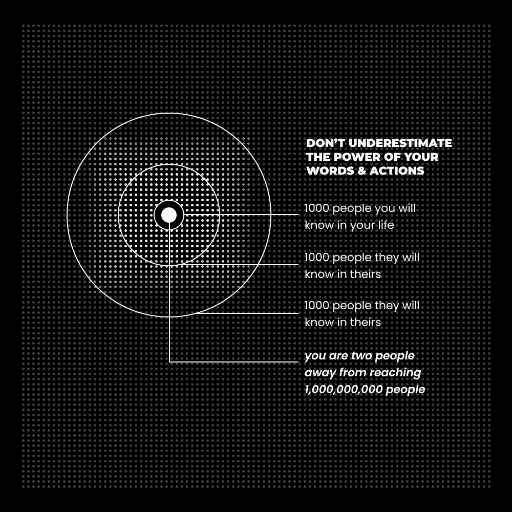

# 阅读的艺术：如何通过5分钟习惯最大化获取智慧

在本教程中，我们将学习一种高效的阅读方法。这种方法旨在帮助忙碌的现代人，每天仅用不到5分钟的时间，就能从书籍中汲取强大的思想，并将其转化为个人成长与创作的燃料。我们将探索如何设定目标、主动寻找灵感、有效记录想法，并最终通过实践与分享来巩固和扩展自己的思维。

---

## 阅读的艺术：设定一个目标

上一节我们介绍了本教程的核心目标，本节中我们来看看如何为阅读设定一个有意义的目标。

人类是目标导向的生物。我们通过个人的视角来解读信息、对话和事件。这个视角的根源，是一系列围绕个人目标、问题和信念形成的框架。对大多数人而言，这种视角是无意识且固化的，通常由社会和文化环境塑造而成。例如，许多人的目标是上大学、找份工作，然后在65岁退休。因此，他们只**看到**有助于实现这些目标的事物，而忽略了与其观点不一致的99%的生活信息。

如果你希望体验超越表面生活的深度与机遇，你需要：

1.  **设定一个对你未来有意义的目标。**
2.  **时常提醒自己这个目标，让它保持在你的意识前沿。**
3.  **观察你如何开始以新的视角解读生活，你的决策将逐渐与目标对齐。**

当你带着明确的目标去阅读时，无论书籍主题是什么，你都会开始注意到那些能解决你问题的潜在方案。

---

## 阅读的艺术：2：寻找想法

上一节我们探讨了如何通过设定目标来聚焦阅读，本节中我们来看看如何主动“狩猎”有价值的想法。

我们的祖先在自然界中寻找食物与资源。但在现代社会，我们的生存需求已超越物理层面，进入了精神层面。因此，卓越之人寻找的是**想法**。“狩猎”意味着从线上线下庞大的信息网络中，获取那些能带来深刻启发的多巴胺。你不会在已知领域狩猎，而是探索未知以进行新颖的发现。

以下是寻找想法的具体方法：

+   **阅读挑战你现有观念的书籍。**
+   **阅读激发你好奇心的书籍。**
+   **阅读你一直推迟阅读的书籍。**

选择那些能将你一只脚带入未知领域的书。当新的信息穿过你大脑中“已知”（右半球）与“未知”（左半球）的边界时，你的神经系统会将其识别为一个有意义的事件。这就像一个正在形成的创新发现，一次内心的宇宙冲突，当其解决时，便会孕育出创造性的涌现——一个新的想法、洞察或认识。有些书之所以引人入胜，正是因为它让你看到了生活的潜力，这些想法将成为你塑造个人故事的原材料。

---

## 阅读的艺术：3：创造力是玩心理乐高

上一节我们学会了如何寻找想法，本节中我们将学习如何捕捉并发展这些想法，就像玩乐高积木一样构建你的知识体系。

你会忘记读过的内容，所有人都会。因此，第一步是建立一个便捷的记录系统，无论是在笔记本还是手机应用里。你需要一个固定位置来捕捉那些最吸引你的想法。

第二步至关重要：**一旦发现一个新颖的想法，就停止阅读。** 你读书不是为了记住每个字，而是为了找到能改变生活的想法并付诸实践。记录下想法后，请按以下步骤发展它：

+   **思考这个想法的实用性。** 它有多少种方式能与你的生活产生关联？
+   **将其应用于你的目标。** 这个想法如何帮助你在心智、身体或事业上获得改善？
+   **尝试将其转化为你自己的。** 你如何从自身角度重新表述这个想法？

如果你需要一套系统来发展想法，可以参考相关资源。同时，你可以通过思考你的目标、当前问题、个人经历以及自我认知，来重新构建和转化这个想法。

例如，从歌德的名言“音乐是液态建筑；建筑是凝固的音乐”出发，如果你的目标是写作和出版，你可以将其转化为：“**书籍是纸雕塑。写作是粘土，而表达是凿子。**”

**核心教训：** 专注于深入思考一个想法，远比被海量浅显想法淹没更有价值。避免陷入只收集而不应用的循环。

**每日实践：** 阅读五分钟。如果某个想法没有立刻吸引你，就换一本书或跳到另一个章节。

---

## 阅读的艺术：4：使用法则

上一节我们讨论了如何将想法内化，本节我们来看看如何通过实践与分享，让这些想法真正提升你的思维层级。

大多数人并不需要更多建议，他们需要的是更强大的思想来塑造世界观和决策框架。这样他们才能做出更好选择，并从试错带来的进步中获得满足感。问题在于，要理解强大的思想，你必须扩展思维，而扩展思维需要让想法与现实相遇。

你必须将收集到的想法付诸实践，并通过直接经验来巩固它们。只有这样，你才能提升思维水平，进入下一个阶段。这就像锻炼心理肌肉，**渐进式超负荷**原则同样适用。停留在表面的“方法”建议，就像永远举着5磅的哑铃却期望长出肌肉。

为了让想法与现实接触，你可以：

+   **写作或日记**，深入探索一个想法。
+   从常见问题、解决步骤或相关故事开始构思，描述因此发生的转变（这是人类行为、讲故事和内容营销的常见结构）。
+   坐下来，精炼你写作产生的想法。

将这个过程制度化的绝佳方式，是通过创作（如写作通讯）来为他人贡献价值。在撰写长篇内容时，你实际上在：

1.  解构你收集到的想法。
2.  通过原创写作重新连接这些知识点。
3.  将你的写作分解成众多更小的想法单元。
4.  重复此过程，从而提升心理能力。

一个非常实用的方法是：写一篇通讯或长文，将其分解成一系列推文，然后再将这些推文组合回一篇新的通讯或文章。这不仅防止思维停滞，还能在此过程中影响成千上万的人。

不要低估你的潜在影响力。你一生中会认识约1000人，他们每人又会认识1000人，只需两层传播，理论上你的想法就能触及百万人级（1000 x 1000 = 1,000,000）。通过持续分享，你的影响可以呈指数级增长。

---

**总结**

在本节课中，我们一起学习了一套高效的“5分钟阅读”系统。我们首先学会了如何**设定明确目标**来指引阅读方向，然后掌握了主动**狩猎想法**的技巧，接着探索了如何像玩乐高一样**捕捉与发展灵感**，最后通过**实践与分享**的法则，将想法固化为真正的智慧与影响力。记住，阅读的核心不在于数量，而在于通过深度互动，让那些强大的思想改变你的思维与行为。

– Dan Koe

> 附：如需更多资源，如免费生产力工具、创意挑战及往期通讯，可访问相关网站。网站亦提供关于自我产品化、高影响力写作等主题的付费大师班课程。