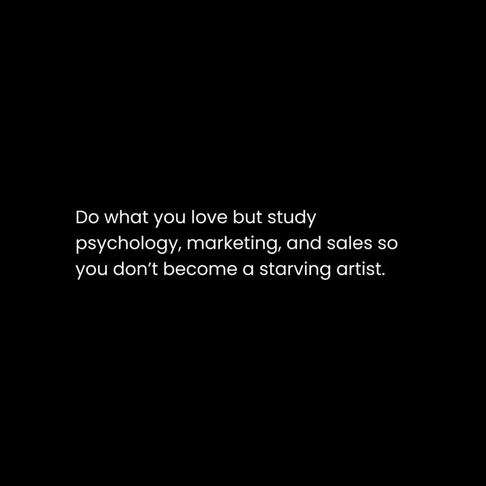
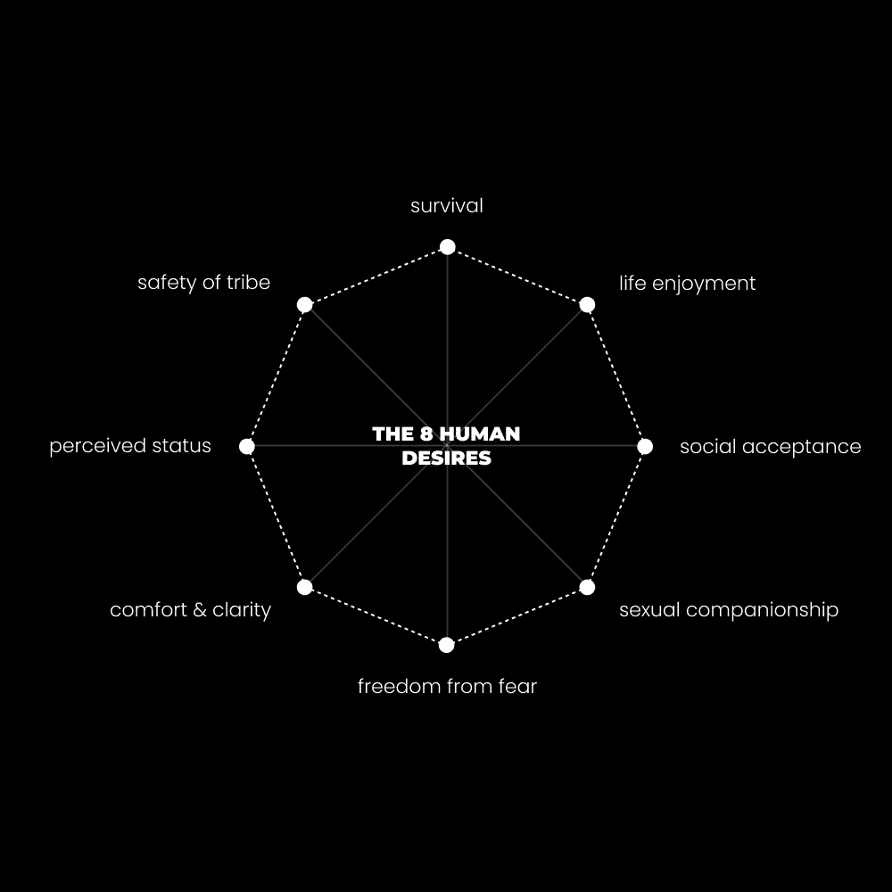

# 价值创造：构建单人企业的核心技能

在本节课中，我们将学习价值创造这一核心技能。它是构建并发展一个成功单人企业的基石。我们将通过一个具体的个人经历引入，逐步拆解价值创造的底层逻辑、实用框架以及如何将其应用于日常的营销与沟通中。

## 概述：从失败的艺术尝试到价值创造的觉醒

我最喜欢的失败业务之一是使用 Photoshop 创作数字艺术。这是我第一次意识到社交媒体力量的尝试。我通过模仿大型账户的增长策略来获取关注：标记社区页面、创作高质量的合成图像、并希望被合作的摄影师分享。大约五年前，我通过这种方式在 Instagram 上获得了前 2500 名粉丝。

在投入三个月全身心创作后，我放弃了。虽然热爱创作，但我不知道如何将其盈利。我的艺术有价值，但当时我认为其价值不足以要求付费。我错误地认为自己需要学习一项更“有利可图”的技能。

现在回顾，如果掌握现在的认知，我会采取不同的路径：继续增长并将受众视为流量来源；创建课程或辅导等产品或服务；学习文案、营销和产品交付；与个人发展创作者合作，将他们的想法视觉化，从而建立权威。这些正是构建一个成功单人企业所需的核心行动。

每一次失败的尝试都教会了我宝贵的经验。例如，Photoshop 技能至今仍用于我品牌的所有设计和缩略图制作。然而，有一种技能对我过去几年中 95% 的品牌增长、销售和受众扩张起到了决定性作用，那就是**价值创造**。

## 人类心理学的通用模式

上一节我们提到了价值创造的重要性，本节中我们来看看其背后的心理学基础。所有能“赚钱”的技能都与人类心理的通用模式相关联。如果一项技能不赚钱，通常是因为它未能有效对接这些底层需求。

所有人类行为（包括为你付费）都基于三个核心驱动力：

1.  **生存**：复制基因与意识信息的愿望，无论是生理还是心理层面。
2.  **进化**：通过创造超越破坏的愿望。
3.  **变革**：追求更高品质体验的愿望。

这些驱动力本质相似，在本文后续可视为同义词。在故事讲述、游戏、音乐等领域都能观察到这些模式。一个简单的框架可以概括它们：**目的、路径、优先级**。

### 1) 目的

行为改变始于一个问题，并指向一个用以克服该问题的目标。这个目标就是目的，目的引发欲望，而欲望则源于问题的产生。就像好故事通过提出问题来开启好奇心，或者优秀的落地页通过关联你生活中的问题来激励行动。通过揭示某人生活中的问题，你就创造了目的。

### 2) 路径

当问题被识别，且目标揭示了潜在的未来时，清晰度就是连接现状与未来的桥梁。混乱的反面是清晰，我们不希望客户在考虑使用我们的产品时感到焦虑和不知所措。

### 3) 优先级

一个问题要想在个人意识中留下深刻印象，必须对其具有重要性。如果问题不重要，你就无法吸引其注意力来展示路径。此时，路径本身已无关紧要，因为他们缺乏采取行动的动力。重要性是主观的，人们从其身份的角度感知问题。例如，向一位超重的游戏玩家推销自我提升产品，必须进行非常具体的定位。

这个框架同样可以用来帮助你重新掌控自己的生活。

## 价值创造框架

目的 > 路径 > 优先级框架很有用，但让我们让它变得更实用。在下一节中，我们将探讨这个框架的具体应用场景。

你可以将以下所有部分视为“营销积木”，用于你的内容、促销乃至日常对话，以展示你的产品或个人价值。这些步骤能将普通内容转化为黄金。当应用于我的各项事业时，正是这些步骤帮助我的企业实现了超过 100 万美元的营业额。它们也是实践“价值创造”这一最有价值技能的步骤。

如果你不知道如何提供产品，可以先学习如何创建一个，或者如何将你头脑中的知识打包成产品。这些技能会随着时间变得更容易。如果刚开始填写这些内容感到困难，无需担心。

以下是价值创造的具体步骤：

### 1) 意识层次

你在线下或线上遇到的每个人，对于他们自身的问题以及你所提供的价值（产品、服务或你本人），都处于某个意识层次。

**第 1 级：无意识**
人们既未意识到自己的问题，也未意识到你的解决方案。针对此阶段的内容（如病毒式推文或视频）旨在让他们意识到问题及其对生活的影响。方法是提供教育、信息和共情。

**第 2 级：问题意识**
人们意识到存在问题，但可能不了解问题本质或不知道有解决方案。你的内容是教育他们关于问题的细节，并提供初步的解决思路。

**第 3 级：解决方案意识**
人们意识到问题和解决方案的存在，但不知道*你的*特定解决方案。此时你需要提供明确的解决方案或鼓励他们采取行动。

**第 4 级：产品意识**
人们知道你的解决方案以及其他类似方案。你的工作是论证为什么你的方案更好，此时强调益处的语言至关重要。

**第 5 级：最高意识**
人们非常清楚你的解决方案，只需要临门一脚就能做出决定。你可以通过限时折扣或稀缺策略来促成行动，但需谨慎使用。

### 2) 定位

理解了意识层次后，我们就可以开始构建有说服力的信息了。有八种核心的人类欲望难以被忽视，你所有的内容、销售文案或写作都应从这些欲望的角度出发：

*   生存
*   生活享受
*   摆脱恐惧、痛苦和危险
*   性伴侣
*   舒适与清晰
*   感知地位
*   社区安全
*   社会接受

你的任务是教育人们了解阻碍这些欲望的问题，并提供克服它们的解决方案。每个人的终极“细分市场”都是自我实现。我的商业理念始终是：解决你自己的问题 > 记录解决方案 > 提升他人的集体意识。

### 3) 重大问题

从你选定的特定意识层次和欲望角度出发，确定一个“重大问题”作为你写作、演讲或创作的起点。例如，从“无意识”阶段和“感知地位”角度，我可以确定一个重大问题：“无法获得六位数的工作”。然后，我可以阐述这个问题如何影响他们的约会能力、支付账单以及获得他人尊重。

### 4) 独特机制

你需要一个与众不同的解决方案。这就是为什么我建议“自己寻找答案”，因为通过亲身实验，你能创造出独特的解决方案。思考*你自己*会如何一步步解决问题，并为这些步骤起一个吸引人的名字。

### 5) 列表喷洒好处

我喜欢在文案和推文中用一系列好处“压倒”读者。列出你独特解决方案的显著好处，等于给了人们*多个*购买或参与的理由。即使一个点未能打动他们，另一个点可能就是促成转变的关键。

### 6) 证据

个人成果、客户推荐信以及任何你能收集到的统计数据或事实，都有助于建立信任。不要低估个人经历的力量，人们渴望真实的人际连接。这就是为什么我90%的通讯和视频都以一个说明我遇到问题的个人经历开始。

### 7) 大想法

在完善了其他价值创造点之后，你需要提炼出一个“大想法”。大想法是一句话总结你的核心价值。最受欢迎的引言往往是大的想法。大想法最好通过主动寻找并将其内化为己有来获得。

### 8) 风险反转与最终结果

一个有说服力的“风险反转”策略能在你事业的早期阶段帮助你达成交易。最常见的退款保证，但你可以通过将其与明确的结果承诺结合，使其更具吸引力。

## 营销积木的应用场景

上一节我们介绍了价值创造的构成要素，现在我们将看看如何将这些“营销积木”应用到实际场景中。阅读理论是不够的，你必须通过实践来掌握。以下是一些可以开始练习价值创造的地方：

### 社交媒体帖子

吸引人的长篇内容通常遵循此格式：
*   提出并激化一个问题。
*   通过故事或证据提供背景，提升读者至解决方案意识。
*   提供可操作步骤来克服问题（最好是你命名的独特方法）。
*   融入实施该系统的益处，鼓励行动。
*   将你内容的大想法作为标题。

短篇内容（如推文、短视频）一次只能聚焦一个积木。你可以将任何一个“营销积木”转化为一篇独立的帖子。

### 着陆页与销售页

与长篇内容类似，着陆页和销售页面也遵循相同模式。你可以使用经典的文案框架来练习，例如 PASTOR、AIDA 或 PAS 模型。对于标题和副标题，应尽可能融入多个营销积木。

### 课程大纲

说服力在产品售出后不应停止。在课程设计中，你仍需保持学员的注意力，提供清晰路径，并鼓励他们采取行动，这样才能确保他们获得结果，你也才能获得宝贵的推荐信。

### 每日对话

所有的人类沟通都包含说服元素。当你与人交谈时，尝试从共同的角度出发。从一个问题开始对话以吸引注意，然后自然地引导至你提供的解决方案或价值。

## 总结

本节课中，我们一起学习了价值创造这一构建单人企业的核心技能。我们从个人经历出发，探讨了其背后的人类心理学基础（目的、路径、优先级），并深入拆解了一个包含意识层次、定位、重大问题、独特机制、好处列表、证据、大想法以及风险反转的完整价值创造框架。最后，我们了解了如何将这些“营销积木”应用于社交媒体、销售页面、课程设计乃至日常对话中。

记住，掌握价值创造的关键在于实践。通过启动项目、面对真实世界的问题，你将学到任何阅读都无法教给你的细节。持续练习这项技能，你的表达能力、现金流和生活质量都将显著提升。

– 丹·科