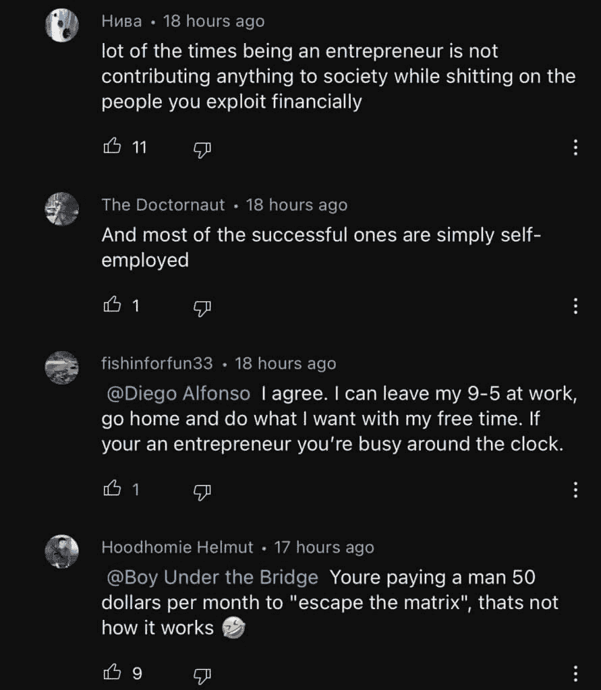

# 自我提升者的在线职业创造：如何实现

> 原文：[`thedankoe.com/letters/self-improvers-are-creating-their-own-career-heres-how/`](https://thedankoe.com/letters/self-improvers-are-creating-their-own-career-heres-how/)

在本教程中，我们将探讨自我提升者如何通过互联网创造属于自己的职业生涯。我们将分析传统工作模式的局限，阐述创业、劳动消解以及创作者经济的核心概念，并提供一套从零开始构建个人在线业务的实用方法。课程内容力求简单直白，适合初学者理解。

## 1：传统工作循环与觉醒 🎯

许多人日复一日地重复着相似的生活轨迹：醒来、通勤、进行八小时令人不满的工作、回家、休息，然后重复。这种状态可能令人感到恐惧，却是大多数人的现实。即使那些努力想逃离的人也常常难以做到。

作者分享了自己的经历，他曾尝试创业数年未果，后来进入职场，发现生活完全被工作所控制。在过去的创作者生涯中，他认识到几个关键点：创业是适合长期思考者的路径；人类一直在致力于消除体力劳动；创作者经济正在成为新的主流；未来属于那些通过做自己喜欢的事获得报酬的明智之人。

上一节我们描述了令人窒息的常规生活，本节我们将深入探讨一种常见的反对声音：“创业被高估了”。

## 2：剖析“创业被高估了”的迷思 🤔

网络上存在一种观点，认为创业被高估了。持有这种观点的人可能出于几种心理：人们往往讨厌自己不理解的事物；他们只看到创业者生活的表面（可能只占5%）就妄下结论；他们厌倦被称为“工资奴隶”，但感受不等于现实。

从本质上看，如果一个人失去工作就无法生存，那么他确实缺乏选择权。更重要的是，许多人没有意识到，停留在重复性高、收入有上限的职位上，可能会限制个人技能的发挥和人类整体的进化。

为什么不将独特的技能和兴趣，打包成一项服务或产品，作为一项业务出售给公司呢？这样，个人就不再是生产效率指标的奴隶，而是可以创建自己的系统，服务更多客户，以更少的工作时间赚取数倍于工资的收入。

创业的全部意义在于减少工作量，优先考虑生活中的美好事物。如果创业者整天都在工作，那通常是因为缺乏自我管理技能，而非创业的本质。人类的心理需要不断进化和挑战，而朝九晚五的工作在达到某个阶段后可能无法提供这种持续的成长动力。

因此，朝九晚五的工作应被视为一块垫脚石，一种获取技能、知识和资源的手段，而非人生的终极目的。

在理解了创业的价值后，我们来看看社会劳动形态正在发生的根本性变化。

## 3：劳动的消解与创造性工作的崛起 🤖

人类历史是一部逐步将自身从繁重体力劳动中解放出来的历史。从奴隶制到农业机械，再到办公室自动化，这一趋势持续不断。如今，人工智能和自动化技术正在加速这一进程。

这并非末日预言，而是带来了巨大的机遇：体力劳动的减少必然伴随着创造性工作和知识工作的兴起。未来属于能够创造新知识、新思想并影响文化的创造性人才，如作家、演讲者、设计师和各类创作者。

人工智能不会取代这些创造性工作，而是将成为创作者突破界限的强大工具。要做好创造性工作，平衡工作与休息至关重要。大脑的“默认模式网络”在我们不专注于外部任务时最为活跃，这正是产生新颖想法的关键。

因此，未来的工作模式强调自给自足、自我教育，并善于利用自动化工具带来的创造机会。目标是实现工作与生活的平衡，充分展现人性，而非像机器人一样劳作。

当劳动形态转向创造性工作，一种全新的经济体系——创作者经济——便应运而生。

## 4：创作者经济：新的经济形态与个人品牌 🌐

社交媒体虽然可能包含负面内容，但它从根本上消除了社会化的障碍，成为我们学习、获取信息和传递价值的核心媒体。一个由平台、应用程序和创作者构成的三层数字媒体结构已经形成。

随着自动化和AI的发展，人们越来越倾向于从其他真实的人类那里获取内容。个人品牌变得至关重要。人们会被那些能根据其兴趣进行教育、娱乐和激励的“人”所吸引。

从商业哲学角度看，业务是个人目的的延伸。通过解决自身在健康、财富、人际关系等永恒市场中的问题，获取必要的技能和知识，然后将所学以免费内容和付费产品的形式分享给他人，个人就能建立起独立的收入来源和巨大的社会影响力。

既然创作者经济如此重要，那么具体有哪些方法可以实现盈利呢？

## 5：创作者盈利的阶梯式方法 💰

对于希望建立在线职业生涯的初学者，可以遵循一个循序渐进的盈利路径。

**首先是提供专业服务。** 在起步阶段，当受众规模不足以支撑数字产品销售时，提供如自由职业、辅导或家教等服务是快速盈利的可靠方式。你可以创建一个“最小可行产品”（MVP），例如定价500-1000美元的咨询服务，并通过直接 outreach 的方式销售。每月只需服务2-3个客户，收入就可能超过普通工资。

**其次是创建小组课程。** 当你拥有一定受众并积累了成功案例后，可以将服务产品化，升级为基于群体的课程。这种模式能让你收取更高费用，保持收入可持续性，且无需依赖大量客户。

**最后是构建多元化业务。** 当你拥有了强大的分销渠道（受众）和影响力杠杆后，就可以真正销售任何你想要的东西，无论是数字产品、实体商品（如服装、补剂），还是线下实体店。此时，你的声誉和社会资本足以支撑多种商业模式。

核心逻辑在于：解决你自己的问题，记录下解决方案，分享给他人，并因此获得报酬。

---

**总结**

在本节课中，我们一起学习了自我提升者如何在线创造职业生涯。我们从批判传统的“工作-生活”循环开始，论证了创业作为掌控人生路径的价值。接着，我们探讨了劳动消解的历史趋势和创造性工作的未来。然后，我们深入分析了以个人品牌为核心的创作者经济这一新形态。最后，我们提供了一套从提供专业服务开始，逐步发展到创建课程和多元化业务的实用盈利路径。记住，关键在于持续学习、解决自身问题、真诚分享，并利用互联网消除物理世界的障碍。未来属于那些主动创造自己职业生涯的人。