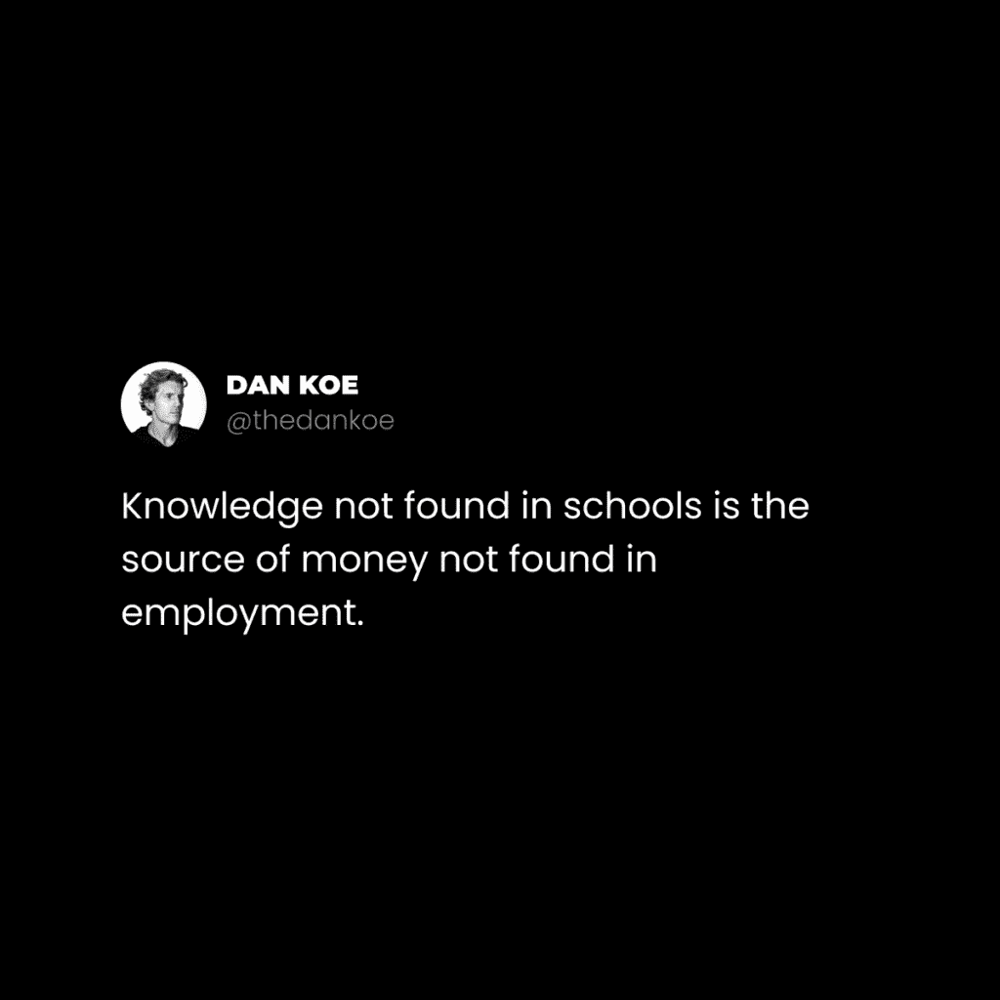
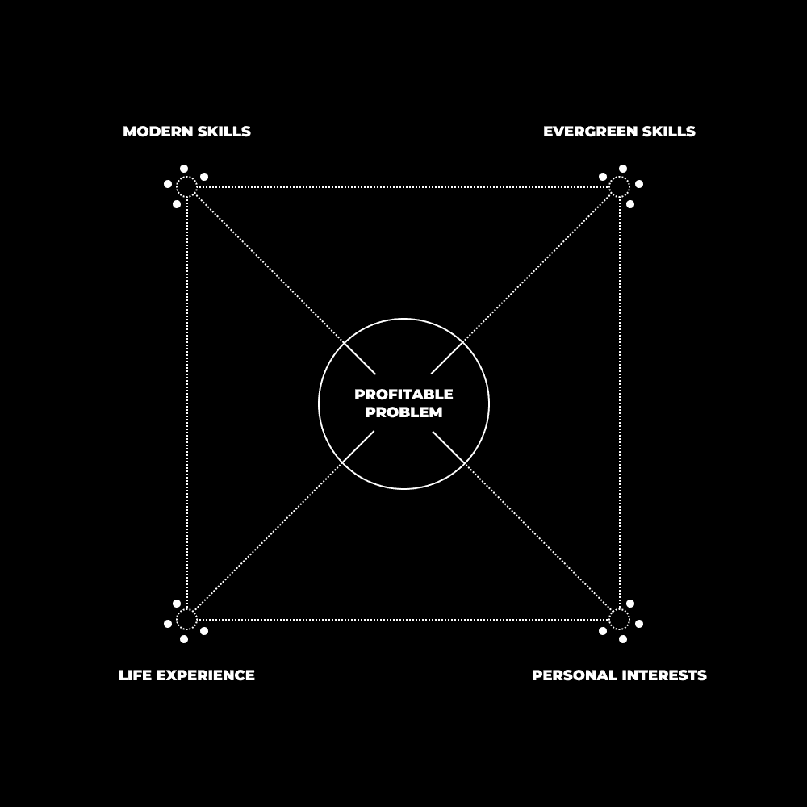

# 数字文艺复兴之路：成为数字文艺复兴人并加入新富阶层

在本节课中，我们将探讨如何摆脱传统教育和工作路径的束缚，利用互联网和现代技能，构建一种能带来满足感、自主权和充裕时间的数字生活方式。我们将学习“新富”理念的核心，并了解如何通过成为“数字文艺复兴人”来实现它。

---

## 概述

我们正处在一场巨大的社会与经济变革之中。传统的“上学、求职、工作到退休”路径正受到挑战。本节课将引导你理解“新富”概念——它并非关于奢靡消费，而是关于利用技术获得工作满足感、时间自由和个人选择权。我们将拆解实现这一目标所需的思维转变和具体技能，并描绘成为“数字文艺复兴人”的路径图。

---

## 新富阶层：超越金钱的转变 🚀

上一节我们概述了课程目标，本节中我们来看看“新富”这一核心概念的具体内涵。

我们正处于一场巨大转变的中间。但这种转变不仅仅局限于金钱。新富并不是关于亿万财富、豪宅和汽车。新富是关于利用技术来实现满足的工作、充裕的空余时间和个人的选择权。

为了提高认识，让我们逐一分析这些要素。这一节的目的在于建立认知。在你能够实现它之前，你必须先理解这一想法。

请在心中牢记以下要点，并使你的日常行为与之保持一致：

### 技术

互联网已经为自学和自给自足的人民主化了财富创造。互联网让你能够学习学校不教授的技能，这些技能往往是带来不可替代收入的技能。**如果每个人都学习它，它就是可替代的。** 你需要投资时间或金钱到那些不会导致静态工资的教育中。

以下是关键的行动方向：
*   学习营销、销售、写作和社交媒体等技能。
*   利用这些技能建立一家个人企业。
*   使用无代码工具，将你的技能转化为服务，获得成果，并逐步将其产品化。
*   投资时间以获得实际成果，并利用这些成果作为你下一步的杠杆。

### 满足的工作

任何人都可以感到快乐，但满足感是另一回事。你需要一个目标，否则你将被分配一个目标。生活对那些不知道自己想要什么的人来说并不仁慈。但这不会瞬间发生。

以下是明确目标的步骤：
*   观察大众的生活状态，明确你**不想要**什么。
*   这将帮助你澄清你真正**想要**的是什么。
*   你需要一个值得追求的目标，它将指导你的日常决策。另一种选择是为了生存，通过工资为别人的梦想工作。

### 充裕的时间

通过利用互联网进行1到2年以满足感为导向的努力，你将能够控制你的时间、收入、地点和生活方式。你将没有老板来安排你的日常日程，你必须自己管理自己。

传统的8小时工作日、无尽的屏幕时间以及很少的运动，是对人类心理和生理的对抗。如果你已习惯于此，可能不会注意到它的后果。对生活方式的控制让你能够与自然重新对齐，并感到超凡脱俗。

### 个人的选择

没有自主权，你的选择只是为了生存而做出的自动化反应。它们源于遵循那条为你铺就的“安全”道路。持续处于生存状态会造成不必要的压力，而压力会使你的思维变得狭隘。

如果你的选择被工资所束缚，就很难为个人发展、灵性探索和创造力腾出时间。这不是瞬间能实现的，但为那些想要完全掌控自己生活的人创造一个独立的收入来源是必要的。

---

## 成为数字文艺复兴人 🧠

上一节我们定义了“新富”的四大支柱，本节中我们来看看实现这一目标的具体人格模型——“数字文艺复兴人”。

自从疫情以来，工作状态已经发生了很大的变化。专家已经过时，但通才也是如此。当然，他们并不是“完全过时”。你有时会被视为专家，有时被视为通才，这是常态。

但我们不在这里追求常态。专家型自由职业者由于缺乏产品化，其收入有上限。而那些无法为95%的客户提供高于平均结果的通才型机构，同样面临困境。

我们生活在一个 **“专业化通才”** 的时代。也就是说，最高收入者是那些利用大脑的创造力，专注于特定、有利可图的问题，并能提供超出平均水平结果的人。

你获得的技能越多，研究的兴趣越广，你对这些领域交叉点的认识就越深。你可以从那些经验中吸取教训，专注于与任何这些技能、兴趣或两者组合相关的问题。这只是在过去十年中才成为可能，多亏了互联网的发展。

历史总是重复，我们现在正处于一个创意人士、愿景家和策略家拥有使他们繁荣的资源的时代。

### 获取永恒的技能

我们在之前的信件中已经讨论过“一百万美元技能栈”。因此，为了保持简洁，让你的目标是沉迷于**营销、销售、写作和演讲**。

如果你不知道要投入时间学习哪些技能，就选择这些。在真实世界环境中**写作**以获得经验，这比阅读无数书籍能教会你更多。它们互有交集，但对于任何形式的独立收入生成都是必要的。

要成为数字文艺复兴人，你将学习各种激发你好奇心的技能和兴趣。而永恒的技能让你能够以有利可图的方式打包和分发这些技能。

几个YouTube视频就足以学习这些技能的基础。之后，你必须学会将这些技能应用到你所选择的任何路径上。

### 培养个人兴趣

在这个时代，成功者和平庸者之间似乎唯一的区别是消费选择。

以下是两种不同的消费模式：
*   **分心者**：他们漫无目的地浏览，没有目标来集中他们的努力。
*   **着迷者**：他们研究与未来目标相一致的兴趣。

例如，致力于打造健康体格的人，始终关注健康行业的发展。那些在通往财务自由道路上的人，则不断尝试新的方法来扩大自己的品牌。

着迷的人让他们的思维之根深入到他们无法停止研究的现实的具体裂缝中。当这个过程在多年中重复进行，并带来新的技能和兴趣时，它们就为创造性问题解决开辟了空间。

### 实践创造性问题解决

50年的1%是6个月，但大多数人无法对不确定的道路做出超过两周的承诺。所有这些都需要时间，任何说不需要的人都不是在为你着想。

当你推动已知领域的边界，在挑战性的问题中找到满足感，并在未知中照亮意识之光时，你增加了你掌握领域的范围。

这是一个思想实验：

1.  **永恒市场**：想象四个小圆圈构成一个正方形，分别代表健康、财富、关系和幸福。当你在这些领域内发展自己时，圆圈的直径增加，直到它们开始像维恩图一样重叠。你意识到了每个领域中的问题，并能从你的经验中拼凑出创造性的解决方案。
2.  **常青技能**：创建一组新的圆圈，代表写作、演讲、营销和销售。同样，当你培养这些技能时，意识重叠，你可以在交叉点解决问题，而专家们则专注于一个小圆圈。
3.  **结果导向技能**：再将同样的方法应用于社交媒体、电子邮件营销、平面设计或编程等技能。当你学习这些技能时，你开始复合你的创造性问题解决能力。

现在，我们有3组重叠的圆圈。最后一块拼图是**个人兴趣**。大多数人从未想过通过做自己热爱的事情来谋生，因为他们缺乏对上述技能和市场的认识。

将代表你个人兴趣的圆圈（例如精神、哲学、艺术等）与另外三组连接，它就形成了一个三维的、相互连接的力场。我们可以将问题放在这个立方体的中心，从外围边缘汲取创意力量，拼凑出独特的解决方案。

当然，金钱是你生活工作的副产品。你的个人兴趣可以是任何东西。你故事中的对手是分心，你必须守护你的好奇心。

没有事情发生，然后所有事情都发生了。当你多维度的意识边缘接触时，就像找到了无限拼图中缺失的一块。起初图像模糊，但一旦正确的拼图块到位，你就能实现理解上的飞跃。

当拼图的图像清晰时，你可以观察他人的故事，识别他们缺失的部分，并帮助他们填补空白。这就是数字复兴人的道路。

他们用教育取代了分心，在持续学习和发展技能的同时，专注于帮助他人。无论是通过自由职业、辅导、内容创作还是其他任何方式，你必须将你的能力展示给世界。

**技能必须通过挑战来检验。如果你不在获得技能的同时努力使用这些技能去创造，那么你并没有真正获得技能。**

就这样。学习、行动、重复，不要让你的思维陷入无关紧要事情的思考循环中。

---

## 总结

本节课中，我们一起学习了“新富”理念的四大支柱：**技术杠杆、满足的工作、充裕的时间和个人选择**。我们探讨了成为“数字文艺复兴人”的路径，这要求我们掌握**永恒技能（营销、销售、写作、演讲）**，深耕**个人兴趣**，并通过**创造性问题解决**将多领域知识融合，构建独特的价值解决方案。

关键在于用主动的“教育”和“创造”取代被动的“分心”，通过持续学习、实践和帮助他人，最终获得对工作、时间和生活的自主权。这条路需要时间和承诺，但它通向的是一种更充实、更自由的生活方式。