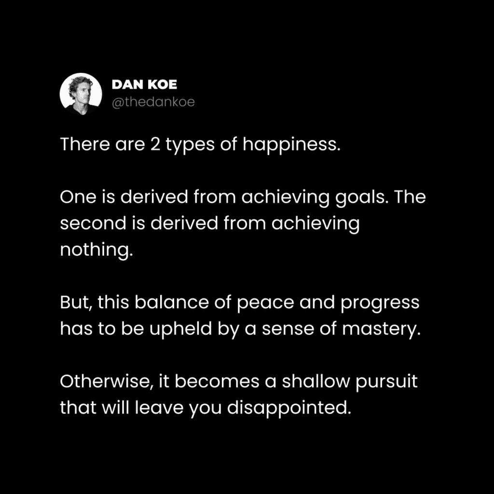
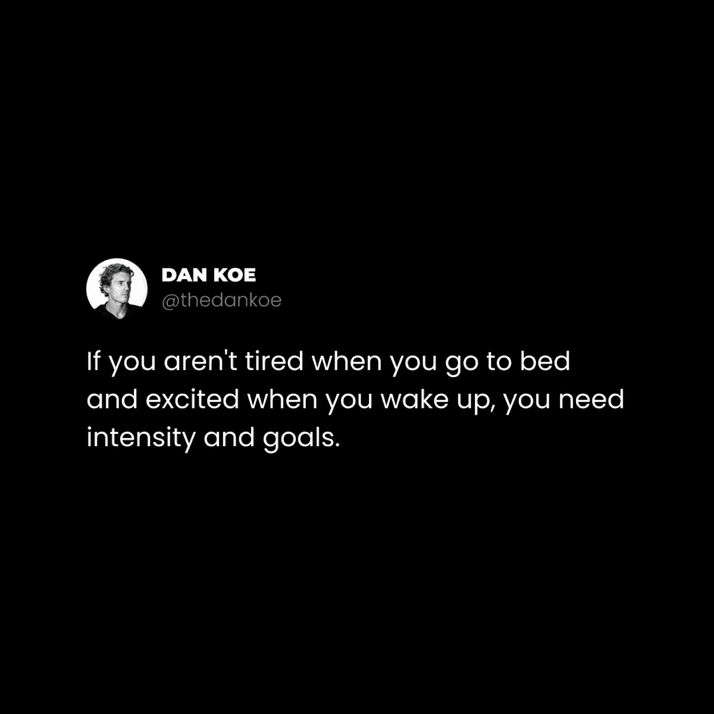

# 生活哲学：如何在艰难时期坚持下去 🧭

在本节课中，我们将学习当生活变得艰难时，如何调整心态并找到前进的方法。我们将探讨心理动荡的本质，以及如何通过平衡“存在”与“行动”来度过难关，最终实现个人成长。

我们生活在一个幻想中：我们渴望进步，却又不希望过程变得艰难。我们成为了“事情应该怎样”的奴隶，而这个“应该”往往是“容易”。例如，人们可能会抱怨在炎热天气中行走，却可以毫无怨言地进入桑拿房。这其中的差别在于**期望**和**意图**。

当你在寒冷中时，身体的自动反应是颤抖，这是一种战斗或逃跑的反应。这听起来合理，因为寒冷让人不适。然而，我们常常会专注于由负面期望产生的强迫性思想，并被困在自己构建的心理牢笼中。但是，如果你能学会与之共存，顺应它，并认识到不适本就是人类经历的一部分，你就会发现，**你对思想的解读才是痛苦的根源**。

## 平衡和平与进步 ⚖️

上一节我们提到了对思想的解读，本节中我们来看看如何通过平衡两种心态来管理情绪。

幸福是一种技能。它不是被给予的，而是被创造的；不是应得的，而是通过努力获得的。就像所有技能一样，它必须被练习、提炼并融入生活。如果它不是你日常生活的一部分，那追求它就失去了意义。

如果你渴望成为一名作家，为什么不是每天写作？即使最初没有报酬，你仍然需要建立影响力、声誉和权威。快乐若被孤立，就失去了意义，因为它需要不快乐作为参照点才能被感知。这就是为什么几乎每一次巨大的成功都发生在巨大的失败之后。



有两种核心心态需要被意识到：
*   **存在与行动**（Being vs. Doing）
*   **和平与进步**（Peace vs. Progress）
*   **静止与运动**（Stillness vs. Motion）

当你全神贯注于其中任何一种纯粹模式时，你就能体验到当下的力量。许多人追求金钱、肌肉或理想伴侣，在达成目标之初感觉美妙。但如果没有掌握其背后的哲学，当变化来临时，就会面临巨大的觉醒。

**公式：幸福 = 技能 = 持续练习 × 哲学理解**

即使行为不变，行为背后的“原因”也可以改变。一个在分手后开始健身的人，如果能让心灵超越对物质结果的执着，就能在健身这个微观世界中找到生活的意义。佛教的主要教义是**无常**，即万事万物，包括思想、情感和人，都处于不断变化之中。当我们认同于某个僵化的意识形态时，我们的幸福就会随着它的动摇而动摇。

思考本身并非坏事，但不受控制的强迫性思维会创造一个混乱的个人现实。当身体静止时，心灵想要移动；当身体移动时，心灵想要静止。没有有意识的练习，心灵会试图抓住过去或未来，让不永恒的事物永恒，这正是导致不快乐的根源。

当你感到不快乐时，去观察那种感觉。深入其中，让它指引你发现生活试图教给你的功课。创造快乐心态的活动是私人的，你必须观察、假设、实验、失败、学习，并不断重复这个过程。

## 实验与强度季节 🔬

上一节我们探讨了心态的平衡，本节中我们来看看如何通过主动实验来度过低谷，迎接成长的高峰。

秘诀是让心灵顺应生活的无常，而不是试图让生活符合心灵想要永恒的欲望。我们大多数人都经历过“强度季节”：
*   “宇宙对齐”，一切顺利，你完美地执行了一个想法。
*   你对目标无比清晰，技能达到新水平，并享受过程。
*   你充满使命感，感觉时间不够用，但乐在其中。

这种纯粹进步的感觉是无与伦比的。问题不在于生活的强度季节，而在于很多人没有把感觉迷失、消极和绝望的时期视为机会。如果你能在这些挣扎时期掌控自己的心灵，那么消极情绪就不再带来痛苦，反而为你进入新的进步季节做好了准备。



### 实验的目的

自我实验是解决个人问题的唯一有效方法。他人提供的解决方案往往忽略了你的独特视角、目标和经验。

假设你感到精力低落，并在社交媒体上看到一篇极力推崇素食主义的帖子。在寻找解决方案的心态下，你可能会：
1.  改善饮食，转向素食。
2.  严格遵循该建议。
3.  看到一些积极结果。

然后，你可能会固守这种饮食意识形态，并将其奉为真理，谴责任何其他方式。这是低意识的表现。事实上，真正起作用的可能并非素食主义本身，而是：
*   摄入了更多营养丰富的食物。
*   通过遵守纪律获得了清晰感（而非混乱）。

相反，如果你尝试一个月的素食、一个月的肉食、一个月的生酮饮食等，你会：
*   在不同饮食模式间建立联系，识别出健康的基本原则（模式识别带来多巴胺）。
*   选择并整合你喜欢且可持续的方法。
*   精炼出一套适合你个性的完美系统。

一旦健康生活方式变得毫不费力，你就可以将同样的实验方法应用于财务、社交、情感或精神等其他生活领域。自我实验是一个保持开放心态、**创造**而非仅仅**寻找**解决方案的过程。

**代码示例（比喻）：**
```
while problem_exists:
    hypothesis = generate_new_idea()
    result = experiment(hypothesis)
    learn_from(result)
    if result.is_positive():
        integrate_into_system()
    else:
        iterate_again()
```

### 向内实验

你感到迷茫，往往是因为缺乏维持清晰基线的系统。在开启生活新篇章时，创造清晰感应是首要任务。

向内实验主要涉及非物质层面的探索，如哲学、精神或情商。以下是你可以尝试的一些技术：
*   **阅读**：吸收不同观点。
*   **冥想**：观察思绪，培养专注。
*   **观察**：不带评判地觉知内心和外界。
*   **自我探究**：追问“我是谁？”等根本问题。
*   **思考**：进行深度反思。
*   **长时间的宁静散步**：在移动中让心灵沉淀。

这些活动的核心是让你专注于当下。就像锻炼肌肉一样，你需要通过“渐进式超负荷”来提升这些技能——逐步增加挑战难度，避免因太简单而无聊，或因太困难而焦虑。向内实验的目标是将至少一项此类活动持续、终身地融入你的日常。

### 向外实验

你感到迷茫的另一个原因，是失去了与目标、目的或能带来秩序感的日常习惯的联系。当生活的一个章节结束时，对旧事物失去兴趣是成长的标志，但没人愿意长期困在迷茫中。

走出迷茫的路径如下：
1.  **保持警觉**：留意生活呈现的新教训和可能性。
2.  **设定目标**：通过一个具体的目标来感知和解读生活情境（模式识别再次带来清晰感）。
3.  **识别差距**：明确你与目标之间的障碍和问题。
4.  **学习与实验**：围绕目标进行学习、构建和测试。

首先，问自己：当前最紧迫的问题是什么？是自尊、金钱还是缺乏满足感？然后思考：你能立即着手解决它吗？还是需要先解决另一个前置问题？例如，如果缺钱且没时间创业，那么实验方向应该是预算管理或寻找新工作，而非直接创业。一旦确定了可行目标，就可以研究并实验能帮助你实现它的具体方法。

### 维持新的基准 🧱

随着你度过实验季节，清晰度会逐渐达到顶峰。最终，拼图的最后一块会归位，你将进入一个充满活力的“强度季节”，在相关领域达到新的高度。

但请保持警觉，这个季节终将结束。就像健身中的增肌期后需要减脂期一样，如果你不进行系统调整，可能会失去大部分成果。当感到一个周期即将结束时，努力区分什么是维持新基准所必需的（信号），什么是无关紧要的（噪音）。加倍投入那些能维持你新获得的“肌肉”的技术和行动。

整个过程的本质可以概括为：
1.  **通过实验解决问题**。
2.  **在生活新篇章中获得清晰**。
3.  **向新高度努力，并系统化过程以维持结果**。

这本质上就是科学方法在个人成长中的应用。

---

本节课中我们一起学习了如何在生活艰难时期坚持下去。我们认识到心理动荡的普遍性，并学会了通过平衡“存在”与“行动”来管理心态。更重要的是，我们掌握了将低谷期转化为“实验季节”的方法，通过向内探索和向外实践来寻找新的方向和目标，最终系统化地维持成长成果，迎接下一个“强度季节”。记住，成长是一个循环往复、不断实验和整合的过程。