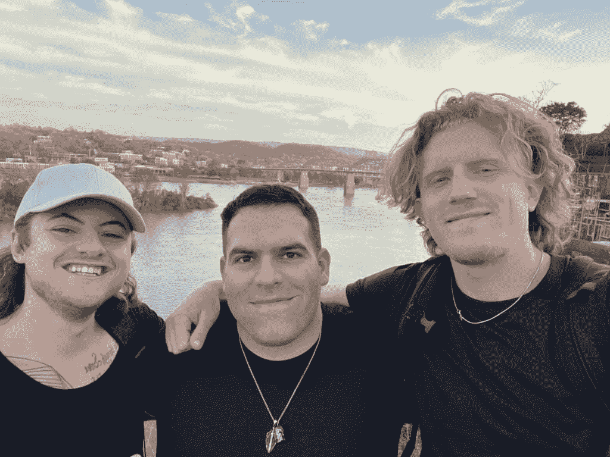

# 在线商业模式：2023年赚取一百万美元的最佳路径

## 概述

在本节课中，我们将探讨2023年构建可持续在线商业模式的核心思想。我们将超越追求快速结果的短期策略，专注于建立能创造真实价值、带来稳定现金流并最终实现规模化的业务基础。

---

这可能是自我提升领域最受欢迎的话题。

这类帖子总是表现优异：
+   2023年最佳副业
+   2023年最佳在线商业模式
+   如何在2023年变得富有

我对最后一个例子感到厌倦。

所有这些视频和文章都缺少一个关键方面：**在线商业的宏观概述**。

它们专注于技术技能、模型和推广策略，以尽可能快地赚钱。这本身没有错。我只是在这里提供新的视角，开阔你的思路。

问题在于**每个人**都想要快速的结果。我也曾如此。我在这里告诉你，这可能不会奏效。即使奏效，在接下来的3个月内也可能无法持续，因为你正在与其他缺乏工作目的的底层竞争者作斗争。他们处于生存状态，这使他们无法考虑[他们的**一生之工作**](https://thedankoe.com/the-rise-of-the-value-creator-a-new-career-path/)。

我收到了100多条私信和邮件，都是关于制作低质量视频字幕的。人们不在乎变得更好，他们在乎赚钱。这是一个残酷的错误。尽管如此，我也经历了和其他人一样的阶段。大多数人都这么做。

所以，把这当作你在商业旅程中的意识种子。如果你正用最新的策略追逐快速的钱，你大约还有3-6个月的时间需要转型、放弃，或者优先考虑成为最好的。

## 什么是最佳商业模式？

最佳商业模式是一个真正的商业模式。不是副业，不是免费的在线调查，也不是投资零花钱到加密货币中。

一个企业必须创造收入。你需要现金流。无论算法变化和趋势如何，企业都有能力扩展、转型并在市场上定位自己。将有一半的短形式内容创作者会失业，因为他们不懂真正的营销。

**金钱是社会生命的源泉**。就像你的手如果血液停止流动就会死亡一样，你的企业也会死亡，因此你的目标感也会消失。目标是超越你自身的东西。如果你没有赚钱，那就意味着你没有用你所能提供的价值为社会做出贡献。商业是你赚钱的方式，因此它也是你为社会做出贡献的方式。业务是你价值的载体。

在线调查、规定性的商业模式和大多数工作都是无灵魂的。

**一个业务有一个提议和流量来源**。这是一个超越商业的普遍原则。

提供的内容 = **价值**
流量 = **人**

你需要将一个有价值的产品或服务放在一群想要购买的人面前。就像在音乐节外摆一个热狗摊，旁边有一群喝醉的人走过。如果你有一个提议，但没有流量，你无法获得销售。

## 动态流量来源

我对[创作者经济作为一种生活方式](https://thedankoe.com/the-future-of-the-creator-economy-my-bold-prediction/)持乐观态度。不论你是否想创业或成为创作者，它都是*新经济*。

因此，个人品牌是“一刀切”流量来源的近似物。个人品牌是你如何成为细分市场[你](https://thedankoe.com/the-most-profitable-niche-is-you-how-to-create-your-niche/)并消除竞争的方式。

在个人品牌下：
+   你不必依赖广告。
+   你可以谈论任何你想说的话。
+   你不必长期依赖冷接触。
+   你建立观众群体，这样你就可以做任何你想做的事情。
+   当你停止手动工作时，你的业务不会死亡。
+   你不会被限制在特定的细分市场。

此外，你还能遇到志同道合的人，并真正享受你的工作。

**教训：** 个人品牌应该被视为你提议的基础流量来源。当人们知道你的名字时，付费广告的权威性会提高。向你的观众进行冷接触会使他们愿意与你交谈。如果你理解内容是关于价值而不是关于特定主题，你可以随时进行转型。

## 经验模型

我过去多次讨论过个人品牌策略。现在，我想更多地关注提案的创建。

大多数人认为他们需要完美的客户画像、完美的系统或精美的实物产品。事实上，*你需要比那些落后一步的人知道得更多。* 参见：术语“信息时代”和“注意力经济”。知识为王。

这世界上的一切都经过发展阶段。商业也不例外，如果你还没有开始，你不可能在两周内达到10级并每年赚100万美元。这似乎是常识，但大多数人因为社交媒体和快速解决问题的思维模式而设定不切实际的期望。我们必须从小处着手。

### 最小可行提案

一个最小可行提案围绕一个***单一***技能或兴趣。

收取高额费用需要时间、经验和跨学科技能的获取。用你的单一技能或兴趣，你立即就能将其转化为相关的自由职业、辅导、咨询或家教提案。

当我说“技能”时，我指的是任何类似的东西：
+   邮件营销
+   网页设计
+   营销文案
+   Facebook广告
+   品牌设计

当我说“兴趣”时，我指的是任何类似的东西：
+   健康和健身
+   性能和生产力
+   个人发展和灵性
+   人际关系

**快速打包你的提案**

有了一项技能，这应该是相当明显的。你可以销售网站设计、邮件营销或品牌设计等服务。从本质上讲，你可以参加一个入门级课程，观看一些YouTube视频，并开始销售。记住，你在这里不是试图收取天价费用，你必须发展你的提案。

**对于辅导、咨询或辅导服务**

首先，理解这个普遍原则：
+   **目标**（你的客户想要达到的地方）
+   **路径**（你独特的引导方式）
+   **问题**（他们现在正在挣扎的事情）

简而言之，这就是营销的全部。你正在销售一种*转变*。

**记住**：*自由职业者通过与客户合作来积累经验。你不需要有先前的成果就可以开始，因为通过帮助自己或帮助他人，你就能获得成果。*

咨询和顾问服务相当明显。对于辅导服务，你将**教授**他们技能，而不是为他们做。想象一下，你就像一对一地引导他们通过课程一样。这对于针对初学者非常有效。

你之所以这样做，而不是作为初学者开设课程，是因为：
+   你可以收取更高的费用。
+   你没有受众来带来持续的课程销售。
+   你还不知道什么能带来结果。
+   与十个$100的销售相比，做出$1000的销售“更容易”。

咨询、顾问或辅导服务包括以下几点：

**1) 你将要教授或帮助他们的事情的结构。**
想想他们现在在哪里（点A）以及你帮助他们实现什么（点B）。创建一个软性大纲，列出他们需要学习和做的事情。这不必变成一个课程。

**如果你想很好地组织你的教学：**
+   定义A点是什么。
+   定义B点是什么。
+   定义前往目的地的路径。
+   按照你的想法填写。

**2) 每周通话以回答问题并教给他们需要知道的内容。**
我建议出售一包4次通话。每周一次。你将教给他们确切需要知道的内容，并回答他们可能有的任何问题。4次通话让你能够创造一个更有吸引力的报价。你正在推广一种转变。

**3) 每周行动项目与文本访问**
每次通话后，你应该告诉他们确切应该做什么。你可以为他们创建工作表、任务或项目来完成。你应该有一种方式在通话之外与他们沟通。

**开始时收费500-1000美元**
对于单一技能的自由职业服务或4次通话套餐，你将从500美元开始，在最初的几位客户之后增加到1000美元。更好的是，我建议免费帮助人们。如果你是一位创作者，并且正在与其他创作者建立联系，可以免费提供给他们几次通话。随着你们双方的成长，他们的推荐信价值将增加。

*来自创作者的推荐信是宝贵的资产*。不要只试图捕获大鱼，因为你急需钱。慢慢来，稳扎稳打。

**你可以选择扩展客户业务或产品化**
当你在扩大你的品牌、获得客户成果并通过技能获取来完善你的报价时，你有两个选择：
1.  创建一个更有吸引力的报价并提高你的价格。
2.  将你的课程转变为基于班级的课程，并利用你的受众来推动它。

我当然推荐第二个选择。这给你带来更多空闲时间，更少的压力，以及更多的杠杆作用。主要的缺点是，你需要持续扩大你的受众来推动班级。然后，一旦你的班级取得成果和推荐信，你就可以进一步将其产品化为一门自学课程。

## 规模扩大至一百万

如果：
+   你不会因为一个低薪的报价而停滞不前。
+   你继续扩大你的追随者。
+   你在进化，你的报价在进化，你在增加收入的同时减少了你在工作上花费的时间。

我采取的这条路是通过个人品牌、数字产品和无尽迭代来实现的。我用了3年时间。希望我的内容能帮助你更快地达到那里。

## 总结

本节课中，我们一起学习了构建可持续在线商业模式的核心路径。我们明确了最佳商业模式是创造真实价值并拥有稳定现金流的企业，而非短期副业。我们深入探讨了以个人品牌作为核心流量来源的重要性，并介绍了如何围绕单一技能或兴趣构建“最小可行提案”，无论是通过自由职业、辅导还是咨询服务。关键在于从小处着手，通过服务积累经验和信誉，然后逐步将服务产品化，实现杠杆效应和规模化增长。记住，快速致富的幻想往往不可持续，专注于提供价值、建立个人品牌并持续迭代，才是通向长期成功和财务自由的可靠道路。