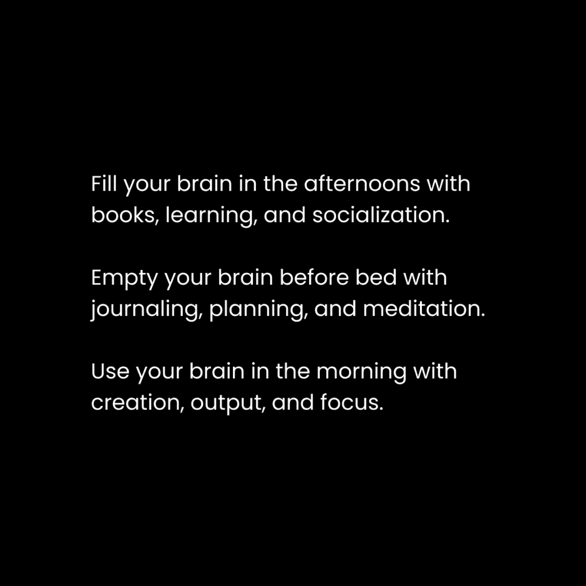

# 深度工作改变生活：概述与核心理念

在本节课中，我们将学习如何通过建立一套深度工作常规，在六个月内彻底改变你的生活。我们将探讨如何将理想未来的行动带入当下，并理解“概念生存”这一核心法则如何驱动我们的习惯与决策。

## 核心理念：将理想未来带入现在

一个强有力的思考方式是：将你理想中的未来生活方式，带入到当下的时间尺度中执行。

例如，如果你想在余生中每天早晨写作两小时，那么你现在就应该开始尝试每天花一些时间写作。这能为你创造基本收入、调整心情并培养创造力。

首先，你通过实验来认识到这一点。其次，除非你现在就尝试去做那些你未来想做的事情，否则你无法真正了解自己是否想要它们。这是一个生活方式的迭代过程。

当你把理想未来的具体行动带入现在，你就是在为那种生活方式投入能量。

根据“概念生存”定律，你会做出各种决定来维持这些日常习惯。

> **概念生存定律**：这是一种人类现象，我们的生存本能已超越物理层面，延伸至精神领域。我们努力维持的，不仅是肉体的生存，还包括那些构成我们自我意识的思想、概念和信仰。

任何威胁到你维持理想生活方式能力的事物，都会被你的大脑视为一个问题。你的大脑会从这个视角审视情况，并主动寻找潜在的解决方案。这些解决方案可能出现在社交媒体、书籍或任何地方。

这也是为什么我鼓励人们重读他们最喜欢的书。很可能，你已经有了精炼的目标。你会带着这个视角去阅读，并发现有助于你当前努力的教训。

**核心教训**：如果你没有在为自己的理想未来努力，那么你就是在为别人的梦想努力。你的时间会根据感知到的重要性来分配，因此，请通过为目标投入能量来创造这种重要性。

---

# 深度工作改变生活：2：全面的每日例行程序

上一节我们介绍了将未来带入现在的核心理念。本节中，我们来看看支撑这一理念的每日例行程序框架。你需要专门的时间来培养创造力、生产力和进行实验。

人们常提出的反对意见是：“我没有足够的时间！”这没关系。我并非要求你全天都这样做，而是要求你尽可能少地开始，比如每天15分钟。因为你的心理健康依赖于此。如果你已完全适应现代生活而从未尝试突破，那么你本质上可能被困在了某种“矩阵”之中。

许多读者熟悉我的日常安排，这里简要说明。你需要三类活动来全力以赴追求目标：

以下是构建高效日常的三个核心组成部分：

+   **充实心灵**——你需要教育、新思想以及可以应用于目标的新资源。这能激发内在动力。
+   **清空心灵**——你不想被困在混乱思绪和有用想法的泡沫中。写下你的想法，保持清晰。
+   **利用心灵**——你需要一个容器来集中努力。在思路清晰的基础上，构建你的未来。

本教程将重点聚焦于最后一点：如何通过深度工作来“利用你的心灵”。

---

# 深度工作改变生活：3：深度工作的必要性

上一节我们构建了每日例行程序的框架，本节中我们来深入探讨其核心引擎：深度工作。生产力关乎在最短时间内完成最有效的工作，而非比拼工作时长。

我们之前讨论过一个重要概念：**感知阈值**。它指的是，曾经困难的事情在克服阻力后会变得毫不费力。当我们为目标投入精力，即使起初并非热情所在，也会达到一个突破点，那时我们会对工作本身充满热情。

如果我们为能带来理想未来的事物投入精力，当动力减退时，我们会觉得是在浪费这份投入。而动力本身的感觉是美妙的。

在一个充满通知、无限选择和令人不知所措的世界里，深度工作不再是一种选择。如果你想改变生活，它是一项**必需品**。深度工作是你以创纪录的速度构建梦想的方式。

> 你是谁，你思考、感受和所做的一切，你所爱的事物——这些都是你关注的总和。 —— 卡尔·纽波特

---

# 深度工作改变生活：4：优先级阶梯实践法

我们了解了深度工作的重要性，那么具体如何执行呢？本节介绍一种结构化深度工作时段的方法：**优先级阶梯**。通过每天1小时的纯粹专注，你可以在6个月内彻底改变生活。

优先级阶梯将专注时段分为四个逐级递进的层次，每个时段持续60-90分钟后休息。随着层级下降，允许分心的可能性逐渐增加。

以下是优先级阶梯的四个层级：

+   **优先级 1 - 愿景构建**：这是最核心、应完全无干扰的时段。行动应能真正推动进展。**杠杆 = 真正推动你走向新见解、进步或结果的东西**。例如，对于想创业的人，初期应专注于学习关键技能或通过有效方法获取初始流量，而非直接开始写没有读者的新闻稿。
+   **优先级 2 - 高效创意工作**：专注于生成和深化你的独特想法。例如，撰写长篇内容（如新闻稿），这能锤炼思想质量，决定未来品牌的高度。
+   **优先级 3 - 有意义任务与溢出工作**：处理与创意工作一致、但重要性稍低的任务。例如，将核心想法转化为社交媒体内容。此阶段也应完成你不想外包的有意义工作。
+   **优先级 4 - 维护任务**：最后处理维护性工作，如查看邮件、回复消息、维护现有产品/服务。将此放在最后，是因为即使一条消息也可能打断之前的深度工作流。

**关键公式**：`绝对专注 = 在2小时内完成8小时的工作量`。直到你亲身实践，否则很难体会其威力。

---

# 深度工作改变生活：总结与行动号召

在本教程中，我们一起学习了如何通过深度工作常规在六个月内改变生活。

我们从**将理想未来带入现在**的核心理念出发，理解了**概念生存定律**如何驱动我们维持习惯。接着，我们构建了包含充实、清空和利用心灵的**每日例行程序框架**，并深入探讨了**深度工作**作为改变引擎的必要性。最后，我们掌握了可操作的**优先级阶梯**实践法，将深度工作结构化，从高杠杆的愿景构建到日常维护任务。

现在，关键在于行动。尝试这些方法，实验并找出最适合你的节奏，然后享受高效工作后带来的充实一天。

– 丹