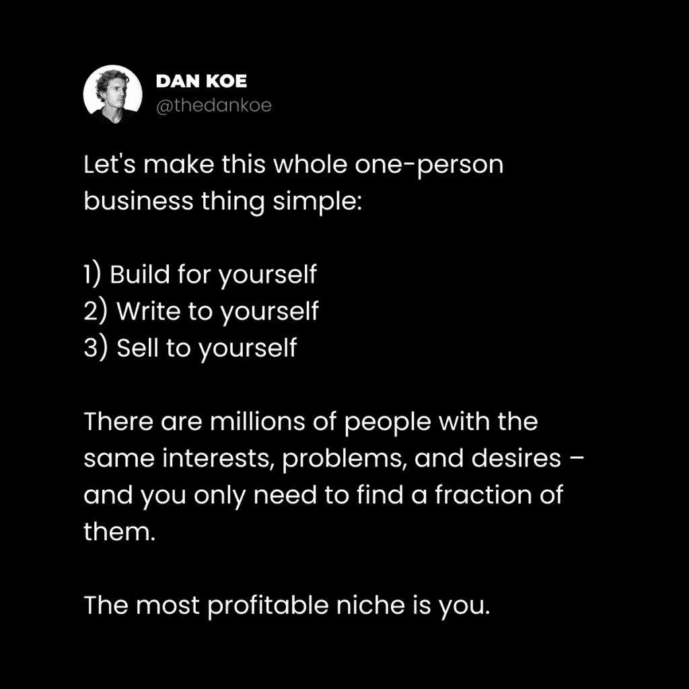
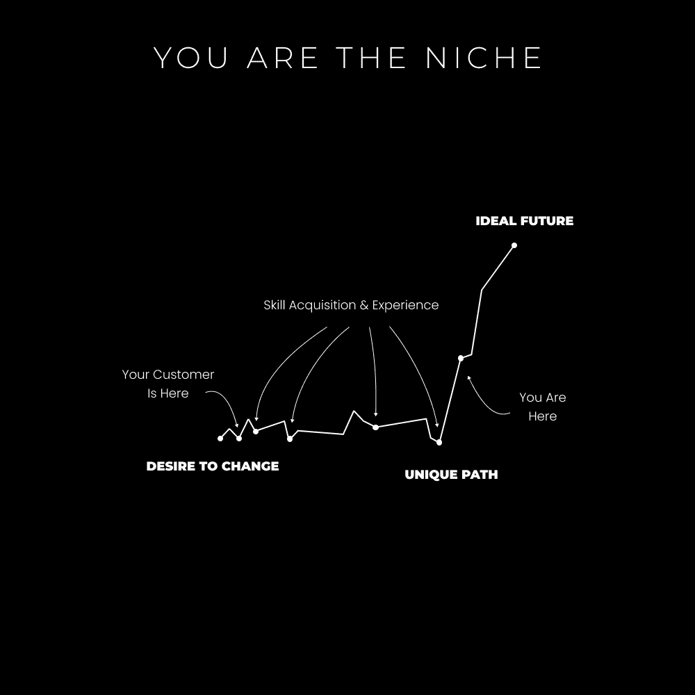
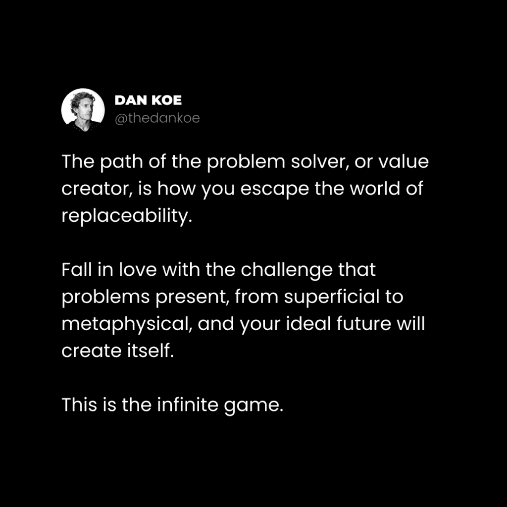
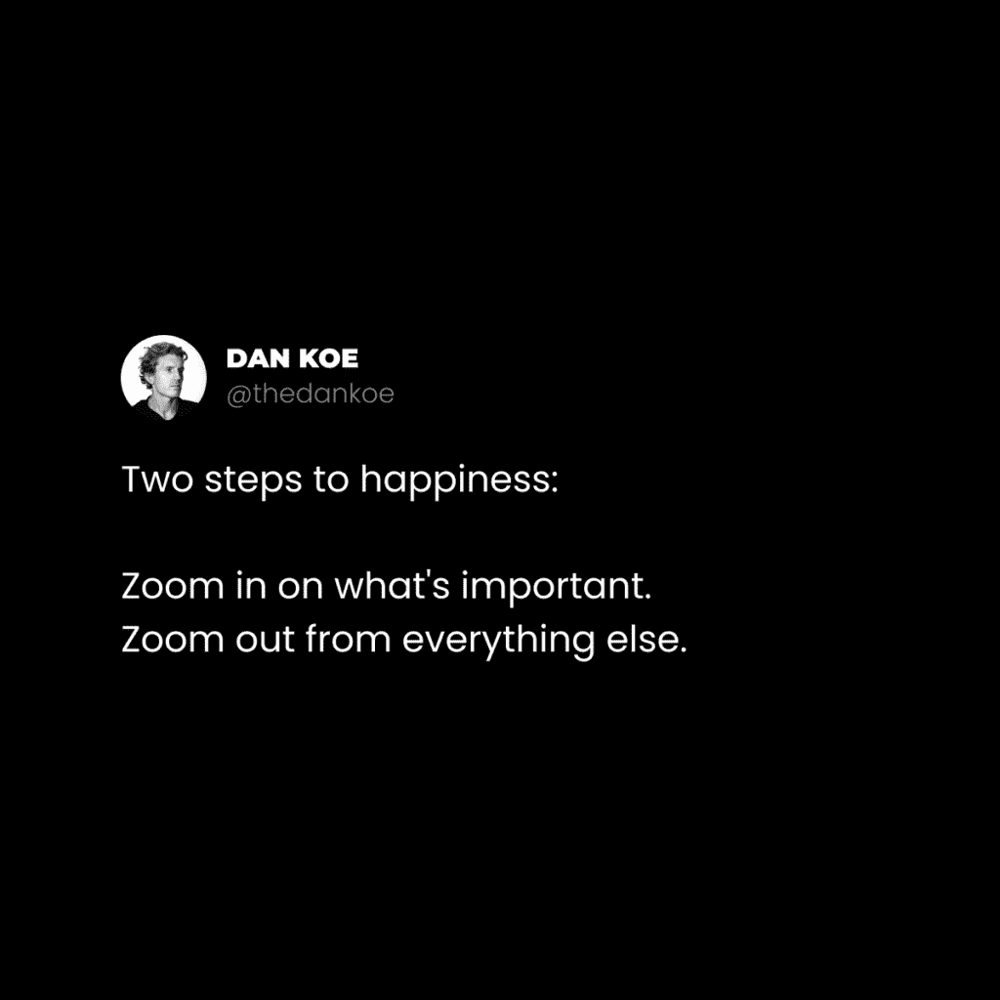

# 个人品牌构建：如何创建最有利可图的领域——你自己

在本节课中，我们将学习如何构建一个以你自身为核心的个人品牌领域。我们将探讨为何“你自己”是最独特的利基市场，并提供一个清晰的步骤指南，帮助你从零开始创建并发展它。

---

我购买的第一门商业课程是一门价值六位数的代理课程。
那是六年前的事。
在那之前，我无法理解课程的价值。
我曾试图独自完成所有事情。
我知道信息存在于网络上，但独自摸索从未成功。
缺失的环节太多。
社交媒体上的免费教育很好，但算法鼓励人们保持简短、有趣，并专注于最吸引人的话题。
每个人都想要免费的东西，这导致高价值的建议被淹没在噪音中。
不要认为你对此免疫。没有人能免疫。
当我对多次商业尝试感到厌倦时，我准备投入我的全部积蓄。
我研究了最好的商业模式，找到了一位声誉良好的人，观看了他的网络研讨会，并支付了999美元。
这对我的财务状况造成了巨大冲击。
所有费用都记在了我的第一张信用卡上。
作为一名兼职大学生，这给我带来了巨大压力。
我同时处理着太多事情。
我并不关心教育本身……但它推迟了我必须让企业成功以避免找工作的最后期限。
那是一个明显没有前途的兼职工作。
在此之前，我有过多次商业失败。
其中存在许多风险。
然而，结果并不理想。
这门课程很棒，它教会了我文案写作、销售漏斗、销售和客户获取过程的可操作性，这些为我未来的企业提供了动力……
但是，有三件事摧毁了我成功的机会：
1.  我对运营Facebook广告代理业务根本不感兴趣。我并不*想*为我的业务工作。
2.  向本地企业发送冷邮件既耗时又压力大，而且他们中没有人有足够的预算支付我。
3.  我从未对自己的利基市场有信心，这导致了大量的摩擦和“闪亮物体综合症”。

这次Facebook广告的经历，比其他任何商业、课程或观点都教会了我更多。
即使它没有直接教会我什么，它也揭示了我未来所有企业中存在的问题。
那就是：选择一个利基市场。

*在深入探讨之前，这是一篇计划好的文章（但我仍然计划在这里提供尽可能多的价值）。*
[首次“独奏者冲刺”活动将于2月7日开始](https://sprints.digitaleconomics.school)。我们首先要了解的是如何创建一个你充满信心的、与你自身相似的利基市场。可以考虑去看看。
这是一个150美元的团队项目，结构有趣且具有影响力（因此我不必为相同的材料收取数千美元）。

## 最有利可图的领域是你自己

广告代理并不是我的第一次，也不是最后一次商业尝试。
其他人在自由职业模式中取得了成功，我还没有放弃（尽管我之前“放弃”了好几次）。
在我努力达到第一个六位数收入后，我偶然发现了推特。
我在一个名为“金钱推特”的小社区中找到了账户，它们引导我走上了现在的道路。
这并非一蹴而就，但我对我的品牌未来有一个愿景。
我创作内容，构建产品，专注于解决阻碍我实现理想未来的问题。
但是，有一件事让我在商业场景中脱颖而出：
*我没有一个静态的利基市场*。
我重新定位的提议是为创作者提供营销咨询（离开本地商业利基市场是有意义的），但我不仅仅谈论营销。
我以任何我想谈论的方式，展示了主题对广大受众的重要性。
如果我想谈论情绪管理，我就会谈论。
如果我想谈论健身和营养，我就会谈论。
如果我想发布一些励志建议，我就会发布。
我80%的内容**并不**围绕我的服务展开，但这并不重要。
为什么会这样？
如果我可以同时对商业和健身感兴趣，那么其他人也可以。
而且，如果你“应该”缩小你的利基市场，这不是最好的方法吗？
只针对像你一样的人，或者想要成为像你一样的人，因为他们拥有相似的理想未来。
这并不是说你要在所有内容中都推广你的产品或服务。
你可以创建一个包含权威内容和促销内容的系统。
如果我想推出新产品或服务，我会这样做：
1.  无论谈论什么，我都以有趣的方式引导人们走向成长。
2.  围绕产品或服务的主题制定一个为期三周的策略（这有助于建立权威，这正是我现在在[独奏者冲刺](https://sprints.digitaleconomics.school)中所做的……请注意——我在上一封信中提到过商业吗？）。
3.  为了提高客户意识，从入门级内容开始，随着发布日期的临近，逐步提升到高级内容。
4.  从上到下撰写长篇、中篇和短篇内容。促销内容会自然产生。
5.  将有效的方法系统化，并在一周内穿插促销活动以保持高销售额。例如，围绕你的产品或服务主题进行每两周一次的讨论。

你的品牌和你的产品之间存在细微差别。你的品牌**不是**你的产品。
几篇“离题”的内容不会破坏你的收入。如果你知道自己在做什么，它们实际上会帮助你。
我很幸运，在我开始成为创作者时，我的金钱问题已经解决了。
大多数人开始是为了赚钱，这是好事，但生存的需求可能会干扰你的创造性思维。
大多数创作者开始时都订阅了一种商业理念，这种理念告诉他们要尽可能细分市场，针对一个与他们没有任何共同点的人，并使用他们不关心的技能来取得成果。难怪人们这么快就放弃了。
如果你想消除所有竞争，你必须有更大的想法。
个人品牌*可以*是吸引客户的一种方式。
但是，当你将你的信息视为你一生的作品时，就不可能将其包含在一个传统的利基市场中。
你生活中的大目标需要多种技能、兴趣和专业知识。例如，灵性如何帮助实现财务自由，或商业中的情绪管理。你的兴趣使你的品牌独一无二。

上一节我们探讨了为何“你自己”是最佳利基市场。接下来，我们来看看如何具体创建这个个人利基市场。

## 如何创建你的个人利基市场

从本质上讲，你的“品牌”或“自我”可以是重复的商业理念或有意识的个人创造的结果。
如果你的品牌停滞不前，你将面临一个充满痛苦的世界。相反，我们希望不断进化，永不停止。
因为如果你不进化，你就会被困在[创作者发展的较低阶段](https://thedankoe.com/the-one-person-business-roadmap-99-of-creators-make-this-mistake/)。
让我们一起来探讨如何（为了商业目的）重塑自己。

### 1) 描绘你的理想未来

你的故事将如何结束？
这会带来平和、健康和充实的工作吗？还是你毫无头绪？
你的故事是你个人品牌与众不同的地方。
如果你没有[对未来的愿景](https://thedankoe.com/the-focus-formula-how-to-take-control-of-your-life/)，你将如何自我教育并在有利的方向上执行？
坐下来思考一下。
我们将在第3步回到这一点。

### 2) 聪明的模仿

> 当你从一位作家那里拿东西时，这叫抄袭，但**当你从多位作家那里拿东西时，这叫研究**。 —— 威尔逊·米兹纳

我的声音是我所喜爱声音的组合。
我的品牌设计是随着时间的推移，我逐渐喜欢的颜色、感觉和风格的组合。
我的商品、网站和着陆页是通过借鉴他人的优点制作的。
这里有颜色，那里有按钮，那里有语调的变化，以及其他一些细微的区别。
我不是在谈论让你看起来像模仿者的几件大事。我是在谈论每一个微小的区别。随着时间的推移，这会累积起来。
你通过借鉴你渴望成为的人的优点并使之成为你自己的方式来做“你自己的事”。
这适用于任何项目，但你要这样做：
以下是具体步骤：
+   列出对你影响最大的书籍。
+   列出你最喜欢的创作者、作者或公众人物的风格。
+   沉浸在他们作品中，让你的思维习惯于那种风格。
+   列出他们的语调、声音以及他们如此出色的原因。
+   研究他们的产品、着陆页以及他们如何赚钱的每一个细节。

简而言之，创建一个由导师组成的部落，并长期独家消费他们的内容。
成为他们精神上的好朋友（在思想上）。
然后，通过你的视角传递你对所做事情的热情。
如果你在潜意识里将他们的想法拼凑成一个新的原创想法，你就不需要复制他们。
你是一个视角的容器，[这正是你独特的地方。](https://thedankoe.com/how-to-copy-your-way-to-success-instead-of-mediocrity/)
如果你养成研究你所渴望成为的人的每一个方面的习惯，好想法就会自动产生。
然后，从你的角度执行那些想法。
视角是目标导向的。
因此，从试图实现你理想未来的角度进行创作。
有些人写日记是因为他们的目标是精神清晰。
有些人写在线内容是因为他们的目标是财务自由。
你的目标是什么？以及特定的技能和兴趣如何帮助你实现目标？

### 3) 从书籍大纲到品牌内容

每个故事都有一个理想的结局，一个最终目标。
通向这个最终目标的道路将充满高潮、低谷、情绪、战斗、错误和需要系统化的解决方案。
这就是如何将你的“自我”或品牌转变为一个容纳你的内容、产品和服务的利基市场：
以下是具体步骤：
+   将你的理想未来视为故事的目标。
+   记录你的过去，有几个关键的转折点可以作为你书籍的起点。
+   记录下书籍的大纲。为了达到最终目标，必须包含哪些章节？
+   为那些章节制定关键点大纲。

这不会立即发生，但你需要一个大纲。
随着你经历生活并取得进步，章节的想法会出现在你面前。
你可能不知道某些章节要写什么，这正是重点所在。
你将不得不获得技能、兴趣和专业知识来实现你的现实。
你是吸引追随者的领导者。
追求你的目标，解决挡在你道路上的问题，并将你的经验传授下去。

### 4) 书写你的故事

故事造就了品牌，你的品牌是独一无二的。
你的故事让你与那些经历与你相同低谷的人产生共鸣。
这给人们带来希望，表明有出路，而你正是引导他们的灯塔。
现在你已经为你的生活故事制定了大纲，开始写作吧。
以下是具体步骤：
+   将每个章节写成文章或通讯。
+   将这些写作内容改编成播客或YouTube视频。
+   将主要观点浓缩成一条推文串、轮播图或LinkedIn帖子。
+   将那些主要观点重写为引人入胜的推文。
+   将那些推文变成其他平台的短视频和帖子。

这个过程让你对你所谈论的主题有一个多维度的理解。
此外，如果你记得，教学是最好的学习方法之一。
你可能会讨厌你最初的内容，但这就是你识别要解决的问题的方式。
如果你写作有困难，那是一件好事。

### 5) 当怀疑时，放大视角

解决困境的方法是视角。
这段旅程是困难的。
你将难以定义你的专业领域，因为没有人愿意把自己放在一个框子里。
理解你不需要立即解决这个问题。
相反，你需要设定一个解决问题的意图。
从那里，通过课程、内容和对话来教育自己，这些将把创造力储存在你的大脑中。
用潜在的解决方案充实你的大脑。
只是不要分心。
然后，放大视角。
给你的大脑留一些空间，以创造性地解决那个问题。
去散步。和朋友出去。去健身房。
做任何能让你停止思考工作的事情。
就像魔法一样，“啊哈！”的时刻会到来。
你的潜意识会将突破性想法发送到你的意识中。
这个循环过程被称为主权生活。
生活的起伏不会被工作的日常所掩盖。
记住这一点，享受你剩余的一天。

**– 丹·科**

附：首次“独奏者冲刺”将于2月7日开始。
这是一个为期14天的密集策略，适用于感到不知所措的创作者：
以下是具体内容：
+   建立你一人企业的基础。
+   创造并对你的利基市场建立信心。
+   撰写20多个基础内容（你可以以1000种不同的方式重新利用）。
+   学习零成本策略，让你的内容和个人资料（对于获取关注者）获得关注。
+   重新利用你最好的内容，并利用它们更快地成长。

*无需承担正常团队模式的高价。*
[如果你感兴趣，请在此处报名](https://sprints.digitaleconomics.school)
价格是150美元（这是一个你将终身利用的品牌）。

---

在本节课中，我们一起学习了如何将“你自己”打造成最有利可图的个人品牌领域。我们从理解个人品牌的独特性开始，逐步学习了描绘理想未来、聪明地模仿、规划内容大纲、书写个人故事以及在遇到瓶颈时调整视角的具体方法。记住，你的经历、兴趣和目标共同构成了无可替代的利基市场。持续进化，分享你的旅程，你就能吸引与你共鸣的受众，并建立持久的事业。