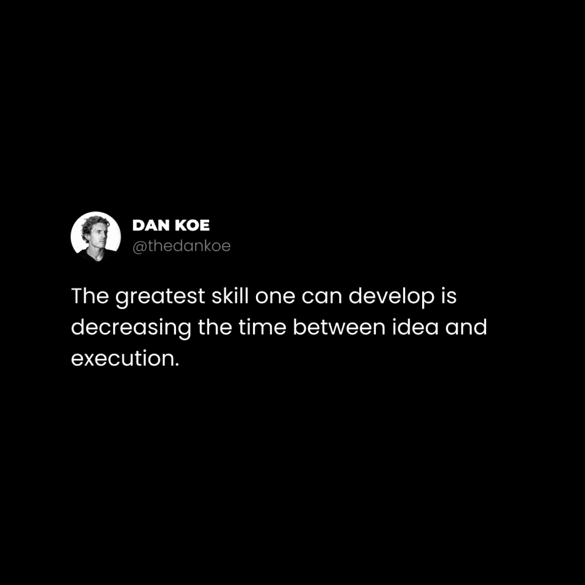

# 社交媒体增长 101：如何撰写真实内容

在本节课中，我们将学习在人工智能时代，如何通过撰写真实、有吸引力的内容来建立个人品牌和实现社交媒体增长。我们将探讨如何组织你的兴趣主题，并掌握几种能有效建立权威的内容写作方法。

---

人们希望关注的是真实的人，而非一个带有人脸的搜索引擎。随着ChatGPT等语言AI的兴起，内容的真实性变得前所未有的重要。每个人都渴望人与人之间的真实连接，而许多社交媒体内容并未提供这种连接。如果你能做到这一点，你将建立起远超想象的个人权威。

根据预测，真实性将成为下一代内容创作者的关键差异化因素。这也是为什么需要探讨哲学、自我认知等非商业话题，它们能让你在商业世界中真正脱颖而出。在与超过5000名创作者直接或间接合作后，我发现他们普遍面临一个最令人困扰的问题：不知道如何将真实的自我融入内容中。这导致许多人在取得成效前就放弃了。即使坚持下去，如果不展示你是谁以及你的背景，你和机器人又有什么区别？

更糟糕的是，那些拥有多个兴趣的人，往往不知道如何写作才能促进增长、树立权威并提升参与度。在深入探讨如何组织主题、撰写内容以及将一个想法扩展成十个之前，请了解我的背景：三年前我开始成为创作者。起步时我就推出了一个产品，尽管很多人警告不要这样做。当我的产品与网页设计相关时，我写了自己想写的一切，包括情绪管理和自我提升。我偶尔会穿插一些关于网页设计的推文，因为我知道这很重要。对于担心变现的人来说，核心建议是：平时可以随意谈论任何你感兴趣的话题，当需要推广时，就多谈谈与推广相关的话题。事情就这么简单。当然，实践中的经验将教会你更多。

**在开始之前请注意：**
首次“独立创业者冲刺”活动将于2月7日开始。在14天内，我们将帮助你在特定领域建立信心，创建20多个基础内容作品，并为你的创作者品牌制定零成本增长策略。
[>> 如果感兴趣，请在此处查看](https://sprints.digitaleconomics.school)

## 构建你的主题树 🌳

如果你不确定该写什么，建议先阅读[关于如何将自己打造成一个细分领域的上一封信](https://thedankoe.com/the-most-profitable-niche-is-you-how-to-create-your-niche/)。在那封信中，我们概述了如何将你的生活故事转化为像书籍章节一样的主题。

你需要思考：哪些技能和兴趣能帮助你创造理想的未来？对于那些已经走在路上的人，是哪些技能、兴趣和专业知识帮助你实现了目标？理解那些看似不能直接盈利的兴趣同样重要，因为它们可能间接帮助你达成目标。例如，如果你的理想未来是内心平和、不为金钱焦虑，那么解决之道可能在于精神层面而非金钱本身。因此，不要犹豫去包含你热爱谈论的事情。一个额外的好处是，你对这些兴趣的热情会自然流露在你的内容中。这些就是我们即将用于创作内容的素材。

### 选择2-3个你想要撰写的兴趣或技能

这些兴趣应该已经存在于你的脑海中。我无法替你做出选择，因为我不是你。如果你目前没有特别想写的兴趣，那么你需要设定一个目标，开始追求它，并学习那些能帮助你达成目标的知识。

### 主题的扩展与分解

大多数人从过于具体的兴趣开始，例如“生物力学运动疗法”，然后因为受众太少而感到压力。进一步地，他们又担心如果不只谈论这个具体话题，整个变现潜力就会消失。但事实并非如此。我们需要放大视角。

假设我的兴趣是：
*   网页设计
*   举重
*   精神层面

我希望将这些兴趣扩展到它们所属的更广阔市场：
*   网页设计 = 在线业务或广义的商业。
*   举重 = 健身或广义的健康。
*   精神层面 = 自我实现或提升。

现在我们有了三个可以自由发挥的广阔市场，接下来需要将它们分解成主题和子主题。这种方法的美妙之处在于：如果你希望通过像“生物力学运动疗法”这样的兴趣赚钱，你可以先吸引对健康感兴趣的人群。然后，逐步提高他们对生物力学的认知，并教育他们为什么这很重要。**你不应该只吸引那些对你的核心兴趣了如指掌的人**，因为他们可能已经不需要向你购买了。

针对这3个兴趣，拿出一个笔记本，像下图这样分解它们：

你的任务是在未来6-12个月内，用各种长度的内容覆盖这个领域的每个部分。这就是你建立品牌认知度的方式。

### 牢记社交杠杆的三大支柱

在开始创作内容之前，我们希望平衡写作的风格。社交杠杆的三大支柱是：增长、真实性和权威性。你的内容，在1-2个月的时间尺度上，应该触及这三个方面。如果你没有获得增长，就调整方向。如果你没有实现销售，就调整方向。如果你没有赢得忠实粉丝，就调整方向。根据你从现实世界获得的反馈进行迭代。即使内容不完美，你也必须坚持发布。

## 如何撰写3种建立权威的内容 📝

我们将以撰写推文为例来创作这些内容。为什么选择推文？因为推文的长度和结构，是任何平台上高绩效帖子的完美基础。我的LinkedIn帖子、Instagram帖子、Reels、TikToks等内容都基于我的推文。

我们将首先在你用来赚钱的主要兴趣上建立权威。让我们以“营销”为例。对于以下任何示例，你都可以：
*   将它们扩展成论坛帖子或新闻通讯以增加权威性。
*   将列表中的任何一点重新制作成单独的帖子。
*   将它们复制粘贴到其他平台。
*   将它们用作短视频、Reels或TikToks的脚本。

现在让我们深入探讨。

### 1. 可操作的原则

这种方法很简单：列出初学者可以采取的可操作步骤。这有助于你在某个领域建立权威。即使是高级受众也会关注你，因为他们理解重温基础原理的重要性。

对于所有类型的内容，请记住遵循这个结构：**钩子 > 正文 > 结论**。

> 你的内容很糟糕，因为你没有：
> 
> – 吸引读者的兴趣
> – 刺激他们的问题
> – 与他们的问题相关
> – 给他们一个有价值的解决方案
> 
> 人类心理学总会战胜你认为会起作用的东西。清晰，而非花哨。

我正在现场撰写这些示例，所以它们可能不完美，但请跟随我的思路。选择你主要兴趣中的一个领域，制作一个吸引人的钩子，提供可操作的价值，并进行优雅的总结。练习造就完美。

### 2. 阐述话题的重要性

大多数人不在乎你写什么，因为他们不理解其重要性。所以，不要轻易放弃并责怪系统……你应该做的是教育他们为什么它很重要。**这是让你的兴趣对他人产生吸引力的方法。** 让他们意识到它如何影响他们的生活。

> 营销是你能学到的最伟大的技能。
> 
> 为什么？
> 
> – 它与任何其他技能都相辅相成
> – 它教你人类心理学
> – 它帮助你将一个利基兴趣变现
> 
> 只有傻瓜才会期望在不学习如何将浏览者转化为顾客的技能的情况下赚钱。

这里有一个从Twitter用户Taylin Simmonds那里借鉴的好例子：

请尝试一下。思考：你的主要话题为什么重要？它是如何影响你的生活的？为什么其他人应该关心？进行自我反思，并就此写一篇帖子。

### 3. 指出常见错误或问题

在你的领域建立权威的一个好方法，是指出不良建议、常见错误或普遍存在的问题。这表明你拥有经验，并且真心想帮助你的读者。

> 停止写过于具体的内容。
> 
> 作为初学者，你应该专注于增长。
> 
> – 使你的写作更具亲和力
> – 关注一个共同的问题
> – 从高层次讨论话题
> 
> 如果只有少数人愿意分享你的内容，不要期望增长。

这引出了我的下一个建议。

## 如何最大化你的写作潜力 🚀

初创创作者常常难以看清内容创作的全景。你并不是每一篇帖子都旨在立即促成销售。你的帖子不是销售页面（但了解如何撰写销售页面确实能提升你的帖子质量）。当你审视自己的作品时，应该能明显判断出，它是否会被在社交媒体上滚动浏览的普通人分享。如果不是，那么在这个细分领域里，你缺乏增长策略，又怎能期望获得增长呢？分享是自然品牌增长的引擎。

放大视野，认识到随着时间的推移，你的内容会向人们介绍你所能提供的一切。当时机成熟，如果你具备相应的技能，他们就会从你这里购买。

### 扩展你的内容

回顾我上面写的示例推文，它们具有权威性吗？是的。它们会吸引潜在客户吗（假设他们在我的内容之外还能找到更多价值）？是的。它们是否具体到不会被分享？不是。这就是你在社交媒体“漏斗顶端”必须达到的平衡。然后，当你将他们引导至你的新闻通讯、引流内容和产品销售页面时——那才是你需要尽可能具体的地方。如果你的内容看起来连初学者都不会分享，那就将范围缩小一个层级重新撰写。

### 研究最佳内容结构

在我们开始撰写除列表以外的其他内容之前，我建议你先研究优秀的内容是什么样子。我个人使用[TweetHunter](http://tweethunter.io/?via=thedankoe)（一款软件）和Twemex（一款Chrome插件）来快速查看我喜欢的账号的顶级内容。你也可以通过Twitter高级搜索来实现，只需在搜索栏输入：
`from:thedankoe min_faves:1000`
将我的用户名替换成其他人的，并将最小点赞数改为你想要的任何数字。沉浸在这些优秀内容中，把它们当作你学习的“辅助轮”。你会用哪些主题来练习呢？

### 重新利用你的列表式内容

你上面写的列表包含多个要点，每个要点都可以扩展成独立的内容。这些列表也可以作为一个帖子、轮播图或新闻通讯的提纲。（我强烈推荐这样做，以建立更多的权威性）。

现在，让我们专注于撰写另一篇短文。从我们上面写的第一条推文开始，第一个要点是“吸引读者的注意力”。如果我借鉴我一条获得9000个点赞的高绩效推文结构：

那么，我可以撰写一条新的推文：“最大的数字技能是捕捉、保持和传递注意力的价值。”这可能是一个更好的角度，但我知道原来的那条效果会很好。

如果你遵循这些确切的步骤，并运用你所有的兴趣，你会发现所有这些关于内容写作的事情都变得很简单。

---

## 总结 📌

本节课我们一起学习了在AI时代进行真实内容创作的核心方法：

*   你可以并且应该将个人兴趣融入内容，使品牌更真实。
*   创建一个主题树，规划在6-12个月内通过写作掌握该领域。
*   撰写多种列表式内容，以在你的主要兴趣领域建立权威。
*   如果你认为内容不会被分享，请扩展写作的广度。
*   研究最佳内容结构，将其作为学习工具，并从已写内容中进行扩展。

这就是你开始内容创作之旅所需的一切。在下一封信中，我们将讨论如何在不花费一分钱的情况下分享这些内容。

希望你们喜欢这篇内容。

我们很快就会再联系。

– DK

**当您准备好时，我能如何提供帮助：**

*   **独立创业者冲刺活动**将于2月7日开始。我们将共同创建你的细分市场，撰写20多篇内容，并制定增长策略，以便你最终可以全职从事这项工作。[在此处报名，费用为150美元。](https://sprints.digitaleconomics.school)
*   **2小时作家课程**在实用环境中教你高影响力的创意写作。我帮助你构建内容生态系统，并在众多创作者中脱颖而出。[在此处报名2小时作家课程。](https://2hourwriter.com)
*   **Modern Mastery**是一个涵盖营销、销售、个人发展和绩效的私人社区。立即获得策略库访问权限、Discord个性化帮助等。[读者可以花5美元加入。](https://modernmastery.co/letter)