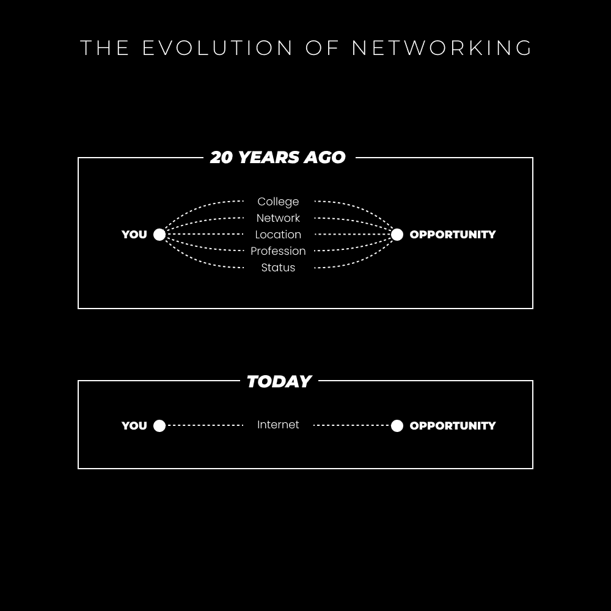

# 数字社交：如何建立高价值联系

在本节课中，我们将学习一种名为“非需求型社交”的方法，它可以帮助你在数字世界中，无需刻意讨好或索取，就能与高价值人士建立真诚且有意义的联系。我们将通过七个具体步骤，让你掌握从找到目标对象到最终提出请求的全过程。

---

## 概述：内向者的社交突破

我本质上是一个内向者。在大学时期，我不是那个主动开启对话的人。我的朋友圈是偶然相遇后自然形成的。我从未想过在课堂上发言，更不用说参加“社交”聚会去结识有价值的人了。那时，我只想待在宿舍里玩游戏，经营我的健身YouTube频道副业。

后来我意识到，内向不等于反社会。社交是一种可以习得的技能，而非固定的性格特征。许多人躲在“内向”的标签后，以逃避成功路上必经的不适感。大学时代已经过去，如今我们身处社交媒体的新舞台。

我曾多次尝试为自己建立名声：先是YouTube频道，然后是Instagram摄影艺术页面，接着是通过各种营销策略建立机构和电商品牌。最终，我偶然发现了Twitter。起初，我认为那只是政治和不成熟梗图的地方。直到有一天，Jose Rosado一篇关于自我提升的帖子出现在我的时间线上。我被其内容吸引并关注了他，由此我的时间线开始被高价值的“财富推特”内容填满。

我潜伏了大约六个月。当时我的自由职业业务已小有成就，这些账户的建议对我很有帮助。突然，一个想法击中了我：“我也可以写出同样的推文。为什么我只是在刷屏，而别人却在获取线索、达成销售并享受分享兴趣的乐趣？”这个问题改变了我生活的方向。

上一节我们回顾了从内向者到发现社交媒体潜力的心路历程，本节中我们来看看数字世界如何打破了传统的社交壁垒。

## 数字世界没有障碍

在过去，通往成功的路径往往依赖人脉。你需要上学、取得好成绩、进入名校，并足够“外向”以通过社交攀爬阶梯。重大的机会只留给那些努力争取的人。

如今，情况已截然不同。机会无处不在。你刚刚划过的推文作者可能需要一位视频编辑；你在评论中发现的人可能想学习如何获得快乐；那个被算法埋没的视频可能详细介绍了自由职业的成功步骤。互联网让你能接触到全球49亿用户。只需一篇内容传播到正确的角落，被正确的人看到，他们就可能联系你并为你的价值付费。

当然，拥有一个分享你内容的受众群体会让这一切更容易，但我们不应在起步时就依赖于此。人脉——尽管我不喜欢这个词——是我数字成功的基石。

Jose Rosado是我最早联系的人之一。我们相处融洽，他帮助分享了我的内容，后来我也投资了他的辅导计划。如今，我们对在线业务的看法虽不同，但这正是重点：每个人都有独特的、可供他人学习的路径。

另一个例子是我的好友Joey Justice。我们曾与一群人共同致力于品牌扩张，分享策略与内容，并共同提升技能。去年，我还与Dakota Robertson和JK Molina一同搬到了德克萨斯州，并结识了Justin Welsh、Sahil Bloom和Dickie Bush等行业重量级人物。

总而言之，与志趣相投的人进行持续且有目的的社交，是进入并维持社交媒体增长的关键。如果你没有在积极建立人脉，那么你已经处于劣势。任何拥有持续增长的创作者（且未陷入负面互动循环）都会告诉你人脉的重要性。

上一节我们探讨了数字世界如何提供了平等的社交机会，本节我们将深入探讨实现这种连接的核心工具：私信。

## 私信的力量

私信是你出现在互联网上任何人面前的方式，尤其是在你还没有观众的时候。自由职业者用它来寻找客户，而当你决定转型时，它也是你构建初始受众、避免从零开始的利器。

我见过人们通过私信找到工作，见过粉丝很少的推文因此走红，也见过数百甚至数千粉丝的账户从中获益。人们通常分为两个阵营：要么低估了持续私信带来的网络效应力量，要么不明白通过策略可以让大账户分享你的内容。

私信是你作为新手建立人脉、促进成长和吸引内容关注的主要方式。但问题是，大多数人都不擅长发私信。

**永远不要**指望收到回复，如果你的私信内容是：
*   “你好”或“嘿”
*   “最近怎么样？”
*   “你能回关我吗？”
*   没有任何前期沟通的直接销售提案
*   一段冗长且没有分段、阅读费时的文字

你必须策略性地处理私信。试想，如果你联系的对象每小时收到10条以上的私信，他们通常只会快速浏览寻找重要信息。你如何才能在众多糟糕的、只索取不付出的私信中脱颖而出？

上一节我们了解了私信的重要性及常见误区，接下来，我们将进入核心部分，学习一套行之有效的“非需求型社交”七步法。

## 7步非需求型社交网络构建法

这个过程最初是一个病毒式的推文串，后来成为数字经济学课程的一个模块，并被用于我的写作课程中以帮助学员吸引注意力。这是基础性的方法，我们将在后续的课程中使用它来确保增长。

掌握如何与你想要联系的人沟通和发送私信，将为你打开有偿工作、社会杠杆和结识高层人士的大门。你可以使用此策略实现以下目标：
*   让一个拥有5万以上粉丝的账户转发你的帖子，带来巨大增长。
*   获得与你分享新增长策略的联系（例如，Dickie Bush前几天私信我一个LinkedIn技巧，我现在感到有必要回报这份好意）。
*   加入或创建智囊团，开始形成你的核心社群。
*   让更多人知道你的名字。知道你的人越多，主动上门的工作和潜在联系就越多。**核心目标是尽可能扩大你的知名度。**

以下是构建非需求型社交网络的七个步骤：

### **1. 找到你想私信的人**

这不仅限于建立联系，对于寻找有偿工作也至关重要。在服务行业（如自由职业、代理机构），一个普遍现象是，如果与客户不合拍，工作会如同地狱。

优先联系以下人群：
*   你欣赏并受其启发的人。
*   你愿意与之合作的人。
*   你愿意与之进行战略性合作的人。
*   你看到互惠互利机会的人。

刚开始时，你需要循序渐进。先从联系那些与你关注层级相近的人开始。如果你不知道该联系谁，很可能你还没有真正开始行动。消费者和创作者看待社交媒体内容的角度截然不同。一旦你拥有了一定的受众和影响力，你就可以联系几乎任何人并获得积极回应。

**在哪里可以找到可私信的人？**
*   你欣赏的账户的“关注”列表。
*   你所在领域导师的推文回复区（在这里互动的人通常也在积极寻求成长和建立人脉）。

这是两个无需复杂工具就能找到潜在联系人的主要领域。

### **2. 发送真诚的赞美**

找到对方某条真正启发你的内容、作品或当前项目。发送私信告诉他们，这条内容如何与你产生了共鸣。这需要你 genuinely 欣赏他们的工作。

人们喜欢赞美，并且基于互惠原则，他们会感到有义务回报这份小小的善意。

以下是一个示例：
> “丹，这条关于管理情绪的推文对我影响很大。我过去几天一直在经历类似情况，它立刻给了我一些缓解。谢谢你。”【附上你喜欢的帖子链接】

就这么简单。

### **3. 表现出对对方的兴趣**

如果对方没有回复，你可以尝试以同样的方式再次联系。表现出兴趣是沟通的基本原则——对他人感兴趣会让你变得有趣。

询问他们：
*   他们的目标是什么。
*   他们正在构建什么。
*   他们目前专注于什么工作。

这为你提供了给予价值的机会（即使你当下没有现成的价值可以给予）。假设他们回复了“非常感谢”之类的客套话。此时，你可以从他们的个人资料中寻找线索，或者直接询问。

**如果你找到了他们正在做的事：**
> “你对[项目名]的下一步计划是什么？看到它增长这么快，我很好奇你接下来的打算。”

**如果你找不到相关信息：**
> “你最近在构建什么？以你发布的内容质量，我相信你肯定有更大的计划在酝酿中。”

### **4. 以提供价值作为开端**

这是大多数人感到困惑的部分。你的首要选择是：
*   观察你能提供帮助的领域。
*   发送可操作的建议。
*   分享你创建或收藏的资源、系统或视频链接。

**切勿在未给予任何东西前直接寻求交易。** 如果为了提供更好的建议或资源需要多问几个问题，那就去问。

这里所说的资源可以是YouTube视频、文章或任何可能对他们有帮助或能引起他们兴趣的东西。如果你暂时没有可以提供的东西，你可以：
*   发送能帮助他们实现目标的资源。
*   将你网络中可能对他们有帮助的人介绍给他们。
*   继续进行愉快的对话，持续表现出兴趣。

关键在于表明你愿意提供帮助的意愿。

### **5. （可选但推荐）通过电话深化联系**

你可以几天后直接跳到第7步，但我建议最终练习所有步骤。“面对面”的互动是无价的。文字无法完全传达你的个性、举止和真诚。

当我开始时，我经常与想进一步了解的人进行Zoom会议。这比你想象的要普遍——当人们清楚你只是想认识他们时，他们通常很开放。你也可以将对话转移到Telegram等平台发送语音消息，这让你显得更真实。许多社交账户都使用Telegram和WhatsApp群组进行沟通和策划。

### **6. 跟进并持续提供价值**

记住他们的目标，并留意任何你可以分享的内容、资源或人脉。当你发现相关事物时，就发送给他们。

> “我记得你提到过关于[项目或目标]的计划。我今天发现了这个，觉得可能对你有帮助。”

“这个”可以是你找到的一个YouTube视频、一篇文章、一个工具，或者一个你认为能帮到他们的人。

### **7. 跟进并提出请求**

至此，你已经建立了一个相当稳固的联系。你已经提供了足够多的价值，使得对方很可能愿意回报。此时，你可以：
*   邀请他们加入一个智囊团。
*   分享你投入了大量心血的一篇文章。
*   向他们提出具体问题，而无需支付咨询费用。

如果你的目标是利用他们的受众实现增长，请确保你写的是一篇他们愿意分享的文章。然后，你可以将其发给他们，并说明是受他们启发。

> “嘿，我刚写完这篇文章，觉得你可能会喜欢。它的灵感来源于我们之前的对话。”

不要直接要求他们分享。让他们以自己认为合适的方式与之互动。即使没有获得转发，任何形式的互动（如点赞、评论）都能让更多人看到你的内容，从而促进增长。

**你应该几乎每天都在联系人。** 如果你沉浸在自己兴趣所在的网络环境中，每天都能发现你想联系的、有启发性的人。

**一个增加大号回复几率的小技巧：** 在私信他们之前，先关注他们并与他们的内容互动几天，让他们熟悉你的头像和名字。

---

## 总结与最终提示

在本节课中，我们一起学习了“非需求型社交”的完整流程：从转变心态、认识到数字世界的平等机遇，到掌握私信这一核心工具，最后通过七个步骤（寻找目标、真诚赞美、表现兴趣、提供价值、深化联系、持续跟进、提出请求）系统地构建高价值人脉网络。

有人可能会问：“丹，这不会花费很多时间吗？”答案是肯定的。任何值得做的事情都需要时间投入。如果用四年攻读学位，再花十年达到可观薪水是传统路径，那么构建自己的梦想同样需要时间。讽刺的是，这条看似“不确定”的道路，往往是实现目标的最快方法，只是人们常常缺乏远见。

如果你明白，当你决定对自己的未来负责时，私信将成为你生活的一部分，那么现在就应该养成这个习惯。写作也是如此。如果你计划未来每天写作，为什么现在不开始呢？是因为不赚钱吗？难道因为不赚钱，就推迟练习，从而推迟未来赚更多钱的机会？请认真对待你的事业。

正如你所见，我今天充满活力（可能是咖啡因的作用）。就到这里吧。

– 丹