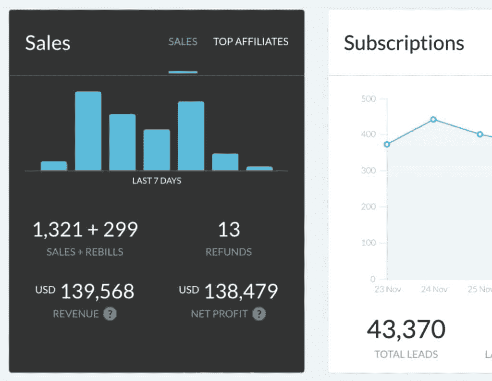

# 一人企业路线图：核心原则与常见误区 🧭

在本节课中，我们将要学习构建一个成功的一人创作者企业的核心路线图。我们将从一个被99%的创作者所忽视的关键错误开始，并逐步解析如何通过正确的思维和策略，实现时间与金钱的自由，而非被迫在两者之间做出牺牲。

---

## 心理垄断：打造不可替代的你 🧠

上一节我们提到了大多数创作者面临的误区，本节中我们来看看如何构建你业务的基石：心理垄断。

你的“个人品牌”应基于你的人生目标，即你引导追随者前往的方向。所有人的欲望都围绕几个永恒的市场：**健康**、**财富**、**人际关系**，以及作为奖励的**幸福**。要在这些市场中脱颖而出，我们不应只做一个普通的品牌，而要成为一个“个人垄断”——即在集体意识中占据一小块独特、不可替代的位置。

如何变得不可替代？答案是：**追求你真正的好奇心**。你的独特性源于你就是“你”。然而，大多数人无法持续追求好奇心，因为他们的注意力被基本心理需求所分散。你的未来不是与他人竞争，而是与你分心的大脑竞争。

以下是实现自我并建立心理垄断的路径：

1.  **提升自己**：持续学习与成长。
2.  **解决你自己的问题**：你的挣扎是宝贵的经验。
3.  **掌握你的生存**：确保基本需求得到满足。
4.  **记录你的旅程**：分享你的过程和所学。
5.  **追求你的好奇心**：并以此让自己与众不同。

你的故事——你如何通过独特的技能、兴趣和克服的困难实现目标——是你品牌成功的核心。这不仅能实现自我，还能通过帮助他人更快地达到目标来创造价值。

---

## 分发 = 自由：构建你的流量引擎 🚀

上一节我们探讨了建立独特性的内心建设，本节中我们来看看如何将你的想法传播出去，即“分发”。

从创作者企业的角度看，“分发”是指你能导向你的产品、服务或任何网络角落的**潜在流量**。强大的分发能力等于自由。

分发主要有三种类型：**建立**、**借用**和**购买**。

以下是每种类型的详细说明：

*   **建立分发**：通过创作内容在互联网上扩大受众。更进一步的策略是“去平台化”，即将受众引导至你拥有更多控制权的平台，如电子邮件列表或私人社区。公式可以表示为：
    `建立的分发 = 社交媒体增长 + 去平台化（邮件列表/社区）`
*   **借用分发**：利用他人的受众。例如，作为播客嘉宾出现，或者创造出极具传染性的想法，让他人自愿在内容中提及你。
*   **购买分发**：通过付费方式获取流量。这不仅仅是广告，还包括播客赞助、付费转发等。购买的流量会放大你已有的成果。

一个常见的误解是认为“受众只是你的受众”。实际上，**网络效应**的力量巨大。你的每个粉丝背后都有他们自己的网络。如果你保持内容一致并专注于持久的创意，你的想法有可能触及远超你直接粉丝数量的人群。

**关键点**：如果你的产品需要你投入时间才能交付（如咨询服务），那么你的收入、生活方式和自由就会受限于你的时间。因此，创造**不需要时间的产品**（如数字产品、书籍）至关重要。你帮助的人越多，你拥有的杠杆就越大。

---

## 内容之战：争夺心智空间 ⚔️

上一节我们了解了分发渠道的构建，本节中我们来看看填充这些渠道的弹药：内容。

对于一人企业初学者而言，内容的核心价值常常被误解。这不是关于吸引眼球或获得最多粉丝，而是关于**有价值的思想**。

有价值的思想 = **相关**、**易懂**、**可操作**到能够自行传播的程度。

你推出的颠覆性观点越多，你占据的**心智空间**就越大。

一个常见的建议是向其他创作者学习高绩效内容创意，这本身是好的。但问题在于缺乏平衡、测试，以及将这些想法通过直接经验转化为自己的东西。

你可以从以下地方寻找灵感：
*   **高绩效的 YouTube 视频**
*   **Medium 热门文章**
*   **热门推文**（使用 Twemex 或 TweetHunter 等工具分析）

---

## 创作者进化三阶段 🐣➡️🦅

上一节我们讨论了内容的核心，本节中我们根据技能、成果和经验，将创作者的发展分为三个阶段。理解你所处的阶段，能帮助你明确当前的机会和重点。

**前言**：这些阶段是基于观察的模型，并非绝对，主要适用于没有先前商业经验的创作者。

### 第一阶段创作者（低杠杆）

这是每个新创作者的起点。重点在于掌握社交媒体增长模式。

以下是本阶段需要关注的核心事项：

1.  **研究高绩效内容**：分析病毒式内容为何有效，并测试应用到自己的内容中。
2.  **使用内容模板**：将可靠的内容结构作为“训练轮”，例如：吸引点 > 价值 > 结论。
3.  **专注短形式增长**：将推特、短视频等平台作为“漏斗顶部”的增长工具，验证想法并建立受众基础。

**如果陷入此阶段**：你会成为一个粉丝众多但缺乏忠诚度和高变现潜力的品牌，无法完全掌控自己的收入和生活。

### 第二阶段创作者（中等杠杆）

当你拥有约1万名粉丝时，应已掌握增长游戏。真正的收入潜力开始显现。

以下是本阶段的发展重点：

1.  **学习直接回应**：掌握说服人们立即行动的文案与营销技能，深刻理解买家心理。
2.  **打造高价值产品**：围绕你的技能开展自由职业、咨询或指导，创建最小可行产品（MVP）并迭代。目标是为少量高价值客户（如每月4+位，单价$2500-$5000）提供服务。
3.  **深入长篇内容领域**：将已验证的短篇想法扩展为深度内容，如通讯、播客或长视频，将追随者转化为铁杆粉丝。

**如果陷入此阶段**：你虽能谋生，但受困于服务客户的时间，无法充分利用已建立的杠杆去深入探索好奇心和创造更大影响。

### 第三阶段创作者（高杠杆）

达到此阶段需要掌握生存技能并持续进行跨学科学习。

以下是本阶段的战略重点：

1.  **产品化与利用成果**：将你服务客户的方法系统化，打包成面向更广受众的数字产品。利用你的成果和社会证明进行大规模启动。
2.  **精炼想法并多元化**：将你在一个平台上成功的内容和策略，复制到其他平台，借助已有网络加速增长。你的内容组合应平衡**增长**、**权威**（产品成果）和**真实性**（深度观念融合）。
3.  **优先考虑长篇内容**：成为“融合者”。深入研究你感兴趣的领域，连接不同学科的大观念，根据自身经验总结模式，并创造属于自己的概念、流程和哲学。这是商业变得极其满足的阶段。

---

## 总结与行动指南 📝

本节课中我们一起学习了构建一人企业的完整路线图。我们从避免“牺牲时间或金钱”的误区开始，强调了**数字杠杆**的重要性。

核心路径可以总结为：**自我实现 > 自我货币化 > 自我超越**。

*   **心理垄断**是你的根基，通过追求真正的好奇心，打造独特的故事和领域。
*   **分发网络**是你的引擎，通过建立、借用和购买流量来获得自由。
*   **有价值的内容**是你的弹药，用于争夺心智空间和传播思想。
*   **三阶段进化**是你的地图，指引你从学习增长，到提供高价值服务，最终到产品化、多元化并创造深远影响。

请记住，本文分享的是基于原则的**一种**方法，而非唯一定律。关键在于：**永不停歇地学习、建造和进化**。分心和舒适是唯一的阻碍。

现在，是时候开始雕刻属于你自己的道路了。