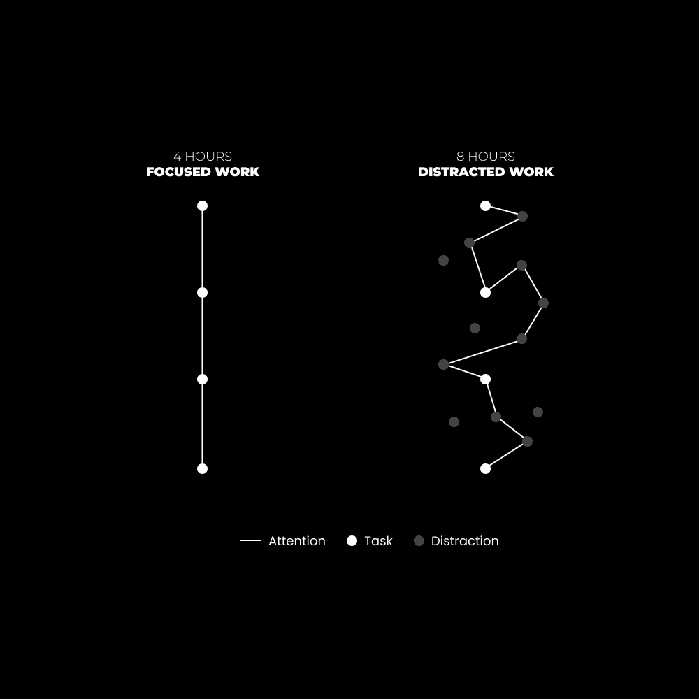

# 专注工作系统：四小时工作日的哲学与实践 🕓

在本教程中，我们将深入探讨“四小时工作日”的理念及其背后的专注工作系统。我们将从核心理念出发，逐步拆解如何通过系统化的方法，实现高效、可持续的深度工作，从而改变你的工作与生活方式。

## 核心理念：专注的力量

上一节我们介绍了四小时工作日的概念，本节中我们来看看其背后的核心哲学。

人类区别于其他生物的关键之一，是**关注深度**。心理学中的**任务积极网络**和**默认模式网络**分别对应着我们的生产力与创造力。前者在我们专注于外部任务时启动，后者则在我们思维向内发散时激活。有效的工作系统需要在这两者间取得平衡。

一个没有系统支撑的思维，就像无序的家庭书架，会因**熵**（系统无序度的度量）的增加而陷入混乱、焦虑和压力。因此，要维持高效产出，我们必须建立并不断优化自己的**生产力系统**。

## 构建你的系统：专注工作十诫 📜

理解了核心理念后，我们开始构建具体的执行框架。以下是实现四小时专注工作日的十个关键步骤。

**1) 设定四小时时限**
研究表明，3-4小时是精神能量高效消耗的最佳点。设定这个时限本身就能创造紧迫感，帮助你聚焦并减少分心。以**每天专注工作4小时**为目标开始。

**2) 明确愿景与身份**
你需要一个**最小可行愿景**。详细写下你想成为谁、想做什么工作、理想的生活状态等。当你的行动与愿景一致时，你的身份也会随之发展。

**3) 确定三大杠杆任务**
找出能推动你业务进入下一阶段的2-3个核心任务。例如，对于内容创作者，杠杆任务可能是：
*   **撰写内容**（如每天写1000字）。
*   **生成流量**（如在特定平台进行有目的的互动）。
*   **推广产品**（如每天进行一次推广）。

**4) 保持任务清晰度**
每周花1-2小时进行规划和研究，为接下来的专注工作时段扫清障碍。确保在开始工作时，你对要完成的任务有绝对清晰的了解。

**5) 采用时间块与休息**
将4小时拆分为可管理的时间块。例如，采用 **90分钟专注 + 15-30分钟休息** 的循环模式。将这些时间块固定在日历上，直到形成习惯。

**6) 操作截止日期**
为工作设定真正的、有约束力的截止日期。这能极大地缩小你的注意力范围，增加进入**心流状态**的可能性。例如，公开承诺一个产品发布日期。

**7) 优化操作环境**
精心设计你的工作环境以保存精神能量：
*   保持工作空间整洁。
*   使用降噪耳机播放无歌词音乐（如电子乐）。
*   移走手机等可能造成干扰的物理物品。

**8) 在干扰之前醒来**
比平常早起床1-2小时。在这段无人打扰的时间里，世界是安静的，你可以最大限度地专注于深度工作。

**9) 优先安排高质量休息**
没有休息就没有高质量工作。**休息 = 通过非工作活动恢复能量**，如运动、阅读、社交。务必在4小时工作结束后停止工作，打破“需要加班”的思维定式。

**10) 持续优化系统**
如果你的工作量无法在4小时内完成，这本身就是一个需要系统化解决的问题。例如，将耗时的工作产品化或自动化。定期审视并改进你的工作流程。

## 总结与行动号召 🚀

本节课中，我们一起学习了“四小时工作日”的哲学基础与构建专注工作系统的十个具体步骤。其核心在于：通过建立清晰的愿景、识别高杠杆任务、设计有利的环境与节奏，并持续优化系统，来对抗熵增，实现可持续的高效产出。

现在，请接受这个挑战：不要仅仅阅读，而是立即应用这些原则。记下这些“诫命”，从今天开始实践。充分利用互联网和数字工具为你服务，而非被其消耗。通过更聪明地工作，你最终将到达不再感觉那是在“工作”的境界。

**对你的挑战**：是什么阻止你每天只工作4小时？写下第一个你能立即做出的改变。