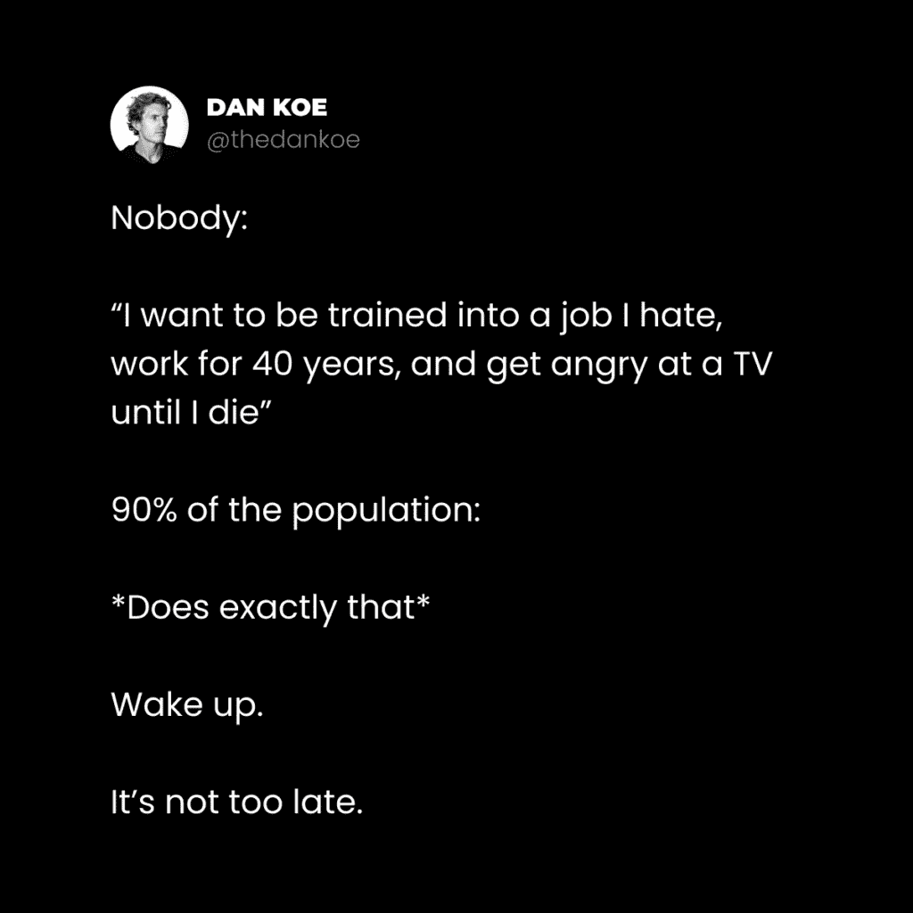
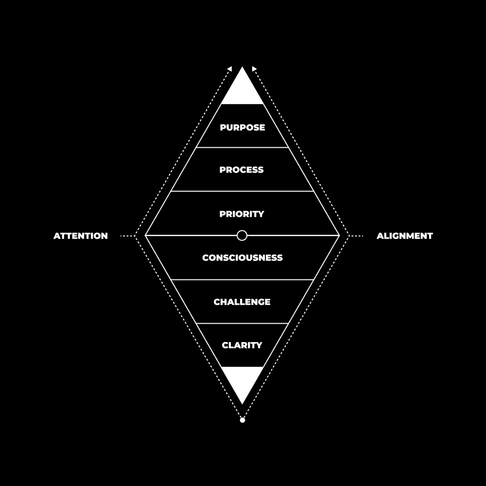
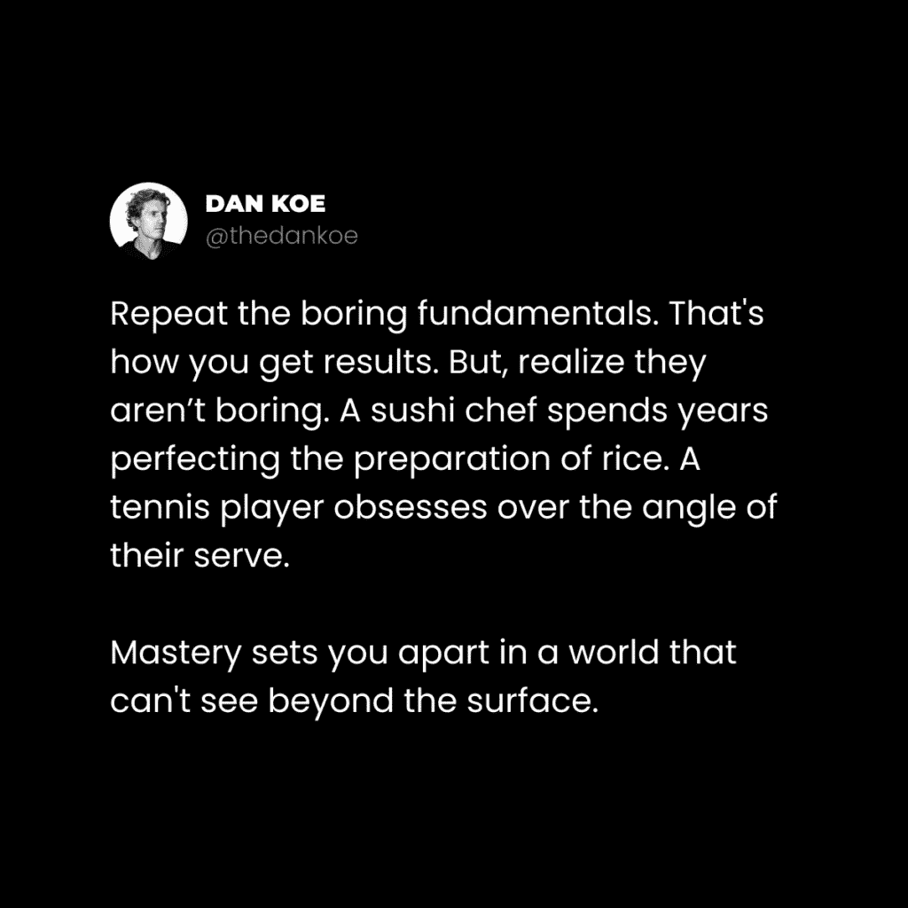
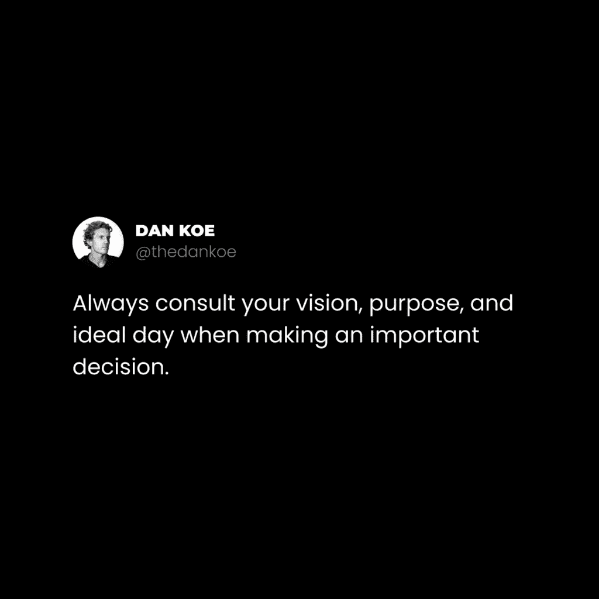
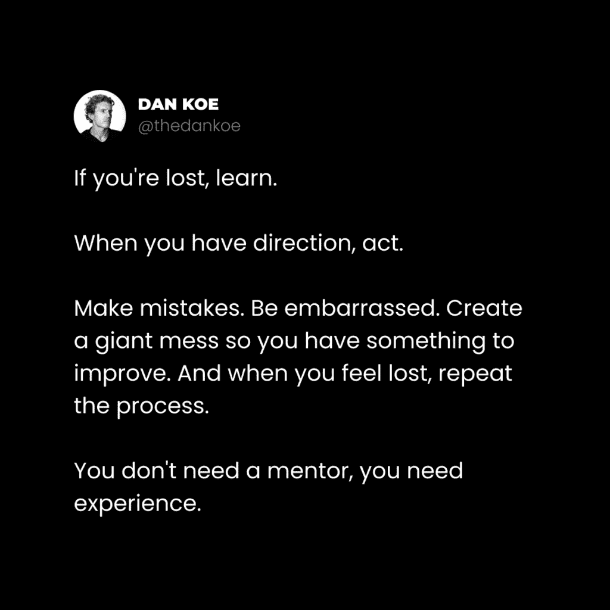

# 焦点公式：掌控你的生活

## 📖 课程概述
在本教程中，我们将学习一种名为“焦点公式”的系统方法，帮助你掌控自己的生活。我们将从理解“整体”这一核心哲学概念开始，探讨现代社会的结构如何影响我们，并最终构建一个由目标、过程、优先级、意识、挑战和清晰度组成的个人实现体系。通过这个公式，你可以将注意力从外部支配中收回，投入到能带来真正满足和成长的活动中。

## 1：理解“整体”概念

上一节我们介绍了本课程的目标，本节中我们来看看构建“焦点公式”的哲学基石——“整体”概念。

整体是构成万物的基本单元。它既是独立的部分，也是更大整体的一部分。例如，一个原子本身是一个整体，但它也是分子的一部分，分子又是细胞的一部分，如此延伸，直至宇宙本身。整体在无限方向上相互关联，就像木头是椅子的一部分，也是树木、房屋的一部分。

整体是创造性解决问题的基石。哲学家艾伦·瓦茨称之为“思维单元”。将整体连接在一起的隐藏材料是**关系**。正如瓦茨所说：“存在即关系，而你正处在其中。”思想、情感和想法本身也是**整体**。例如，你面临的“挣扎”本身是一个整体，但它也可能是未来“满足”这个更大整体的一部分。

理解整体的最佳方式是通过哲学沉思。你可以随机选择一个物体，通过一系列提问，跟随它进入发现的“兔子洞”。

以下是进行整体思考的一个示例步骤：
1.  选择一个物体（例如：蜂蜜）。
2.  提出一系列“什么”、“如何”、“为什么”、“在哪里”、“何时”的问题。
3.  跟随思维的联想，不要局限于物理或直接联系。

以“蜂蜜”为例，思维可以关联到：
*   蜜蜂授粉和制造蜂蜜的过程。
*   蜂农的生计与伦理。
*   蜂蜜的生产、分销链条。
*   蜂蜜对人类健康的影响。
*   …关联可以无限继续。

你自身也是一个整体，包含了你的兴趣。你的兴趣是某个细分市场整体的一部分，细分市场又是更大市场整体的一部分。如果你在生活的某个领域感到挣扎，通常是因为你的视角未能包含构成该领域“整体”的所有必要部分。因此，保持开放心态，从多角度理解事物至关重要。

## 2：识别现代社会的“支配等级”

上一节我们探讨了“整体”的概念，本节中我们来看看社会结构如何模仿并扭曲了这种自然的整体性，形成一种“支配等级”。

整体通常以等级结构组织，它们相互超越并包含对方。就像人类超越并包含了动物的特性。等级结构主要有两种类型：
1.  **支配等级**：这是“等级”一词带有负面含义的原因。它的结构类似金字塔骗局，权力和资源集中在顶层，底层成员为上层提供支撑，但获益甚少。
2.  **自然等级**（或实现等级）：这是一种“逐渐增加的整体性秩序”，例如：粒子 -> 原子 -> 细胞 -> 生物体，或字母 -> 单词 -> 句子 -> 段落。每一层的整体成为下一层整体的一部分。

从宏观角度看，许多社会实体（如公立学校体系、大公司、政府机构甚至某些宗教组织）都落入了**支配等级**的定义。底层是数量众多、权力较小的个体，顶层是少数掌握权力和资源的个体。

在真正的金字塔骗局中，底层投资者投入的是金钱。而在社会金字塔中，底层大众投入的**是注意力**。由于人类在概念层面生存，如果你将注意力（即你的心理能量）持续投资于某个外部等级（如职业头衔、社会地位），你就会在心理上认同并受制于它。我们这个时代的权力正来源于**注意力**。

掌权者需要持续吸纳集体的注意力来维持其地位。随着传统价值观衰落，焦虑感上升，许多人为了寻求“安全与稳定”，自动将注意力投资于外部支配等级的目标，并以此构建个人身份。这形成了一种集体无意识，其共同愿景往往是：取得好成绩、找到高薪工作、消费、然后在晚年退休。

这种对注意力的奴役是心理层面的，是大多数人的默认状态。要逃离这种奴役，你需要停止将注意力投资于外部的支配等级，转而创建属于自己的**实现等级**。

## 3：构建你的“焦点公式”

上一节我们分析了现代社会如何通过“支配等级”攫取我们的注意力，本节中我们将学习如何通过构建个人的“焦点公式”来收回控制权。

“焦点公式”是一个帮助你集中生活、实现个人愿景的元框架。它由两个相互关联的金字塔组成：
*   **外在潜力金字塔**（顶端）：包含**目标**、**过程**、**优先级**。它为你创造一个可实现的未来潜在现实。
*   **内在进步金字塔**（底端）：包含**意识**、**挑战**、**清晰度**。它在你的内心创造秩序和成长。

当这两个金字塔通过对齐的**注意力**连接起来时，你就能进入一种持续的“心流”状态，高效地向目标迈进。

以下是构建“焦点公式”各组成部分的详细指南。

### 🎯 目标 – 你的北极星
在你个人实现等级的顶端是你的**目标**。它等同于你的愿景、生活使命或任何长期宏大目标。这是掌握生活最关键的一步，因为它是一个包含所有部分的整体。没有目标，其他一切都会瓦解。

设定目标时需注意以下几点：
*   **生活没有单一目标**：目标分阶段出现，由浅入深。你会不断超越旧目标，采纳新目标。
*   **没有绝对错误的行动**：“错误”通常源于狭隘的视角。追随你的欲望，自我反思，提高意识，下次做出更好决定即可。
*   **初期可能不清晰**：将其视为一个“最小可行目标”，你将在实践中不断完善它。
*   **目标会逐渐淡去**：生活分章节展开。当一章结束时感到迷茫是正常的，这时需要通过自我反思来发现下一章的目的。

如何创造一个有意义的目标？通过提出优质问题。你的生活质量取决于你所提问题的质量。将这些问题作为你注意力的锚点：

以下是帮助你发现目标的关键问题列表：
*   我真正想从生活中得到什么？
*   对我来说，什么才是真正重要的？
*   我最高版本的自己是什么样子？
*   我的理想一天是怎样的？
*   为了到达那里，我必须完成什么？
*   这能解决世界上的某个问题吗？有什么产品或服务与之匹配？
*   我的下一个目标阶段是什么？

**请务必将这些问题的答案写下来。**

### 🔄 过程 – 精通的追求
**过程**是实现目标所需的系统、策略或方法。它是一系列从大到小、与具体行为相关的目标层次结构。理解并遵循一个系统，能在你的思维中维持秩序，显著提升生活乐趣。

你需要使这些目标变得有意识。具体做法是：

以下是设定分层目标的方法：
*   写下你的10年目标。
*   将其分解为1年目标。
*   进一步分解为月度目标、周目标和每日目标。

过程本身也分阶段，与你需要掌握的技能相关：
*   **初学者阶段**：杠杆可能是学习基础知识、建立联系。
*   **中级阶段**：杠杆可能是构建产品、减少对外部学习的依赖。
*   **专家阶段**：杠杆可能是做热爱之事、放大影响力。

**请务必将这些阶段、杠杆和分层目标都写下来。**

### ⚖️ 优先级 – 做出更好的决定
**优先级**首先包括你在“过程”中确定的操作杠杆。这些最好是**绩效目标**（你直接可控），而非**虚荣目标**（结果不可控）。

以下是设定绩效目标的示例：
*   **不要设**：“每天增长50个粉丝”（不可控）。
*   **应该设**：“今天写3篇帖子”（可控，且可能带来粉丝增长）。
*   **不要设**：“写一篇完美的文章”。
*   **应该设**：“先写下1000字初稿”（可控，可后续编辑）。

如何做出更好的日常决策？
1.  **将目标置于首位**：用你的目标作为过滤器，判断事务是否重要。
2.  **获得多角度理解**：不要固守单一视角。努力从不同身份（如未来的自己、他人、甚至宇宙视角）看待情况。这能帮助你以有利于行动的方式感知现状。
3.  **以目标为导向感知情境**：只有当你将其解释为问题时，问题才存在。转换视角，许多“问题”会变得微不足道，从而促使你采取行动。

### 🌌 意识
**意识状态**决定一切。大多数人的世界观通过社会化变得狭隘，这影响了他们的信念、思想、情绪，最终决定了他们的注意力和行为。

提高意识意味着：
*   质疑一切被灌输的信念。
*   获得对潜在未来的认识。
*   学会应对生活的起伏。
*   尝试创造一个更整体的身份（如“人类”、“宇宙”），并从这个更广阔的视角看待世界。

你的行为将随之改变，真正的难题将浮现，你可以用创造力去解决它们。

### 🧗 挑战 – 智慧与进化的源泉
你个人实现等级中的目标、过程和优先级，都应该是**具有挑战性**的。挑战能进一步缩小你的注意力范围，排除干扰。

过程提出的每一个新目标，都会要求你成长，迫使你投资于教育以获得新技能。**学习的源泉是挑战，而非机械记忆**。要避免没有成长和进步的盲目重复。

### ✨ 清晰度 – 随着时间的推移自我纠正
创建目标、过程和优先级并非易事，也不会立即清晰。**请摒弃寻求速效的心态**。我们是在规划生活，而非仅仅规划一天。

**自我反思**是你在这段旅程中最好的伴侣。每月回顾你写下的内容，反思什么做对了，什么可以改进。但要理解，在当下没有绝对“对错”的选择，你无法100%预知结果。**经验**是你随时间完善目标的唯一方式。如果你没有“犯错”，你就不知道需要改进什么。

### 🔗 对齐 – 连接内在与外在
当**外在潜力金字塔**（目标、过程、优先级）与**内在进步金字塔**（意识、挑战、清晰度）通过对齐的**注意力**连接起来时，就产生了强大的协同效应。

*   顶端金字塔创造未来潜力，刺激如多巴胺等神经递质。
*   底端金字塔创造内心秩序，刺激如内啡肽等神经递质。

两者的对齐在大脑中创造了一种持续的神经化学混合物，使你更容易进入心流状态，专注于建设未来。

你需要通过投入**时间**来实现这种对齐：创造时间来实现梦想，反思进展，并完善策略。用建设未来的行动，替代无意义的消费。活在你自己创造的内心现实中。

## 🏁 课程总结
在本节课中，我们一起学习了“焦点公式”——一个掌控个人生活和注意力的元系统。

我们首先理解了“整体”哲学观，认识到万事万物相互关联。接着，我们剖析了现代社会如何通过“支配等级”结构（如工作、消费主义）攫取并奴役我们的注意力。为了摆脱这种状态，我们构建了属于自己的“实现等级”，即“焦点公式”。

这个公式包含两个相互支撑的部分：
1.  **外在潜力金字塔**：由**目标**（北极星）、**过程**（精通之路）和**优先级**（决策框架）组成，指引我们创造未来。
2.  **内在进步金字塔**：由**意识**（认知基础）、**挑战**（成长引擎）和**清晰度**（反思校准）组成，确保我们内心有序并持续进化。

通过将**注意力**有意识地投入这个自我构建的体系，并对齐内外金字塔，我们就能从外部支配中解放出来，将精力聚焦于能带来真正满足、成长和影响力的事物上。这个公式不仅适用于人生规划，也适用于任何你希望做好的事情（如创业、写作）。记住，这是**你的现实**。构建它，专注其中，世界将因你的聚焦而改变。