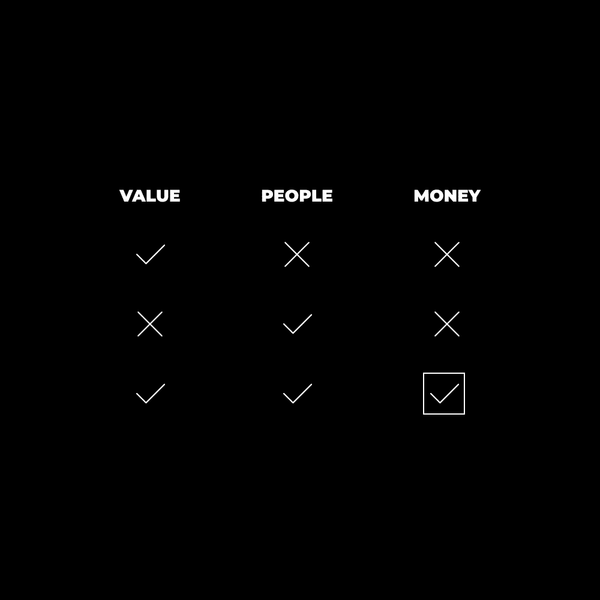
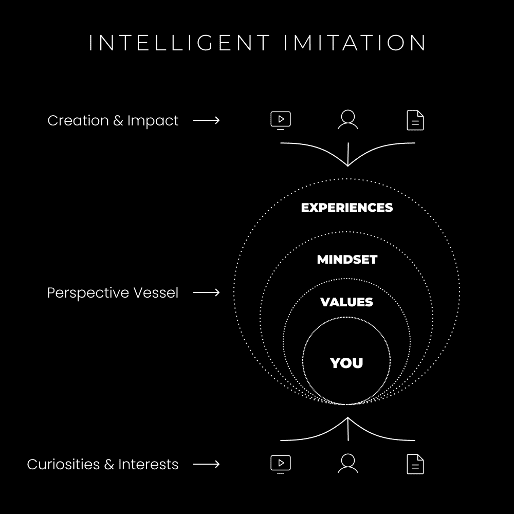
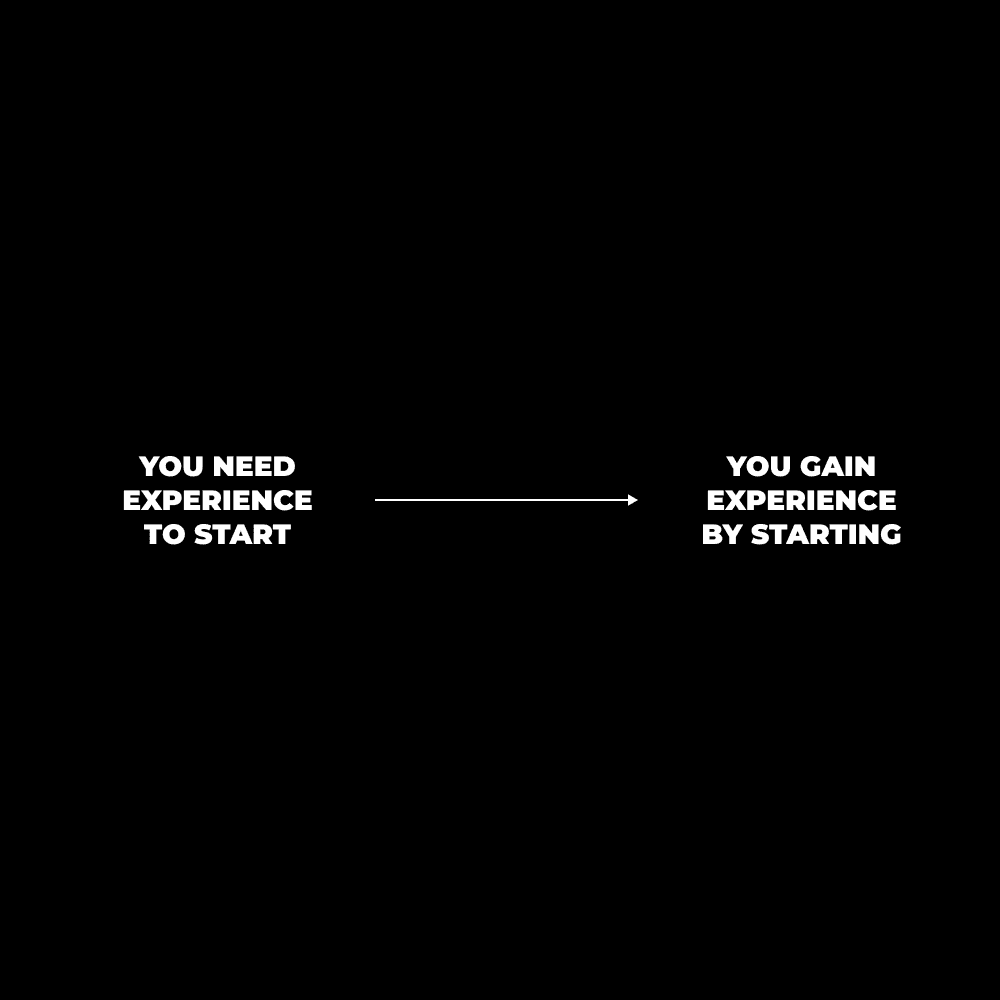

# 单人企业成功指南：11 个核心洞察 🚀

在本教程中，我们将一起学习如何成功运营一个单人企业。课程内容源自一位成功创业者的经验总结，涵盖了从心态、策略到具体执行的多个层面。我们将把这些宝贵的洞察整理成清晰、易懂的教程，帮助你构建并发展自己的事业。

---

## 1️⃣ 洞察一：一切皆关乎流量与产品

商业的核心是创造优秀的产品或服务，并将其展示给正确的人。

许多人过于沉迷于营销细节，却忽略了基础。这就像一个简单的公式：**流量 × 产品 = 机会**。如果你有足够多的人看到你的产品，并且产品足够好，你就有机会成功。

一个初学者的方法是：为你之前购买过的优质产品进行联盟推广。你可以写一条推文，付费请人转发，如果操作得当，仅此一项就可能带来全职收入。关键在于，从付费推广中获得的收益要大于支出，即实现**投资回报率（ROI）**。

这种方法可以帮助你在初期建立受众。随着经验增长，你可以为自己的产品或服务做同样的事。最终，你将通过持续产出优质内容来获得免费流量，减少对付费推广的依赖。

---

## 2️⃣ 洞察二：你需要三个核心杠杆

一旦你通过持续拉动正确的**杠杆**建立起优势，你将获得他人难以想象的自
由。

假设你已经有了要销售的东西。如果没有，这应该成为你长期思考的核心。你需要平衡以下三件事，它们是你业务的杠杆：

**杠杆一：增长**
如果你的关注者或品牌没有持续增长，那就存在问题。内容，以及将流量引导至该内容，是你增长的主要方式。市场中的大多数人是初学者，因此你的社交媒体内容应以基础建议为主，吸引他们，再引导至更高级的内容。

**杠杆二：培养与支持**
作为一个价值创造者，你的核心工作是教育受众。通过新闻简报、深度文章等内容形式，教育并培养他们，直到他们准备好购买你的产品。这是建立权威和信任的关键步骤。

**杠杆三：货币化**
诚实地面对赚钱的目标。你需要测试不同的促销方式、角度和推广渠道。找到能带来销售的方法，并将其系统化，使其成为日常运营的一部分，从而实现可持续的收入。

---

## 3️⃣ 洞察三：质疑一切

“质疑一切”是推动商业成功的关键动力。

当有人说“你必须细分市场”或“你必须达到一万粉丝才能开始销售”时，问问自己：**谁说的？** 挑战这些限制性信念，为了你自己和你的追随者，去证明它们是错误的。固执地去寻找实现目标的方法，这正是你获得独特知识和财富的途径。

---

## 4️⃣ 洞察四：解构一切

意识和创造力是信息时代成功的关键。每件事物都是一个由部分组成的整体。

练习分解你遇到的任何事物。例如，一本关于生产力的书是一个**整体**，它的**部分**包括：生产力原则、提高策略、相关的故事和轶事。通过提问深入挖掘，你可以用其中一个部分来阐述新的观点。这种解构思维能极大地提升你的创造力和洞察力。

---

## 5️⃣ 洞察五：不要放弃，而是转型

人们常担心“追逐新奇事物综合症”，但你需要明白，你可以从复合知识的位置“重新开始”。

如果你学习了网页设计，但看到了文案写作的机会，那就转向文案写作。这不是放弃，而是**技能叠加**。只要你的宏伟目标（如财务自由）不变，路上的转型就是进化。你的初始技能不会消失，它会在新的事业中发挥作用。知识、技能和好习惯都会累积增长。

---

## 6️⃣ 洞察六：复制成功之路

成功是一场智能模仿的游戏。

不要因为追求“原创”而拒绝模仿。作为新手，模仿是最重要的学习技能。

+   用你欣赏的作者的语调练习写作。
+   以热门账号发布的话题为灵感。
+   分析竞争对手的着陆页和其解决的问题。
+   研究爆款帖子为何成功，以及它是否带来了收入。
+   观察市场上畅销的产品，思考如何利用你的独特经验创造出自己的版本。

---

## 7️⃣ 洞察七：最有利可图的利基是你自己

传统的营销建议正在失效。如果你想领先，那就**产品化你自己**。

通过自我反思了解自己，然后把你自己的需求和成长历程作为客户画像。在线分享你追求目标、研究兴趣的过程。没有人能复制真实性，你是独一无二的。

---

## 8️⃣ 洞察八：自我意识是关键

自我意识能帮助你比他人更快地掌握大多数技能。

作为内容创造者，你需要理解人类行为和心理。你自己就是你最好的老师。问问自己：为什么那个帖子吸引了我的注意？为什么我会喜欢并转发它？逆向工程这些行为，你就能知道如何吸引他人。

赚钱也是如此。理解你为什么花钱，就能更好地理解别人为什么付钱给你。

---

## 9️⃣ 洞察九：先行动，再学习

在信息时代，人们常犯的错误是让学习取代了执行。

最好的方法是制定一个项目，然后开始行动。例如：
+   制定一份新闻简报计划。
+   制定一个产品开发计划。
+   制定一项服务提供计划。
+   制定你的人生规划。

当你有了一个具体的项目，你的思维就会准备好进行模式识别，你会更主动地寻找和应用所需的知识，而不是陷入无尽的学习教程中。

---

## 🔟 洞察十：创造你的职业生涯

未来60%的新工作尚未被创造出来，但它们都将在互联网上诞生。

价值创造者正在开辟新的道路。你可以通过追求自己的广泛兴趣，将它们转化为独特的类别，并利用它们来解决特定问题。例如，如果你对心态、生产力和商业都感兴趣，你可以创造一个如“生活方式设计”或“个人主权”这样的新类别，并成为其定义者和引领者。

---

## 1️⃣1️⃣ 洞察十一：缺乏经验不是借口

自我会找各种理由说服你“不能做”某件事。

例如，当建议你开始在线写作时，你可能会想：“我不擅长写作”或“只有网红才能积累粉丝”。这些都是限制性信念。写作是澄清思想、巩固知识、开启创造真正解决方案潜力的方式。学习一项技能，对自己运用这项技能（个人品牌需要各种企业技能），教授你所学的，然后将其出售。

做与大多数人相反的事。不要让恐惧支配你，让你停滞不前。

---

### 总结

在本节课中，我们一起学习了发展单人企业的十一个核心洞察。从理解商业的基础（流量与产品），到掌握三个增长杠杆（增长、培养、货币化），再到培养关键心态（质疑、解构、转型、模仿），以及最终的落地策略（产品化自己、提升自我意识、先行动后学习、创造职业生涯、克服借口）。记住，成功是一场你可以参与的游戏，关键在于持续学习、勇敢行动并保持真实。现在，是时候将这些洞察应用到你自己的事业中了。