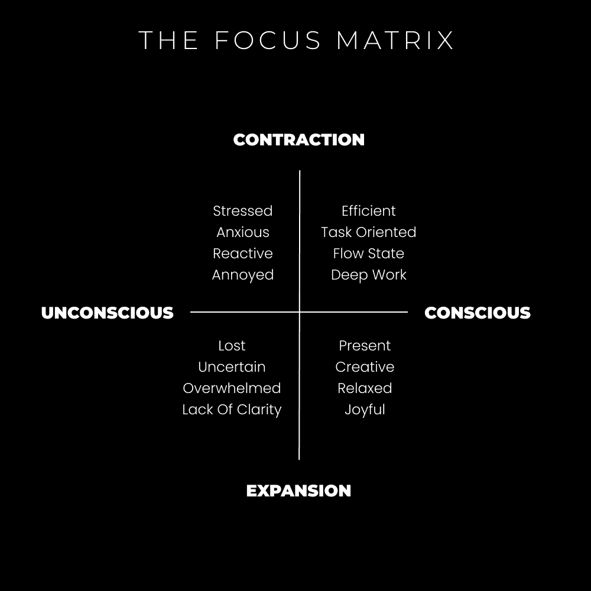

# 独处的力量：如何成为你自己 🧘

在本节课中，我们将探讨“做你自己”这一常见建议背后的深层含义，并学习如何通过独处和自我反思，摆脱外部世界的塑造，真正发掘并成为独特的自己。我们将理解为什么过度社交会阻碍原创性，并掌握几种实用的独处方法，以澄清思想、设定目标并最终活出真实的自我。

## 存在即关系 🌐

上一节我们提到了“做你自己”的困惑，本节中我们来看看“自我”是如何形成的。你的身份，或者说“自我”，只有在与周围环境区分时才能存在。这正如灵性教义所指：自我并非与宇宙分离，它本就是宇宙的一部分。

*在一个没有他人的世界里，自我将不存在。*

未能认识到生命的互联性，就会产生痛苦。当你从比较的角度看待世界，放大自己与他人的差异时，痛苦便会产生。相反，当你从连接的角度看待世界，抽离出来看到整体，强调相似之处并欣赏万物相连的智慧时，乐趣便会产生。

> 幸福的两大步骤：
> 1.  专注于重要的事情。
> 2.  从其他所有事物中抽离出来。

狭窄的专注对追求目标有益，但多数人处于由压力引起的持续狭窄状态。一个消极想法就能占据全部注意力，让人看不到更广阔的世界。这与“做你自己”密切相关：如果你从未有意识地塑造自己，那么“你自己”很可能只是外部环境的产物。

## 被塑造的自我 🤖

既然我们理解了自我与外界的关系，那么“你自己”究竟从何而来？从出生起，你的意识就在解释感官信息并形成记忆与习惯。到成年时，“你自己”已被家庭、学校、社会和文化深度塑造。

社交媒体加剧了“过度社交”问题。当一个缺乏自信的头脑接触到海量他人的观点时，很容易去模仿和依附。你会思考别人的想法，而不是自己的。这导致你的思想、写作和工作缺乏独特性，结果便是与众人无异。

**核心洞察**：你不能改善你不知道的东西。意识是改变的第一步。

以下是本周可以开始的练习：
*   **注意你的词汇**：你选择的用语是出于本心，还是模仿他人？
*   **审视你的决定**：这个决定是受他人（线上或线下）影响吗？
*   **分析决定的影响**：这个决定对你的目标或他人的目标有益吗？

## 独处的力量（如何做自己）🚶‍♂️

认识到问题后，我们如何解决？关键在于平衡。要在这个世界留下印记，你需要与人连接；但要产生独特价值，你必须**抽出时间独处**。独处是逆转外部塑造、连接内在自我的关键。

优先考虑自己，甚至可以说，要“自私”。这里的自私指的是培养一系列自我价值：

> 无私需要自私的价值观：
> – 自制力
> – 自立
> – 自我反思
> – 自我教育
> – 自我意识
> – 自雇
> – 自我管理
> – **自我实验**

**自我实验**至关重要。将你的生活视为一个科学项目，其本质是试错。尝试一切，淘汰无效的。做你自己的教练、导师和治疗师。

那么，在独处时具体可以做什么呢？以下是几种用于清晰、批判性和深入思考的方法：

### 1) 进行一次沉思式散步 🚶‍♀️

散步不仅仅是活动身体。它关乎长寿、创意产生、压力调节、远离屏幕以及进行深度思考。当你散步时，在脑海中保留一个想法，让你的思维与之自由关联。

散步时可以思考的主题：
*   你的愿景。
*   你想成为的人。
*   为什么你尚未成为那样的人。
*   你的身份由谁塑造。
*   阅读中令你印象深刻的想法。
*   你持有的特定信念及其根源。

**行动建议**：`每天进行一次无干扰的沉思式散步。`

### 2) 每周自我反思 📝

我们无法预知未来，但可以通过自我反思确保当下的行为有利于我们期望的方向。反思让你意识到行为的影响，从而越来越擅长做出“不完美但正确”的决定。

**核心方法**：定期回顾你的行为、决定及其结果，评估它们是否与你的内在目标一致。

### 3) 写作以澄清你的思想 ✍️

意识能同时处理的信息有限。写作能将脑海中的想法外化，加以梳理和澄清。如果你计划建立个人事业，写作更是吸引客户、建立影响力的核心方式。

> 如果你没有想法，就去阅读。
> 如果你有了想法，但无法表达，就去写作。
> 如果你有了想法，并且有清晰的表达能力，就去构建。

**实践路径**：`阅读 -> 写作 -> 构建`。

### 4) 质疑自我意识构建的故事 🧠

这是一个内在的、持续终生的游戏。在日常生活中，注意你的思维走向，尤其是在社交媒体上。观察你的内心如何与所见内容对话，并编造故事。练习退后一步，获得元视角，欣赏事物本身，而非你对其的叙述。

**练习**：在浏览信息时，注意你的情绪反应（生气或高兴），并追问这个反应背后的内在故事是什么。

## 总结 🎯

本节课中，我们一起学习了“做你自己”的真正含义。我们了解到，自我是在与外界的关系中被塑造的，过度社交可能让我们失去原创性。要成为真正的自己，必须通过独处来优先连接内在。我们掌握了四种实用方法：**沉思式散步**以激发思考，**每周自我反思**以校准方向，**写作**以澄清思想，以及**质疑内心叙事**以获得元视角。记住，这是一场持续的内在游戏，但每一步自我觉察都将使你更接近真实、独特的自己。