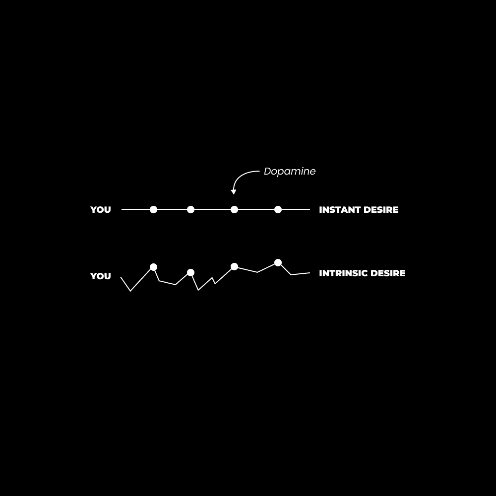

# 深度思考：矩阵是真实的（如何用你的心灵突破）

在本节课中，我们将学习如何成为一个深刻的、原创的、自由的思考者。我们将探讨什么是“矩阵”，以及如何通过有意识的练习突破其限制，从而在生活和商业中获得真正的自由与创造力。

## 概述

我们常常渴望成为深刻的思考者，但最初的目标可能只是为了获得他人的认可。然而，随着自我认知的深入，我们会发现深度思考是赢得生活和商业游戏的必要条件。它是创造独特解决方案、构建理想生活的唯一途径。要理解深度思考，我们首先要了解它的对立面——浅层思考。

上一节我们介绍了深度思考的重要性，本节中我们来看看什么是浅层思考。

浅层思考是指接受表面现象为绝对真实，或者从不超越个人感知的局限。每个人的感知都受其环境、经验和意识状态所限。例如，仅凭社交媒体上的帖子就断定某种饮食或商业模式对所有人都是最佳的，而不进行开放性的实践验证，这就是浅层思考。

那么，什么是深度思考呢？以下是其核心定义：

*   **意识到**你心灵创造的界限。
*   **将一切感知**视为可能性，直到被直接经验过滤。
*   **质疑一切**，尤其是那些你认为绝对正确、毫无例外的思想、信念和偏见。

简而言之，**思想狭隘**是深度思考的敌人。但思想狭隘又是什么呢？它就是接受“矩阵”作为你的现实。

## 矩阵不是幻想

*意识是一种新颖与习惯之间的斗争。*

当人们提到“矩阵”，通常会联想到那部经典电影。但这里所说的矩阵并非指电影情节，而是指你选择“红色药丸”来在这个矩阵中制造故障的可能性。

所有的理解都是隐喻性的。“矩阵”这个概念本身就是一个**象征**，一个指向某种真理的隐喻。

**符号**（名词）——*代表或表示其他事物的事物，尤指代表抽象事物的物质对象*。

自时间开始，在语言被发明之前，人类就通过识别模式和关系来解释现实。我们用符号来代表这些现象或体验。关键在于，符号是一种*表征*，并非事物本身。

随着时间推移，人们共享并赋予这些符号意义，形成了沟通。但由于环境和先前经验不同，每个人对符号的理解都有细微差别，因此意义并非绝对。这些符号是心理层面的解释，是覆盖在现实之上的一层心理构建，是我们心灵对无限可能施加的限制。

这些心理构建日益复杂，形成了语言、文化、社会、教育体系、政府，以及大量关于生活“曾经如何”与“应该如何”的期望、假设和预测（即“信念”）。

因此，可以将矩阵想象成一个深植于我们内心的期望网络，它根深蒂固到我们从不质疑。你房间里的一切事物都被你无意识地赋予了意义。甚至你整个世界观中那些你未曾直接接触的事物，也因信息的传播而被赋予了意义。

### 周期、节奏、模式与规范化

> 如果你愿意，你可以活在这些智力结构中，也可以死在其中。但好奇的人……通常会对传统的答案感到不满意。——特伦斯·麦肯纳

我们不仅创造了期望网络，这些期望还通过重复——就像在健身房通过重复练习来增强力量一样——在我们的心理中固化。重复足够多次后，我们称之为“条件反射”。

我们可以观察到生活中无处不在的周期性。例如，个人生活中的睡眠周期、饮食周期、工作周期等。商业中也有周期，内容表现有好有坏，月份业绩有高有低。认识到自己处于低谷期（同时为高潮期做准备）是唯一能做的事。

从更大的范围看，宇宙、世界、文化、社会乃至个人，似乎都经历着周期，这些周期自上而下地影响着人类行为。所有这些周期，都是你需要思考和解构的部分。

这种对现实“应该是什么样”的虚幻矩阵期望，正将你束缚在有限潜能的生活中。矩阵是由思想、信仰、偏见、期望和假设构成的网，它塑造了你的世界观。**存在先于知识**。在我们能为其添加知识层之前，某物必须先*存在*。

矩阵是你认为自己“知道”的东西。如果你不能“成为”它，你就只能“知道”它——即在心中注册一个被赋予意义的符号、图像或想法。这是一种表征，而非本质。

摆脱你的自动化本质，是逃离矩阵的方式。因为如果你想成为一个深刻的思考者，并将这种思考应用于内容、商业和生活的各个方面，你就不应在矩阵内思考，那意味着与所有人思考相同的东西。

当你探索构成自我感的各种心理结构时，你会发现什么？是神秘、深刻和未知的领域，正等待被探索。

这也是为什么我敦促创作者研究灵性。一旦你意识到在我们强迫性思维之下存在着无限的智慧，你就可以有意识地探索它，并在你的写作、视频和创作中体现其本质。这是作为个人企业实现原创性的神秘途径。

上一节我们探讨了矩阵的本质，本节中我们来看看如何突破它。

## 探索未知（经验暴露）

> 你的优势在于你停止的地方，或者你妥协了你的全部天赋，取而代之的是迎合你的恐惧。——大卫·迪达

人类心灵为自身无限的潜能设置了限制。关于深度思考，我们所有人都停滞在一个由生活周期和期望所重复的表层思想泡沫中。

为了逆转这种效应，我们必须通过推动已知的边界，在矩阵中制造故障。

如果我们想在这个充满干扰和噪音的世界中成为深刻、清晰、有逻辑的思考者，就必须让自己接触更深层次的经验，无论是有形的还是无形的。

我们并非要盲目地投入未知。虽然对于经验丰富的探索者来说，采取激进策略（例如搬到租金翻倍的地方以迫使自己赚更多钱）可能带来快速进步，但开始时我们应循序渐进。

目标是**持续地**轻微突破已知，带来些许不适感，并让新发现引发的痴迷引导我们走向更深。就像在矩阵中制造一个故障，得以一瞥无限。例如，书中某段话让你豁然开朗，为你打开一个全新的世界（但我们不想在其中迷失）。

再次强调：

*   **已知**是我们心理上居住的期望之网，是心灵在生存受威胁时可以回归的舒适区。
*   **未知**是现实的织锦，是无限潜能的土地，是勇敢者愿意随着时间、练习和正念不断深入探索的互联游乐场。

如果你现在还不能完全理解，这没关系。“构建意识”的自我发展阶段，需要经过多年有意识的练习来重新编程你的心灵后才会开启。然而，恰当的话语可以让你的心灵窥见这个意识层次，这正是本文试图做到的。

### 如何打破已知的锁链

要理解深入未知的过程，我们必须理解**状态**和**阶段**的理论。

*   **状态**：一种暂时的意识状态，可以随时被打破。例如服用迷幻药、阅读缓解焦虑的名言，或在写下几句话后感到特别有创造力。
*   **阶段**：一种永久性的意识阶段，就像在游戏中达到新等级，获得了之前无法获得的能力。例如基本的幸福水平。这需要时间积累，并且不会消除回归到更低**状态**（如陷入困境）的可能性。

我们的目标是达到未知的新**阶段**。让自己接触更多经验，从而对可能性产生更深刻的认识。

为了便于理解，可以将“阶段”视为在收入、内心平静或任何生活领域达到的新基准。例如，我的月收入基准从2万美元提升到了5万美元。偶尔达到10万美元是一种**状态**，但维持它可能因压力过大而导致收益递减。

然而，有时剧烈的成长是有意义的。当你绝对清楚自己能实现某个目标，并需要为自己创造一个压力环境时。例如，放下一切搬到另一个国家。这很可怕，但你知道这将带来巨大的成长。你的收入和生活方式将不得不适应你所创造的压力，使其常态化。

在已知世界的边缘生活，同样适用于你如何学习和执行。在商业中，如果你还没赚到第一美元，就不应复制一个十亿美元企业的广告策略。存在不同的层次和基准，你需要达到相应层次，你的意识才能扩展到足以理解更高级的策略。

试图复制他们的策略会导致失败，因为你没有意识到自己缺乏同等的品牌知名度、产品质量、广告预算等关键因素。

> 如果你迷失了方向，答案是教育。
> 如果你受过教育，答案是行动。
> 如果你正在行动，答案是连贯性。
> — 丹·科伊 (@thedankoe) [2022年3月29日](https://twitter.com/thedankoe/status/1508796620569206784?ref_src=twsrc%5Etfw)

因此，将知识与执行力相匹配是唯一合理的方式。你应该向比你领先几步、但仍理解你所在层次的人学习。然后，去教那些比你落后几步的人，以此巩固你脑海中的知识。

这就是为什么我鼓励每个人都尽快创建一个教育产品。例如，[现代精通](https://modernmastery.co/letter)包含了我从旅程开始以来创建的所有产品，因为我现在所教的，可能无法直接帮助刚刚起步的人。

这就是追求“优质多巴胺”的方式。

*   **廉价的多巴胺**来自于无需努力就获得的新奇感。
*   **优质的多巴胺**来自于通过努力创造的新奇感。

你必须设定目标，学习如何实现它们，并在恐惧的边缘执行。我们可以将廉价多巴胺视为一个循环本身，比如不断刷手机，这会损害大脑受体，阻碍你深入思考内在欲望，导致你永远停留在熟悉的精神舒适区，不去执行灵魂渴望的更美好未来。

虽然有很多方法可以“跳出舒适区”，并且你可以随时尝试（如旅行、尝试迷幻药等），但以下实践应该成为你生活中持续的习惯：

**1) 阅读**

当你阅读时，不要遇到第一个难题就停下。如果你不理解但想理解，请继续读下去。让你的潜意识沉浸在这些想法中，让时间使其变得有意义。

我曾多次遇到不理解某本书的情况，一年后重读却完全理解了。书的意义随着我生活阶段的不同而全新呈现。

当你嗅到令人兴奋、瞥见未知的东西时，全力以赴去追求它。留意那种兴奋感，写下你的发现，并开始在线研究以了解更多。

**2) 写作**

每个作家都会遇到写作瓶颈。其中90%的人认为这是坏事，但实际上这通常表明他们走在了正确的道路上。

当你难以表达思想时，你的大脑正准备好将这种表达模式固化到你的思维中——**前提是你坚持下去**。

当你在工作中遇到创造性障碍时，你会怎么做？像史蒂夫·乔布斯、塔伦蒂诺甚至古希腊人那样：你放手。

暂时与工作的这个方面脱离。去散步、躺在泳池边、见朋友、远足……做任何能激活大脑默认模式网络的事情。那时，你的大脑会开始工作，将潜意识中的想法拼凑起来。

答案会像时钟一样准时出现在你的意识中。准备好你的笔记吧 😉 这就是许多人所说的“顿悟”时刻。

作为创作者，这正是你试图为读者创造的东西。所以如果你经历了这样的时刻，请分享它。总会有人受益。

如果你想学习如何写作（以建立业务、获得收入并为数字化未来创造杠杆），请查看[《2小时作家》](https://2hourwriter.com)，以防止自己被自动化取代。

根据费曼技巧，教授你所学的知识胜过其他所有学习方法。这是你保留所吸收信息的方式。

**3) 教学**

我们的目标是成为一个深刻、原创和自由的思考者，从而通过商业对世界产生影响。这意味着你必须教育你的读者，成为一个教师，并以有意义的方式提炼你的发现。[你必须成为一个价值创造者。](https://thedankoe.com/the-rise-of-the-value-creator-a-new-career-path/)

以下是费曼技巧的精髓，可以开启你的教学之旅（加上我为创作者业务添加的一点调整）：

1.  **选择并研究一个概念。** 选择你能够终身追求的兴趣领域。
2.  **教给一个孩子。** 不要只是用四年级水平写作，而是尝试用比喻和其他对孩子有意义的方式向一个四岁孩子解释，这样能让更广泛的受众理解。
3.  **学习更多，填补知识空白，并进一步简化。** 努力研究该主题的所有观点。试图证明自己是错的，并加倍重视基础知识。保持开放心态。
4.  **建造者的心态**

从我记事起，我总是有一个正在进行的副项目，无论是关于思想、身体还是事业。

作为一名青少年，我沉迷于举重。我设定了塑造自己身体的目标，并让日常行动反映这个目标。我打破了已知常规，研究了如何增肌，并尝试了不同的饮食和训练方法。

一个建造者：

1.  通过探索兴趣来创造新奇。这要求你意识到并消除生活中的干扰。
2.  在心中设定一个目标，以此深入探索发现。这几乎会自然发生，但写下来可以巩固它。
3.  将目标视为一个项目。这意味着它是一个持续进行的工作，一旦“完成”，也需要终身维护。
4.  知道他们会积累额外的“脂肪”，并根据生活的周期和节奏进行削减。

这适用于你生活的各个方面。你的思想、身体、事业和关系都是需要积极构建、维护并在必要时重建的项目。这样，你才不会屈服于现有矩阵的结构。

## 总结

在本节课中，我们一起学习了成为深度思考者的关键：不要让思维停留在已知事物上。如果你想脱颖而出，就必须通过打破生活中固有的思维模式来探索未知。

这一切都需要有意识的练习和觉察。这不是一个能立即改变生活的技巧，本文旨在提高你的意识。现在你意识到了，就有了一些可以着手改进的方向。

**– 丹·科**

### 本周动态

上周的视频非常火爆，已有超过15万次观看。本周的视频将帮助联系本文中的概念，名为“价值创造者的崛起（多面手和自我提升者的职业道路）”。

[点击此处查看。](https://youtube.com/c/DanKoeTalks)

在《现代精通》中，我发布了一篇关于如何为你的品牌（尤其是当你拥有多种兴趣时）制作完美个人简介的文章。这完全关乎视角和定位。

[读者可以点击此处以5美元加入。](https://modernmastery.co/letter)