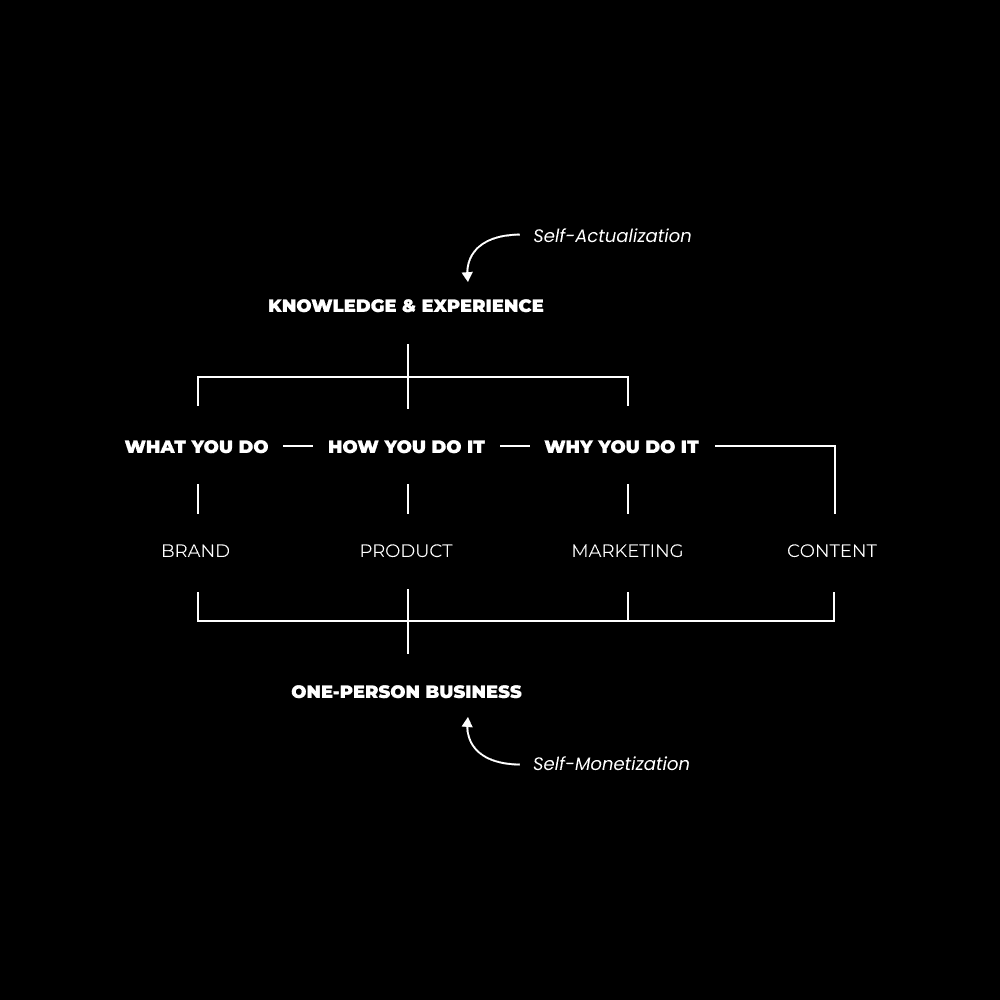

# 个人商业模型：第三部分：如何将知识转化为价值

## 概述

在本节课中，我们将学习如何将你头脑中积累的知识和经验，转化为能够创造价值并带来收益的产品或服务。我们将探讨一个系统化的方法，帮助你从自我提升走向自我实现，并最终实现自我超越。

## 信息：新时代的基石

上一节我们讨论了个人产品化的概念，本节中我们来看看这一切的基础：信息。

注意力**不是**新的货币。信息才是。信息是我们用注意力处理的东西。人类所做的一切，本质上都是处理、存储和使用信息来创造或毁灭。

现代技术，如社交媒体，其潜在意图是让我们能够获取通常无法获得的信息，从而增加我们生活的潜力。信息带来对机会的觉察，机会的觉察能催生有利的想法，有利的思想最终导致积极的行为改变。

相反，信息操纵则可能导致负面结果。但今天，我们聚焦于信息时代的积极面：**一切都是信息**。我们的遗传密码、感知到的光线、形成的信念，都是信息。信息积累到一定程度，得到释放时，就会导致发现、创新和突破。

每个人都有一个共同的大目标：**尽可能提高自身的人类体验质量**。我们的思想、情感和行为——这些都是信息的形式——决定了我们的体验质量。大脑需要有序的信息来保持自身有序。当信息（内容）的结构良好时，会带来幸福和满足感；结构混乱则导致低质量的体验。

## 💡 发掘你头脑中的价值

你头脑中可能蕴藏着价值超过10万美元的信息。关键在于如何将这些知识打包，并通过有价值的途径分发给他人。

以下是如何构思一个有利可图产品的思考路径，请思考这三个问题：

**1. 你一天中最精彩的部分是什么？**
是写作、日记、冥想、瑜伽还是健身？这些我们习以为常、认为“不值一提”的事情，往往蕴含着独特的价值。如果你有自己的一套高效日记方法，能否将其产品化？你热爱的、毫不费力却能极大改善生活的事情，正是你可以传授给他人的。

**2. 你比同行做得更好的事情是什么？**
如果你的朋友对你的某项技能表现出浓厚兴趣，你能系统地教给他们吗？或者，有没有什么事情因为你的执着追求而被朋友“批评”不理解？这种独特的坚持和系统，可能就是你的产品核心。

**3. 你关注谁，他们卖什么？**
一个反直觉但极其有效的建议是：**卖那些已经卖得好的东西**。深入研究你所在领域成功人士的个人资料、内容、产品页面，拆解他们成功的拼图，然后结合你的独特性进行复制和创新。

**4. 给尚未开始者的额外建议**
如果你还没有明确方向，请果断选择一个你稍有兴趣的路径，立即开始行动。审视你的书架、学习类浏览记录、激励你进步的社交媒体关注列表。设定目标，向已经达成的人学习，并复制他们的成功路径。

## 🛠️ 创建盈利产品的七步法

现在，我们进入实操部分。以下是将你的知识转化为产品的七个非线性步骤。请记住，这个过程必须在公共场合进行，你需要数据（市场反馈）来验证你的想法是否有价值。

**第一步：在特定技能或兴趣上达到平均水平以上**
动机让你开始，**学习让你持续**。如果你没有看到期望的结果，通常是因为技能还不够。你必须投入时间，不仅学习理论，更要让技能在真实市场中“浸泡”，发现那些细微却关键的差别。学习写作、营销和销售是不会错的方向，它们能教你实用的人类心理学。

**第二步：每天运用这些技能去构建**
学习必须有应用出口。如果你在学习营销，就去建立一个品牌；如果学习灵性，就去构建一种生活方式。将所学无情地应用到你的生活或业务中，并消除一切会带来混乱信息的干扰。

**第三步：记录你的学习、发现和结果**
将互联网视为你的公共笔记本。做笔记、写内容，记录下对你有价值、能激发兴奋感的有序信息。这不仅帮助你内化知识，也为他人提供了价值。“开始、构建、教授”是保留所学的最佳方式。

**第四步：通过实验获得全面理解**
成为“综合者”。尝试多种方法，从每个来源中提取最有效的部分，融合成你自己独特的系统。就像音乐制作人融合不同流派创造新音乐一样，你可以通过综合创新，在饱和的市场中找到独特的、永不饱和的定位。

**第五步：迭代你的流程以提升效率和结果**
为你擅长的事情创建标准操作流程（SOP）。这是一个能持续产生结果的步骤系统。在实际使用中，你会遇到问题，此时就对SOP进行微调、测试、再迭代，直到它变得高效可靠。

**第六步：借鉴已经成功的营销和产品结构**
再次强调：**卖那些已经热销的产品**。研究你所在领域成功产品的着陆页：标题、核心问题、课程结构、价值主张、保证条款等。借鉴这些已被验证的框架，然后填充你独一无二的内容和见解。记住，买家会重复购买同类产品。

**第七步：建立分销渠道并系统化推广**
品牌和产品相对稳定，而内容和营销需要持续努力。内容是构建分销（受众、邮件列表、社区）的手段。营销是通过各种渠道（社交媒体帖子、新闻通讯、不同角度的信息传递）推广产品的方式。成功的唯一法则是**坚持不懈和迭代**。大量创作，观察哪些内容反响最好，然后用各种方式深化这一主题，并将其扩展到不同平台。

## ⚠️ 重要提醒

你必须立即开始**写作、构建和推广**。如果感到焦虑，请记住，未知会随着时间变为已知。拖延不会让事情变得更容易。一个自主、盈利且充实的未来正在等待那些勇于开始并持续迭代的人。

## 总结

本节课我们一起学习了如何将内在知识转化为外在价值的完整路径。我们从理解信息时代的本质出发，探讨了如何发掘自身独特的知识价值，并通过七个步骤系统化地将其产品化。核心在于：提升自我生活质量，记录并系统化你的方法，借鉴成功模式，并勇敢地公开构建和迭代。这是一条实现自我实现、自我货币化，并最终导向自我超越的旅程。现在，是时候开始提取你头脑中的价值了。