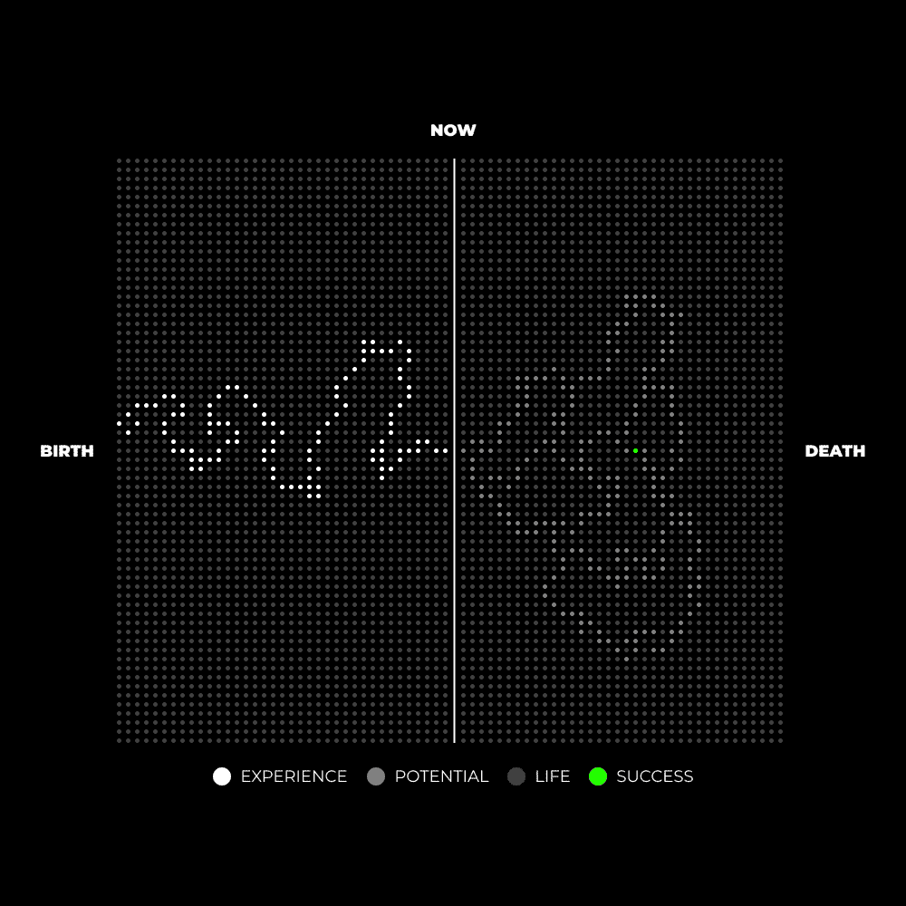

# 生活是一场游戏：如何赢得比赛 🎮

> 原文：[`thedankoe.com/letters/life-is-a-game-heres-how-you-play-it/`](https://thedankoe.com/letters/life-is-a-game-heres-how-you-play-it/)

在本节课中，我们将学习如何将生活视为一场游戏，并通过设定目标、建立规则框架、平衡挑战与技能来获得心流体验，从而赢得这场比赛。我们将探讨宏观与微观游戏的概念，并学习如何塑造一个能玩好人生游戏的“玩家”角色。

你是否体验过最佳的人类状态？

那种你感到极度自信、充满活力或效率极高的时刻，远超平常水平。

有些人称之为“心流”状态。

这是一种意识状态，此时只有你眼前的事物才重要。

你失去了导致所有心理痛苦的自我意识。

当你进入这种状态时，你会：

*   停止在意他人的看法。
*   与你正在执行的任务融为一体。
*   清楚地知道下一步该做什么，了解自己的表现，并从中获得深深的满足感。

关键在于，这是神秘主义者、大师和精神导师试图让你理解的东西。

**比较带来痛苦。**

“自我”是一个想法，一个概念。它是“存在”之后的“认知”。

这不是一个静态的东西，但不要因此误以为“自我”不重要。玩游戏的角色将决定这个角色是否能赢。

“自我”的另一个词是“自我中心”。

当“我”或“自我”出现在句子中时，总是位于比较之前。

这不是你可以摆脱的东西，而是你可以发展的东西。

如果你想减轻痛苦，就必须学会如何控制你的注意力，而注意力深受自我中心的影响。

当你通过关注并将自己的一部分与他人比较而变得自我意识时，你往往会放大差异。

这会浪费宝贵的心理能量，并倾向于分散你的思想。

就像你在镜子里看到皮肤上的痘痘，然后“皮肤应该光滑”的想法突然出现在意识中，你开始陷入消极心态。你是在比较“现实”与“理想”，而不是接受事物本来的样子并继续前进。

或者，当你将注意力集中在自己的社会地位上时，“社会成功”的想法突然出现，你感觉自己“落后”了，而“落后”只是你心中的一个信念。

那么，我们如何控制注意力呢？

**通过将生活视为一场游戏。**

我这一代人因将对电子游戏的痴迷转化为商业成功而闻名。

游戏、商业以及其他外部世界的构建或“矩阵”：

1.  提出一个令人向往的目标层次。
2.  有一个结构来框定你的注意力。
3.  引入一个挑战来进一步聚焦你的注意力。
4.  要求玩家具备满足游戏需求的技能。

很少有人理解的是，你可以从生活中的任何情境中创造出一个游戏。

如果你能塑造思维来创造一个有趣的游戏，生活就会变得愉快。

如果你做不到，你的思维就会被塑造去参与社会地位游戏。例如，上大学、找一份高薪工作，或采取另一种结构化的生活方式，以减轻自主生活所暗示的初始痛苦。

这封信的目的是提高意识。

我不希望你20年后醒来，背负更多责任，却意识到必须加倍努力才能使生活有序。

让我们深入探讨。

## 宏观与微观游戏 🗺️

在玩像《魔兽世界》这样的开放世界策略游戏时，有几个模式需要注意，以及它们如何与日常生活相关。

显而易见的事情包括：

*   积累金币。
*   选择一个职业。
*   提升角色等级。

以及与这些事情相关的进步。

但是，有一些人们常常忽略的事情，可能帮助你从新的角度看待生活。

**游戏是预先编程好并下载到硬盘上的。**

> 系统已经被操纵。
>
> 你无法改变它。
>
> 但是你可以学会它。
>
> 这就是你在系统利益下自我操纵的方式。
>
> — 丹·科伊 (@thedankoe) [2022年7月5日](https://twitter.com/thedankoe/status/1544277416704720898?ref_src=twsrc%5Etfw)

成功的常规路径已经被编程到集体心理中。

在我们意识到之前，我们已经在追求社会希望我们追求的游戏胜利，通常是为了维持这个游戏本身。

*   上大学。
*   找到一份高薪工作。
*   65岁退休，这样你终于可以享受生活。

90%的情况下，事情不会这样发展。

（通常最终陷入永无止境的焦虑、绝望和缺乏满足感的状态）。

为什么？因为时代在变化，而“程序员”无法快速修复游戏。因为这需要他们彻底改革学校、银行和就业系统。

移除摩天大楼的一个基础构件可能会导致它倒塌。

这就是为什么个人通过在线教育作为创作者、编程去中心化货币以及作为独立合同工（如自由职业者）提供服务来填补这些角色（并因此获得丰厚收入）。

从不质疑这个系统并屈服于其编程的人被称为NPC。

非玩家角色。

这些包括镇民、战斗任务中的Boss，以及其他让游戏对玩家保持有趣的角色。他们做被告知要做的事情。

然后，还有一些人选择有意识地玩游戏，并享受集体自我所创造的乐趣。

**你可以选择无数条道路。**

在《魔兽世界》中，你有一系列的选择需要做出：

*   你的角色外观。
*   他们是什么样的玩家（战士、法师等）。
*   他们想学习哪种专业。
*   他们想通过哪条任务路径来提升等级。
*   他们是单人游戏还是组队游戏。
*   他们加入什么公会来帮助更快升级。

以及一系列其他个人选择，允许游戏以你喜欢的任何方式进行。

你看，生活就像一座山，但这座山是无限高的。

如果有5个人站在山脚，你要求他们为第一个顶峰规划一条路径，他们都会画出略有不同的路线。

然后，当他们到达那个顶峰时，他们不仅能够向下看并帮助他人更快攀登，而且还有一个新的顶峰要达到，但这是基于先前经验的地方。

**提高你的等级会增加自我复杂性。**

在现实世界中，主要的灵性问题在于人们从不改变。

他们认同信念、他们的工作和强加给他们的生活道路。

他们的自我永远不会改变，因为它不想改变。

一旦他们达到生活中的那个阶段，他们就会停止学习、积累技能，并“升级”到有更多机会可供选择的地步。

通过提高你的技能组合，你能够承担生活中更复杂的挑战。

通过承担更多挑战，你获得了扩展你意识的知识和经验。

就像在电子游戏中将点数投入到技能树的特定特质一样。

最终，你拥有如此多的力量和经验，整个世界都可以自由漫游，没有压力或义务。

通过承担更高水平的挑战，曾经地图上的未知区域现在被探索了——而且可以继续探索，只要你愿意。

随着你自己的发展，你拥有了从混乱中创造秩序的知识和经验。

你有更多的力量从任何情况下创造乐趣。

这个整体结构代表了人生的游戏，即宏观游戏。

但是，这还只是更深层次的问题。

你发现自己所处的每一个情境都可以被视为一个微观游戏。

一个游戏中的游戏。

让我们讨论一下你如何在玩人生游戏中创造最大的乐趣。

## 设定目标层次 🎯

游戏提出了赢得比赛的大目标。

它们还提出了子目标，如任务，这些目标引导你走向赢得比赛。

如果只有赢得比赛的目标，而你对如何赢得又缺乏清晰的认识，那么比赛就不会有趣。你的心智将无法维持秩序，意味着它会陷入混乱。

到目前为止，为你的未来制定一个愿景应该是常识。

作为人类，我们有能力**瞄准**。

猴子可以扔粪便，但它们不**计划**。粪便通常会被直接扔向地面。

相反，人类可以将注意力集中在目标上，并且根据他们的技能水平，从50码之外击中靶心。

我们不想成为被扔向地面的粪便，所以我们创造了一个我们可以为之努力构建的愿景。

但是，如果我们不想被宏伟的愿景压垮，我们需要一个计划。一套从上到下的目标，使我们的日常行动变得清晰，更容易采取行动。

**思考要大，行动要小。**

拿起笔和纸，或者[使用我的Power Planner](https://shop.thedankoe.com/planner)，来：

*   创建你愿景的第一个迭代。
*   创建10年、1年和月度目标。
*   有一个地方用于每周的方向和反思。
*   将你的日常优先任务与这些目标对齐。

将这些写下来，你将扩展你的意识，注意到推动这一愿景的机会。

随着更好的想法浮出水面，你可以进一步细化它们以整理思绪。

## 游戏框架 🖼️

你的视角是你感知现实的框架。

就像一台相机。

视野范围，即使背景模糊，也会限制在框架本身中注册的内容。

通过在任何情况下操纵你的视角，你可以将以前被视为问题的小障碍视为挑战。

在视频游戏中，有两样东西以减少焦虑、压倒性和压力的方式对意识进行排序。

**1) 规则**

每个视频游戏都有一套规则，必须遵守才能在不作弊的情况下赢得游戏。

当我们玩游戏时，这允许我们使用有限的意识注意力专注于此时此地——同时将最终目标放在心底。

在心理学中，多巴胺在你想到未来拥有某种渴望的东西时（例如赢得游戏或实现你的愿景）涌入大脑。

“此时此地”的化学物质——如血清素、催产素和内啡肽——在你欣赏眼前的事物时（例如玩游戏或执行优先任务）会奖励你的大脑。

因此，当你带着赢得游戏的意图玩游戏时，你更有可能进入愉快的流动状态。

***从科学角度看，心流只是奖励性化学物质在你大脑中泛滥的鸡尾酒，这些化学物质通过专注的注意力被激发。***

但是，只有当你满足我们很快将要讨论的其他要求时才会发生。

在现实世界中，在生活的宏观尺度上，**你的“规则”就是你的价值观**。

你认为重要的事物。

当你按照自己的价值观行事，同时将这些行动限制在有助于你生活目标之内时，你将获得最大的乐趣。

在日常生活的微观尺度上，清晰来自消除环境干扰。

就像你试图进行深度工作一样。

你关闭浏览器标签，戴上降噪耳机，并为工作设定清晰的步骤。

当这项工作与内在结果一致时，你可以猜到接下来会发生什么。心流。

现在，这不仅仅在于理解和消除环境干扰。

你可以在曾经平凡的情况下创建规则或界限。

我曾经讨厌长时间散步，即使我知道这对我的身心健康有益。

因此，你可以这样做：

*   为这种情况设定一个目标，比如走2，500步。
*   创建规则来游戏化它，比如永远不要踩到裂缝。
*   执行最小阻力行动，比如走出前门。

***目标、清晰、简化行动。***

这也适用于你通常讨厌的情况。

就像如果你不明白为什么人们看体育比赛或观鸟。

***从中创造你自己的游戏。***

**2) 机制**

如果你以前没有玩过这个游戏，这会很困难。

你的目标会设定得很糟糕。

你将不得不在低级别挑战上进行练习。

你会被顶级玩家的技艺所震撼。

每个游戏都有一种特定的方式，让你更多地融入你的感官、思维和先前的经验，这些经验通过注意力渠道。

***在电子游戏中***，它是按下一系列按键、按钮或鼠标点击。

***在桌面游戏中***，它是你策略中的有效性、创造力或前瞻性思维。

***在体育运动中***，它是你身体的训练以及你如何根据目标移动它。

在所有上述情况中，是你的情境感知（游戏的框架）以及你如何选择行动以获胜。

反馈在这里很重要。

游戏需要一种方式来维持秩序，因为游戏正在进行。

当你知道自己做得如何时，你就不太可能分心。

如果你的视角有限，无法以给你清晰度的方式感知一个情境，那么做出“好”的决策并最终获胜将很困难。

当这种情况发生时，你的思维会拓宽其视角——或者说框架化的注意力——这为分心留出了空间。

我们如何在玩游戏时提高我们的机制？

当然是练习。

在游戏中，你通常每天都会登录，执行一系列重复的任务。比如做日常任务、刷经验值或制作武器以提升你职业的等级。

你必须在你的大脑中编程那个特定的机制，使其变得不费力。

换句话说，就是习惯的形成。

如果你能够自动化你做出的决策，成功就会变得不费力。

这需要时间和持续的学习渴望。

我们很快会讨论这个问题。

## 焦虑与无聊的微妙平衡 ⚖️

当你开始玩游戏时，尤其是没有阅读规则手册，体验会愉快吗？

可能不会。

即使你知道规则，除非你开始掌握游戏的机制，否则也不会觉得那么有趣。

如果你在《魔兽世界》中是1级，并且*某种方式*能够与50级角色战斗，这会很有趣吗？

首先，你会立即失败。

其次，不会有趣，除非你在心中创造了更好的游戏框架——比如试图失败，因为你想看看50级有多强大。

如果你和朋友们玩了几次象棋，你会考虑参加竞争性比赛吗？或者与大师对弈？

经验教训：

如果你的技能与游戏提出的挑战不匹配，你将度过糟糕的时光。

如果你技能高而挑战低，你会感到无聊。

如果你技能低而挑战高，你会感到焦虑。

**无聊**源于自我中心。你的注意力分散，一个新的欲望出现在你的脑海中，相关的想法开始占据你的注意力。

如果你工作中感到无聊，你可能会开始思考你可以做更多富有成效的事情。

**焦虑**源于自我意识。你的注意力转向你对自己的概念，再次，相关的想法开始渗透你的意识领域。

*“哇，我并不像我想象的那么好。”*

*“我真的很需要练习我的挥杆。”*

*“那个女孩完全超出了我的水平。”*

注意“我”和“我的”的使用，这暗示了一种比较。

这种比较导致心理熵：[除非用适当的能量维持，否则心灵倾向于混乱](https://thedankoe.com/the-cure-to-caring-what-people-think/)，或者说，是有序的信息可以被有意识的思维作为能量处理。

我们该如何防止这种情况发生？

通过终身学习。

如果你在这封信上已经思考了一段时间，你知道这意味着什么：

[终身建设。](https://thedankoe.com/how-i-remember-everything-i-learn/)

将你的生活视为不仅是一个游戏，从这个视角看，还是一个项目。

在心中保持改进的意图，遇到引发焦虑或无聊的问题，并以具体知识的形式学习来克服这个问题。

## 不要恨玩家，创造玩家 🧑‍🎤

> 在我们历史进程的这个阶段，一个人应该能够构建一个自我，这个自我不仅仅是生物驱动力和文化习惯的结果，而是一个有意识、个性化的创造。 —— 米哈伊·契克森米哈伊

我记得我第一次作为青少年下载《魔兽世界》时的情景。

我花了两小时的时间研究每个种族、职业和改变外观选项的细微细节，同时在我脑海中保持胜利的想法，以便做出正确的决定。

我会成为战士吗？萨满？还是介于两者之间？

我想要成为巨魔吗？

或者只是一个长头发的普通人？

当我去接受某些任务和地下城的挑战时，我的个性最适合作为坦克、支援者还是伤害角色？

当我达到15级时呢？

我想要追求哪些专业？

有许多像炼金术、采矿、锻造等等，这些都会决定我能利用公共交易系统到什么程度。

一旦我做出了选择，我就有一系列“天赋”和“特质”，我可以通过经验来提升它们。

一旦我将它们提升到一定水平，我就有了更多最初不可用的选择。

足够回忆了，这如何应用到日常生活中？

首先，为了描绘一幅画面，我认为人类天生并不善良。

就像夏娃吃了知识之树的苹果一样，我们有着无尽的求知欲。

学习是人类经验的基础。

当我们年轻时，我们不知道更好的方法，最终在心中形成了一个“自我”，这是从我们的环境中学到的。

通过任何媒介的学习都会影响我们的思想。特别是如果我们所学习的内容被重复或条件化到我们的头脑中。

我们的思想影响行为。

意味着，你所学习或消费的任何事物都会塑造你的个性和在这个世界中的行为方式。

赢得人生、商业或任何你目前所处的当下情境，取决于你的性格如何在这个游戏中定位、感知和行动。

成功是我们心中所持有的一个主观目标。

目标是通过正确的行为顺序来实现的。

因此，如果我们想要实现我们梦想中的生活，我们必须创造一个能够很好地玩人生游戏的性格。

我们如何塑造我们的性格？

以下是塑造性格的两个关键方法：

**1) 通过整合我们在这封信中讨论的每一件事。**

你需要一个内在的目标层次结构来在任何给定时刻排序你的思想。

当你迷失方向时，将你的注意力集中在你的愿景、目标和优先事项上，以获得清晰。

**2) 通过自我教育和自我反思。**

你的目标层次结构呈现了一系列挑战，你必须通过技能获取、问题解决和直接经验来承担这些挑战。

这些都是学习的形式。

幸运的是，我们生活在一个任何信息都触手可及的时代。你的问题的解决方案以想法的形式出现，你必须实施这些想法。

你通过持续消费有价值的信息来找到这些想法。有时你必须筛去泥沙才能找到金子。这是一个终生的过程，只能被分心和廉价愉悦所打断。

自我反思是你引导未来决策的方式。

怎么做？

因为在采取行动时，不可能有100%的确定性。

你只需要接受它们。

当你这样做时，唯一确定这些行为是好坏的方式是通过自我反思。

如果你当前的生活是你过去决定的产物，这意味着你无法知道“原因”的“效果”直到它发生。

即使有人告诉你会发生什么，你也没有考虑到可能导致不同结果的每一个环境因素。没有直接经验，你限制了你的潜力。

当你坐下来沉思你的决定时，这就是你找到“效果”的方式。

从中，随着时间的推移，你的决定会越来越准确，直到你达到你的目标。

## 总结 📝

本节课中，我们一起学习了如何将生活视为一场可以赢得的游戏。让我们快速回顾一下核心要点：

*   **游戏是一种将意识排序到着迷程度的方式。** 当你着迷时，你不再关心别人怎么想，而是根据你的价值观去赢得比赛。
*   **游戏是有趣的，生活中的每一个情境都可以在心理上塑造成一个游戏。** 如果你想要避免心理上的混乱，你的技能需要与任何情境提出的挑战相匹配。
*   **你的视角将决定你能获得的信息。** 如果它没有结构，你将误解它。
*   **你自己，一个概念，是玩家。** 随着时间的推移，你想要创造一个能够赢得它最擅长的游戏的角色。

希望你们都喜欢阅读这篇文章。这是我最喜欢写的一篇。

开始玩大游戏吧，朋友们。

– *丹·科*

**本周发生了什么**

2小时作家在BFCM周末大促销。如果你想学习一个基础技能以加入数字（或创作者）经济，你可以以30%的折扣购买。

[查看2小时作家。](https://2hourwriter.com)

在《现代精通》中，推出了2个策略。一个是7个推文模板和病毒性帖子结构的分解。另一个是我如何创造3年之久的独特内容想法，这使我与其他创作者区别开来。

[读者可以以5美元的价格加入。](https://modernmastery.co/letter)

在YouTube上，我发布了“矩阵是真实的（这是你如何用你的心灵逃脱的方法）。”关于我是如何记住我所学的一切的另一集将在明天推出。

[在此订阅以观看。](https://youtube.com/c/DanKoeTalks)

*就像往常一样，当你准备好时，你可以在我的网站上找到我其他免费和付费的产品，以改善你的生活和业务。[点击这里。](https://thedankoe.com)*