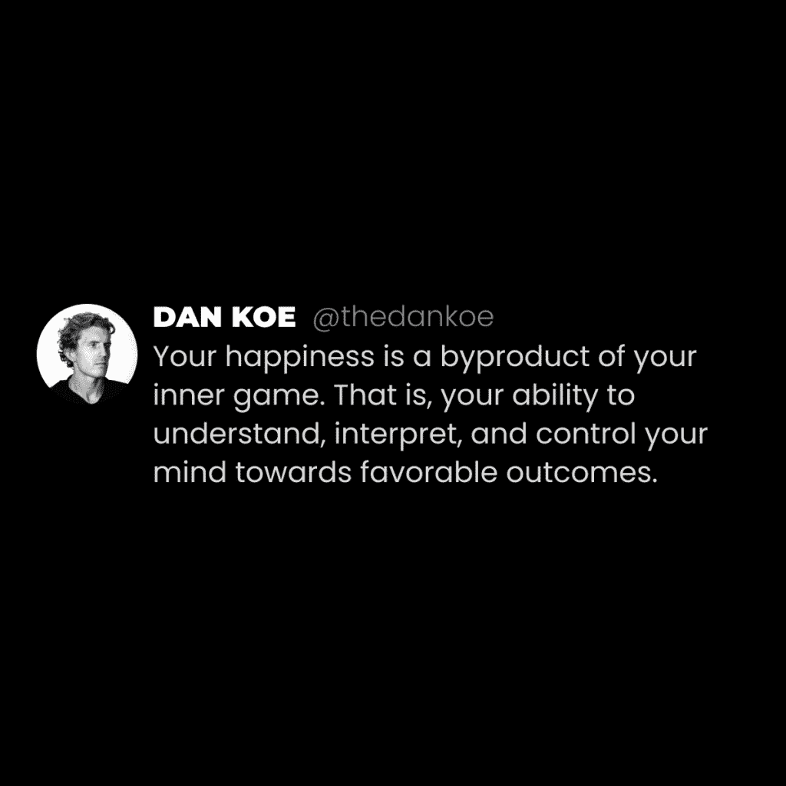
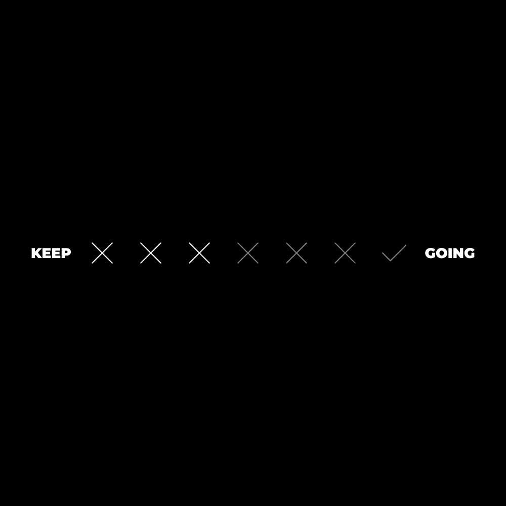
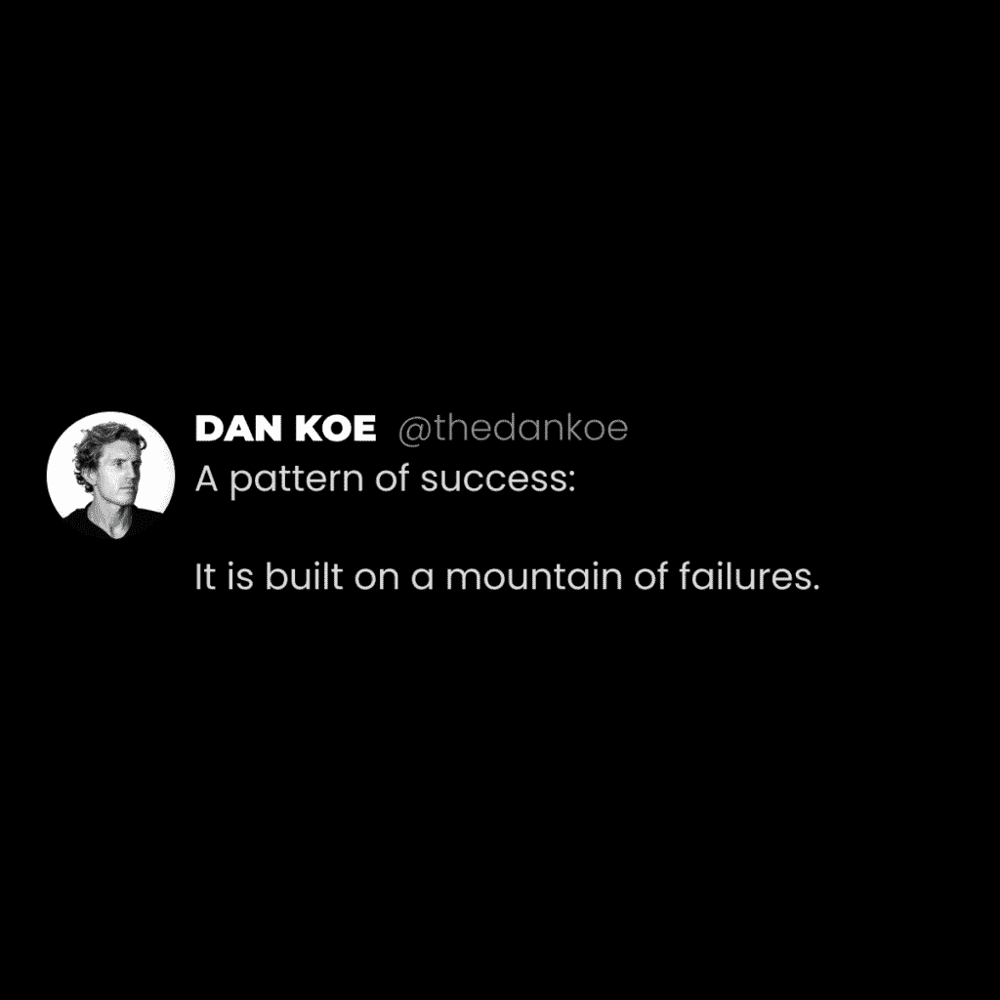
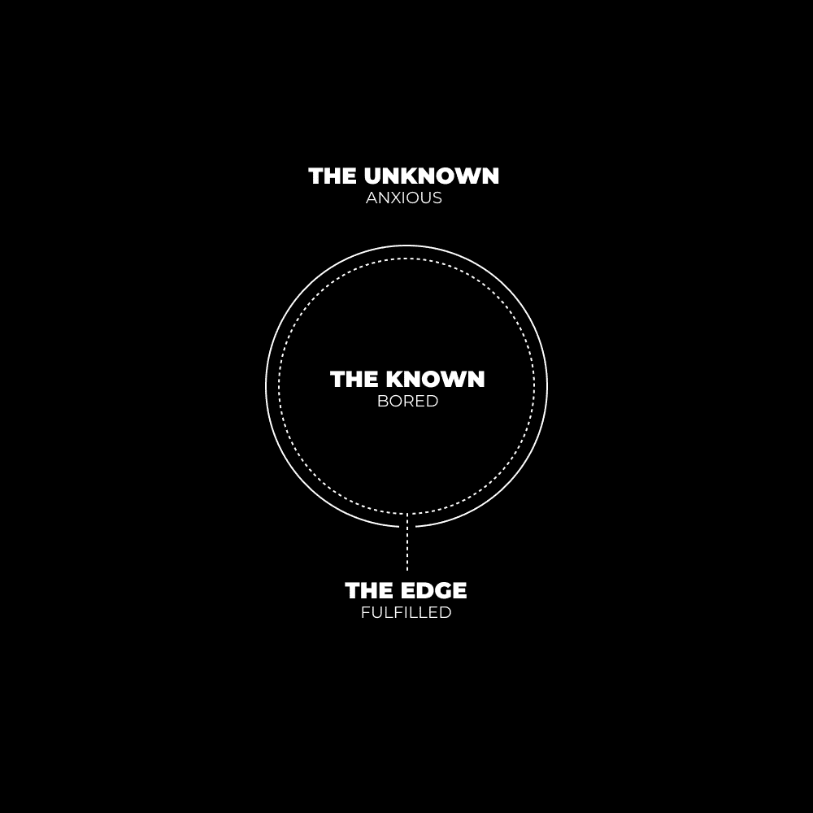
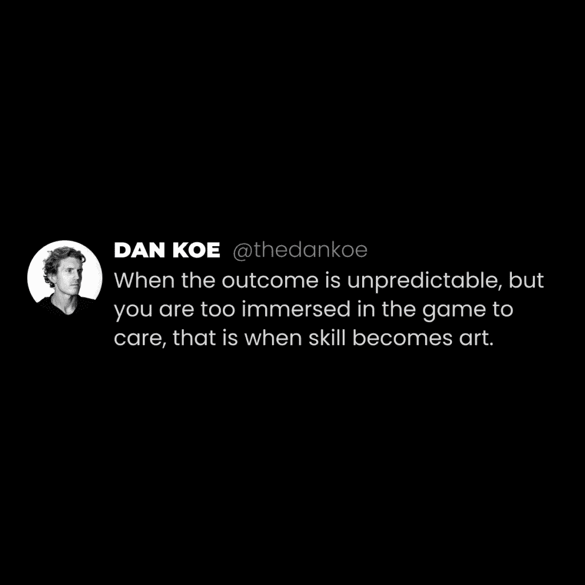

# 克服恐惧：为什么害怕失败正在毁掉你的生活

在本节课中，我们将探讨“害怕失败”这一普遍心理如何阻碍我们的成长与学习。我们将重新定义失败，理解它在学习过程中的核心作用，并学习如何通过拥抱失败来构建更充实、更有意义的生活。

学习是人类经验的基础。

然而，绝大多数人并未掌握正确的学习方法。

问题不在于他们不知道如何学习，而在于他们忘记了学习的本质。

我们这里讨论的是真正的学习。

在本教程中，记忆、囤积知识和鹦鹉学舌等行为不被视为学习。

学习是经验的结果。

人类经验不仅仅包含文字。

它是一系列感觉、光线、声音、味道和其他感知的集合，共同构成一个单一的**视角**。如同时间的一个瞬间，是瞬息万变的当下意识的一个片段，转瞬即逝。

文字是覆盖在现实之上的一层。

现实由符号、隐喻和能量构成，我们为了理解所关注的事物而为其贴上标签。

那么，学习发生在哪里？

发生在**斗争**中。

发生在**失败**中。

发生在人们通常回避而非接受的事情中。

我们为何回避？因为我们不理解失败是什么。否则为何要害怕它？我们没有完整的图景，没有完整的视角。这只能通过失败本身来获得。你明白我的意思吗？

既然学习需要失败，请理解本文旨在提高你的认知。你无法对未知的事物采取行动，如果本文能让你意识到失败的重要性，我的任务就完成了。剩下的取决于你。我不能替你失败。

要知道，人们讨厌他们不理解的东西。对许多人而言，失败是一种自动的、无意识的、预先编程的“讨厌”。

**真正的学习的第一步是改变你对失败的看法。**

即，不要评判、假设或期望它不存在。失败是一种低频能量源。当你专注于挖掘（将这种能量带入意识中）时，相关的感受会在身体中显现，而你将其标记为“好”或“坏”。

失败是客观存在的。这意味着，如果你不修复与它的潜在关系，拖延和缺乏满足感将主宰你的生活。

为什么我们必须经历失败、斗争和挑战才能真正学习？

因为当你处于由斗争产生的“不适”意识状态时，你的大脑已准备好接受教训。它开放地接受解决方案，将其内化，并将这次学习锁定以备下次使用。

这意味着，你必须直接体验来自斗争（阻力）的视角，才能将对立面（突破）带入现实。

这种视角存在于底层。与之相关的感受并非我们应该回避的东西。

## 失败的档案 📁

每个成功的人似乎都要经历一个失败的阈值。

也就是说，在学会成功之前，一个人在追求特定目标时必须经历一定数量的失败。

以我个人为例，在赚到第一个1000美元之前，我失败了超过7种不同的商业模式。

“丹，如果你能回到过去，你会改变任何事情吗？”

这总是一个有趣的问题，因为它暗示存在一个可以避免失败、保持舒适的“秘密”，而失败本身就是那个秘密。

现在回想起来，不会。我不会回去改变任何事情。如果我那样做了，我将不得不再次失败，经历这个循环，最终回到同一个地方。

如果我没有在创意设计上失败，我就不会学到改进设计的方法。这促使我创建了Instagram数字艺术页面。

如果我没有在数字艺术页面上失败，我就不会去学习网页设计。这导致了多次自由职业的尝试。

如果我没有在自由职业上失败，我就不会去学习品牌、文案和社交媒体。这最终导致了一个失败的电商品牌。

如果我没有在电商上失败，我就不会得到那份网页设计的工作。这带来了自由职业的成功，并促使我转向社交媒体，一直坚持至今。

最终，我积累了一整套通过斗争提炼出的经验教训，使我能够在我想要追求的任何事情上取得成功。

这是一种在任何“白手起家”的成功故事中都能看到的模式。白手起家意味着他们没有继承财富。去听听任何你敬佩之人的起源故事播客，他们会告诉你同样的故事。失败是不可避免的、必要的，也是你能找到的最接近“快速致富”的东西。

在任何事业中，成功都是一个不断投资于你的**失败档案**的过程，直到没有其他可以失败的地方。也就是说，直到你的投资累积起来，你才能负担得起成功。

## 如何快乐地失败：已知与未知的交汇处 🎮

人类在故事中找到意义。

我们通过故事来理解世界。

在我们不自知的情况下，我们的潜意识会“填补”我们感知到的一切空白。

当你接近一个陌生人时，为什么会感到焦虑？因为你的大脑已经预设了结果。

当你长时间做同一件事，比如在健身房做同样的锻炼，为什么会感到无聊？因为你的大脑已经知道会发生什么。

生活是一场包含无限游戏的竞赛。

你选择参与的游戏将决定你从获胜中获得的结果。

陷阱是什么？

游戏意味着有失败的可能。

更重要的是，当你开始持续玩一款新游戏时，你将更频繁地“失败”。你不可能通过赢得每一场比赛就从1级升到100级。

> 阳刚之气渴望感受生活在边缘的极乐，如果不敢亲自尝试，就会在电视上、体育赛事和警匪剧中观看。—— 大卫·迪达

游戏是令人兴奋的。它们是有结构的、你积极参与的故事。这就是你在生活中找到意义的方式：沉迷于那些能带来满意结果的竞赛。

*请注意，不要把“阳刚”与男性或女性混淆。每个人都有阳刚和阴柔的一面。这是一种能量，在现实的不同方面表现出不同特征，而不仅限于人类。*

重点是，追求更多、征服以及从赢得战斗中获得利益，是阳刚能量的体现。

男人和女人都一样，尤其是随着技术解决某些问题（反之亦然），女性承担更多阳刚活动，每个人都可以：

*   攀登企业阶梯
*   围绕兴趣建立事业
*   在具有挑战性的体育竞赛中竞争

认为一个人可以是100%阳刚，或者女性应该是100%阴柔，是愚蠢的。每个人都需要在自身内部保持平衡。大多数男性倾向于阳刚，反之亦然。

我会把这个话题留到另一天，但世界正在融合。有些人可能预测它将融为一体。我不在乎人们如何自我认同，我只是喜欢观察并将事物拼凑起来（而不是让它激怒我，以至于以摧毁这些事物为基础来建立我的身份）。

当我构建（阳刚）时，我感到充满活力，但我知道何时该放松并庆祝（阴柔）。秩序与混乱。这是比喻，不是字面意思。

天气炎热时，你会感到凉爽的可贵。天气寒冷时，你会感到温暖的可贵。有些人喜欢大部分时间保持温暖，有些人喜欢寒冷。当男性取得重大商业胜利时，他们会喝啤酒庆祝。这就是平衡。

重点是，为了过上充实的生活，每个个体需要通过参与战斗来保持阳刚能量的平衡。也就是说，去玩游戏。需要有悬念。即使你不认同自己有“阳刚的一面”，忽视你身上的这一方面也是不明智的。

阴阳。

> 当一个人的所有相关技能都用于应对某种情况下的挑战时，那个人的注意力就会完全被活动所吸收。没有剩余的心理能量来处理除了活动提供的信息之外的其他信息。所有的注意力都集中在相关的刺激上。—— 米哈里·契克森米哈伊

战斗发生在战场上。

游戏按照一定的规则进行。

任何现实生活中的情况都呈现出一个带有某些已知和未知变量的**环境**。

**如果你不知道如何玩游戏，那就不会有趣。你会感到焦虑。**

健身房的初学者不会尝试举起400磅的杠铃。他接受自己当前力量的挑战，并期待在未来几个月内取得进步。

**如果你在游戏中太擅长，那也不会有趣。你会感到无聊。**

国际象棋大师可能会从教初学者中找到挑战的乐趣，但与初学者对弈？**无聊**。大师的技能必须得到考验，才能进入心流状态，使他的注意力完全沉浸在他追求的目标中。

**舒适存在于已知之中。**

**未知中存在不适。**

**满足感存在于边缘。**

我相信这是古人解释“无念”或“非二元”时提到的一部分。

一种类似于现代心理学家所称的“心流”的意识状态。

这与失败有什么关系？

通过追求正确的目标，你可以更频繁地享受失败。

**一种既不太遥远以至于你在未知中迷失，也不太接近以至于你感到无聊的东西。**

同时，也因其价值而受到认可。

在我们结束之前，有一个问题：

你的愿景对你来说有价值吗？

也就是说，你是否已经**内化、欣赏并深入思考**了实现这一愿景将如何渗透到你的生活中？

财务自由值得10年的**失败**吗？如果不值得，另一个选择是什么？那个选择值得10年的奋斗吗？

重复那个问题序列。将“财务自由”替换为任何好事。那些不能外包或给予你的事情，比如：

*   你的体格和能量水平
*   你一生中培养的个人品牌
*   对你技艺的精通以及你在世界上的行事方式

写下来。在散步时思考你的未来。让你的愿景随着**时间**变得清晰。它不会瞬间出现。

与它共处。

**你不需要更多的建议**

寻求建议是将你采取行动和自行解决问题的能力外包出去。

（寻求建议与获取你目前正在采取行动的具体信息不同，那被称为教育，这也是需要几十年才能掌握的事情）。

重新看看那个图表。

你已经**知道**你需要执行什么。

你需要挑战已知的边缘，挑战自己，尝尝未知的感觉，并投资于你对真正不知道的事情的教育（以及它们何时最适用）。

**“我应该创业吗？”**

**“我应该去健身房吗？”**

**“我应该向那个人表白吗？”**

如果我告诉你“是”，你会学到什么？如果我告诉你“不”，又会怎样？

如果你听了其中的任何一个，你不会在未知中找到自己的答案。你可能会浪费2-3年的时间，因为有人告诉你不要做某事，而不是自己去尝试并找出答案。

去建立，去创造，挑战自己，尝试一切，并找出答案。

那是人类所做的事情。

– 丹·科

---

本节课中，我们一起学习了失败在学习与成长中的核心作用。我们明白了真正的学习源于斗争和失败的经历，而害怕失败会让我们停滞不前。通过构建自己的“失败档案”，并主动在已知与未知的边缘（即心流区）挑战自己，我们可以将失败转化为成功的基石。关键在于改变对失败的看法，视其为必要的过程而非可怕的结局，并为自己设定有价值、有挑战性的目标。记住，答案不在别人的建议里，而在你亲身尝试和失败的过程中。