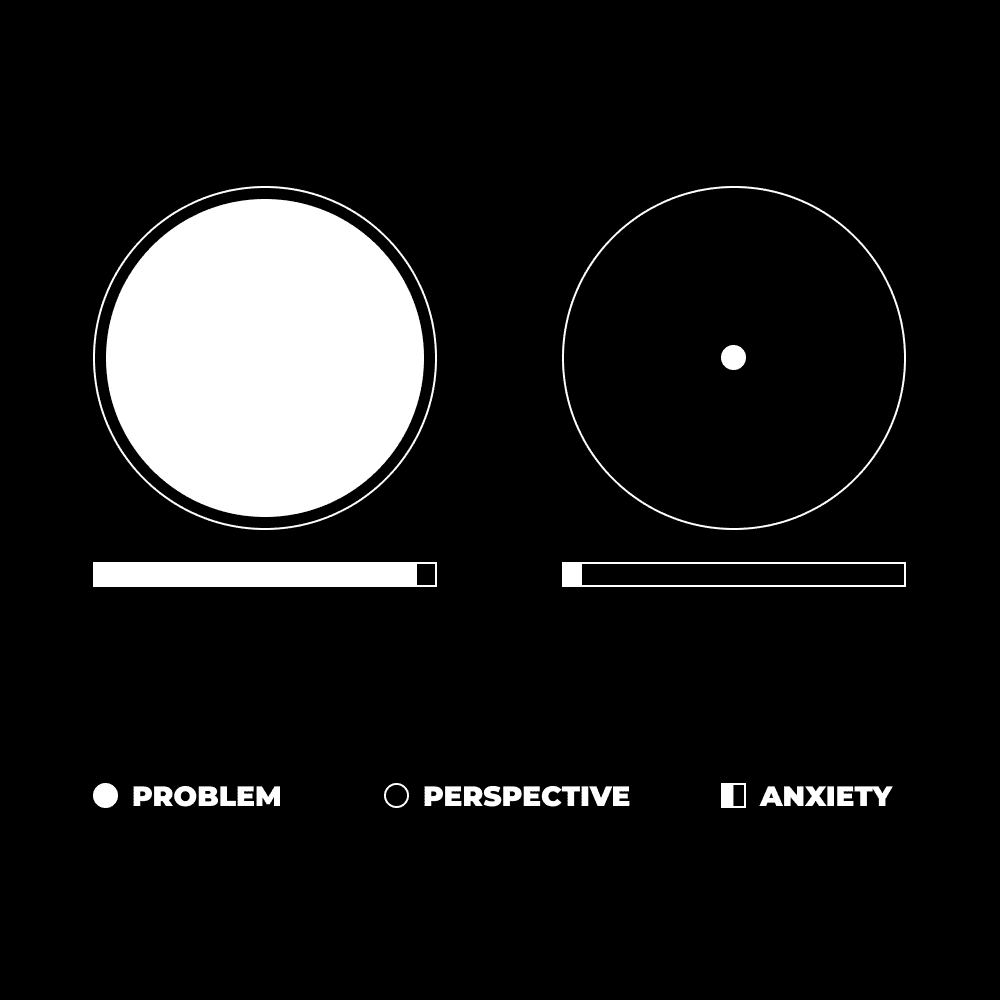
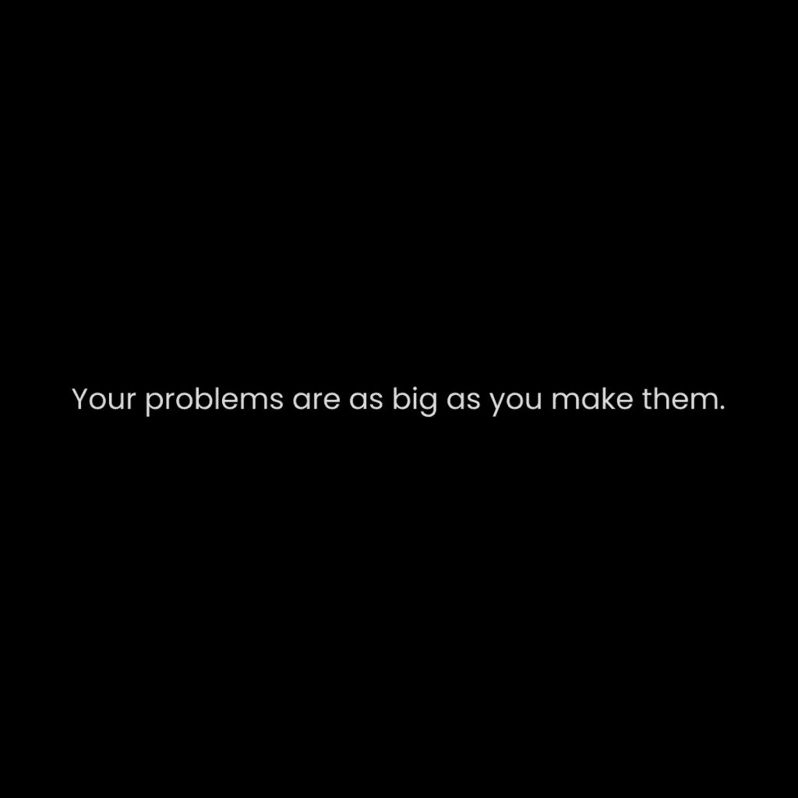

# 个人成长：如何停止感到迷茫、不知所措和对未来的不确定

在本节课中，我们将学习如何理解并应对普遍存在的迷茫、焦虑和不确定感。我们将探讨这些感受的根源，并学习通过掌控注意力、设定目标和建立系统来构建清晰、有序的内心世界，从而主动创造自己想要的未来。

## 问题的本质与系统性

上一节我们介绍了课程的主题，本节中我们来看看问题的本质。

问题不是个人的。问题具有系统性。每个人都有同样的问题，他们将继续有同样的问题。你永远无法摆脱它们。你只能通过更好地感知它们来变得更好，这会导致更好的决策（不受情绪影响）。

焦虑、压倒性和压力是心理熵的结果。

**心理熵**可以理解为：
`心理熵 = 心灵系统的无序度`

心理的 = 关于心灵的。熵 = 系统趋向于无序。系统需要持续的能量才能繁荣。如果你的心灵是一个房间，而你不对这个房间（维持秩序）投入能量，那么这个房间就会变脏。一天不打扫不会有什么坏处。但一周？一个月？一年？这就是我们所说的猪窝。

没有什么好奇怪的，焦虑在我们的社会中如此普遍。没有人打扫过他们的房间一年了，谁愿意投入那么多的能量？在一天之后打扫房间比在一年之后打扫要容易得多。焦虑周期持续下去，因为我们知道我们需要打扫房间，但我们没有。思想和行动之间存在差距。那正是问题发生的地方。当我们心中的系统出现能量阻塞时。

心理健康是关于理解、理解和清晰。如果你让一种强迫性和负面的思想控制一个情况，你就无法看到那个情况的真实面目。你会陷入自己的头脑中，思考可能发生的不良事情。你将那个负面经历拉入现在，它影响你的思想和行动。

关注为所触及的一切注入生命。当你将你的注意力集中在你心灵创造的一个虚假现实中时，你的行为会使它变得真实。你认为这会在任何情况下导致有益的结果吗？它会帮助你的社交、财务或个人目标吗？还是它会以让你退入舒适的方式扭曲它们？

## 核心课程：视角与感知

理解了问题的系统性后，本节我们将学习应对的核心课程。

理解你的问题是正常的。它们是心灵中的虚构，通过关注变得真实。问题并不特殊，当从角度来看时，它们变得愚蠢。当一个第三世界国家的孩子已经接受他可能明天没有水时，你为什么还在担心你的社交媒体帖子没有获得任何互动？那个孩子在你之上有什么更好的心理空间吗？

通过获得视角，你创造了从占据你注意力的那个问题中退出的空间。问题从世界的大小缩小到面包屑的大小。你可以看到问题是什么，通过意识，开始纠正你在生活中如何消耗能量以维持心理秩序。

## 构建并掌控你的现实

上一节我们学习了通过视角缩小问题，本节中我们来看看如何主动构建内心秩序。

你如何保持内心的秩序，以避免可怕的焦虑、压倒性和压力？通过创造你自己的现实。

系统需要能量。你的心灵是一个系统。精神能量通过注意力转移。“哪里有注意力，哪里就有能量流动。”当你关注积极的事物时，生活就是积极的。当你关注消极的事物时，生活就是消极的。

虽然这可以在一瞬间改变，但你必须明白，你是你过去的产物。你的心灵最初是一个几乎空白的石板。随着时间的推移，它被训练成以有利于社会和文化进步的方式运作。这是不可避免的。这就是你学习的方式。我们接受父母的信仰，朋友的举止，以及我们文化的问题，就像它们是我们自己的。

再次强调，这本身并不是“坏”的。但如果你想要从生活中获得更多，那么我可以看到你在左右摇头。有句俗语说“你的思想创造你的现实”，这是真的，但是什么让你的思想（你的现实）变得好或坏？如果我们的信念被编程进我们的头脑，而且我们的信念往往会自动化我们的思想，那么我们该怎么办？我们只是接受我们所接受的教导以及随之而来的情感负担吗？

生活在一种你被训练成的生活现实中就像是一个木偶。一个 NPC。一个受他人控制而非自己的情感开关。要逆转这种效果，我们必须掌握我们完全控制的官能。

以下是两个你可以完全控制的官能：

*   **你的视角**——你观察一个情况的视角或位置。
*   **你的感知**——你如何解释情况。它是问题性的还是有益的？

结合起来，`视角 + 感知 = 焦点`。焦点 = 有意识的注意力。焦点是可以控制的。放大，缩小，狭窄，宽广，开放，关闭。焦点是你在哪里放置你宝贵的能量的互动、解释和决定。焦点是你在任何外部环境中如何（以及你的心灵）与之互动。

我不是在谈论深度工作的焦点。我在谈论焦点，即你现在正在做的事情，包括你过去的全部和未来的全部。不要轻视这一点。注意力是你唯一可以自觉控制的东西。

一个无法控制的思想突然出现在你的脑海中，你有两个选择：

1.  让你的注意力自动且无意识——这几乎保证了你对所解释的思想、想法或信息的负面解释。
2.  观察你的注意力，你的反应，并通过解读有利于你目标的情况进行纠正。

当我们使这个过程变得有意识，专注于我们的一生，我们的生活质量就会大幅提升。为什么？因为我们开始逐渐意识到，我们想要得到的一切都是通过如何投资我们的注意力来实现的。投资是会复利的。

## 治愈焦虑：有意识地行动

掌握了构建现实的方法后，本节我们将学习具体的治愈方法。

你的现实是一个框架。视角是相机，感知是镜头。当你的注意力完全集中在你的现实之中时，所有的担忧都会消散。

我们将在另一封信中讨论如何建立更好的关系，但为了简短起见：你通过找到一个共同的观点来分享——一个你们都能投入最多精力并解决出现的问题的共同现实来建立更好的关系。

想想看，一个健身者会在家庭聚餐时关心他是否带来了鸡肉和米饭吗？是的，但只有当他超出自己的现实时。也就是说，只有当他失去对注意力的控制时。如果他记得对他来说重要的事情，他的目标，并且正确地感知情况以避免短期快乐，那么他就不会在乎。也就是说，他是专注的。

真的有其他事情真正重要吗？是的，但只有当你给予它关注时。它实际上只存在于——被你意识所持有——如果你给予它关注。如果你不能给予它你的关注，它存在吗？当然不存在，至少不是对你来说。

如果一个杂乱的思绪、观点或信念突然出现在你的意识领域（这取决于你注意力的宽度），请将你的注意力重新集中在你的现实上。

简而言之，为了摆脱焦虑、关心他人的看法和心灵熵增——你必须掌握你的注意力。你必须用有意识的活法来交换机械的活法。来自拉丁语 *intentio:* ‘拉伸，目标’。你正在*拉伸*向什么？你能告诉我吗？你是每天都在做，还是只有在“感觉”到的时候才做？*如果你不追求有目的的生活——向比你更大的东西拉伸——那么你只是在生存**。一种无意识、机械和自动的无意义状态。社会机器上的齿轮。

## 行动指南：构建你想要的未来

理解了治愈的原理，最后我们来看看具体的行动步骤。

最后，我们如何摆脱这种永远感到迷茫、焦虑和无法控制自己生活的状态？通过构建、构建和积极创造你想要的未来。请理解，这些话是有意为之的。你不可能一天就“建造”一栋房子。如果你没有资源去构建生活，你不可能“构建”生活。你可能甚至在打下地基之前看不到房子的建造。但一旦房子的骨架显现出来，那就是动力自动产生的时候。

以下是构建未来需要做的三个步骤：

**1) 设定一个有意义的目标**

这就是大多数人会遇到的问题。一个系统需要一个*结果*。你需要有一些东西可以*投入精力*。如果你生活中任何领域都没有取得进步，那么能量就没有正常流动。动力来自行动。构造不良的房屋会被摧毁，然后重建。

“但如何创造一个有意义的目标？”首先，不要对它容易、立即或毫不费力抱有**错误的期望**。如果你不知道该做什么，那么唯一的选择就是**尝试新事物**。没有人能告诉你对你有什么意义。尝试那种商业模式。了解你那奇怪的兴趣所在。借鉴某人的建议（你尊重的）并对其进行实验。做任何不是在手机上滚动和抱怨你生活状况的事情。给予时间，你将找到你想要全力以赴的事情。

你如何知道何时全力以赴？你将无法控制自己。如果你不是处于持续的干扰状态，那个目标的兴奋感将推动你采取行动。

**2) 建立一个系统**

如果你没有计划，不要期待那些不是由运气驱动的结果。收入最高的人是世界的创新者、策略家和愿景家。而不是体力劳动者。成为一名策略家。今晚坐下来用日记本写 30 分钟。**绘制**出你的未来。写下你将如何做到这一点。

现在，明白大多数目标都是通过系统实现的。一个过程。一个过程是重复的，基于基础，并通过经验得到改进。你每天、每周、每月将移动哪些杠杆？写下来。因为只有这样，你才能努力改进这个过程。你无法改善不存在的东西。所以创造一些你可以改进的东西。

**3) 将你所有的能量都集中在那个目标上**

能量有两种形式，外在的和内在的。通过朝着让你兴奋的目标努力，你将受到良好的多巴胺的推动，因为多巴胺来自于实现你愿景的欲望。这就是内在的能量。如果你失去了对目标的最初兴奋感，你可能需要提醒自己最初为什么开始。

下一种形式的能量，外在的，来自于将你所有的**思想、情感和行为**都引导向那个目标。将你遇到的所有事情都重新定位，从你的目标角度去看待。重新定位 = 变化。同一枚硬币总是有两面。正面和负面。大多数人方便地省略了积极的一面，这样他们就有借口停止追求目标。你必须控制你的注意力。

最好的方法是询问“为什么”，在意图的背景下。你为什么吃那种平淡却充满活力的食物？为了实现你的体型目标。为什么你写那些一开始就会得到零反响的帖子？为了实现你的财务自由目标。为什么你甚至看起来在公共场合“格格不入”时还要和一个新人交谈？为了实现你的社交目标。

精神。秩序。如果你不知道自己为什么要做正在做的事情，那你为什么要做它呢？这没有意义。心理健康是关于找到意义的。我再次提问：你正朝着什么方向努力？仅此一项就能带来避免因过度关注生活中负面方面而陷入下滑的清晰度。

## 总结

本节课中我们一起学习了如何应对迷茫与焦虑。我们认识到这些问题具有系统性，根源在于“心理熵”——内心秩序因缺乏能量投入而混乱。治愈的关键在于掌控我们唯一的可控资源：**注意力**。通过结合**视角**和**感知**形成有意识的**焦点**，我们可以构建并专注于自己的现实框架。最终，通过**设定有意义的目标**、**建立实现目标的系统**，并将所有**能量聚焦于目标**，我们能够从被动反应转向主动创造，从而获得清晰、有序和充满动力的生活。记住，你正在朝着什么方向努力？这个问题的答案本身就能带来巨大的力量。