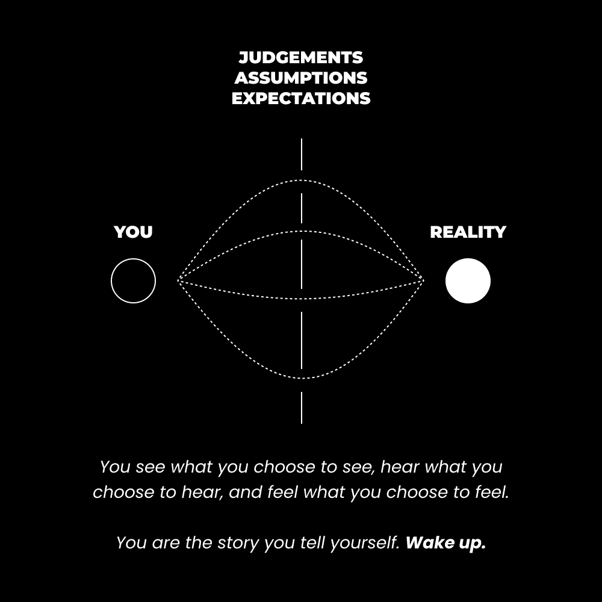

# 高效学习：5 种方法让你学习速度提升 10 倍

在本节课中，我们将探讨如何通过调整心态和方法，将学习效率提升十倍。我们将从理解限制性信念的危害开始，逐步深入到具体的实践步骤，帮助你构建一个开放、高效的学习系统。

## 🧠 模糊感知的危险

上一节我们提到了提升学习效率的潜力，本节中我们来看看阻碍高效学习的第一个障碍：模糊的感知。

专注可以被视为有序的意识，与导致“精神熵”的混乱意识相反。这是确定性与不确定性、对生活的控制感与绝望感之间的区别。可以说，它是幸福的关键。

将你的个人观点或世界观想象成一台单反相机。相机有不同的设置和“编程”，使其能够“看到”世界。当镜头模糊时，你看不清模糊背后的东西，只能猜测和编造故事。这就是感知。

现实中，构成我们世界观的是我们的信仰、偏见、目标、价值观和愿景。信仰和偏见本身不是问题，问题在于缺乏对它们的选择和意识。当它们处于无意识状态时，生存机制就会启动。

> “直到你将无意识变为有意识，它将指引你的生活，而你将称之为命运。” —— C.G. 荣格

生存是日常生活的一部分。但当这些生存机制是无意识的，我们试图保护的是“自我”的概念。我们依附于这些信仰和偏见，仿佛它们就是我们自己。如果你的无意识信念受到挑战，你的注意力就会收缩，感知就会变得模糊。

这是一个需要终身努力的过程，旨在通过接纳和行为改变来认识并整合你的“阴影”。但这里有一个更重要的教训：当你的感知模糊时，你无法看到世界的真实面貌。你会错过生命本身的学习过程。

意识到你的感知可能不准确，是打开学习之门的第一步。

## 🔓 打开你的心扉，拥抱未知

当感知模糊时，你会以机械、自动的方式评判和假设周围的世界。而当感知清晰时，你会以开放、有意识的方式观察和辨别。这是所有高效学习信息的核心。

我们之前讨论过“未知”的概念——一片充满无限潜力的土地。在这里，未知意味着看到现实的本来面目。即，对我们日常意识因条件化感知而忽略的事物保持开放。这不仅仅是擦亮你自己的眼镜，而是能够完全摘下眼镜，并开放地通过任何“镜片”去看。

感知是具有选择性的。现在，问问自己，你在关注什么？是屏幕上的文字。但什么让文字*存在*？是它背后的空白。就像一首歌是一系列音符，但若没有静默的间隔、没有起伏变化，它就只是一长串噪音。宇宙（Universe）也是如此：Uni（一） + Verse（歌曲）。

让我们开始应用这些理念。

## 🛠️ 元技能的元技能

学习是人类的基本驱动力。我们从出生起就在学习。问题在于，我们被条件化地接受了一种一维的、浅薄的生活方式。研究这个，忽略那个。遵循这些目标，而不是你自己的。这导致了人类意识的极化：低意识，高无意识。

我们在这里采取一种非常广泛的学习方法，以生活为背景。就像大多数反映普遍规律的事情一样，它可以应用于任何维度。

以下是五个步骤，帮助你在任何现实领域实现十倍速学习：无论是个人、文化、社会，还是具体情境或对话。

### 第一步：打开你的心扉

这是前提。如果你的心扉对学习本身关闭，你如何能学习？这需要时间和实践。

以社交媒体评论区为例。当有影响力的人发帖时，评论通常分为四类：
1.  出于好奇心提问的人（开放心态）。
2.  根据自身感知做出反应，无法看到言外之意的人（封闭心态）。
3.  为了吸引粉丝而回复的人（商业目的）。
4.  鼓励他人或仅用表情符号回复的人（友善之人）。

第一种心态是开放的。第二种则源于缺乏自我意识。如果我告诉你可以作为个体赚取一百万美元，你的反应是“不可能”，因为你尚未接触那种潜在现实，那么逻辑上的解决方案难道就是永远关闭思维，躲在自己舒适的现实中吗？

反思一下，我的一个目标一直是证明人们的限制性观点（包括我自己的）是错误的。无论好坏，这促使我深入撰写通讯、课程等内容，因为我无法停止学习如何做到这一点。

### 第二步：环境沉浸

当你愿意学习时，依赖任何单一个人提供所有材料是低效的。以社交媒体上关于如何获得六块腹肌的帖子为例。你可能会听到封闭思维的声音：“间歇性禁食？太蠢了！”。

虽然我本人可能与这些具体建议无关，但对一件事关闭思维，就会关闭通往其他可能有益未来道路的大门。以间歇性禁食为例，开放思维为你提供了新视角，进而打开更多可能性。通过收集不同观点，你可以连接信息点，为自己量身定制健康方案。

那些愿意改善健康的人有两条路：
1.  开始向创作者寻求所有答案，期望从一个有自己优先事项的人那里获得相当于五本书的信息。
2.  将自我教育视为己任，在能改善生活的领域深入学习。

在第二种情况下，环境沉浸是关键。这意味着控制或调整你的关注点，以接触与期望结果相关的信息。关注提供不同视角的社交媒体账号、购买书籍、收听播客、与注重健康的朋友交流、报名课程。为了防止信息过载，练习超然和批判性思维。不要将任何建议视为金科玉律。

### 第三步：沉默观察

沉默观察是关于*保持*开放心态以持续学习。在你觉得自己已经学完之后，“关闭”心态很容易。我们的大脑喜欢抓住最能服务“自我”的想法。

如果我听到一个完美的营销饮食建议，我可能轻易接受它作为定律，尝试后看到好结果，并感觉这是对所有人最好的选择——即使它可能对我也不是最佳选择！

### 第四步：连接点

使用这个法则：“如果你不用它，你就会失去它。”

这就是为什么每个人都强调要采取行动。如果你不通过直接经验巩固所学，然后去教导他人，你就是在传播二手信息。你是在重复别人的话，过着没有亲身实践建议的生活。这对你的伤害大于对他人的帮助。

采取行动的方式多种多样，不限于物理行动。你可以写作、思考、冥想，并应用所学。

当你应用所学时，你被迫以自己的方式去做。你会遇到阻力，直到突破为止。当一切“豁然开朗”，出现“啊哈！”时刻时，你会感受到大脑中多巴胺水平的提升，感到兴奋。

只要你沉浸在某个环境中并应用所学，这种现象就会持续。这就是我大量写作的原因——因为我喜欢消费信息以了解更多。我将我的思想、身体和事业视为科学项目。我快速实施并从中获得神经生物学上的益处。

### 第五步：堆积经验

以开放的心态、有利的环境、清晰的观察，以及连接信息点——你的学习将会产生复利效应。当你不固守特定信念时，你的学习速度会快得惊人。

> 复杂性是两种广泛心理过程的产物：分化与整合。分化意味着向独特性发展，将自己与他人区分开来。整合则相反：与他人、与自我之外的思想和实体结合。一个复杂的人是成功结合这些对立倾向的人。 —— 米哈伊·契克森米哈伊

随着时间的推移，你的生活经验将持续累积。你的“自我”将变得更加复杂。你会更享受生活，因为你不需要为自己的观点辩护——你知道存在无限多的其他观点。执着于其中之一是痛苦的根源。

## 📝 总结

本节课中，我们一起学习了如何将学习速度提升十倍的系统方法。我们从认识“模糊感知”的危险开始，明白了开放心态和拥抱未知是高效学习的基础。接着，我们深入探讨了五个核心步骤：**打开心扉**是前提；**环境沉浸**为我们提供了学习的素材；**沉默观察**帮助我们保持吸收状态；**连接点**（即应用与实践）让知识内化；最后，通过**堆积经验**，学习产生复利效应，使我们成为一个更复杂、更具适应性的个体。记住，高效学习不仅关乎技巧，更关乎一种对世界保持好奇、开放和不断整合的生存姿态。