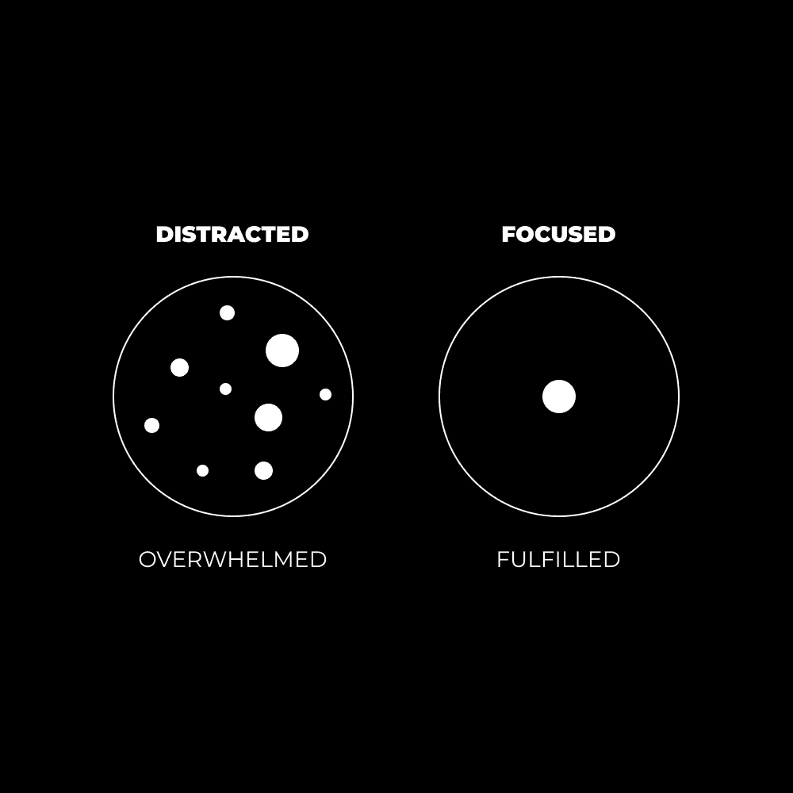

# 专注力课程：为什么你总是感到不知所措

在本节课中，我们将探讨一个普遍存在的感受——不知所措——的根源，并揭示其核心原因在于注意力的分散。我们将学习如何通过控制“意识的内涵”来重获专注，从而提升生活的幸福感与控制感。

---

我观察到一个存在于每个群体中的**共同模式**：

+   成功的企业家
+   开明的灵性大师
+   幸福的已婚夫妇
+   破纪录的运动员

这个模式是什么？

**专注**。

我听说上述每个类别的人都提到，“专注”是他们取得成功、幸福与进步的关键。

在阅读了大量关于效能、幸福、商业、灵性、哲学以及任何与生活享受相关的书籍后……我认为我找到了答案。

享受最大生活乐趣（并附带获得任何事业上的成功）的关键在于：

> 一个人可以通过改变意识的内涵，让自己变得快乐或痛苦，无论“外部”实际发生了什么。 —— 米哈伊·契克森米哈伊

*专注*就是受控的意识。

或者说，关键在于控制“意识的内涵”。

当你的意识内容——即你所关注的事物——能够被积极地理解时，你的生活就会变得积极。

这意味着，如果你努力从任何给定情境中寻求清晰、无偏见的有利认知，你会感到难以置信的轻松。

这也引出了 Leo from Actualized.org 提出的观点：*一切都是意识的幻象*。例如：原子是意识的幻象。这是我们为了理解它而创造的一个标签。这有些形而上学，但建立这种联系很有趣。

通过专注于单一的“意识幻象”，而不是分散在十个幻象之间，我们可以过上快乐、健康和充实的生活。

---

## 意识的内涵

请把你的大脑想象成一台超级计算机。

你处理信息的能力取决于若干因素，但我想特别关注你的“RAM”。

RAM——即“随机存取存储器”——是决定计算机性能的最重要部件之一。

你运行的不同程序、打开的浏览器标签以及正在执行的高性能任务，消耗的RAM越多，你的计算机运行速度就越慢。

这与你的注意力，即你意识中所承载的内容，并无区别。

人类每秒可以处理 **126比特** 的信息。一生中总计约 **1850亿比特**。

大多数人同时运行着多个高需求“程序”，这正在消耗他们有限的创造性能量。

以下是常见的消耗性“程序”：

+   对过去错误的懊悔
+   对未来压力的焦虑
+   想要逃避上述想法的饥饿感或娱乐欲望
+   一种想要打破习惯性生活方式的内心呼喊
+   需要完成的多项优先任务清单
+   本应完成但被遗忘的任务（未闭环事项）

这个列表可以一直延续下去。

现代人的注意力默认分散在无限的方向上。我们生活在压力和接近崩溃的状态中。我们并非以专注、无忧无虑的心态活在当下，恰恰相反。我们生活在一个由分散的注意力所创造的虚假现实中。

当我们的意识内容承载了过多的过去或未来时，混乱便会产生。心智倾向于无序。如果不加控制，我们将失去对生活的掌控感，从而导致不快乐。而掌控感是通过有控制的意识实现的。

即，**专注**。

---

## 重获专注力的八个步骤

要打破我们机械化的生活方式，首先必须认识到它对我们的生活造成了何种影响。

为了从混乱回归有序，我们必须将注意力重新集中，并选择值得关注的事物。

我们消耗的“RAM”越少——我们的专注力越集中——生活就越愉快。秩序得以恢复，对生活的掌控感带来了深刻的满足。

上一节我们探讨了注意力分散如何导致失控感，本节中我们来看看如何通过八个具体步骤来系统地重获专注力。

### 1) 选择一个落后的生活领域

我们的整体力量取决于最薄弱的环节。那个落后最多的领域，往往拥有最容易摘取的果实，也是造成最多问题的领域。

请思考：我生活的哪个领域持续带来问题？如果解决了它，你的生活质量将实现飞跃。

是金钱？约会？心理健康？自尊？社交生活？还是健康与能量水平？散步、沉思，然后选择一个领域，当它被解决时，结果会在你生活的其他方面产生连锁反应。

为了本文的目的，也鉴于这是许多人的共同问题，让我们以***金钱***作为一个落后领域的例子。

### 2) 清晰理解基本原理

这里需要做一个区分：

+   **基础**：原则或基本原理
+   **战术**：技巧和技术细节。

基本原理驱动结果。技术细节可以进一步优化结果，但前提是基本原理已被掌握、系统化并养成习惯。

基本原理移动杠杆。技术细节则提供了陷入困境、不堪重负和制造不存在问题的机会。

以我们的关注领域——金钱为例，你需要**流量**和**价值主张**。这是获取你想要之物的普遍原则。

如果你没有流量（即无人看到你的产品）：
+   社交媒体受众
+   付费广告或推广
+   社区或团体
+   有机搜索结果
+   直接接触（例如，冷邮件）

如果你没有一份令人信服的价值主张（即没有可售卖之物）：
+   数字或实体产品
+   自由职业或咨询服务
+   团体课程或在线辅导
+   会员服务或社区

这就像在约会市场中。如果你是一个高价值的“产品”，但将自己置于没有“流量”的环境中，那么成功的机会渺茫。

### 3) 设定一个基于能力的目标

关注外表、粉丝数、互动量或伴侣魅力本身并无不妥。它们各有其场景和益处。我建议你可以关注这些，但不要将其作为主要焦点。

**问题在于**：基于虚荣的目标比基于能力的目标更容易超出我们的控制。

这些步骤并非完全线性，除非你了解每天可以采取的、能移动杠杆的具体行动，否则很难设定基于能力的目标。

在我们的例子中，如果我想建立受众（流量）并销售数字产品（价值主张）来赚钱，你需要执行以下杠杆行动：

+   每天写3篇短帖（例如推文）
+   每周写1篇长文（例如通讯/博客）
+   将长文浓缩成一篇中等长度的帖子（例如LinkedIn长帖）
+   每天花30-60分钟为你的数字产品设计课程

在这种情况下，你可以设定一个目标：**每天写1000个高质量的字**，并评估你的写作过程本身（而非由此产生的结果）。

过程重于结果。

说到写作，这正是我们将在[《2小时作家》](https://2hourwriter.com)课程中深入探讨的内容。

### 4) 在行动中自我教育

基础知识能帮你起步，但你需要学习如何将这些知识应用到你的具体情境中。

太多人陷入了“教程地狱”，试图吸收尽可能多的信息，却从未真正开始。

正确的做法是：
+   快速开始并快速失败
+   确定导致失败的原因
+   寻找具体信息来克服它
+   再次失败，并让经验随时间累积

不要在开始前试图弄清一切。这被称为“精神手淫”。

### 5) 每天预留30-60分钟深度时间

深度工作不仅适用于事业，也适用于你生活的每个领域。

当企业家想在事业上进步时，他们会投入时间和精力。
当已婚夫妇想改善关系时，他们会为彼此预留时间。
当个人想提升心智时，他们会花时间独处并进行意识训练——比如冥想。

*必须创造出无干扰的时间，这样无论面对哪个生活领域，当需要投入“深度工作”时，你的注意力才不会分散。*

### 6) 沉浸于目标内容中

对于追求灵性成长的人，这被称为“临在”。
对于其他人，这被称为“投入”并进入某种程度的“心流”状态。

回想一下当你刷社交媒体时，你是如何全神贯注于手机的。营销人员和科技公司有专门的团队，致力于通过捕捉注意力来触发一种伪心流状态。

当你被手机吸引时，你的注意力就无法集中于其他事物。大多数人用此来逃避现实，而非深入挖掘现实本身。

如果你的目标与人际关系相关，请练习将注意力完全集中在对方身上：他们的身体、动作、言语。运用你所有的感官去感受当下，并让它成为你意识的焦点。

### 7) 识别并重置时刻

做到这些并非易事。你会失败。事情本就如此。

一个干扰会闯入你的意识，你的注意力会分散，你可能会被干扰引发的负面情绪带走。

此时，只需要一个**识别时刻**，你就能从这种状态中解脱出来。

无论是抱怨艰苦的训练，还是因为预设的身份而害怕接近新人。

暂停，认识到你正在抗拒现实，然后让一切顺其自然。

你对现实的期望并不等于现实本身。

它“不应该是”你“认为”它应该的样子。

“它应该就是它现在的样子。”

### 8) 进行持续的“肌肉”锻炼

任何事物都像肌肉。

你的注意力、人际关系、事业、健身、精神实践以及任何类型的习惯。它们通过关注、充足的能量支持（用于表现和恢复）以及直接经验而成长，这样你就能加倍投入于对你**有效**的事情。

不要期望快速的结果。即使有“类固醇”（如课程、辅导、方法论和系统），你仍然需要付出努力。你不能注射一些睾酮，然后坐在沙发上，就指望成为下一个罗尼·科尔曼。

将你生活的每个领域都当作一个科学项目来对待：

+   识别问题
+   设定期望结果
+   测试不同解决方案
+   找到适合你的方法
+   复制成功结果

在此基础上，持续锻炼“肌肉”，朝着你期望的结果前进。届时，你将拥有足够的经验来判断自己是想要增肌、减脂，还是维持现状。

— Dan Koe

---

**本周动态**

我的新课程《2小时作家》预售情况良好。它将于27日正式上线，目前已有150多名学生期待课程内容发布。

如果你想学习一项能提升你内容创作、销售、价值感知及任何其他可销售技能的技能，[请点击此处查看](https://2hourwriter.com)。

我的YouTube频道新发布了一段视频，介绍了我实现轻松高效生产力的三步框架。

[点击此处观看](https://youtu.be/qdXFeyzq7HE)。

我们下周将在Modern Mastery社区内部举办一场关于饮食与生活方式的研讨会。目标是帮助每个人为自己的健康目标（无论是增肌、减脂、提升工作能量，还是以可持续的方式改善外貌）创建专属系统。

[Koe Letters的读者可以以5美元价格加入](https://modernmastery.co/letter)。

---

本节课中，我们一起学习了“不知所措”的根源在于注意力分散，并深入探讨了“意识的内涵”这一核心概念。通过理解专注是受控的意识，我们掌握了重获专注力的八个具体步骤：从选择落后领域、理解基本原理、设定能力目标，到在行动中学习、预留深度时间、沉浸目标、识别重置时刻，以及进行持续锻炼。记住，掌控注意力就是掌控生活的开始。