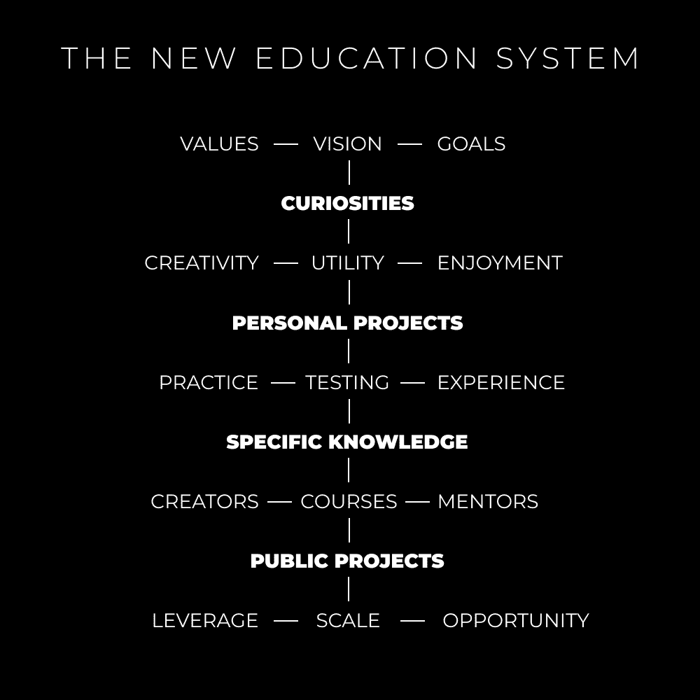
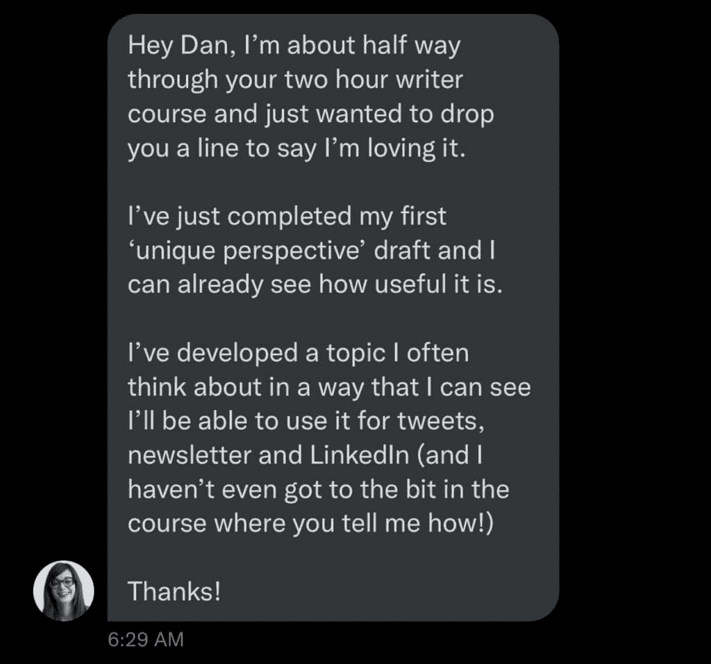
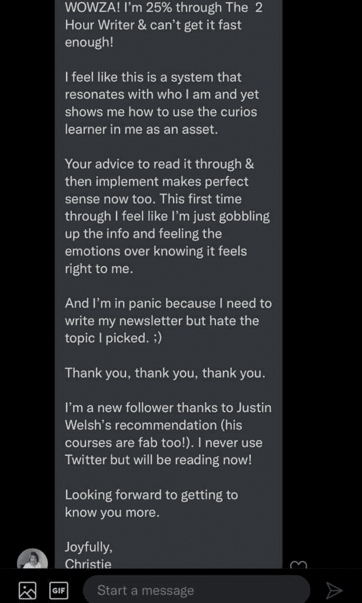

# 掌控人生：如何获得你想要的生活

在本教程中，我们将探讨如何摆脱传统教育和工作模式的束缚，通过自我教育、技能构建和项目实践，主动创造并获取你真正想要的生活。我们将分析现有体系的局限，并提供一个清晰的五步行动框架。

## 传统教育的局限与个人选择

现代教育体系的核心目标是**将人们培训成可替代的雇员**。

在进入大学之前，我就意识到，即使获得学位并找到一份“合适”的工作，也并非人生的终点。若想赚取足够的金钱以解决财务困扰，通常面临两个选择：

**选项 1：攀登企业阶梯**
*   用个人技能为他人构建业务。
*   为获取更高薪水，牺牲个人欲望与时间。

**选项 2：创造自己的阶梯**
*   用个人技能建立自己的业务。
*   为实现个人目标，牺牲闲暇时间。

当然，这是一种概括。我已自雇三到四年，对许多事情看法不同。据我观察，极少有工作能提供自雇所带来的益处，例如：充足的休息、追求内在目标层次、避免长时间面对人造蓝光、追求精通带来的深刻满足感等。

为了换取可预测的收入，人类心理、健康和自我实现这些**基本需求**常常被置于次要地位。当真正的多巴胺来源于追求自身生存、实现自我设定目标以及在所选技能上达到精通时，为他人目标而工作便显得缺乏意义。

## 互联网时代的公平竞争与自我赋能

**互联网已经使竞争环境更加公平**。

各个经验水平的人都在解决自身问题、学习新技能，并以吸引人的方式在线分享成果。这种做法一举多得：
*   通过实践学习建立高杠杆技能（如写作、说服等与品牌建设相关的可销售技能）。
*   建立数字杠杆（追随者、人际网络、永久存在的数字资产）。
*   研究真正感兴趣的方向（并通过整理和发布想法来深化理解）。
*   帮助落后自己一两步的人（因为人们正对“系统”失去信任，更希望向真实的人学习）。

现代教育形态正在我们眼前演变。如同比特币一样，教育将继续去中心化。创作者成为新的教师，消费者成为新的学生。

## 🏛️ 新的教育体系：回归本质

上一节我们探讨了外部环境的变化，本节我们将审视教育体系本身。旧的教育体系存在于政府办学之前，我们向父母、社区和经验学习。作为没有预设路径的人类，我们本应追求好奇心，从经验中学习，并寻找能加速我们独特旅程的导师。

然而，现状已被颠倒。从小我们就被训练成：
*   取悦他人，并接受基于表现的评分（而非真正学到什么）。
*   满足社会的需求与欲望（因为接受他人意识形态比创造自己的生活方式更容易）。
*   将思维限制在“这就是全部了吗？”的怀疑中。

这导致了一条固定路径：上学、听从指令、获得学位、被训练成可替代的工作、拥有决定社会价值的固定收入……且不质疑任何事。

新的教育体系不依赖于社会，它依赖于你。**自我教育是答案**，而无人知晓如何自我教育，这正是关键所在。

## 🧭 五步掌握自我教育法

我们尚未进入另一个文艺复兴时代。思想、信息和建议无处不在，同时人们正失去对宗教、政府和强加意识形态的信任，这导致了普遍的焦虑与无序。过去，外部体系为我们提供了秩序和目标，现在我们必须亲自动手。以下是具体方法：

**第一步：认识自己**
如果你不清楚自己想要什么，那就先明确你不想要什么，然后朝相反方向努力。花一周时间思考你的**愿景、目标和价值观**，并将其内化为行动指南。

**第二步：追求你的好奇心**
评估你感兴趣事物的三个潜在价值：
*   **实用性**：能否解决实际问题或创造收入？
*   **创造性**：能否表达自我或创新？
*   **愉悦性**：过程本身是否带来快乐？

你应构建的是**技能组合**，而非单一技能。例如，若你热爱艺术，还需学习写作、营销、销售等技能，为你的艺术赋予实用价值，帮助他人获得他们想要的。

**第三步：启动一个个人项目**
项目具有强大力量：
1.  它将你从“教程地狱”（无休止被动学习）中解救出来。
2.  它迫使你构建在现实世界中可运行的东西。
3.  它教你追寻健康的多巴胺来源——通过进步、专注和创造性能量。

例如：开始撰写一份**新闻通讯**以锻炼写作；为你设想的品牌创建横幅，从而学习设计工具；将那个“百万美元”应用想法付诸实践。关键在于**构建**，而非空想。

**第四步：寻求具体知识**
在开始前试图学会一切只会拖延进程。**先构建，后学习**。当项目遇到障碍时，再去寻找具体解决方案：购买课程、观看教程、提出具体问题、加入社区。这就是新教育体系的魅力：所需信息已然存在，你只需通过实践发现问题，然后精准查找。

**第五步：公开你的项目**
互联网为每个人提供了建立杠杆的机会：
*   创建个人网站。
*   在社交媒体上写作并分享知识。
*   建立受众并实现变现。
*   托管、管理和分发你的项目。

关键一点是：如果没有支持者，你很难因热爱之事获得报酬。在公开场合构建项目，谈论你的旅程，激励他人，并收集使其成功的必要反馈。记住，没有反馈也是一种反馈。

## 总结

本节课我们一起学习了如何主动塑造人生。我们分析了传统路径的局限，认识到互联网带来的新机遇。核心在于通过**自我认知、好奇驱动、项目实践、针对性学习和公开构建**这五个步骤，掌握自我教育的能力，从而创造并获取你真正渴望的生活。记住，杠杆在于你的技能组合和公开分享的勇气。