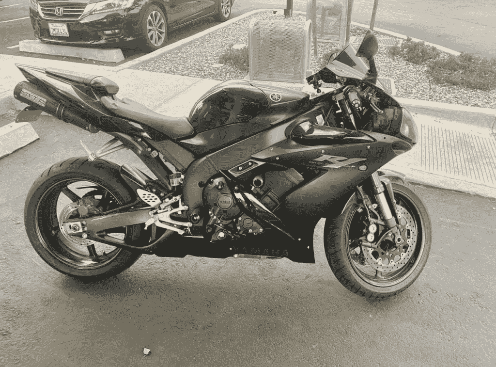
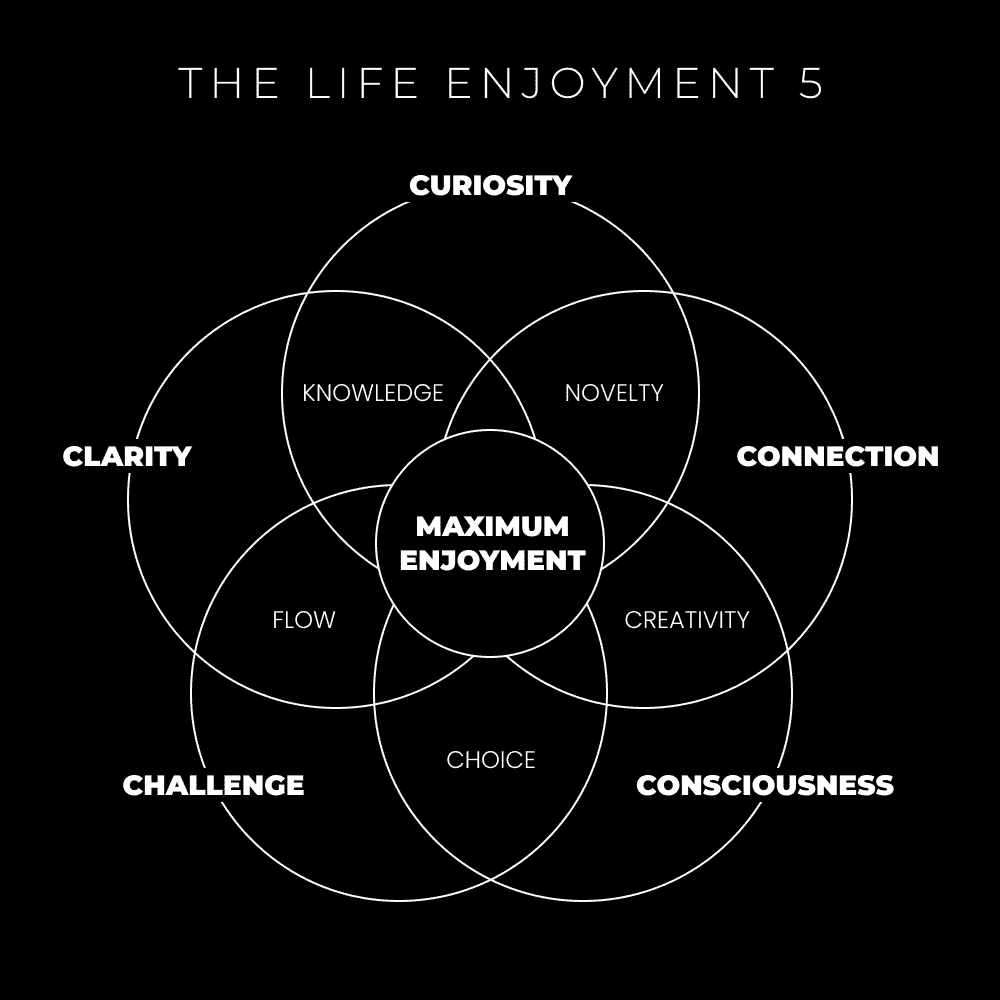

# 生活与学习：为什么你不能享受生活

在本节课中，我们将探讨一个核心问题：为什么许多人难以享受生活。我们将通过一个关于摩托车的个人故事引入，并深入分析现代教育体系与人类天性的冲突，最终揭示通过“学习”和“生活的五个享受”来提升生活深度与满足感的方法。

## 学习的重要性

上一节我们通过摩托车的例子引入了话题，本节中我们来看看“学习”在生活中的根本作用。

我对现代教育体系持有一些批评意见。它确实有其优点，例如确保社会成员对基本运作方式有共同理解。然而，从顺应自然天性生活的角度来看，它并非一个完美的方案。现代教育体系常常与我们的生存本能心理相悖。它促使我们去“学习”、记忆，并训练我们从事与个人内在学习和记忆动力无关的职业。此外，大规模的教育体系难以跟上数字经济指数级发展的速度。最终，只有那些懂得追随好奇心、快速学习并实现“工具独立”的人才能脱颖而出。

顺应你的天性——即你的生存本能大脑——你将开始收获益处。

**学习是你在生活中变得更清醒、更有意识、更有技能的方法。**

当你初次接触一款新游戏时，你会经历以下过程：
*   了解游戏规则。
*   熟悉操作机制和控制系统。
*   学习如何赢得游戏。

你好奇这款游戏能带来多少乐趣。你可能会观看教程视频或阅读规则手册。作为一级玩家，你测试自己的极限，并很快意识到还有很长的路要走。你开始自问：
*   这款游戏适合我吗？
*   它真的值得我投入时间吗？
*   玩这款游戏我会感到快乐吗？
*   我的朋友们在玩吗？
*   世界上有多少人在玩？
*   这会消耗多少时间、金钱和其他资源？

提问是评估是否应将这项新活动纳入生活的方法。你还有其他事情要做。你有日常安排、生活方式、社交活动、习惯、杂务，以及其他可能因持续玩游戏而受影响的事务。如果玩那款特定的游戏，看起来并不比你正在进行的其他活动更有趣、更有价值，那你为何要让它成为你生活的常态呢？许多人正是在此处停滞不前。他们在第一级时就放弃了游戏。

### 学习是你揭示生活所提供深度的方法。

当你刚开始学习一款游戏（或在生活中尝试新事物）时，你可能并不喜欢它。它可能对你尚无意义。例如，你可能“讨厌”在周日陪妻子去古董店购物。并非你真的讨厌它，而是你不理解它。对你而言，这更像是一种麻烦，而非游戏。你看到的只是无聊的旧物，它们在你的生活中似乎毫无作用。

然而，对你的妻子而言，逛古董店则是一场有趣的游戏，她是其中的高级玩家。
*   她享受在古董店寻找“隐藏珍宝”的乐趣。
*   她对历史有足够理解，能够欣赏古董。
*   她的父亲曾是木匠，看到摇椅会让她想起他。

她对深入探索游戏的内部运作感到**好奇**。她通过经验对如何玩游戏有**清晰**的认识。她能将她所看到的与其他过往或潜在的经历**连接**起来。她在心中虚构了一个**挑战**，以便在那天投入游戏。她提升自己的**意识**，看到了游戏所呈现的相互关联的网络。

但你……你甚至还未开始玩。你不将其视为游戏。你只专注于冰山一角，并假设水下的一切都毫无用处。你没有给自己机会去发现你的“为什么”。如果总是浅尝辄止，你将无法看到生活的全貌，那只是一种肤浅的存在。

*在离开教程之前，你可能就想放弃。*
在第一级，你只能假设或预测更高级别中存在什么。在第一百级，你对下面的层级拥有鸟瞰般的视野。

## 做任何你想做的事的艺术

每当我谈论“做你想做的事”时，总会得到类似的回应。
*“你是说如果我想从桥上跳下去，就应该跳吗？？？”*
*“你是说如果我想成为下一个希特勒，就应该去做吗？”*
*“你是说如果人们是大规模杀人犯，那也没关系吗？！！”*

请清醒过来。停止这种思维。运用一点常识，批判性地思考你所说的话。*这引出了有意识生活与无意识生活的区别。*

如果你意识到“成为下一个希特勒”会带来的广泛影响，你就不会想这样做。如果你无论如何还是做了，那也好，这样你才能认识到自己的盲点并努力改变。如果你意识到自己的不道德行为及其如何破坏集体系统的平衡，你就会努力改正。如果你有意识，你会*想要*改进……

### 做你想做的事，就是按照自然规律生活。

从心理学角度看，这一点已被充分研究。我想到两个最喜爱的模型：史蒂文·科特勒的五个内在驱动因素，以及米哈里·契克森米哈赖的“心流”模型。我们之前已多次讨论，此处不再赘述。

简而言之，有具体的方法可以操纵你的注意力或调整焦点，以获得更丰富的体验。多巴胺、肾上腺素和去甲肾上腺素等化学物质会涌入大脑，奖励你源自本性的追求。
*   发展你的技能组合。
*   精通你的技艺。
*   追求*你的*愿景。
*   为*你的*目标而努力。
*   按照一套价值观生活。
*   活在当下。
*   为生存而“狩猎”（例如创业）。
*   运用你的创造力（自然界本就是富有创造力的）。
*   提升你的意识水平（如同游戏经验值）。

每个人都有一种追求更高版本自我的“拉力”。

> 比追求最高版本的自己更痛苦的事，就是不去追求最高版本的自己。
> — 丹·科 (@thedankoe) [2021年2月6日](https://twitter.com/thedankoe/status/1357983425760817154?ref_src=twsrc%5Etfw)

当你追随好奇心、满足基本需求、获得一定程度的行动自由并持续进步时，你会在心理上获得奖励。这感觉很好。冲破挣扎的战壕。克服挑战。在生活不断展开的故事中赢得战斗。登上山顶。感受一首歌中的能量。万变不离其宗。推与拉。无为。阴与阳。生活的周期、章节、阶段。生活模仿自然，顺应它。

另一种说法是：系统存在缺陷，因此要学习系统，以便你能在其中灵活操作，朝着最佳结果前进。不要恨玩家，要恨游戏。（划掉，不要恨游戏，要*欣赏*它）

## 生活的5个享受

让我们回到摩托车的话题。我一直非常关注我的室友是如何学习骑摩托车的。在注意到好奇心和清晰阶段之后——我开始观察到更多。

这份通讯最初是关于学习的。但我决定（就在此刻）转向讨论“享受”（学习带来的结果）。我开始构建一个与“创造金字塔”完美契合的元概念。它融合了我在灵性、心理和哲学教导中发现的、关于生活享受的交叉点。不仅偶尔，而且可以按需获得。也就是说，一旦你理解了系统的各个部分、游戏的各个方面。

我称之为“生活享受五要素”（Life Enjoyment 5， LE5）。

享受的五个“C”既是工具，也是迹象。你可以使用并组合它们来增加你对日常生活的享受。或者，当你在做真正喜欢的事情时，你可以意识到它们的存在。

这让我想起了埃克哈特·托利的三种行动模式：
1.  接受
2.  享受
3.  热情

这些是在任何情况下保持内心平和的绝佳工具——但关键在于……每种情况带来的变量截然不同。我喜欢埃克哈特，他的模式对我有帮助，但还有更多内容。我以此为目的来构建和创造他的工作（以及其他人的），以带来一个更强大的概念。一个让你意识到生活所能提供的深度和机会的概念。

LE5不是线性的，它们像自然发生一样出现，没有固定顺序。

**好奇心**
你被什么所吸引想去尝试？当你感到被吸引时，哪些限制性信念会浮现？在此处暂停并提问。不要让你的“猴子大脑”认为你的生存受到威胁。*信念的消亡并非死亡本身——即使感觉惊人地相似。*
提问是你开辟新的心理探索路径的方式。提问是你通过深入无限之洞来扩展意识的方式。提问是你决定接下来需要自我教育内容的方式。
起初这可能很困难，但通常由以下问题触发：
“如果……”
如果我学会了这项技能？
如果我无论如何都要去旅行呢？
如果我承诺开始那项业务？
当我们去买摩托车时，我们沉浸在所有不同的型号、它们的目的以及微小的差异中。我们都很好奇。如果我们拥有这种新的交通方式，我们的生活将会是什么样子？这引发了许多其他问题，这些问题开始与其他LE5要素联系起来。正如你所猜，这开启了一个新的世界去探索和体验（不仅仅是路上的）。我们遇到了骑摩托车的新朋友，有效地扩大了我们在奥斯汀的高质量人际网络。我们感到有必要去探索小径，走进大自然。清单还在继续。

**清晰**
大多数现代问题的根源在于缺乏清晰。焦虑、不确定性、固定型思维、思想狭隘等都源于清晰度的缺失。

> 你想要什么（目标）
> 如何到达那里（清晰）
> 你为什么想要（意图）
> 当这三件事到位时，你的行动选择变得无缝。
> — 丹·科 (@thedankoe) [2021年12月6日](https://twitter.com/thedankoe/status/1467865674932445194?ref_src=twsrc%5Etfw)

这值得用一整篇文章来阐述，并且是“创造金字塔”、一般创造力以及智能模仿的支柱。
以摩托车为例，过程如下：
*   沉浸
*   模仿
*   创新
德凡（和我一起买摩托车的编辑）从我这里获得了几样东西：
*   教育——我带他进行了摩托车游戏教程（基础、机械和/或骑行的基本原理）。
*   教练——我在他骑车时揭示了他的盲点。我帮助他在问题出现时解决问题。
*   资源——我给了他其他“导师”去学习，以及阅读材料来加速他的学习。
无论你是学习一项新技能还是纠结于一项具体任务……清晰度归结为结构、信息和“屈服”。
信息丰富且可能令人不知所措，但又是必要的。结构化这些信息（或对意识进行排序）是你开始“勾勒谜题轮廓”的方式。“屈服”和休息通常会将一切整合在一起。
就像一位作家想出了15个标题，放下笔，去泳池边放松（这确实是常有的事，大多数作家在休息时完成大部分工作）。或者程序员无法找出一个错误，但在洗澡时突然想到了完美的解决方案。
这同样适用于摩托车，但“屈服”的方面在更长期的承诺中发挥作用，例如创业、自我提升、充分利用生活等。

**连接**
心理学中有一个现象叫模式识别。还有自我发展的“构建意识”阶段，以及整体系统思维。连接源于能够放大视野、看到大局、识别模式、模型、结构和联系的能力。这最好用“啊哈！”时刻（或一系列这样的时刻）来体现。
与好奇心一样，连接能提高大脑中的多巴胺水平。*这会激发兴奋感。*它让你想分享所学。大多数时候，你忍不住要告诉每个人你的新摩托车以及你学到的所有关于它的知识。
参考史蒂文·科特勒的五个内在驱动因素，连接也可以从*目的和热情*的角度来审视。当你将正在学习的内容与现实世界中具有实用性的其他事物联系起来时，你开始培养对新技能所持目的的热情。（例如解决世界上的大问题、开始创业，或直接应用于你现在的生活）。

**挑战**
挑战是系统的一部分。挑战是推动你进入心流状态的因素。挑战是消除无聊的东西。我们作为一个社会非常害怕接受新的挑战，因为它们威胁到我们被训练成习惯的舒适感。
如果你的工作、生活或自我没有在持续挑战你，我可以向你保证，你的生活不会很有趣。我还可以保证，你没有取得很大的进步。这再次突出了持续自我反思和设定新目标的重要性。
*   设定一个具有挑战性的目标。
*   通过将其分解成更小的目标来获得清晰度。
*   通过将你生活的各个方面（思想、身体、精神、商业）与这些目标对齐来有意识地行动。
如果你感到焦虑或开始过度思考，你需要清晰度。你需要学习、练习和教学，以增加围绕该目标的技能。如果你感到无聊或对当前任务不感兴趣，你需要设定与你的技能相匹配的新目标。

**意识**
在接下来的几周里，我们将更多地讨论意识。意识关乎深度和欣赏。*爱*。现在，开始看到表面之下。承担理解所有给定情况所呈现的*联系*的*挑战*，以了解所有情况（这样你就能获得*清晰度*）。
当大多数人将摩托车视为无目的的死亡机器时——你可以选择超越这一点，打破你对生活的无意识、条件化的情感反应。深入挖掘。欣赏创造那辆摩托车所经历的整个过程。欣赏它为骑手带来的机会。欣赏人们选择玩的游戏。
通过将你所看到的内容分解成更小的部分来寻求理解。然后进一步分解。严肃地说，停止你正在做的事情，想想摩托车，然后开始向下剖析和向上构建。用你的思想将摩托车剖析成它的各个部分，这些部分从何而来，谁参与了其中，并继续深入挖掘，直到你达到我们用来构建物理材料的基本元素。用你的思想构建一个潜在的现实，如果涉及到摩托车，这将有利于你的愿景。你能遇到新的人吗？你能将一项新的爱好融入你的生活吗？
如果你是受无意识思维模式束缚的奴隶，这几乎是不可能的，这些思维模式使你的思想变得封闭和狭隘。在日常生活中继续进行这种剖析和构建过程。你可以用任何东西来做这件事。（即使是你正在看的屏幕）。任何东西。
你认为我是如何*创造*内容的？你认为我是如何通过非常规方法*创造*收入的？你认为任何人通常是如何*创造*的吗？停下来，深入挖掘，并欣赏。提升你的意识。剖析和构建。*思考*。

**你可以使用LE5来识别、理解和解决多个领域的问题，运用我们刚刚讨论的一切。**
这很难理解，直到亲身体验。我的建议：
*   将LE5图形保存到你的手机上。
*   研究它的各个部分，让你的好奇心自由驰骋。（剖析和构建——创造）
*   当你在学习时，开始注意这个概念的不同方面。
*   注意你的感受，并质疑你为什么会有那样的感受。
这将帮助你更深入地了解自己，并开始复制那些积极的结果。
当你发现自己处于不良情绪中时，利用LE5的优势：
*   询问你为什么会有不良情绪（好奇心）
*   设定一个目标来逆转不良情绪（挑战）
*   逆向工程它，以便你知道要学习什么（清晰性）
*   当你学习时，观察你发现新事物时心中充满的兴奋（连接）
*   在整个过程中保持清醒（意识）。

这是一个宏大的话题，我们将继续应用、剖析、构建和理解。

本节课中，我们一起探讨了为何难以享受生活，分析了现代教育与天性的冲突，并深入介绍了通过“学习”和“生活的五个享受”（好奇心、清晰、连接、挑战、意识）来提升生活深度与满足感的具体方法。记住，深入挖掘、持续学习并顺应你的本性，是获得丰富生活体验的关键。