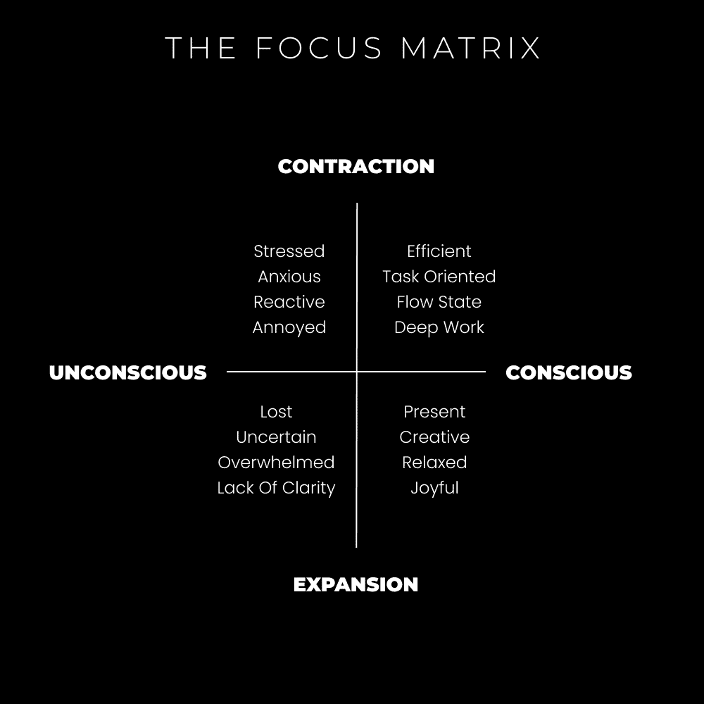

# 专注力掌控：专注的艺术与深度

在本节课中，我们将学习如何理解并掌握专注力。我们将探讨专注的本质，它如何影响我们的生活，以及如何通过有意识的练习来深化我们的专注能力，从而提升创造力、效率和生活体验。

***

我最喜欢的书之一是戴维·迪埃达的《卓越男性的道路》。大卫对现代男性气质提出了变革性的想法。他为围绕它的误解带来了独特的见解，并采用了一种精神层面的关系方法。我最欣赏戴维的一点是他的写作风格。他的写作有些不同寻常。其中一些内容在逻辑上可能并不直接，但依然能引发共鸣。可以看出，迪埃达不是仅用头脑写作，更是用心在写作。他不仅在谈论精神层面的话语，更是在实践（或书写）精神层面的行动。

他通过沉浸于当下，从最深层的源泉中汲取灵感。这种灵感来自与无限、上帝、宇宙或更高智慧的连接，是一种全然清醒的状态。迪埃达的写作仿佛悬浮在物质世界之上几英尺。他是在描绘一幅画，遵循“展示，而非讲述”的原则。他试图通过描述感受，而非单纯解释概念，来传达他的直接体验。

这让我对写作本身有了很多领悟。当我能够不受干扰地坐下来，全神贯注，让那些可能对理性思维没有直接意义的词语自然流淌时，我写得最好。思考的过程被降到最低，直接从源头呈现到屏幕上。

那么，是什么阻止人们达到这种状态呢？让我们引用阿兰·瓦茨的话来设定场景。

> 人类意识既是意识、敏感性和理解的一种形式，同时也是一种无知的形式。我们拥有的普通日常意识所省略的比它所吸收的要多。因此，它省略了一些非常重要的事情。它省略了如果我们知道它们，就会减轻我们的焦虑、恐惧和恐怖的事情。如果我们能够扩展我们的意识，包括我们省略的那些事情，我们就会有一个深刻的内心部分，因为我们都会知道你必须不知道的一件事……什么是深刻的，什么是神秘的，什么是深处的。
> 
> —— 阿兰·瓦茨

就像迪埃达一样，瓦茨在描述他在人类意识“深处”所看到的东西。让我们深入探讨这一点。或许这能帮助我们所有人成为更好的写作者，并开启我们人类生活的新维度。

*提示：* 本节内容偏向精神或哲学层面。建议你以开放的心态和好奇心阅读，旨在理解而非评判。

***

## 专注力掌控：02：专注矩阵

上一节我们介绍了专注力的深层含义，本节中我们来看看一个理解专注力的框架——“专注矩阵”。

我正在撰写《专注的艺术》一书，目的是让人们接触到我们常常忽视的专注力的深度。正因为如此，人们对专注的理解往往非常片面。大多数人仅仅从表面层面“看到”它，并就此止步。尤其是在自我提升领域，很多人只把它视为偶尔用于深度工作的工具。事实上，专注是我们生活的全部。

> 你会惊讶，在 1 小时的专注无间断中你能完成多少事情。
> 
> — DAN KOE (@thedankoe) 2022 年 6 月 25 日

学习如何进入深度专注工作是一种强大的方式，可以介绍如何利用注意力的力量。

+   你可以在 2 小时内完成 8 小时的工作。
+   你可以更有效地利用一天中有限的能量。
+   你可以养成在目标上取得巨大进步的习惯。

这些我们已经讨论过。但上面那条推文所指的，不仅仅是“专注工作”，而是“专注”本身。让我们深入探讨。

在我的定义中：
*   **专注**是意识的注意。
*   **意识**是人类经验的本质。
*   **注意力**是我们处理无限意识领域内信息的方式。
*   **专注**是你如何操纵你的注意力，将现实导向最佳结果。

在我的书中，我提出了一个贯穿我生活的总体元概念，称为“三支柱”。

**I: 专注**
你的愿景、目标、目标层次（使命）和优先行动是专注的锚点。这些“锚点”必须被培养、精炼和定期审视，以提供持续的内在能量。

**II: 能量**
当你有了重要的事情要投入时间和注意力时，其他所有事情都必须围绕它来组织。这包括所有输入：食物、思想、金钱、信息等。你遇到的每一个刺激，要么有助于你的未来（包括集体影响），要么就应该被忽略。你可以通过调整对这些特定实体的关注程度来“进入”它们的能量水平。例如，当一个负面想法出现时，你可以通过极性思维将其转化为积极的体验。

**III: 经验**
准确的专注力和开放的能量通道，让你能够从当下的直接意识经验中行动。也就是说，你将你的专注力锚定在当下。当与源头连接时，你“给予你的礼物”或“与世界为敌”，正如迪埃达所说，用你全部的能力，毫无保留。这会影响世界的思想和心灵，从而影响集体意识和心灵。

从写作或沟通的角度考虑：迪埃达在他的写作中完全“给予他的礼物”，处于当下。他鼓励你在与世界沟通和互动时也完全给予你的礼物。

这当然只是冰山一角。需要一整本书来解释。对于那些想知道的人，它将在未来发布。

***

## 专注力掌控：03：专注的收缩与扩张

上一节我们介绍了专注矩阵，本节中我们来看看专注力的核心动态：收缩与扩张。

焦点的收缩和扩张是你过上有意义、快乐和进步生活的方式。这是一种艺术形式。无论情况对未经训练的眼睛来说显得多么“负面”，一切皆源于心。

*   狭窄、无意识的专注会导致压力、焦虑、反应性和烦恼。例如，当你过度关注未来的压力事件时，很容易将那种未来的体验拉入你的当前体验。
*   开放、无意识的专注会导致感到迷失和对自己的生活方向感到不知所措。例如，虽然有任务和目标，但如果没有被有意识地观察和管理，它们也可能触发杂乱的想法和情绪。

有意识的专注——无论是狭窄的还是开放的——在整个生命中都有其用途。但我想重点介绍一个彻底改变了我导航现实的方式：**深度、欣赏和爱**。

请暂时放下标签、判断和反应。当我挑战你的思维方式时，请打开你的心扉，超越文字本身。

***

## 专注力掌控：04：无限的觉知

上一节我们探讨了专注的两种模式，本节中我们来理解人类独有的能力：对无限觉知的深度专注。

最明显将人类与其他物种区分开来的东西之一，就是专注的深度——即扩张与收缩的能力。

*   **扩张**意味着广泛的注意力区域。
*   **收缩**意味着小的注意力区域。

这就像一个根据你直接意识到的内容而变大或变小的圆圈。专注是人们常常忽视的最重要技能。它是不可触摸的、非物质的，几乎无法准确量化。因此，以及由于其他原因，大多数人都处于一种“睡眠”状态，过着预先编程的无意识生活。

有意识地活着是更深的一层。通过实践，你可以在一个全新的维度中享受生活。

什么阻止人们进入这个新维度？想象一下冰山的尖端。它位于水面之上。现在想象一下，这个冰山可以是你在现实中接触到的任何东西。无限的冰山构成了现实的纹理。

一个想法、情绪、物体、声音……任何你能通过感官直接意识到的东西。这就是大多数人生活的方式。他们只看到表面，而忘记了深度、理解和生命本身的相互依存性。

你如何深入探索？通过有意识的注意力和意识。

以下是几个思考练习：
1.  你能否意识到你的手机正在发出的电磁频率？不是要求你看到或感受到，而是意识到它们的存在。
2.  你能否意识到你手中的咖啡？它的化学成分是什么？涉及了哪些人的劳动？
3.  你能否看到在这个过程中，你是如何专注于一个特定的意识片段的？你可以将咖啡与杯子分开，将分子与液体分开。

通过扩展和收缩你的注意力，你对无限的认识就会增多或减少。就像开车一样，有时你放松地享受，有时你需要高度集中以应对突发状况。通过掌握你的专注力，你可以在生活中更好地导航、欣赏并茁壮成长。

***

## 专注力掌控：05：思考练习——探索未知

上一节我们讨论了无限觉知，本节中我们通过一个具体的思考练习来探索专注力的应用。

我们经常谈论“未知”的概念。这是一个黑暗、可怕的地方，却蕴藏着无限的机会。在你感知的现实之下，还有一层。

让我们做一个思考练习：
*   **想象**你的自我就像你存在所持有的手电筒。
*   **想象**手电筒发出的光束是你的感知。
*   **想象**你的生活是你通过手电筒照亮而直接意识到的所有事物的总和。
*   **想象**你自己作为一个在未知领域的探险者。

（所有的理解都是隐喻性的，基于你已有的*体验*。语言是我们传达经验的方式。你的直接经验是无限的表现形式。）

你在一个向无限方向延伸的黑暗房间里。你的愿景是北极星，是隧道尽头的微光。你的目标是微弱的蜡烛，勾勒出实现你愿景的道路。有限的、以自我为中心的“手电筒”意识在这个旅程中帮助有限。如果你背对着你的愿景，你将在黑暗中迷失。

现在，尝试这个冥想练习：
1.  想象扔掉手电筒一会儿。
2.  在你的胸腔中想象一个可以收缩和扩张的光球。你能感觉到它的温暖吗？
3.  用你的意识注意力，尝试慢慢地将这个光球沿着身体向下移动，比如到你的胃部，甚至到你的双腿。
4.  现在，尝试慢慢地将这个球体扩大，让它吞没你的整个身体。感受它“照亮”你的血液、器官和你能意识到的任何部分。
5.  将你的焦点进一步扩大到整个房间。你能将周围一定半径内的一切都带入你开放的焦点中吗？

当你“退出来”，以这种扩展的视角观察时，世界上还有任何担忧吗？你能看到大局吗？相反，当你遇到障碍，只聚焦于问题时，它是否就成了你的整个世界？

> 幸福的两大步：
> 
> 专注于重要的事情。
> 
> 从其他一切事物中退出来。
> 
> — 丹·科 (@thedankoe) 2022 年 5 月 2 日

这是我喜欢在每天散步时做的冥想之一。它通过收缩和扩大你的焦点，帮助你可视化通往更好生活的道路。

***

在本节课中，我们一起学习了专注力的深层含义。我们从迪埃达和瓦茨的见解出发，探讨了专注不仅是效率工具，更是生活的全部。我们介绍了“专注矩阵”框架，理解了专注、能量与经验的关联。我们深入分析了专注的收缩与扩张两种模式，以及它们如何影响我们的情绪和状态。最后，我们通过思考练习和冥想，实践了如何扩展我们的觉知，从狭窄的自我焦点中“退出”，连接到更广阔的当下体验。掌握专注力，就是掌握了一种导航现实、深化体验的艺术。