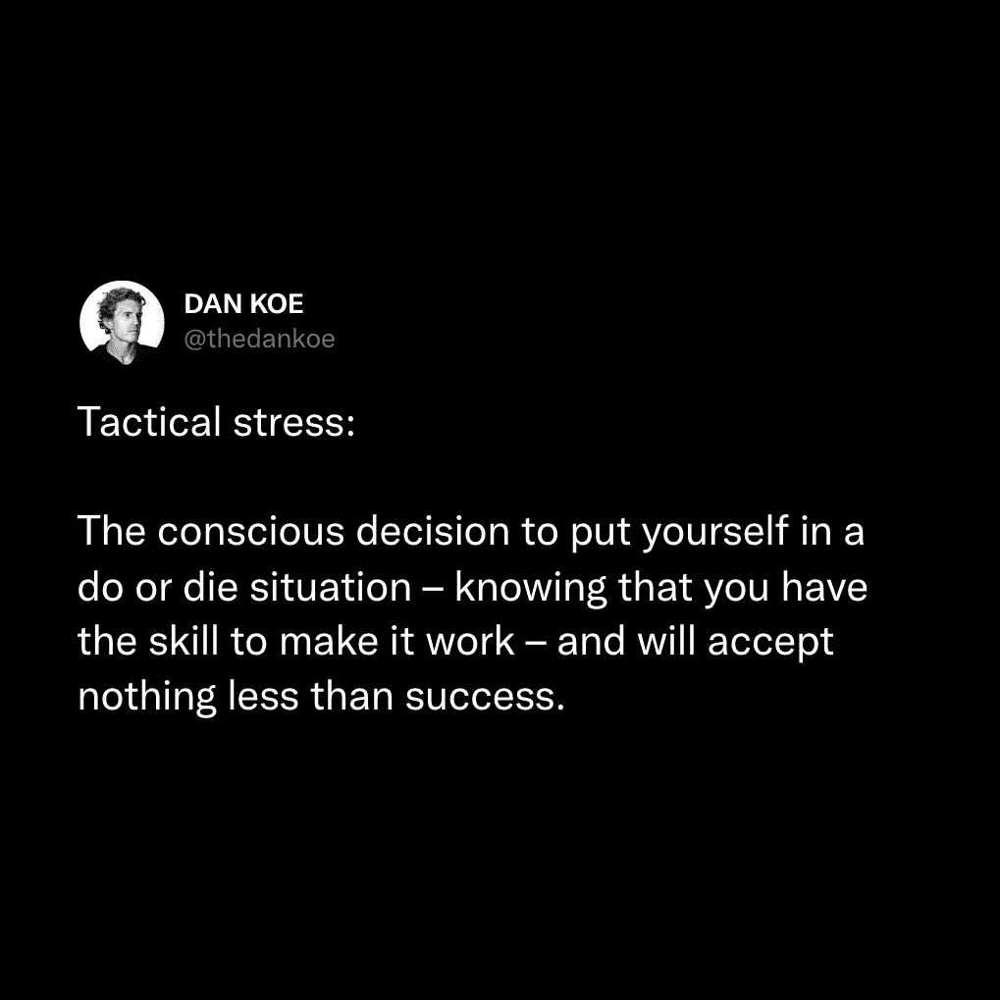
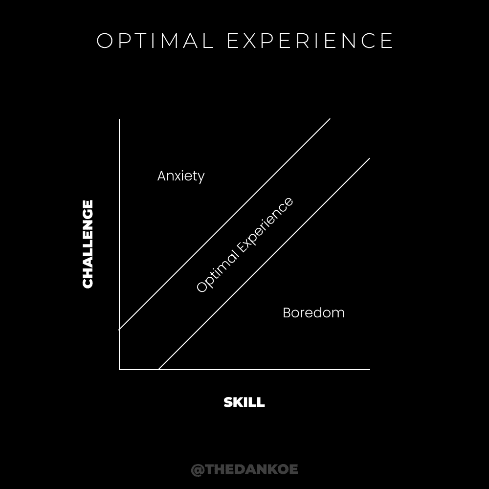

# 创造有意义、富有、有影响力的人生：教程：如何在最短时间内实现目标 🚀

在本教程中，我们将学习如何通过提升“清晰度”来快速构建一个有意义、富有且具有影响力的人生。我们将探讨如何从思维层面入手，规划并实现个人愿景。

## 概述：清晰度的核心力量

如果要将我所有的进步归功于一件事，那将是**清晰度**。清晰度是指对意识进行排序的能力。它让专注变得毫不费力，这在信息时代至关重要。

在我不到12岁的时候，我总是随身携带一个笔记本。那不是用来记课堂笔记的，而是用来描绘我脑海中各种奇怪怪物、机器人和任何我能想象到的事物的画册。随着我长大，我不再画画，但保留了写笔记本的习惯。我开始写下对未来场景的想象，这就像一个愿景板，一张我需要采取的行动地图。

## 将梦想（或噩梦）变为现实 💡

上一节我们介绍了清晰度的概念，本节中我们来看看如何将内在想法转化为外部现实。

意识产生意识，思想引发思想，项目衍生项目。核心要点是：如果你没有首先想象它，你就无法为自己创造一个未来的现实。反之，如果你首先想象了消极场景，你也可能创造出一个消极的当下现实。

以特斯拉公司为例，如果车轮、马车、电和汽车没有先被发明出来，它就不会存在。这引出了我们作为人类可能面临的一个根本问题：心理时间或线性时间的概念。

我们倾向于回忆熟悉的过去，并产生相同的熟悉想法。这些想法将过去的经验拉入当下，让你实际上体验到与过去相同的感觉。当你重复这些想法、情绪和经历时，你的大脑会通过神经网络固化这些模式，从而形成习惯和常规。如果处于无意识状态，这很危险，因为你只是在重复过去的自己。

对于未来也是如此。你会基于过去的经验，将注意力投射到一个可预测的未来并感到焦虑，从而在当下就感受到这些压力。大多数人醒来后，会立即将注意力投射到一个充满压力的未来，因为他们被过去的模式所编程。

解决这个问题的唯一方法是深入未知领域。思考新的思想，接触新的想法，沉浸在有利于成长的环境中。采取那些被他人称为“有风险”的行动，因为说这些话的人可能从未真正体验过“风险”本身。

超过90%的人生活在一种行动矛盾中：他们选择自动化、“安全”、“确定”的道路，而这在我们不断变化的世界中，恰恰充满了最大的风险和不确定性。

## 21世纪最重要的技能 🧠

我们已经看到，无序的心灵会引发许多问题，这源于“心理熵”——心灵倾向于混乱和无序。然而，解决方案正是**清晰性**，即有序的意识。这是一种以直接方式组织信息，使其从思维转化为现实的能力。

没有人天生就知道自己一生想做什么。但这并非坏事，而是一种祝福。不知道自己想要什么，意味着你可以在无限的未知潜力中创造任何你想要的东西。未知是所有潜力存在的地方。你需要打破习惯，不再以那个已知、熟悉、可预测的自我，生活在已知、熟悉、可预测的生活中。

现在，我们明白这是一个宏大的主题。在本教程中，我们专注于如何通过命令意识来为自己创造一个积极的现实。以下是实现这一目标的具体步骤。

## 实现清晰人生的步骤

以下是构建清晰愿景并实现它的系统性方法。

**1) 区分物质与非物质体验**

> “我不是发生在我身上的事，我是我选择成为的人。” —— 卡尔·荣格

不要从纯粹的唯物主义角度理解这句话。应从非物质、体验的角度思考。你此刻就是你所选择成为的那个人。在非物质世界中，没有需要跨越的鸿沟。

当你进入心流状态时，你正在体验你渴望的感觉。你不在乎具体的豪车或豪宅，你在乎的是它们带来的**感觉或体验**。这种体验你现在就可以实现。

一个不为人知的观点是：“假装做到你做到”是极好的建议。从物质角度看，这像在欺骗。但从非物质角度看，没有“假装”，你已经成为了那个人，物质世界会随之跟上。

**2) 创建一个清晰的愿景**

我们如何进入未知？通过运用大脑的力量，可视化我们想要吸引并努力实现的潜在现实。

“意图”一词源自拉丁语，意为“伸展”或“努力”。当你带着意图行动时，你就是在通过注意力向某个目标“伸展”。

许多人谈论“吸引力法则”。可以这样理解：通过持续具体的可视化，你设定了自己的焦点。当你练习专注于自己的愿景时，你开始解构大脑中无意识的思维模式。

例如，如果你相信自己能在网上赚钱（因为你对愿景很清晰），你就会开始注意到赚钱的机会。这就像你第一次注意到某种车型后，突然到处都能看到它一样。你正在主动敞开心扉，注意新事物，并将这些经历“吸引”到生活中。

通过具体描绘你想要的未来，你可以开始进入那种状态的能量。环境、自然、万事万物都持有能量，某种能量的频率就是信息。我们的头脑处理和组织这些信息。

**3) 将愿景逆向分解为目标**

创建目标的主要目的不是死盯着它们，而是为了提供更多清晰度，并证明愿景是可实现的。你可以将其视为**微观愿景**。它们的存在是为了提供额外的能量来源，以支持执行实现愿景所需的过程。

具体做法是：根据你想创造的规模，将其分解为3个层次的目标。如果你想创造更好的生活，要考虑长远。写下你的10年目标、1年目标和月度目标。然后，我们可以通过执行特定的过程来完成这些任务、里程碑或“微观愿景”。

**4) 开始测试一个过程**

将所有阶段视为一个实验。在测试特定部分之前，你无法知道什么会产生结果。科学家也不会一开始就提出一个完美可复制的过程，这可能需要数周、数月甚至数年。

在这个过程中，耐心、信念和顺应性是必要的。你正在创造一个前所未有的现实。如果你愿意，可以回到那条“安全”、“可预测”的传统道路。如果不愿意，就要对失败持开放态度。

你需要问自己：每天可以执行哪些关键行动，来实现你的月度、年度乃至终身愿景？如果想到这些让你焦虑，你需要自我教育并提升技能。如果感到无聊，你需要增加挑战。

**5) 利用内在驱动力**

好奇心、激情、目标、灵感以及意图，都是你可以用来提高工作质量的工具。这些因素会影响你大脑中的多巴胺等神经化学物质。当你出于好奇心或强烈的目标感去工作时，你会做得更好。这些都是你可以随时利用的内在能量来源，而非外在激励。

**6) 控制与引导你的注意力**

这一点值得深入探讨。现在，你需要理解你可以从上述任何层面获取能量。这些都是释放创造性能量的选项。

注意力给予和接收能量。我们处理来自各种频率的信息，但只有当我们给予注意力时，才能处理它。当你无意识地将注意力给予消极能量（比如想象与老板的冲突），你就触发了那个能量源，并会*感觉到*能量被消耗。

通过管理注意力，你可以释放能量，将最大努力投入到你的愿景中。当你不确定时，将注意力集中在当下。扩展你的意识，打开你的焦点，触及未知所蕴含的无限潜力和积极性。

## 实践示例分解 🎯

上一节我们列出了步骤，现在让我们通过一个具体例子来应用它们。

假设你对未来的一个愿景是利用创意技能赚取六位数收入。我们可以将其分解为目标：

*   **10年目标**：通过销售设计教程内容赚取六位数（例如，每月服务4个客户，每人2250美元；或每月销售84份99美元的课程）。
*   **1年目标**：通过图形设计辅导赚取60，000美元，并规划一门课程。
*   **1个月目标**：获得一位价值1，000美元的咨询客户。

接下来，我们需要一个专注于实现这些目标的过程：

*   每天发布3条推文，以建立专业权威和公众形象。
*   每天向10位与我的帖子互动的人发送私信，并使用预设的沟通脚本进行初步交流。
*   每天为你的产品或服务进行一次推广。

然后，利用内在驱动力。例如，将这个过程融入你的日常习惯。最后，通过每天留出1小时专门执行这个过程，来进一步框架化你的焦点。

## 成为多维度强健的人 🌉

创造金字塔不仅适用于改善个人生活，它可以应用于你生活和工作的各个方面。

*   **开始一个新项目？** 为其制定愿景，通过目标设定获得清晰度，减少行动阻力，并集中注意力。
*   **想建立更好的关系？** 为你期望的互动方式制定愿景，明确实现路径，并框架化你的注意力。
*   **用个人品牌开创在线业务？** **这就是你创建品牌的方式。** 你的愿景是你帮助他人达到的期望结果。实现路径上的目标是你教育受众的内容。你的内在动力吸引志同道合的人。而吸引并框架化受众的注意力，是你帮助他们克服障碍的方式。

一个额外建议：创建一个由你喜欢的图片组成的愿景板。思考你想传达的感觉是什么？你希望通过环境、形象、色彩等所有他人能感知的信息形式，传达什么样的体验？

创建产品或服务也是如此。思考用户的期望结果是什么？他们如何达到那里？你设计的过程能否引导他们产生结果？他们能否集中精力实现这些结果？你是否让这个过程变得无缝顺畅？

## 总结

在本教程中，我们一起学习了如何通过提升“清晰度”来快速构建理想人生。我们从**区分物质与非物质体验**入手，认识到体验本身的重要性。接着，我们学习了如何**创建一个清晰的愿景**，并将其**逆向分解为可执行的目标**。然后，我们探讨了通过**测试过程**、**利用内在驱动力**以及**控制注意力**来将计划付诸实践。最后，我们通过一个示例和扩展应用，展示了这套方法如何帮助我们成为多维度强健的人，在生活各个领域创造想要的现实。当你感到迷茫时，请参考这个“创造金字塔”，以获得清晰度并主动塑造你的生活。