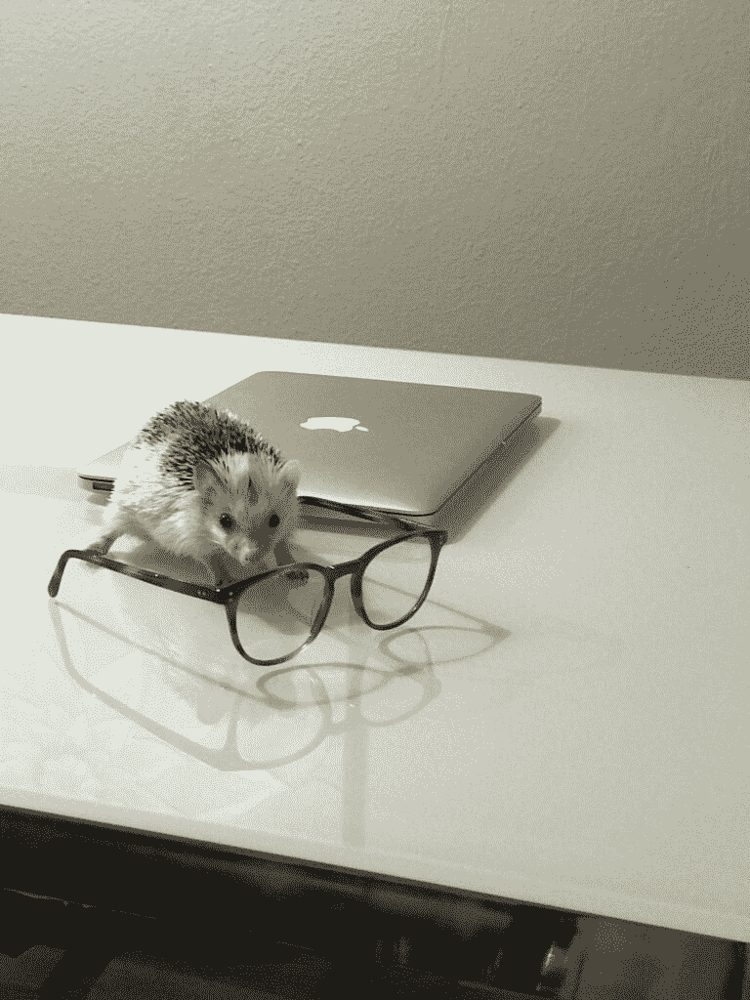
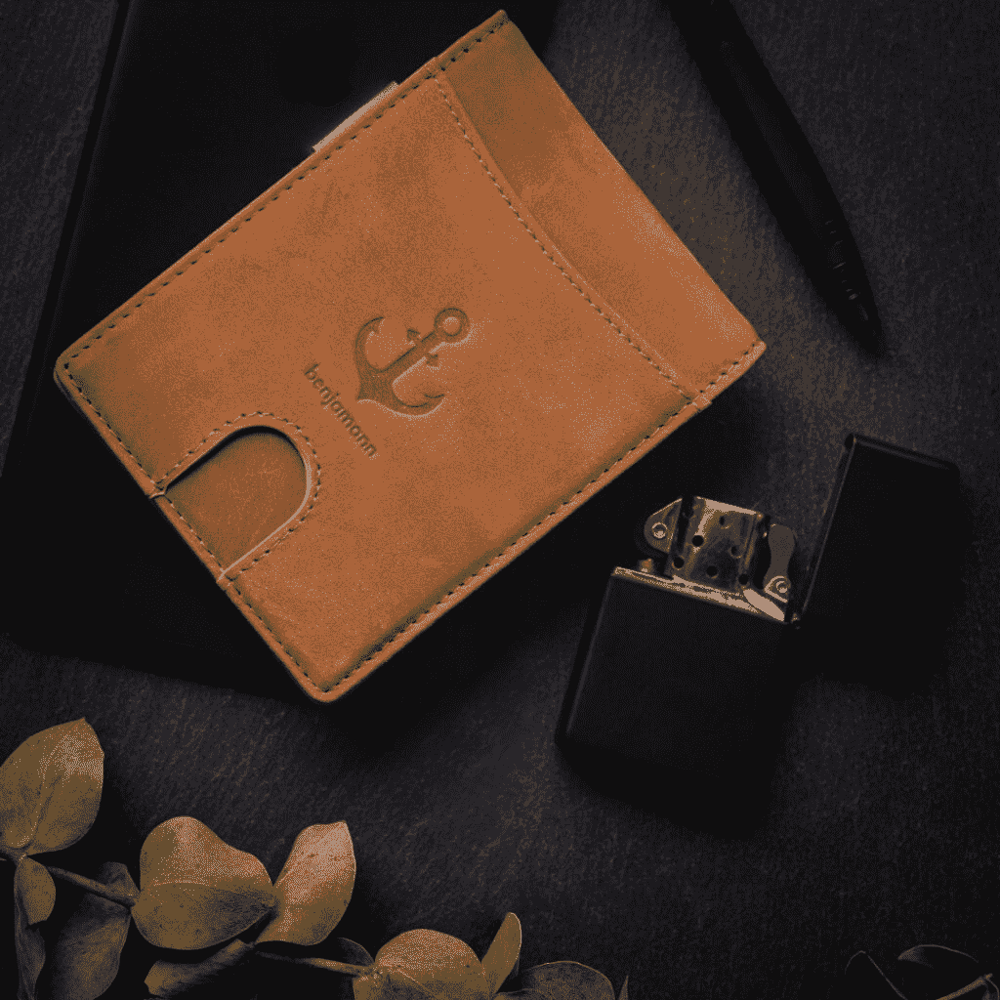
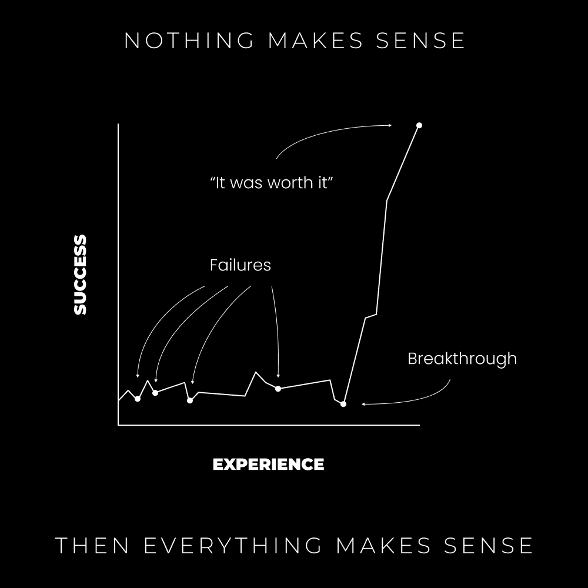
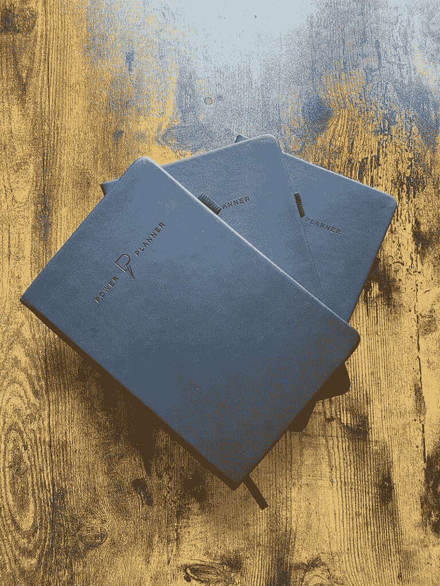

# 在线创业：从七次失败到全职创意收入之路 🚀

在本节课中，我们将跟随作者丹·科的真实经历，学习他如何通过尝试七种不同的在线商业模式，最终将失败转化为成功的全职创意收入。我们将剖析他的每一步尝试、关键转折点以及从中提炼出的宝贵教训。

## 概述：对传统道路的质疑与探索

我从小就非常警觉。我知道一定有更好的生活方式。我看到的许多人似乎都不快乐，对他们的职业、老板乃至生活本身都不满意。这让我决心避开“默认”的生活方式。

抱怨现状不会改变未来。把命运掌握在自己手中是唯一的选择。因此，我将年轻时的精力投入到了个人责任、自我教育和追求自主权上。如果每个人都遵循“上学、找工作、退休”的相同路径，结果不也会相同吗？这难道不是全球不快乐的根源吗？**唯一的出路是做与他人相反的事**。

当别人看电视时，我关注在线教育者。当别人下班休息时，我去健身房。当别人被新闻充斥头脑时，我阅读关于灵性和潜能开发的书籍。

## 1.1：大学时期的觉醒与初次尝试

我真正兴奋的事情之一是上大学。但我也知道，这延迟了我建立可持续收入的时间。从踏入大学校园的那一刻起，我就开始了倒计时。

我决心尝试不同的商业模式。大一那年，我和朋友一起创办了一个健身YouTube频道。我们制作了健身视频、教育内容和食物挑战。

**几个月后，我们决定放弃。** 除了这个频道，大一的生活主要是派对、游戏和学习各种课程（如平面设计、市场营销），以探索真正的兴趣。

大约那时，我经历了一次被捕事件（因在停车场吸食大麻）。这成为了一个重要的转折点。恐惧让我暂时忘记了开辟自己道路的目标。在等待法律程序的不确定中，我阅读了埃克哈特·托勒的《当下的力量》，这帮助我释放了焦虑，重新找回了动力。

我重新开始制作YouTube视频（头部讲话风格），并继续学习灵性知识。但和之前的尝试一样，它没有成功。

## 1.2：深入创意领域与接踵而至的失败

大二时，我迷上了摄影和Photoshop。我投入大量时间学习并创作超现实的数字艺术作品，并在Instagram上获得了约2500名粉丝。

**我从未计划以此赚钱**——但它教会了我平面设计、视觉叙事，并让我看到了通过优质内容在社交媒体上成长的可能性。如果当时有现在的认知，我本可以轻松创建一门教授这种合成技术的课程。

同年，我还尝试了更多商业模式。以下是几次关键的失败尝试：

**1) Facebook广告代理**
我购买课程学习了如何为本地企业运营Facebook广告。在发送了约50封冷邮件并进行了2-3次销售通话后，我没有签下任何客户，于是放弃了。

**2) 派对服装一件代发商店**
我了解EDM和音乐节场景，并看到了服装需求。我运用学到的电商知识，投入约100美元广告费，最终只卖出了一件产品。当意识到客户要等待漫长的中国发货时间时，我感到很糟糕，再次放弃。

**3) 自由职业网页设计**
大三时，我沉迷于网页开发。我几乎逃掉了所有课，通过在线课程快速掌握了技能。我开始尝试自由职业，联系朋友和家人，建立了一些作品集网站，总共赚了大约500美元。

**时间正在流逝**。我必须取得进展，否则将面临找一份传统工作的命运。

**4) 两个电子商务品牌**
我决定整合技能，创建真正的品牌。
*   **第一个品牌：蓝光眼镜**。我向父亲借了几千美元，寻找产品、拍照、投放广告并尝试网红营销。一次失败的网红推广（评论区充满负面言论）让我深受打击，最终放弃。
*   **第二个品牌：简约钱包**。在有了一份网页设计工作后，我用收入再次尝试电商，投资了专业产品图片，但依然没有销售，再次以失败和厌倦告终。

在所有这些过程中，我还尝试过SEO代理、内容营销代理，并不断寻找网页设计客户。我发展的所有技能似乎都没有带来预期的成功。

## 1.3：转折点：找到定位与模式验证

尽管有一份不错的工作，我内心的声音仍在催促我兑现对自己的承诺。

我重新开始积极寻找自由职业客户，通过走进当地企业、联系人际网络、尝试LinkedIn开发等方式，每月能吸引2-3个客户，每个项目收费1500-2500美元。

在服务这些客户（主要是服务型企业）的过程中，我学习了电子邮件营销和文案写作。我调整了服务内容，开始创建“服务漏斗”——一个包含着陆页、注册和邮件序列的系统，旨在将更多潜在客户转化为咨询电话。

**这是我开始提高价格的时候**（因为这是一个更具体、效果更好的方案）。我为设置这样一个漏斗收费2500-5000美元，而这比构建一个完整网站耗时更少。

凭借这项服务，我得以辞去工作。但兴奋感并未持续太久。

几个月后，我将阵地转向Twitter，开始发布内容，并将目标客户群体调整为创作者、教练和自由职业者。我理解他们，喜欢与他们合作，并能带来更好的结果。

## 1.4：加速发展：产品化与收入增长

在过去的四年里，我构建产品、调整品牌、测试不同方案，最终取得了突破性进展。以下是关键里程碑的时间线：

*   达到了六位数的自由职业收入。
*   构建了自由职业产品体系，扩大了受众，并通过信息产品每月额外赚取约3000美元。
*   创建了一门教授网页设计的课程。
*   在Twitter上达到1万名关注者，并创建了关于如何在Twitter上增长和获客的课程。
*   推出了一款实体计划本，后因厌倦物流转为提供免费数字版（The Power Planner）。
*   数字产品销售达到六位数。
*   将自由职业服务升级为营销咨询服务。
*   构建了Modern Mastery HQ社区。
*   达到了单月5万美元的收入，个人企业年收入稳定在30-50万美元。
*   Modern Mastery社区增长到1000名成员。
*   停止了咨询服务，并即将推出专注于快速技能获取、受众建设和内容创作的学校——Digital Economics。

**没有什么发生，然后一切就发生了。**

## 总结：从十年失败中提炼的七个核心教训

我从这段旅程中学到了很多，以下是最有影响力的七个教训：

**1) 接受“无意义到有意义”的循环**
完美的想法总是在一段迷茫期后出现。一开始可能什么都不明白，但坚持走下去，一切会变得清晰。这是一个循环且不可避免的过程。

**2) 以解决问题为导向**
一切皆有可能。永远不要停止学习。你应该始终有一个正在进行的项目，并同步学习完成它所需的知识，这是快速成长的关键。

**3) 不畏惧重新开始**
如果当前的业务没有结果，并且你不再对此充满热情，那就勇敢选择另一条路。尝试新事物。

**4) 拥抱不确定性与未知之路**
值得追求的事物往往不可预测。如果你在阅读本文，说明你注定不走寻常路。接受不确定性会成为你思维的一部分。就像肌肉通过阻力、紧张和恢复来塑造一样，成长也源于挑战。

**5) 广泛尝试，积极探索**
购买书籍，尝试社交媒体上的建议，测试各种可想象的商业模式，在线发布内容。你的任务是找到你热爱解决的问题和热衷谈论的话题的交汇点，那就是你事业的起点。

**6) 先给予，后收获**
开始时，可以免费工作。为自己、为朋友、为想象中的项目构建作品。与人交流，在社交媒体上建立联系。毫无保留地分享你的价值，不要期待立即回报。善行终会带来善果。

**7) 持续行动，不畏拒绝**
除了你自己，没有什么能阻止你展示自己。习惯被拒绝。最坏的结果是什么？不过是再试一次，再获得一个宝贵的教训，让你下次瞄准得更准。所以，只管行动。

---

本节课中，我们一起学习了丹·科从多次创业失败到建立稳定创意收入的完整历程。我们看到了尝试、失败、调整和坚持的重要性，并总结出了七个对初学者极具指导意义的核心教训。关键在于保持学习，勇于尝试，解决问题，并在过程中不断重新定义自己的道路。