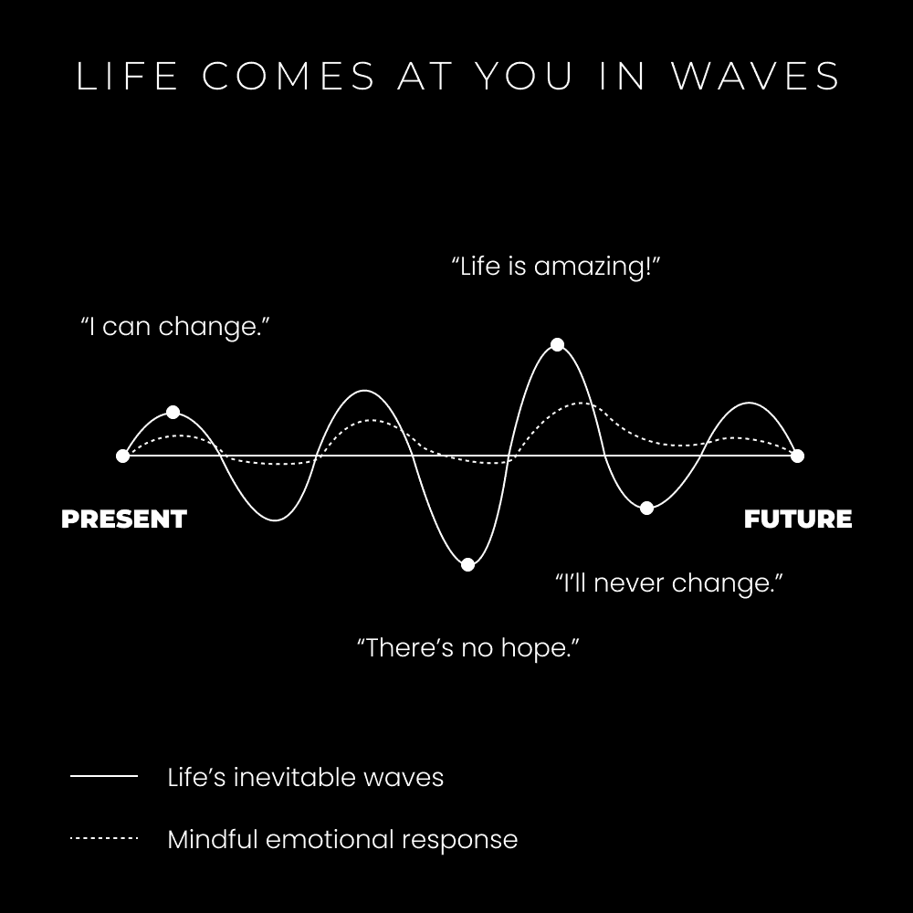

# 重塑自我：为何难以改变与重塑之道

在本节课中，我们将探讨一个核心问题：为什么改变自己如此困难？我们将通过一个生动的故事来理解人类心理的运作模式，并学习两种重塑自我的具体路径。课程将深入浅出地解释身份、信念与习惯的形成机制，并提供一套简单可行的行动框架。

## 生活如波浪般起伏 🌊

我童年时曾是童子军。每周二晚上，我会在以前的教堂出现，举起三根手指敬礼，并背诵童子军誓言。我们的队伍会讨论每周议程，努力获取感兴趣的技能徽章，并计划下一次露营旅行。

每年我们都有一次被称为“高冒险”的旅行。这是一次为期一周的露营。有一年，我们决定前往卡塔利娜岛。我们的雄心勃勃的目标是在岛上划皮划艇，并在沿途的不同海滩露营。

抵达当天，我们匆忙赶到皮划艇租赁处，立即“起航”。我们依赖之前获得的划独木舟徽章经验，自认为足以在接下来的5小时里驾驭海洋。

水面平静了大约一小时。随后，海洋的波浪开始变得汹涌。我们当时并未意识到，岛屿另一侧正酝酿着一场风暴。简而言之，**我们在冒险中途遭遇了暴风雨**。

波浪增长到至少10英尺高。我们的小组开始分散。我和我的伙伴多次翻船。我们浑身湿透，寒冷刺骨，几乎丢失船桨。密集的雨点刺痛身体。我的背包脱落，食物和衣物全部浸湿。更糟糕的是，我们是在逆风划行，几乎无法向目的地前进。

**那是我一生中真正认为生命可能终结的时刻。** 大约30分钟后，我们就看不见其他队员的橙色船桨了。我和我的伙伴经历了从奋力划桨到接受“灭亡”的心理阶段。最终，我们看到了海岸，重燃希望，拼命划向陆地。

撞上岸边后，我们拖船上岸，瘫倒在地。我们都因寒冷而轻微颤抖。落后的队员约一小时后由救援队接回。我所有的食物和衣物都湿透了。这次旅行被迫提前结束。

这个故事模拟了生活的强度周期，但我想用它来说明另一个道理。

## 高潮与低潮 ⚖️

当我们处于浪尖时，心怀希望。当我们深陷谷底时，希望变得稀缺。巅峰时，感觉无所不能；低谷时，感觉举步维艰。

> 你身处寒冷之中，开始颤抖，为什么？因为你正在抵抗寒冷。放松，顺其自然。
> — 艾伦·瓦茨

在经典力学中，**谐振子**是一个试图维持平衡的系统。你需要了解的**80/20法则**之一是：当平衡被打破时，系统会以同等力量向反方向反弹，并最终回归平衡。

我们的大脑运作方式类似。生活中的高潮总是伴随着低潮。我们的大脑是一个由正负反馈训练而成的复杂网络系统。

*   **负面反馈**：让你停止做某事。
*   **正面反馈**：让你重复做某事。

持续获得正面反馈的行为、信念或思维模式会变得习惯化，进入“自动驾驶”状态。这就像训练一只狗，通过音调和模式关联正面或负面的含义。

我们思维的可塑性既危险（在无意识时）又有益（在有意识时）。它表明我们有能力重新训练大脑，但我们的“思维谐振子”不会轻易让我们摆脱旧模式。

## 身份的层次 🏙️

如果你想改变生活，就必须改变身份。

*   一个健康的人不会认为吃健康食物是负担。**他们就是吃健康食物的人**。这对他们而言是享受。
*   一个商人不会认为专注工作是早晨的负担。**他们就是每天早晨完成工作的人**。

改变信念、身份和生活并不简单。请将你的思维想象成一座城市，例如华盛顿州的西雅图。

1889年，一个翻倒的胶水锅引发大火，摧毁了大部分城市。原因在于城市建立在糟糕的基础上：木质建筑、木质下水道、低劣的建筑质量。

人类的心理为生存而设计。当你的信念、身份或生活受到威胁时，大脑会发出警报，你的注意力变得狭窄，开始过度关注涌入脑海的想法。平衡被打破，思维会做出反应，试图将你拉回稳态。

问题在于，我们生活在一个与祖先完全不同的世界。我们很少面临物理威胁，大多有住所、食物和谋生能力。然而，**人类是唯一将信念的死亡等同于肉体死亡的存在**。

这种生存机制可能具有破坏性。试图做出一个小改变，就像打翻了胶水锅，可能点燃你多年来在心中建造的“城市”。当你试图重建一部分时，可能会威胁整个基础。在谷底时，你看不到希望，可能会“翻船”。

当你深陷生活泥潭时，你可能视其为纯粹的负面反馈，从而强化那些不利于高质量生活的思维模式，并回避任何威胁到旧身份的事物。

这就是挑战所在。新罗马建立在古罗马之上，新西雅图也建立在旧西雅图之上。所有建筑、地基和网络都相互连接，层层叠加，协同工作。移除特定部分可能暂时损害系统功能。

你的身份也是如此——我们通过故事、信念和根深蒂固的思维模式来理解自我，这些构成了大脑的最优运作方式。如果我重建了我的故事，“我”会消失吗？如果我质疑根深蒂固的信仰呢？如果我不再做日复一日同样的事，生活会怎样？这确实难以理解。

上一节我们探讨了身份如同层层叠加的城市，改变它会引发系统的抗拒。接下来，我们来看看如何有效地进行重塑。

## 如何重塑自己 🔧

重塑自我有两条主要途径：

**1) 触达谷底。**

通过经历生活中的最低谷，你开始对现状感到极度厌倦。你深刻意识到是什么阻碍了你。你深入挖掘身份的层次，找到那块刚好可以移除、以便朝反方向前进的“基石”。

这会带来大量痛苦，通常是难以控制的。“烧毁”你象征性的城市可能在多年后引发更深层的问题，导致再次跌入谷底。我遇到的每一个触底反弹的人，几乎都是因为生活强加给他们的不幸。

有一个更好的选择，一个完全在你控制之内的选择。

**2) 积累小胜。**

每个人都听说过詹姆斯·克利尔的“每天进步1%”的理念。它拥有巨大力量。

当你一点一滴地重建你的“城市”时，你将在不“烧毁”旧城的基础上，建立起“新西雅图”。

你该从哪里开始？通过清晰定义你的**愿景**和**反愿景**。

> 如果你不知道想要什么，那就弄清你不想要什么，并朝相反方向努力。
> — 丹·科 (@thedankoe)

得益于大脑的负面偏见，观察你不想要的东西并朝反方向努力，通常更容易。当你规划未来愿景时，它会像一束光，照亮你意识中的盲区。

> 如果你迷失了，答案是教育。
> 如果你受过教育，答案是行动。
> 如果你在行动，答案是坚持。
> — 丹·科 (@thedankoe)

当你将愿景分解为10年、1年和月度目标时，你会清晰地看到实现愿景需要做什么。现在，我们可以把事情分解为优先任务。

以下是启动步骤：

*   **减少行动摩擦**：你能采取的最小心理、身体、情感或财务步骤是什么？是穿上运动鞋走出门？是从沙发上站起来迈出第一步？是投资25美元上一门课以示认真？是阅读或写下书的第一句话？

## 积极构建你的生活 🛠️

这不是一个轻松的过程。你仍然处于“暴风雨中的皮划艇”这个比喻里。生活是混乱的。通过愿景和目标设定来整理意识，是我们获得对生活的确定感和控制感的方式。

我们处于一个信息与观点爆炸的时代，类似于公元前5世纪。人们对来自企业文化、有组织宗教或正规教育的外部目标体系失去了信任。

因此，你必须**积极参与构建自己的生活**。这需要个人责任感、强大的自信，以及意识到“没有人会来拯救你”的觉悟。你可以收集并组织世界上丰富的信息，以产生满意收入、促进健康、理清思绪并连接精神的方式将其整合。

> 难以下咽的真理：你的大部分限制都是自我强加的。如果你想要某样东西，总有办法——只是你的大脑不会让你看到它。
> — 丹·科 (@thedankoe)

如果你认为自己身处暴风雨中，那你确实如此。如果你认为自己正在享受波浪的过山车，那你就会感到快乐。

你如何积极构建生活？通过**意识、创造力和意图**。

最简单的方法是将生活的每个方面都视为一个项目。

以下是开始改变生活所需的一切：

1.  **购买一本空白笔记本**。
2.  **用大字写上“我的科学日志”**。
3.  **将你的心灵、身体、精神和事业视为终身项目**。
4.  **记录观察、测试小变化、分析结果、并加倍投入有效的方法**。

通过保持清醒和警觉（可应用于心理、身体、财务和精神项目）进行静默观察。

通过自我教育扩展意识，发现新路径。

假设并实验解决方案，以解决你的问题。

分析结果并获得反馈，这将开始重新连接你心智中的系统网络。

记录一个可复制的流程，以帮助他人并获得*更多*反馈。

重复以上步骤。

**培养你到现在这个程度，花了18年以上。不要期望一夜之间有太多进展。**

朋友们，这就是你重塑自我的方式。

— 丹·科

---

**本节课中，我们一起学习了：**

1.  **心理的“谐振子”模型**：大脑倾向于维持稳态，改变会引发反弹。
2.  **身份的层次性**：自我认知像一座层层建造的城市，牵一发而动全身。
3.  **重塑自我的两条路径**：被动地“触达谷底”或主动地“积累小胜”。
4.  **积极构建生活的框架**：通过定义愿景与反愿景、设定目标、减少行动摩擦来启动改变。
5.  **“科学日志”法**：将生活视为项目，通过观察、实验、分析和迭代来系统地重塑自我。

记住，改变是渐进的过程，始于最小的行动。关键在于持续地意识、创造并意图明确地建造你想要的生活。