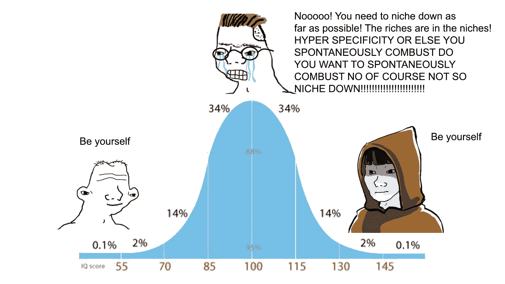

# 现代商业哲学：为何选择细分市场对聪明人而言是愚蠢的

在本节课中，我们将探讨一个反直觉的观点：在当今时代，过度专注于一个狭窄的细分市场（利基市场）可能会限制个人的成长与潜力。我们将从人类意识处理信息的极限出发，分析“创作者经济”如何加速个人发展，并最终提出一种更符合自然与创造力的生活及商业模型。

## 人类意识的极限与潜力

上一节我们介绍了课程的主题，本节中我们来看看支撑这一观点的核心科学依据。人类每秒可以处理约126比特的信息。一生中，平均每个人能处理的信息总量约为1850亿比特。这些信息通过我们的意识被整理和存储。我们意识到的内容，即我们关注和专注的事物，决定了我们存储的信息。这意味着，我们一生中能够有意识处理的信息量存在明确的上限。

这个上限是人类潜力的一个关键因素，甚至可能是主要指标。大多数人将约15%的注意力用于洗澡、烹饪等生活必需活动。然而，许多人也将大量时间浪费在闲逛、看电视、刷社交媒体等无意义的活动上，从而浪费了自身的潜力。

上周我们讨论了肯·威尔伯的蜂巢理论，即我们如何在特定领域发展自己并经历三个成长阶段，最终使技能升华为艺术。上述统计数据强化了这一观点：人类通过有意识开发能处理1850亿比特信息，这限制了我们能深入发展的领域数量，也意味着所有人都受到同样的限制。根据许多哲学家和古代先贤的观点，在不同领域发展自我是幸福的源泉，反之则可能导致不幸。

因此，拥有愿景和目标，并有意识地为之努力是有效的，关键在于“在过程中找到快乐”。

尼采曾说：
> “幸福是力量增加的感觉——阻力正在被克服。”

齐克森米哈伊指出：
> “一个能够控制意识的人的标志是能够随意集中注意力，对干扰视而不见，集中精力直到实现目标，而且能够这样做的人通常享受日常生活的正常过程。”

若将此概念置于游戏（如《魔兽世界》）的背景下：你会在达到最高等级时退出游戏。你只能获得有限的经验值，只能在技能树上分配有限的“技能点”。如果不体验完整的故事或参与游戏的各个部分，你就无法达到最高等级（即你的潜力）。如果你把技能点分散得太开，最终你的实力将不如那些明智分配点数的人。

因此，调整心态、保持专注、整理思绪、避免分心，以及所有关于利用有限意识来发展觉知、追求基于兴趣的目标层级的格言，都是获得整体生活满足感的秘诀之一。

这本身就是一个深刻的教训。你永远无法完全了解另一个人的心态，无法理解他们如何控制自己的意识，也无法理解带给他们快乐的目标层级。仅仅因为某人不锻炼、不创业或不关注健康，并不意味着他们不快乐。那些追随自身多巴胺指引、探索特定领域的人，可能因为其有序的意识而比我们更快乐。因此，评判、假设和期望都是无用的。做好自己认为正确的事，并允许他人做同样的事。教导他人，仅在他们愿意接受时进行。“智慧之口只对理解之耳言语。”

## “创作者经济”如何加速我们的发展

上一节我们探讨了意识资源的有限性，本节中我们来看看“创作者经济”如何帮助我们突破这一限制。可以这样思考：通过具体知识——例如课程、辅导、学徒制及其他在线教育形式——人们正在将大约10年的信息、经验和失败，浓缩成一个简单且可操作的路线图，用于在特定生活领域取得成功。

书籍、文章、视频、播客等媒介承载了这些知识。关键在于消费它们时，要结合实践项目来连接想法，并引发模式识别。

可以说，这些信息被**压缩**或**紧凑化**了，就像一个压缩文件。现在，我们的大脑可以更快地处理过去需要10年才能积累的信息。这些信息不再需要占据我们约50亿比特的意识注意力，可能只需要约1000万比特。这意味着我们正在“创造”解决问题的方案，突破个人和职业发展的限制，并为自己和他人腾出空间去做同样的事情。

作者花了5年时间才在自由职业领域取得成功。但在将其第一本电子书打包出售后，其他人仅在几个月内就取得了成功。现在，人们可以在更短的时间内取得更多成功，将1-3年的学习成果打包，并传授他们的经验。这导致了特定领域的指数级发展，同时也允许在多个领域快速进步。

例如，计算机编程曾经非常专业化。现在，有了各种框架、教育资源和学习方法，人们可以在6个月内获得高薪的网页开发工作，而无需学位。这种加速趋势将持续下去，尤其对科技行业从业者和敢于追求创造性工作的人而言。

核心观点是：我们正在**压缩**需要处理的信息量。得益于创作者和技术，我们可以比前辈学到更多。我们不必只专精于一个领域。实际上，过度专注于一个领域会极大地限制我们。一个人通过专业化变得有价值，但通过成为“现代文艺复兴人”（即通才）而变得不可替代。我们可以通过增强专业化，并学习互补领域来为创造力腾出空间。

一个独立创业者可以蓬勃发展，因为他可以学习市场营销、销售、一项可销售的技能、电子邮件营销、内容创作、视频编辑、广告投放、产品构建、潜在客户开发等。通过在整个创作者生涯中压缩、系统化和产品化这一过程，一个人可以赚取100万至500万美元的收入。当然，一个小团队可以带来更多火力。

你看到成为创作者的力量和必要性了吗？你实际上是在“提升集体人类意识”的同时，做着自己热爱的事情。通过创造新颖的解决方案，你迅速提高了个人在特定领域的发展。同时，由于“教学相长”，你的自身发展甚至更加迅速。如果你持续地产出内容、产品、服务以及简化理解的方式，你将为进一步的创新腾出空间。

顺便一提：作者惊讶于在这份通讯中创意“融合”的程度。如果不是作为一名创作者，就无法做出这些联系，而这正是关键所在。你必须经历发展阶段，利用可用的具体知识（自我教育），并成为一名创作者，通过创造价值来进一步强化、连接和简化这些知识。

## 专业化是一种虚假的神祇

记得上周我们讨论了“前理性谬误”吗？即从前理性、理性到超理性阶段的发展过程？本质上，这个梗图对生活的每个方面都适用吗？

在古代，“万事通”或文艺复兴式的全才曾带来成功。随后进入了专业化的时代。现在，对于那些能看到并抓住机会的人而言，文艺复兴时代正在回归——主要是在网络世界。

请问：作者的细分市场是什么？专业是什么？你能给出一个直接的答案吗？如果你回答“在线商业”、“自我提升”、“哲学与灵性”甚至“健身与健康”，作者都不会完全同意。作者的品牌是其所选择发展的多个领域的**综合**——一种相互关联。作者的细分市场是“所有这些”，这正是创造力的先导。不限制自己，使其能够与在类似领域发展的人建立联系。不限制自己，为模式识别打开了空间，使其能够连接不同领域的点，为任何主题带来新颖的视角。这让作者及其产品能从商品化的海洋中脱颖而出。

当然，专业化在起步阶段很重要，并且长期来看也能发挥非常有益的作用。这是变得**有价值**与变得**不可替代**之间的区别。一个万事通不如一个精通某项技能的人。专注于一个核心领域，同时利用现代创新快速在多个相关领域发展自己，这为你提供了**杠杆**。你在子领域的发展只会增强你在主要领域的有效性。

## 现代商业的体验模型

世界正在转变。随着技术进步，我们正逐渐变得更加人性化（前提是明智地使用技术）。这为更多的创造性追求以及通过此途径赚取可观收入的能力开辟了空间。

作者的“体验模型”概念应运而生，旨在帮助人们在创作者/注意力经济中蓬勃发展。

以下是该模型的构成部分：

*   **信息处理与个人构成**：你一生中处理的信息量决定了你的条件反射、思维程序、信念、偏见、感知、身份、个性和技能水平。
*   **注意力与体验**：你的注意力投向何处以及如何控制它，决定了你的**体验**。
*   **体验与创作**：你的体验将成为你**创作**的基石。这就是你的内容、产品和服务。
*   **潜力与品牌**：你的潜力将成为你的**品牌**。这就是你的愿景、目标和价值观。

没有人可以复制这个“细分市场”，你也不局限于你所创造的具体产品。只要你能掌握**常青技能**，它们就会持续盈利。

你是否看到一切都在回归原点？**个人成长 = 商业成长**。

在内容创作方面，有一点需要思考：你能通过新奇的事物吸引人们的注意力，让他们意识到自己想要追求的特定兴趣，用紧凑而有价值的信息填充他们有限的意识，并引导他们走向更好的生活吗？这，是个人品牌或创作者成功的关键。

你塑造自己的愿景、目标和价值观——朝着它们努力，吸引追随者，引领他们走向更美好的生活。你的愿景是你和你的追随者期望的最终结果。你的目标是你在努力实现的具体里程碑。你的价值观是你和你的追随者正在发展的领域。所有这些构成了你的内容支柱。当需要创造内容时，你依靠的是你的**经验**。随着你在这些领域的发展，你学到的教训会越来越有创意。你从错误、洞察和成功中学习，在你实现愿景的道路上开辟道路。这是一条非常充实的工作道路。人们跟随你，因为你是一个自信、真诚的领导者，引领他们走向更美好的生活。

创造力随之而来。我们如何将其融入生活和事业，以实现最大化和快速的发展？答案是：通过利用已经创造出的想法和具体知识。当你跟随和模仿其他领导者或励志原型时，你为自己的愿景带来了清晰度。正如那句俗语所说：“每个优秀的教练都有自己的教练。”

## 如何与自然和谐生活（并赚钱）

第一步是**意识**。对自己现有条件和思维程序的意识。给予时间，你的心和思想就会打开。你回归到童年般的状态……或者说，你超越了成人状态（克服前理性谬误），解锁了自信、好奇心和创造力的天赋。

通过好奇心，你追求真正感兴趣的发展领域。你通过模式识别和多巴胺的反馈来积累动力。你开始在不同领域间建立联系——除非你超越并成为创造者（儿童=创造者，成人=消费者，保有童真的成人=创造者），否则你无法在这些领域全面发展自己。你没有去教学、领导和做那些达到下一发展阶段所必需的事情。

通过遵循本性（你的直觉）去追求你的兴趣，你成为一个“独一无二的细分市场”。你建立起品牌的“个人垄断”。你与互联网的进化（自然）保持一致。你随着宇宙的整体发展而流动（并从中获利）。这就是你应该做的事情。你没有意识到这一点，是因为你与自己的存在脱节——你没有成为那个锚定自身的点。

你如何选择填充那1850亿比特的信息，将与其他人截然不同。当然，会有一些相似之处，但在这个阶段，竞争已不相关。你的“细分市场”是你一生中存储的数十亿比特信息的体现。简而言之，你分享的比你想象的要多——你所需要的是一个关于在线增长、品牌、营销和销售的自我教育目标层级，并保持动力。

这比你想象的要容易。阻碍你进步的唯一因素是你自己。你对思维的潜意识认同。你已经有了一切——你所需要做的就是拥抱你天生的好奇心，让它成为你的指南，传承你的经验，并通过内容、产品和服务记录你的旅程。

当然，还有更多的技术细节，但作者已经制作了数百份通讯、MMHQ文章、播客、课程、视频、培训和相关帖子。你需要的所有东西已经在互联网上。你可能因为允许干扰占据并保持你的注意力，而对这一切视而不见。

**醒来。**

本节课中，我们一起学习了为何在信息可被压缩、跨界学习成为可能的时代，过度执着于单一细分市场可能限制个人潜力。我们探讨了人类意识的处理极限，“创作者经济”的加速效应，以及通过构建独特的“体验模型”和遵循内在好奇心，实现与自然和谐发展并创造价值的新路径。关键在于成为连接不同领域的创造者，而非局限于单一领域的专家。