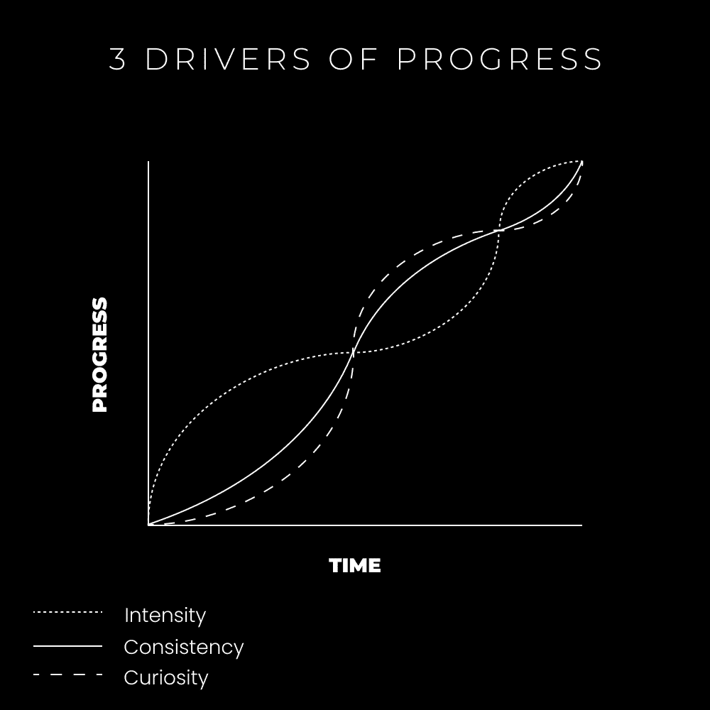

# 生活哲学：理解生活的三个阶段

在本节课中，我们将学习一个关于个人成长与生活节奏的框架。通过理解“强度”、“一致性”和“好奇心”这三个循环往复的阶段，你可以更好地定位自己当前的状态，并学会顺应而非对抗生活的自然周期，从而减少迷茫，更有效地朝着目标前进。

## 概述：生活的周期性

我总感觉生活是分阶段的。在一个阶段里，我感到迷茫。在另一个阶段里，我充满能量，深深陷入心流状态，专注于构建未来。还有一个阶段，我只是在例行公事，但感到快乐。

有趣的是，这种周期性感觉在学生时代并不明显。当老师和雇主引导我的注意力时，生活显得线性。只有当需要自己管理目标、掌握注意力并决定人生方向时，这种主权生活的周期性才变得显著。

迷茫的阶段最具破坏性，但也最富启发性。它就像在黑暗中摸索，希望能找到一根蜡烛。找到了，看着它熄灭，再找到另一根，希望它能引导你走向光明，直到黑暗再次降临。

通过保持意识并带着改进的意图，这些周期的破坏性会减弱。许多人可能深陷迷茫而不自知。实际上，迷茫期是在为下一轮的行动积蓄能量。就像在桑拿房中，不要与之抗争，**让它净化你**。

## 进步的三个驱动力

当你承诺根据自身目标（而非他人期望）构建生活时，有三个核心驱动力推动你进步。如果你能意识到并参与这些阶段，你就在朝着更好的生活迈进。

这些阶段对每个人都会发生，但对那些从事不喜欢的工作、跟随他人道路而非开辟自己道路的人最具破坏性。理解这些阶段能帮助你定位自身、明确行动并做出准确决策。

**进步的三个驱动力是：**

1.  **强度**
2.  **一致性**
3.  **好奇心**

这些阶段循环出现，一个导致另一个，是生活的必然周期。秘诀在于放手，让周期自然发生。与之抗争只会让你困在那个阶段，直到学会它要教给你的东西。

*   **强度**用于构建。
*   **一致性**用于维持。
*   **好奇心**用于探索。

这些不仅是宏观的生活周期，也体现在年、月、周、日之中。本文将聚焦宏观视角，但你可以开始观察日常生活中的这些微小周期。

以下是导航它们的方法：

### 探索未知：好奇心阶段

我们将从“好奇心”阶段开始，因为许多人对此有误解。这是人们容易陷入长期停滞的阶段。虽然有无限的改进空间，但**需要与舒适区边缘保持距离**。

**生活是一系列实验**。没有人能完全“搞清楚”。未知之地充满无限机会，但大多数人视其为巨大风险。顶尖的1%的成就者将风险视为生活的一部分，而其余99%的人则视其为对熟悉领域的威胁，感到恐惧。

好奇阶段很棘手。它看起来不像探索，更像是在太空中漂浮，没有例行公事锚定，缺乏方向感。我们必须采取探险者心态，在“丛林”中探索，寻找改变人生的新发现。

要轻松导航此阶段，需要直觉、屈服和接受。以下是一些更有效的方法：

以下是有效探索未知的步骤：

*   **列出**你拥有的20个兴趣。
*   **记录**兴趣之间的关联（交叉点）。
*   **沉浸**在你感兴趣的信息中。
*   **阅读书籍**，收听播客，关注该领域的领导者。
*   **连接这些点**，理解其现实世界的实用性。
*   **教授**你所学的知识，以深化理解。

最终，你将更清楚前进方向。你的神经生物学——那种兴奋感——会暗示你的激情所在。在探索中不断教育自己，教育能为未知地图投下光亮。在时间上投资免费内容，在金钱上投资你渴望成为的人的教导。

好奇阶段是为了探索、实验和发现。这些新发现将引导你走向自己真正想走的道路。这需要你联系直觉，让好奇心成为内在驱动力。这是一个测试兴趣、评估实用性并最终连接各点的时期，它能带来巨大清晰度，将你引入下一阶段。

### 快速构建一个更好的未来：强度阶段

“强度”阶段是构建与你的好奇心相关项目的时期。当清晰度到来时，你会日夜兼程，争分夺秒地完成任务。没有什么能阻止你开辟自己的道路。专注是无缝的，心流似乎持续一整天。

这个阶段发生在好奇心阶段之后，当一切变得清晰时。你有了新发现、清晰洞察和能推动你前进的策略。你已经在感受自己未来的角色。现在的你与想成为的你合二为一。

> 强度可以澄清。它不仅创造了动力，还创造了你需要感受到的摩擦或满足感的压力。——马库斯·巴克敏斯特

建设阶段是将好奇心转化为狂热的过程，是为了酿造让你进入心流状态的神经化学鸡尾酒。它在培养自主性和精通感的同时，也滋养着激情与目标。这是你构建个人自由和自我实现的地方。此阶段最适合高潜在盈利能力的项目。它可以始于爱好，但若想持续，自主性必不可少。

在此阶段后期，若想保持进度，你必须将过程**系统化**。

### 一致性累积：维持阶段

在强度阶段结束时，你将达到一个新的基准（心理、身体、精神或财务等）。如果不维持，你将再次跌入低谷。这是一个循环，但你不必再次陷入迷茫的好奇心阶段。

“一致性”最好通过系统来导航。这些系统应围绕能产生增长的基本原理和杠杆式行动构建。将这些基本原理融入日常惯例，尽可能自动化，并将不喜欢的事务委托出去。

以下是建立维持系统的步骤：

*   **记录**你的关键目标导向任务（杠杆任务）。
*   **安排**专门的时间块来执行这些任务。
*   **避免分心**，进入深度工作模式。
*   **在你精力最旺盛的时候**处理这些任务。
*   **经常反思**，将不喜欢或技术性的工作委托出去（如通过虚拟助理）。

通过建立适当的生活与工作系统，你可以用更少的专注工作时间（例如2-4小时）维持全职收入。技术进步（如无代码工具）减少了独立工作者的负担。一旦感到稳定，你就可以保持进度，并跳入另一个好奇心阶段，探索新领域，用新发现再次开启强度循环。（如果在已有基础上构建，则效果更佳。）

### 宏观与微观阶段

一旦意识到这些阶段，它们会变得更可预测，你也能更有效地导航。你可以预见将要发生的事，减轻对未来的焦虑。

事实上，**这些阶段不仅存在于宏观生活层面，也存在于微观的每一天**。你可以利用此理解来设计可持续的日程。例如，我的日程安排是：

*   **早晨前两小时**进行建设（强度）。
*   **随后两小时**保持规律工作（一致性）。
*   **下午时间**用于探索（好奇心）。

一个精心设计的生活方式，就是在宏观阶段中嵌套微观阶段。这是在划分你的时间，并知道何时转换以实现平衡。

本节课中，我们一起学习了个人成长的三个核心驱动力：**好奇心**用于探索未知，**强度**用于快速构建，**一致性**用于长期维持。理解并顺应这三个自然循环的阶段，而非与之对抗，能帮助你减少迷茫，更清晰、更有效地朝着自我设定的目标前进。记住，生活有其节奏，学会在正确的阶段做正确的事。