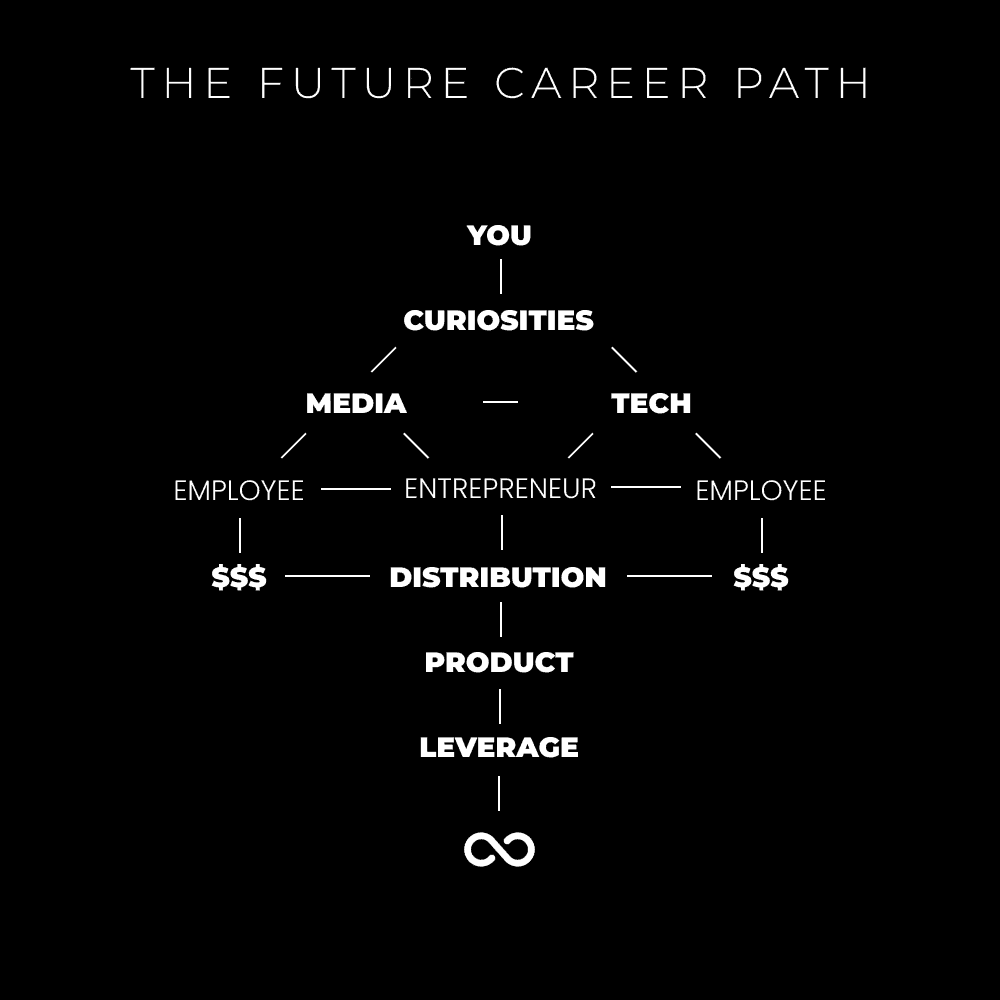

# 数字经济学：未来职业之路：从工作到游戏 🎮

在本节课中，我们将探讨未来职业发展的核心范式转变。我们将学习如何将个人好奇心转化为可持续的在线事业，并理解构建个人品牌与数字资产的底层逻辑。

---

在过去的一个月里，我意识到我生活中以及许多人生活中的一个共同主题：**痴迷**。

童年时期，我痴迷于寻找更好的生活方式。我不知道是什么激发了我。**我所知道的是，我是一个沉默的观察者**。无论去到哪里，我都会密切关注人们的行为。这种观察不是评判性的，而是辨别性的。

我会思考：那个人是如何到达人生那个阶段的？他们为什么看起来是那样？是因为他们每天早上都在麦当劳的快车道上买两个香肠蛋麦满分和一大杯冰咖啡吗？许多事情都让我感到不适。

其中之一便是传统的职业道路。上学。在18岁时*认为*自己知道想做什么（这实际上是文化驱使你去做的）。*可能*第一次就找到一份好工作。*可能*在无法控制自己70%时间的情况下享受生活。*可能*在65岁时获得自由去做自己想做的事……我对此毫无兴趣。

不。我不喜欢那样。一个“安全”的未来听起来并不安全。因此，我把时间花在健身房，向社交媒体上我渴望成为的人学习，学习任何能帮助我的技能，并且尝试了超过7次失败的商业模式。

顺便一提：我发现这是我个人品牌中缺失的一块。所以我将在6月7日推出“数字经济学”。这将是一个现代商业学位，由真正理解现代在线业务的人教授。课程涵盖技能获取、品牌建设、快速内容创作，以及在30天内创建一个无人能竞争的专属利基市场。这里是早期鸟更新的等待名单。

当一切变得清晰时，我开始看到成功。在过去4年里，我拼凑出了这个谜题。以下是我18岁时希望知道的事情。

## 未来的职业道路 🛤️

工作的未来将不再是“工作”。**它将是游戏**。

人类的心理是为生存而设计的。创业是现代的生存方式。

> 过去的人们会在他们自己的小社区内狩猎、采集、交易和赚钱。
> 互联网给了我们在我们自己的无限社区中狩猎、采集、交易和赚钱的机会。
> 回归自然。
> — DAN KOE (@thedankoe) 2022年5月5日

我们无法控制人类的进化。道路已经铺好，并正迅速在我们眼前展开。那些登上列车的人会生存下来，而其他人将经历神经生物学的衰退。

关键在于区分好的多巴胺与坏的多巴胺。追求你的好奇心，进行探索发现，并能在从公司到个人的世界中维持这种生活方式。挖掘你的创意天赋，为问题提供解决方案，浓缩信息，并提高集体的福祉。

### 追求你的好奇心 🔍

> 通过追求你真正的好奇心和激情，而不是目前热门的东西，来找到具体的知识。
> — Naval (@naval) 2018年5月31日

在我们生命的最初18年甚至更长时间里，文化被设计用来剥夺我们孩童般的好奇心。这既是一件好事，也是一件坏事。对于意识到这一点的人来说是好事，对于没有意识到的人来说是坏事。

好奇心是通往做你想做之事的道路，而不是做别人想让你做的事。教育体系为我们分配了可能感兴趣也可能不感兴趣的学习材料。它可能会激发好奇心，让你在空闲时间探索某些东西，但孩子们很少这样做，尤其是当他们的父母催促他们做作业的时候。

你通过提问，而不是被动应对，来追求你的好奇心。

“如果我学会了那个技能呢？”
“如果我改善了健康状况呢？”
“如果我开始那个业务呢？”
“如果我失败了怎么办？如果我成功了怎么办？如果我坚持下去呢？世界会结束吗？当然不会。”

经过一系列问题后，接下来是对未知领域的探索。即**行动**。寻找资源来自我教育。让新的发现引导你走向另一条未知的道路。重复这个过程，直到你连接了所有的点。

幸运的是，我们生活在一个任何东西都可以货币化的世界里。如果你知道如何快速学习、构建产品并进行销售，你只需通过在线谈论、学习和教授你的好奇心，就能建立分销渠道。

### 媒介与信息 📡

我有一个理论：我们作为人类正在在线绘制集体意识的地图。

创作者、个人品牌、“思想领袖”和在线教育者正在以指数级的速度加速进化。我们通过课程、系统、分步指南和导师制，以可消化的方式浓缩信息，提炼出多年的经验。原本需要处理6000万个信息比特，现在可能只需要1000万个。

我们可以学到更多，行动更快，做出新的发现，并以同样的方式传授我们的经验。有些人认为这就是生活的意义，而有些人则坐在场外，看着其他人为他们的未来建立巨大的杠杆。所有人都在追求他们独特的兴趣，这将使每个人都能在商业中走向独特的、未饱和的方向。

这正是人类所做的事情：为了生存而模仿。我们模仿父母、老师和朋友，以便学会如何在世界上生存。许多人就止步于此。**智能模仿**是在此之后发生的。你从那些正在压缩你好奇的信息的人那里学习，剖析它，理解它，并亲身体验它。如何做到？通过在线记录你所学、所建和所经历的内容。要正确地做到这一点，你需要理解什么能吸引注意力。也就是说，如何以吸引其他追求好奇心的人的方式提炼你的学习成果。

如果你想获取我用于快速学习的智能模仿过程，可以免费下载我的7天挑战。它将使你的创意产出增加10倍，并使内容创作想法变得无缝。

现在，回到正题。你可以选择两条路径来追求你的内在好奇心。

#### 路径一：媒介（信息）🎤

媒介是我们与他人沟通的方式，而不必面对面。互联网的前端就是媒介。这就是你如何吸引注意力来教育、娱乐和激励他人。这就是你如何吸引观众，公开学习，并分发你像压缩的zip文件一样的知识，你可以将其出售（同时加速进化并提高集体福祉）。

要掌握媒介，需要学习营销、说服、销售、心理学、认识论、哲学以及所有其他能让你理解心智的东西。最好的方法是**公开学习**。也就是说，通过建立一个现实世界的项目来学习。基于你的好奇心创建一个社交媒体账户。制作视频、播客、文章、帖子以及其他内容。把它当作一种爱好，一个游戏，你在其中学习是什么让其他人兴奋。

至少，你创建了一个公开的资料库，并发展了可以让你在没有学位的情况下获得高薪工作的现代技能。媒体工作很热门。你可以为营销和媒体机构、创意人士、其他个人品牌以及许多其他选项工作。然后你可以利用你收入的增加来推动你的创业之旅（并且已经掌握了媒体游戏）。

最多，你为未来建立了杠杆，创建了一个基于系统的项目，并且赚得比你过上幸福生活所需的资金要多得多。

无论哪种方式，你都会赢。开始创作。

#### 路径二：代码（媒介）💻

在过去十年中，科技世界已经爆炸式发展。科技，特别是代码，是媒介的载体。它使我们能够以结构化的方式包装信息。它使我们能够将信息、产品、服务以及所有其他内容存放在数字经济中。它是互联网的后端。

再次强调，你可以在不到6个月的时间内学会编码并找到工作，无需学位，赚得一笔不错的收入，然后过渡到你想要的任何行业。在我大学退学前的最后一年，代码是我的好奇心。我参加了一个基本的HTML和CSS课程，上瘾了，然后开始通过YouTube视频和课程自学。我在媒体方面失败后，最终在一家网页设计公司找到了工作。我用那份收入来推动我的业务，并最终在自由职业中取得了成功。我把我学到的东西在网上谈论，打包成一个系统，并在我的个人品牌下出售。

代码方面还有更多，比如区块链和web3，但我不能让我对正在构建的东西的关注分散。所以我会把那留给你的好奇心去探索。

#### 路径三：强大的组合 💪

所有这一切的美丽之处在于：世界的程序员们已经变得如此出色，以至于无代码工具突然涌现。任何人都可以建立一个网站、电子邮件列表、博客、产品、会员社区，以及其他允许他们利用在线媒体技能的东西。

使用这些无代码工具，普通个人只需开始一个个人品牌，就可以同时学习媒体和代码。通过学习和发布内容，你通过沟通教育自己；通过在你的网站、着陆页和电子邮件列表上存放信息，你通过代码教育自己。

### 先建立分销，然后建立你想要的任何东西 🚀

> 建立分销，然后建立你想要的任何东西。
> — jckbtchr (@jackbutcher) 2021年5月22日

正如我们所学的，任何人都可以建立分销。分销只是指潜在流量的一种花哨说法。观众是流量。电子邮件列表是流量。社区是流量。你的网络是流量。所有这些都可以引导到你的数字产品或服务。

随着我们学习如何在互联网中导航，世界正渴望人与人之间的联系。去中心化是一个热门话题。企业不可信。正规教育也不可信。个人分销中心（个人品牌）正在涌现，以提供这种人与人之间的联系和教育。每个人都可以追求他们的好奇心，做他们喜欢的事情——如果他们意识到这个机会的话。

> “这个星球上有近70亿人。我希望有一天，几乎会有70亿家公司。” — Naval

**媒体是信息（内容）。代码是房地产（内容存放的地方）。品牌是分销（如何吸引人们到你的内容）。** 通过建立这些数字资产，你可以创建一个基于系统的数字产品或服务（浓缩了有价值的信息），并从你的好奇心的角度谈论你的专业知识（因此没有“竞争”）。

### 赚大钱 💰

到目前为止，我们已经经历了好奇心、媒体、代码和分销的步骤。但你分发什么呢？**数字产品或服务**。即通过加速教育或解决问题来影响人类直接体验的东西。

有三种方法可以做到这一点：

以下是三种主要的盈利模式：

1.  **完成你的服务**：这包括像自由职业或代理工作这样的服务。有人有问题，你有一个独特的系统来解决它，他们雇佣你，然后你为他们解决问题。
2.  **与你一起完成**：这包括咨询、辅导或指导。你并不是为某人做某事，而是引导他们通过你的系统。你教导他们、教育他们，如何改善他们生活的某个方面。你帮助他们克服你之前经历过的障碍。
3.  **DIY（自己动手做）**：这适用于数字产品。你通过无代码工具将你的系统打包成易于消化的形式，并通过互联网无限期地分发。你可以直接进入数字产品市场，但你需要分销才能有效地盈利。当你没有分销渠道时，自由职业或咨询可以帮助你发展你的系统，取得成果，并在没有大量受众的情况下赚取收入。

这就是如何创造财富。通过攀登阶梯，发展你的系统，将其打包，并以“没有边际复制成本”的方式分发。

> 幸运需要杠杆。商业杠杆来自资本、人员和没有边际复制成本的产物（代码和媒体）。
> — Naval (@naval) 2018年5月31日

### 开始构建杠杆 🛠️

我可以继续谈论这个问题，也会在未来的信件中继续探讨，但现在的关键是——**开始行动**。这就是你学习的方式。

使用我的Power Planner来制定你品牌的使命和愿景（你将引导人们走向何方，你将研究什么，你将在公众面前学习什么）。然后，使用我的智能模仿过程来帮助你记录思维的过程。

这就是我们都在做的事情：在线绘制一个巨大的思维地图（就像宇宙一样）。加入这个派对，享受神经生物学的好处，或者等到你没有其他选择。我不是“恐吓者”的粉丝，但似乎真的没有其他路径。你要么按照自然规律生活，要么成为人类既有体系的产物。也就是说，创造，或被创造。

---

在本节课中，我们一起学习了未来职业道路的核心转变：从被动工作到主动“游戏”。我们探讨了如何通过追求好奇心、掌握媒介（信息）与代码（载体）、建立个人品牌作为分销渠道，并最终通过服务或产品实现盈利，来构建属于自己的数字事业。关键在于立即开始行动，公开学习，并利用无代码工具降低入门门槛。记住，未来的财富创造在于建立没有边际复制成本的数字资产。