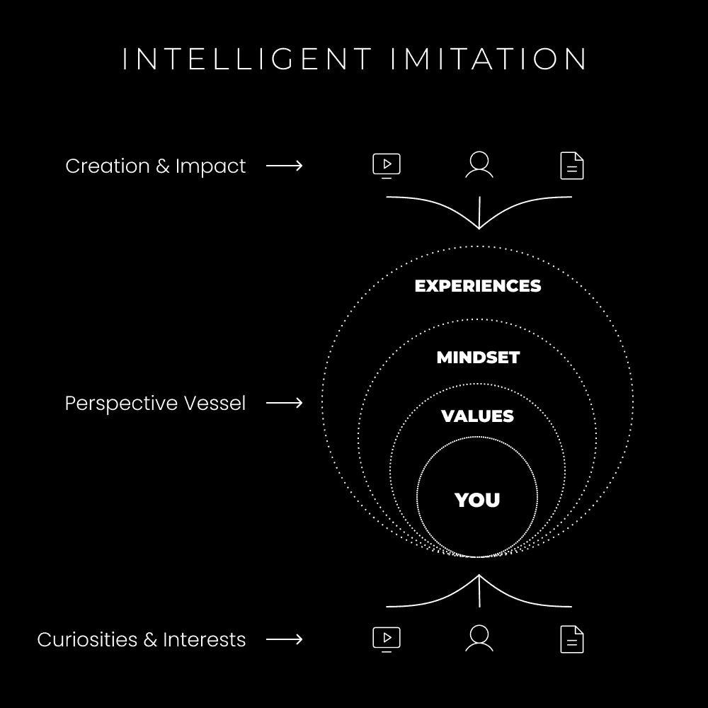

# 成功之道：如何通过模仿走向成功（而非平庸）

在本节课中，我们将探讨一个核心问题：如何通过有意识的模仿来获取成功，而不是在无意识的模仿中陷入平庸。我们将分析人类天生的模仿机制，理解视角如何塑造我们的世界，并学习一套将信息转化为个人优势的智能模仿过程。

## 你是一个天生的模仿者（这是设计好的）

从出生开始，你就在模仿周围的人。这是生存与学习的基础。你模仿父母学会了说话、走路。你模仿文化和社会规范来适应环境。多巴胺系统帮助你区分兴趣（信号）与干扰（噪音），引导你去模仿那些真正让你大脑“兴奋”的事物。

模仿本身不是问题。问题在于当**依恋**产生时——我们无意识地将模仿来的特征、信念和价值观固化为自我身份的一部分。大脑需要清晰的目标层次来理解世界。如果没有自主建立的目标，我们就会被动接受社会设定的目标（例如：上学、工作、退休），这可能与内心真正的追求相悖。

大脑需要一个连贯的“故事”来获得确定感，抵御焦虑。如果一个人没有意识到自己在模仿什么，就会紧紧依附于这个由外界塑造的身份。当身份受到挑战时，心理上会如同面临生存威胁。

因此，主动写下并完善你的个人愿景至关重要。建立一个由内在动机（如好奇心、激情、个人价值观）驱动的目标体系，能为你的行动提供清晰指引，并减少生活中的压力和焦虑。这是一个需要不断实验和迭代的终身过程。

**公式：成功 = 智能模仿 ≠ 无意识模仿**

上一节我们探讨了模仿的天性及其潜在陷阱。接下来，我们将看到，成功的关键在于将这种无意识的模仿转变为有意识的、智能的选择。

## 你是一个视角容器

一切都是视角。现实通过你的视角被感知。*可以把视角想象成相机，把感知想象成镜头*。两者的结合构成了你的世界观。人们常常基于自己的世界观来捍卫自己的视角。

*以下是一个关于转换视角力量的例子：*

假设特伦斯在社交媒体上看到一条让他生气的帖子。基于他过去的模仿和 conditioning，他可能留下一条刻薄的评论，获得短暂的多巴胺满足，但这会引发负面循环。

如果特伦斯能够暂停，并转换到一个激发好奇心的视角，他可能会想：“对方为何有此观点？他的经历是什么？” 通过接受他人有不同的视角（由他们的愿景、目标、经验构成），他就能从原本令人愤怒的情境中学到积极的东西，从而做出更有利的选择。



**核心概念：注意力是当今的货币，而新奇、积极的视角是吸引注意力的关键。** 无论是在职场、创业还是日常交流中，提供新颖的视角能让你脱颖而出，建立信任，并成为他人愿意倾听和记住的人。

***如果你掌握了视角的艺术，你就掌握了心智游戏。***

理解了视角的力量后，我们如何系统地培养它并将其转化为实际优势呢？下一节将介绍具体的智能模仿过程。

## 智能模仿过程

这个过程不仅适用于创业者，也适用于任何希望提升个人价值、建立数字影响力的人。通过追求好奇心、提炼知识并以独特视角分享，你可以在建立**信任**、表达**简单性**和实践**个性**的同时，创造机会。

以下是浓缩和理解知识、发展独特视角的四步智能模仿过程。

### **步骤 1) 选择 3-5 个你渴望成为的“导师”。**

你成为你所消费的内容。因此，要有意识地选择你的信息源。

*以下是执行此步骤的具体方法：*
+   列出3-5位深刻改变了你**观点**的人。
+   写下你最爱推荐的书及其作者。
+   记录下那些让你每次观看都感到“惊叹”的创作者（YouTuber、播客主、博主）。
+   关注那些让你觉得“他们怎么能说得如此精辟？”的社交媒体账号。
这些“导师”的组合及其观点间的**联系**，将是你创造独特内容的基石。

### **步骤 2) 不要消费。研究。**

将被动消费转变为主动研究。研究者的**视角**意味着将一切视为实验，从中提取有用的部分进行测试和理论构建。

### **步骤 3) 与自己接触并写下它。**

为避免现代干扰，你需要为真正的多巴胺信号（好奇心）创造空间。在研究时，不要机械地记笔记。等待那些真正让你感到兴奋、注意力集中的新颖观点出现，然后只记录下这些核心洞察。

### **步骤 4) 解构与提炼。**

这是形成独特视角的关键。对吸引你的观点进行深度解构，而不仅仅是肤浅理解。

*以下是根据你的核心笔记进行解构的框架：*
+   **相关主题**：这个观点属于哪个领域？
+   **核心理解**：用你自己的话简要总结。
+   **关联问题**：这个主题通常解决哪些常见问题？
+   **核心益处**：解决这些问题的主要好处是什么？
+   **潜在阻力**：人们对此可能有什么反对意见或限制性信念？
+   **个人链接**：你有哪些相关的个人经历或故事？
+   **解决过程**：解决该问题的逐步流程是什么？

完成上述解构后，尝试将所有内容提炼成一句强有力的核心观点。这句话将体现你从独特视角得出的深刻见解。

**代码示例（提炼过程）：**
```plaintext
输入：分散的笔记和想法
过程：应用解构框架 -> 分析、连接、提炼
输出：一句强有力的核心观点 + 一个完整的内容大纲（可用于文章、视频、产品等）
```
通过持续实践这个过程，你将构建一个充满实用、有吸引力且可货币化想法的网络。这些想法不仅能推动你个人前进，也可能为他人带来价值。

本节课中，我们一起学习了模仿的双重性。我们认识到无意识的模仿会让我们依附于外界赋予的身份，而有意识的、**智能的模仿**则是成功的捷径。关键在于通过培养自主的愿景和独特的**视角**，将外界信息转化为个人优势。通过“选择导师、进行研究、记录洞察、解构提炼”的四步过程，你可以系统地发展自己的思想体系，在信息时代脱颖而出，走向真正属于自己的成功。