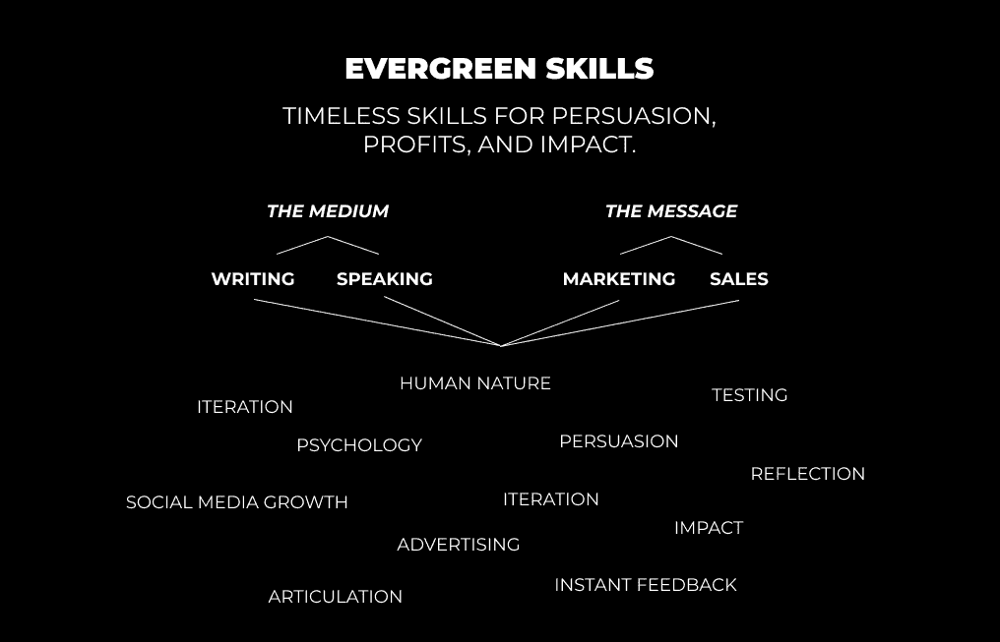
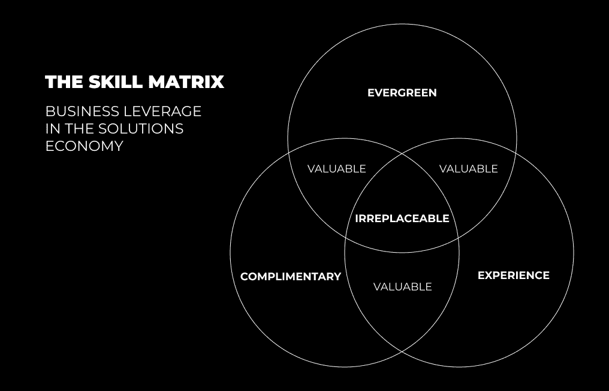

# 个人成长与在线事业：2022年必备技能指南 🚀

在本节课中，我们将学习一套核心技能体系。这套体系旨在帮助你在2022年及以后的时代蓬勃发展，建立有价值的个人品牌并实现可持续的在线收入。我们将从根本出发，探讨如何成为一个“有价值”的人，并逐步掌握那些能让你变得“不可替代”的关键能力。

## 成为有价值的人 💎

在物质世界中，你的感知价值与你所能解决的**问题数量**相关。首先，你需要在个人层面提升自己，解决健康、财富和关系等永恒领域的问题。这使你成为一个“高价值”的个体，能够吸引他人，因为你填补了他们生活中的空白。

然而，仅仅提升自己还不够。你还需要学会如何包装和传达这种价值，以吸引追随者、潜在客户和顾客。这比单纯的教育业务（如辅导、项目、数字产品）更为根本，是设定场景的必要基础。将这些技能货币化需要时间，因为这首先需要你解决好自己的问题。

在自我提升的过程中，你应该掌握以下核心技能。

### **常青技能 🌲**

许多内容创作者会推荐各种技能，但我们需要回归根本。有两类技能将**始终**保持价值，它们能让你创造并向公开市场展示你的产品。

**第一类是媒介**。媒介分为两种：写作和演讲。写作是清晰、正确演讲的基础，也是你在现代世界中组织和传达思想的主要方式。与他人的根本沟通形式就是写作。

在线有大量资源可以学习写作。关键在于，你需要让好奇心引导你，通过自我教育和探索未知来启动学习的雪球效应。一旦你学会了写作，你就能够有效地说话。

**第二类是信息**。这主要指营销和销售。这是关于如何通过写作和说话来吸引他人注意力、推广你的解决方案的技能。它涉及对广告、心理学、人性以及驱动我们决策因素的理解。没有这些理解，你无法有效地写作或说话。你可以通过自我意识和观察他人来学习这些技能。

营销和销售是你让人们认识到你的价值、激发行为改变的方式。行为改变是唯一重要的指标，因为它意味着他人将在生活中看到积极的结果，而这也是你获得报酬的方式。没有营销和销售，你将无法赚取收入。

写作、演讲、营销和销售是四种能为你铺就有利可图在线职业生涯的技能。

### **补充技能 🛠️**

补充技能能够进一步放大常青技能的影响力。它们包括摄影、视频制作、网页与图形设计、技术熟练度、音频工程、商业管理等。

这些是创造性的、技术性的和商业性的技能，使你能够展示、可视化和扩展你常青技能的效果。许多人会先学习这些技能，但风险在于，他们可能从未学会如何在线建立杠杆或以高价销售产品与服务，从而陷入“饥饿艺术家”的陷阱。因此，必须优先获取常青技能。

你的常青技能可以用来推广、销售和货币化你的补充技能。所有这些技能共同作用，展示你与个人兴趣及已解决问题相关的价值。随着你在自我教育之旅中前行，不同的项目会需要你掌握不同的补充技能。

### **关于市场饱和的说明**

大多数永恒的市场都是饱和的，充满了竞争者，其中许多还是初学者。然而，在常青技能方面，真正高于平均水平的人非常少。这是一个需要时间的游戏。请理解，通过好奇心、常青技能和少数互补技能，你完全可以赚取可观的收入。这些技能是相互渗透、相互关联的。

## **成为不可替代的人 🏆**

上一节我们介绍了如何通过常青技能和补充技能变得有价值。本节中，我们来看看如何更进一步，变得不可替代。

为了赚取生活工资（而不仅仅是生存工资），你必须变得有价值。但为了产生无限收入，你必须变得不可替代。在当今世界，变得有价值有时等同于成为商品。每个人都能提供某种形式的价值，但很少有人能提供一组独特的、适用于特定情境并能取得具体成果的技能与知识组合。

不可替代性体现在你通过设计的系统确保问题得到解决的能力。具体知识使你能够充分利用你的技能，填补他人无法填补的空白。**如果你想变得有价值，了解规则。如果你想变得不可替代，了解何时打破规则。**

这就是永恒市场、学习、解决自身问题以及经验发挥作用的地方。变得不可替代更多地关乎你解决什么问题，而非你如何解决问题。你通过技能组合应用知识的能力才是关键。

经验丰富的专家之所以不可替代，是因为他们丰富的经验。他们遵循的路径通常是：解决自己的问题 > 获得经验 > 开启服务业务（咨询、辅导、自由职业）> 获得更多经验并开始开发独特的成果获取系统 > 加入坚持和迭代 > 将系统产品化 > 重复此循环。

更进一步，变得不可替代的道路需要开放的心态（能够转向和学习）、研究你主要服务领域的所有周边领域、不固守某一种做事方式等。如果你把自己局限在一个框框里，你的收入也会受到限制。

你需要专注于在减少投入时间的同时增加收入。不断迭代、系统化、产品化，不要因为服务业务达到每月2万美元就满足，尤其是当你可以用更少的工作时间达到每月100万美元时。

对于大多数人来说，起点是从常青技能和互补技能开始。通过扩大受众来建立杠杆，开启服务业务，免费提供帮助以发展你的系统。之后，道路自然会向你显现。

---

**本节课总结**

本节课中，我们一起学习了在2022年蓬勃发展的核心技能路径。我们首先探讨了如何通过解决个人问题成为“有价值”的人，并重点掌握了**写作、演讲、营销、销售**这四项常青技能，以及能放大其效果的**补充技能**。随后，我们深入了解了如何通过积累具体知识、经验和开发独特系统，从“有价值”进阶到“不可替代”，从而创造无限收入。记住，这是一个由好奇心驱动、需要时间和迭代的旅程。从核心技能开始，逐步建立你的个人事业体系。