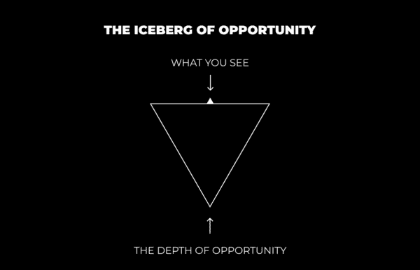
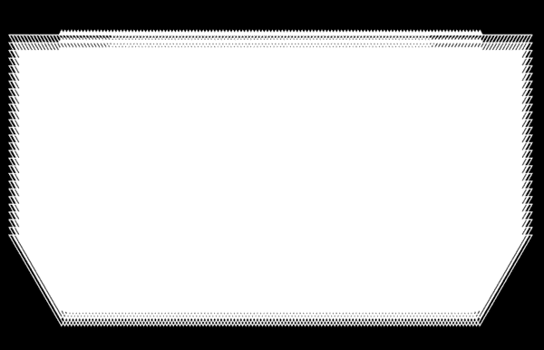

# 个人成长与商业洞察：从“蘑菇”中获得的启示

在本节课中，我们将探讨如何通过培养深度好奇心，来发现生活与商业中潜藏的无限机会。我们将学习“机会的冰山”模型，并掌握将其转化为个人成长与事业成功的具体路径。

***

> 原文：[`thedankoe.com/letters/what-mushrooms-taught-me-about-life-and-business/`](https://thedankoe.com/letters/what-mushrooms-taught-me-about-life-and-business/)

过去几年，我断断续续地尝试使用裸盖菇素（俗称“神奇蘑菇”）。

***免责声明：在摄入任何可能改变心智状态的物质前，请务必自行研究并保持审慎。***

上个月，我重新开始尝试。我每周微剂量服用1-2次，因为我尊重这种物质的潜在力量。

上一次经历中，我学到了一个至关重要的教训。一个关于蜂巢，以及那些就在你眼前、让你能够欣赏、理解、掌握并将周围一切货币化的无限机会的教训。

***

## **🧊 机会的冰山**

上一节我们提到了一个关于蜂巢的启示，本节中我们来看看这个比喻如何展开。

让我们从蜂巢开始。是的，就是蜂巢。那些毛茸茸小飞虫创造的美丽而美味的副产品。上次微剂量体验后，我去本地农贸市场，被免费品尝的原始蜂蜜吸引，并买下了一块精美的蜂巢样本。

1磅蜂巢

现在，当大多数人看到这块蜂巢时，他们的思考就停止了。它看起来美味，他们可能会购买，但他们看不到其背后的*深度*。他们未能从好奇心中获益，因为他们习惯了分心。被下一个待办任务、需要查看的通知、持续不断的内心对话等等所占据。

*当你保持好奇时*——也就是说，当你全神贯注，不被“脑海中的杂音”、消极情绪或其他任何让你与理想自我产生隔阂的事物分心时——*你便向世界敞开了自己*。你让内在的直觉去注意周围无限的新奇体验。这不是大公司用来让你陷入廉价多巴胺循环的虚假新奇事物。

通过那份好奇心，你会发现蜂巢不仅仅是蜂巢。你会提问。你会思考。你会挖掘那些能在大脑中创造新神经连接的新奇事物。这会催生能带来真正动力、激情、目标和潜在精通的化学物质。

以下是你可以提出的问题列表：
*   创造蜂巢的过程是什么？
*   完成它需要多长时间？
*   这种特定蜂蜜来自哪种植物、树木或花朵？
*   养蜂人的角色是什么？
*   他们如何制造蜂蜜？
*   它是如何到达我手中的？
*   人们为什么应该吃蜂蜜？
*   蜂蜜含糖太多吗？
*   糖对健康有益还是有害？
*   什么是生物能量营养学，它为何提倡摄入大量糖分？
*   蜂蜜加在咖啡里好喝吗？
*   咖啡是如何制作的？
*   我能制作一款添加了原生蜂蜜的咖啡，为生物能量营养学爱好者打造品牌，并将其发展成价值千万美元的生意吗？

机会的冰山

你明白这可以探索得多深吗？你明白不让自己被现代社会的干扰——垃圾食品、无脑社交媒体、戏剧冲突以及其他所有外部刺激——所淹没的重要性吗？**因为你在压制自己天生的、孩童般的好奇心。你在压制自己的潜力。**

*醒来吧。*

***

### **🌌 现实的无限潜力**

“机会的冰山”适用于你周围的一切。不仅仅是物质对象。思想、情感、知识等也是如此。它在现实的所有维度上无限延伸。

蜂巢是一座冰山。白色蜂巢的蜡质壁是一座冰山。“这个”这个词是一座冰山。你周围的一切都是一座包含着无数冰山的冰山。

冰山在X轴上

你可以开始看到这有多深。你可以开始理解无限、真理、上帝、源头、万物等不可测度的本质。

*这就是现实的本质。*

冰山在X和Y轴上

这并不止于二维。我们可以添加一个Z轴。我们可以添加ABCDEFG轴。这描绘了现实：在无限方向上跨越无限维度的冰山。当你处于当下时，你渴望探索未知——而不是投射到熟悉的过去或可预测的未来。不要被你的负面感知、意识形态、偏见、信仰以及你紧紧抓住的一切所蒙蔽。不要停留在同一个熟悉的舒适泡泡里，重复已经历过的体验，压制你的直觉，那等同于过早的精神死亡。

***

### **🛤️ 通往无限未知的四条路径**

当然，你不能对所有事情都一头扎进去。你不想让自己不知所措。你不想活在潜在的可能性中。那只是精神上的空想。

相反，我们想要与当下时刻深度连接。播种并培育那些将孕育出我们理想现实的种子。你可以通过追求你的人生事业来实现这一点。追随你的好奇心，让自然机制（神经化学物质在目的和激情中起辅助作用）发挥作用，并持续走向自主和精通。

在这里，你可以选择四条路径。

以下是四条具体的实践路径：

1.  **欣赏** —— 不要无意识地生活，对一切做出情绪化反应。要学会欣赏事物蕴含的深度。观察那些因看到深度并选择追求而享受事物的人。对新事物保持开放，因为它并不像表面看起来那么肤浅。对当下保持敬畏。带着欣赏和感恩在生活中前行。

2.  **理解** — 当你产生深入探索的冲动时，不要压制它。**“闪亮物体综合症”** 只在你完全放弃改进之路时才会成为问题。学习和理解事物总会对生活无限互联的本质有所帮助。我的个人经历就是直接例证。理解所有方面使你比狭隘的“单方面专家”更具专业知识。理解，而非无知，意味着直接经验。

3.  **精通** — **理解** 使你成为博学者（Jack of all trades）。**精通** 使你成为某个领域的专家（Master of one）。这是当今市场和社会中的有利位置。这需要尝试、犯错和承担小风险。你通往精通的道路可能会改变。你唯一需要做的就是保持当下，并走在正确的道路上。这就是你的人生事业。

4.  **赚钱** — 如今，你可以将几乎任何事物货币化。我在上面给出了一个例子：针对生物能量营养学爱好者的原生蜂蜜咖啡。如果我想，我可以将这个生意做到数百万规模……但这不是我的人生事业。这不是我的直觉引导我去的地方。

***

### **🚀 现在开始精通过程**

为了自我超越，你必须首先实现自我。为了自我实现，你需要玩转金钱游戏。你需要足够的资本和时间去追求你的“使命”，即最符合你独特本质的事情。

由于我们经常在此讨论商业，我将给你一些步骤。这些是我与每一位通过互联网建立影响力的成功人士交流时，总结出的步骤。

再次强调，不是每件事都需要货币化。全力以赴去做一件事，直到你完成那个目的和人生阶段。

以下是开始精通过程的具体步骤：

1.  **对一个“冰山”产生好奇心**。好奇心是潜力的火花。
2.  **自我教育**。利用互联网上的信息。阅读书籍、观看讲座、收听播客。购买有 proven results 的课程或教练服务。**学习**。
3.  **开始一个真实世界的项目**。通过你选择的服务或商业模式获得实践经验。做免费工作，模拟未来收费的工作。帮助他人，理解他们以及你为他们解决的问题。这将加速学习过程——你不能跳过这一步。（这**不一定**出于商业目的。只需在真实世界中**构建**一些东西。）
4.  **学习永恒的技能**。核心信息技能：营销和销售。核心媒介技能：写作和演讲。所有“冰山”都内嵌这些基础。从基础开始。这些技能能帮你将知识打包成解决特定问题的方案，并通过现代工具和平台展示与传递你的价值。
5.  **建立或购买分销渠道**。我最喜欢的流量来源是个人品牌（在社交媒体上）。它让我能追求兴趣、传授知识，并将任何符合我生活方式的事物货币化。这就是我帮助他人建立的东西。从简单且可扩展的平台开始，比如 Twitter，然后扩展到其他平台。你也可以尝试付费广告、SEO等其他流量来源。
6.  **推广你的“产品”**。当你有了可以通过社交媒体免费分发价值的产品或服务，并掌握了沟通价值的技能后，接下来就是推广。
7.  **产品化并扩展规模**。如果你想雇佣员工并扩大规模，可以去做。但不要低估一人企业模式的威力。在线教育和个人影响力正在增长，任何人都可以参与。一旦你取得了成果，就可以将你的知识打包成无限复制的数字资产。你可以出售你是如何制作“产品”的，也可以出售你是如何销售“产品”的。只要创造的价值超过成本，你可以出售任何东西。

***

## **📝 总结**

本节课中，我们一起学习了如何通过培养深度好奇心，发现生活与商业中“机会的冰山”。我们探讨了现实的无限潜力，并规划了欣赏、理解、精通、赚钱四条实践路径。最后，我们拆解了从产生好奇到产品化扩展的七步精通过程。

追求人生事业、采用一人企业模式，在我看来，是最令人满足的道路之一。世界正在向这种去中心化模式发展，而你仍处于早期阶段。重视自我教育、自给自足和个人责任的人将脱颖而出。

通过理解本节课阐述的概念，你可以开始从大多数人视为寻常的事物中，为自己创造美好的生活。

因此，我留下这个最后的提醒：醒来，停止让随机事物偷走你的注意力、专注力和多巴胺。

先与自己的内在“连接”，才能与世界、宇宙、上帝以及表象之下的本质连接。

从这个状态出发，跟随你新发现的直觉和好奇心，深入生活未知的领域。

这是你学习生活所设课程的惟一方式。

最后一个问题……

你怎么还会感到“无聊”呢？

*丹·科*