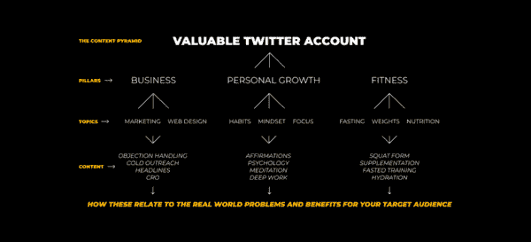

# 在线商业基础：简单的三点在线商业模式

在本节课中，我们将学习一个极其简化的在线商业模式。这个模式由三个核心部分组成，旨在帮助初学者理解如何从零开始，通过社交媒体、邮件列表和产品，构建一个可持续的在线业务。

在一个过度复杂化的世界中，商业其实可以很简单。许多人认为创业需要启动资金、顶尖技能或大量粉丝，但事实并非如此。让我们退一步，看看达到每月稳定收入需要哪些基本要素。

三点在线商业模式如下：

1.  社交媒体账号
2.  邮件列表
3.  产品

这三个部分相互关联，共同构成一个完整的商业闭环。

## **第一点：社交媒体账号**

上一节我们介绍了商业模式的核心框架，本节中我们来看看第一个组成部分：社交媒体账号。

你的社交媒体账号是你的新简历。你的内容展示了你的专业知识、兴趣和个性。随着付费广告成本上升，社交媒体账号成为了一个免费的有机流量来源，你可以将流量引导至你的产品。

许多人认为社交媒体增长很困难。确实如此，但存在经过验证的增长和货币化方法。在不知道如何操作的情况下盲目增长是低效的。

*备注：你不需要大量粉丝就能赚取可观收入。粉丝有帮助，但并非必需。你可以在建立影响力的同时获得收入。*

这就像学习一款新游戏。起初因为不懂规则而感到无聊，但当你学会规则、基础操作和获胜方法后，游戏就变得有趣了。社交媒体也是如此。规则是平台的服务条款。基础是增长机制，即如何获得最大曝光并将读者转化为粉丝。机制体现在你的内容中。以Twitter为例，机制在于你撰写与兴趣相关的有力内容的能力。

由于社交媒体账号是品牌的门面，你该如何开始？以下是几个关键步骤。

### **创建一个内容金字塔**

内容金字塔包含了你想要讨论的所有主题，通常由2-3个主要支柱向下分支。例如，我的主题是自我提升、在线商业和对绩效的灵性看法。

主题可以是任何事物。如果网络上已经有人就此话题培养了观众，你同样可以做到。另一个好指标是：如果你能和朋友就某个话题聊上几个小时，那么你也可以在网上与人交流。

### **打造一个可追随的档案**

不要过度思考这一步。参考成功者的做法。拥有一个得体的头像、一个能回答“对我有什么好处？”的引人入胜的个人简介，并设置一个指向你产品的链接，以表明你是一个创作者，而非消费者。

需要持续问自己的一个问题是：我的账户看起来像有10万粉丝的样子吗？如果不是，就做出改变。

### **理解当前增长策略**

这仍然是一个游戏。你需要了解对初学者而言，哪种内容能带来最大增长，因为初期增长最为困难。

想想看，流行的YouTube博主并非一开始就发布旅行vlog。他们通过发布符合算法的“教程”类内容起步。目前，类似“我尝试了X 30天”的内容很受欢迎。

在Twitter上，当前的策略是发布简洁的推文和Medium风格的线程。加入讨论内容策略的社区，或关注那些正在增长的账户，以了解趋势。

### **保持一致性**

最终，你可能不需要时刻关注策略。但如果你能坚持一年，不断修正错误，你将很可能拥有一个五位数的粉丝群。

你的社交媒体账号将成为你销售产品、建立重要联系和为未来品牌积累优势的渠道。如果你从服务型业务开始建立现金流，并拥有大量受众，你未来可以启动任何与兴趣相关的业务并取得成功。

## **第二点：邮件列表**

上一节我们探讨了如何利用社交媒体吸引流量，本节我们将讨论如何通过邮件列表将这些流量转化为可持续的资产。

一个不幸的事实是：你并不真正拥有你的社交媒体账号。那里也可能不是一直进行销售的最佳场所。因此，你应该从一开始就建立你的邮件列表。你不需要立即频繁发邮件，但开始收集邮箱地址是明智之举。这可以防止因账号问题而失去联系渠道，因为你真正拥有的是你的邮件列表。

当你有时间后，可以开始撰写每周通讯。这些内容未来可以转化为自动邮件序列、社交媒体线程、博客文章或视频。现阶段，专注于发展你的想法，并测试哪些内容能引起受众共鸣。

当你的产品或服务准备就绪时，你可以创建能自动完成销售的邮件序列。之后，你只需在社交媒体上推广你的通讯，销售就会自动进行。

以下是建立邮件营销的基本流程：

1.  **欢迎序列**：发送一封欢迎邮件，介绍你谈论的内容、品牌愿景以及订阅者可以期待什么。
2.  **故事介绍**：发送2-3封邮件，讲述你的个人故事或你试图解决的核心问题。
3.  **销售序列**：将订阅者引导至销售序列。这些邮件应提高他们对问题的认知，展示你的解决方案，并加入一些紧迫感以促成购买。

仅凭社交媒体账号和邮件列表，你就可以随着时间的推移获得丰厚收入。这是一个非常轻量级的单人商业模式。

## **第三点：你的产品**

在建立了流量渠道（社交媒体）和客户资产（邮件列表）之后，本节我们来看看商业模式的核心：你的产品。

对于初学者，你的产品就是你所销售的商品或服务。如果你想赚钱，拥有产品是必不可少的。当你还没有稳定的主动收入时，不要过分追求被动收入。

“我该卖什么？”以下是一些思考方向：

*   你对什么感兴趣？
*   你在哪些方面有经验或取得过成果？
*   你是否通过试错解决了某个生活难题？你能帮助他人避开这些弯路吗？
*   **你关注的人正在卖什么？你能卖类似的东西吗？（市场已经存在，无需重新发明轮子。）**

例如，我做了3年自由职业，成功后写了一本关于此经历的书。我知道市场上已有自由职业书籍，于是我创建了自己的版本，卖给那些信任我而非竞争对手的人（个人品牌消除了直接竞争）。

在创建产品时，有几点需要注意：

*   人们不关心产品或服务的所有细节，他们只关心你能带来的**具体结果**。
*   即使你没有现成的成功案例，你也可以通过提供有吸引力的**保证**来建立信任，这能帮助你获得收入。
*   你必须尽可能简单、直接地规划出从问题（A点）到解决方案（B点）的路径。你让买家越容易将方案融入生活，效果就越好。**系统化**是关键。
*   不要试图解决所有问题。专注于一个迫切的、根本性的问题。测试不同的方法，然后加倍投入最有效的那种。

归根结底，你面临的问题通常是以下两者之一：流量问题或产品问题。正如JK Molina所说：

> “总是流量或报价问题”这个概念改变了我的人生。
> 钱不够？改善你的报价或者获取更多的流量。
> 女孩不够多？提高你的（吸引力）或者遇到更多的女孩（扩大社交圈）。
> 总是有解决方案。而且它就是这两个之一。

如果你无法赚钱，原因就在于此。其他任何障碍，都可以通过保持行动和持续优化来解决。

## **总结**

本节课中，我们一起学习了一个简单而强大的三点在线商业模式。

1.  **社交媒体账号**：作为你的数字简历和免费流量入口，通过创建内容金字塔、优化个人资料、理解平台规则并保持一致性来构建。
2.  **邮件列表**：作为你真正拥有的客户资产和自动化销售渠道，从收集邮箱开始，逐步建立欢迎序列和销售序列。
3.  **你的产品**：作为商业变现的核心，聚焦于你能提供的具体结果，并不断优化你的产品（报价）以解决市场问题。

这个模式的精髓在于其系统性和关联性：社交媒体带来流量，邮件列表沉淀和培育客户，最终通过产品完成价值交付与变现。记住，成功的关键在于开始行动，并在过程中持续学习和迭代。