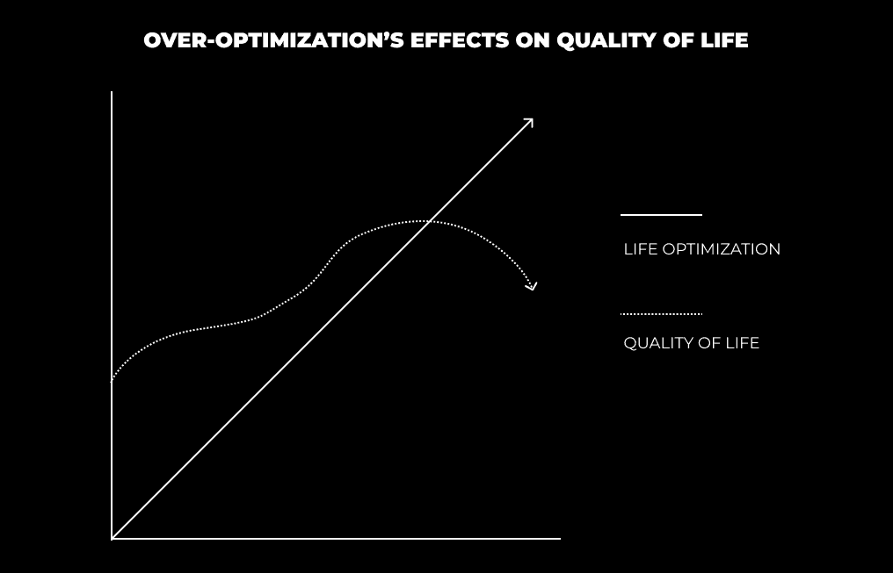
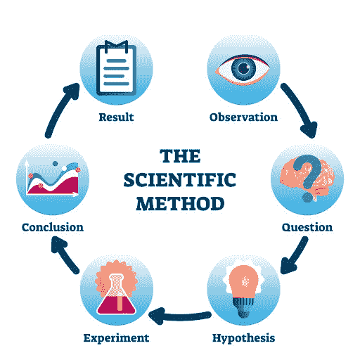

# 生活哲学：从十年失败中汲取的教训 🧠

在本节课中，我们将一起学习如何从个人经历，特别是从失败和尝试中，提炼出可持续的生活与成长哲学。我们将探讨如何避免教条主义，找到平衡，并通过科学的实验方法来构建个人化的成功体系。

---

在过去的六个月里，我的生活充满了突破、宏大的想法和指数级的进步。我一直在尝试改善生活的各个方面——心智、身体、精神、事业——经过十年的起伏后，事情开始变得清晰。

当我开始举重时，我在一年内就达到了“愚昧之巅”。

*邓宁-克鲁格效应*

我沉迷于学习训练和营养的基础知识。我研究了莱恩·诺顿、艾伦·阿拉贡、埃里克·赫尔姆斯，以及像马特·奥格斯、克里斯·拉瓦多、克里斯·琼斯、维特鲁维安体质、迈克尔·科里和罗布·利普塞特等元老级健身影响者。

我成为了 **IIFYM（如果它符合你的宏量营养素）** 的狂热信徒。对我来说，唯一重要的是卡路里和宏量营养素。我吃了很多冷冻玉米卷、泡芙，以及任何我能找到的东西来摄入碳水化合物、脂肪和蛋白质。

这在一定程度上是有效的。我增加了大量的肌肉和力量。我在高中的最后一年卧推达到了275磅——但我很快意识到，每晚玩《光环3》到凌晨3点，喝大量胡椒博士汽水是不可持续的。所以我开始尝试。

---

## 生活哲学：2：不存在“最佳”方案 🏆

上一节我们看到了追求单一“最佳”方案的局限性。本节中，我们将探讨为什么执着于寻找完美方案本身就是一种迷思。

在过去的两年里，我尝试过素食、生酮、纯肉、低碳水、高碳水以及“贫穷大学生”饮食。

最近，我对“原始肉食”饮食变得非常教条。简单来说，这种饮食主要包含器官肉、肌肉肉、动物胶质部分、时令水果、鸡蛋、乳制品和一些其他食物。它非常强调寻找你能找到的最高质量的食物。

我之所以如此教条，是因为我正处于一种“清除模式”。我戒掉了酒精、社交活动以及任何其他让我分心的事情，以实现我185磅的体重目标。我已经尝试了3-4年，最终对缺乏进展感到厌倦。

现在我已经达到了那个目标，我感觉自己正从“开悟之坡”转向“可持续平台”。

以下是我最近的领悟：

---

## 生活哲学：3：通过强度循环找到平衡 ⚖️

理解了“最佳方案”的迷思后，我们需要一种更灵活的方法。本节将介绍如何通过周期性的高强度努力来建立可持续的平衡。

奋斗文化喜欢美化“僧侣模式”和高强度。当我感到被拉向一个较小的目标时，我也喜欢古老的僧侣模式——激光般的专注、深度工作、在一个月内完成一年的工作量、因为想法不断涌现而失眠，以及享受多巴胺和内在驱动的浪潮——但**可持续性**必须被考虑在内。

如果你长时间处于高强度或过度优化的状态，你会在生活质量上遇到收益递减的点。

当我开始过度优化时，**生活失去了活力**。事情变得有压力。除了我的日常例行公事之外的一切都被视为负担。如果我不能控制生活中的每一件小事，我就无法享受生活本身。

**试图完美化你生活的每一个领域会让你憎恨不完美**。当你这样做时，你阻止了自己享受人类境况中固有的不完美。

自然是完美的。自然就是如此。人类被赋予了思考的能力。但过度复杂的思考误解了自然的不完美。社会模仿自然——过度优化并不是一种生活方式。

回家度假看望家人，只会让我思考我能吃什么，我花了多少钱，以及我什么时候能回家“重新开始”。我可以想象自己评判他们的“正常”行为。无法享受和家人在一起的时光。

然而，这些高强度和优化的状态是必要的。没有它们，我就无法在脑海中巩固这些结论。所有的自我提升都源于意识。通过深入未知来找到意识。**你不能改善你不知道的东西**——你不能意识到你不知道存在的东西。

当你从这些高强度状态中过渡出来时——你将在你指数级改进的任何事物上从一个更高的基准出发。通过强度，你会迅速遇到障碍。**你在一个月内获得一年的经验**。当你遇到过度优化的隐喻性墙壁时，生活会给你一个教训。你会从中学习吗？

---

## 生活哲学：4：基础与坚持才是关键 🔑

通过强度循环，我们达到了更高的基准。但如何维持这个基准呢？本节将探讨建立并坚守个人基础原则的重要性。

基础是当事情变得过于激烈（或过于松懈）时你可以依靠的东西。它们是你获得成果的系统。它们是推动进步的“杠杆”。

当你在追求个人和事业发展中感到迷失、不知所措或没有方向时，回到基础——把它们写下来。

以下是我当前的健康基础：

+   **饮食核心**：每天摄入生肝脏、骨汤和肌肉肉，以实现伪原始肉食饮食。这涵盖了大部分必需营养素。
+   **碳水补充**：用水果、白米和块茎类蔬菜补充碳水化合物。
+   **发酵食品**：如山羊奶酸奶。
+   **基础补剂**：我的“启迪灵药”将保持基本不变。
+   **训练频率**：每周进行3次全身训练。
+   **有氧运动**：每周跑步和短跑4次。
+   **轻度活动**：周末进行如远足等轻度活动。
+   **蛋白质摄入**：每磅体重摄入1克蛋白质。
+   **压力管理**：进行压力和情绪调节。

现在我开始参加更多的社交活动，我正在回归上面提到的 **80/20规则**。如果我能坚持80%的时间，那么可以说我将继续在健康方面取得指数级的进步。酒精仍然被排除在外，因为它目前带来的麻烦多于好处。

让我感到惊讶的是，那些把可持续性放在心上的“灵活节食者”群体。更进一步，你会有像Instagram上的Timbahwolf这样的人，他吃得乱七八糟，但体形比99%的社交媒体影响者都要好。

洛奇吃煎饼。迈克尔·菲尔普斯抽大麻，吃很多披萨。我们在社交媒体上看到的就是我们暴露给自己的。我完全忘记了过去我是从哪里来的，可能错误地归因于我的进步。

**从我的反思来看**：对我精神清晰度、皮肤和能量水平影响最大的是**不过量进食、保持精瘦、有目标、压力调节、训练和运动**。并不一定是许多人推崇的超高质量高脂肪饮食。大多数人停止过量进食，开始运动，保持一致性，并锁定一些其他原则——然后他们才会说这是某种魔法，比如吃生肝或进行生酮饮食。看起来健康行业人们谈论的原因和效果似乎被误认了——或者被极化来推广产品。

我并不是要改变你们的观点。我是要你们以批判性的态度去面对生活。保持开放的心态。不要限制可能导致快乐的事物，因为你限制了你对一个特定领域的所有领域的意识和知识。我重视批判性思维和细微差别——我将会更多地朝这个方向发展，而不是对一种特定的饮食方式过于教条。

我是不是要开始大吃垃圾食品？不。我会像你们一样进行测试和实验。从这个新的基准和意识水平出发，我能够准确看到对我的身体产生的短期影响。

当旅行时，我肯定不会错过像意大利面、面包和其他碳水化合物来源这样的常见被诋毁的食物。

如果你想要摆脱你已订阅的任何健康理念或宗教，我已经开始收听一个较老的乔·罗根播客，嘉宾是莱恩·诺顿和多姆·达戈斯蒂诺（他们辩论关于灵活饮食和生酮饮食）。

这就是这些“强度周期”的美丽之处。我的健康哲学是我过去10年改善过程中获得的经验的综合。它得到了来自各个方面的研究和经验的支持。这是强大的，并且对我来说，我的生活的其他支柱也是如此。

这并没有消除有纪律的生活方式的好处。这正是有纪律的生活方式。这种“平衡”的生活方式比完全消除事物更难实现——但潜在回报更高。这就是为什么需要强度来找到平衡。我多年来一直在原地打转，因为我害怕全力以赴。我害怕学习生活中在未知中等待我的教训。

这非常不同——但也很相似——与我的之前饮食相比。我是通过有意识的实验达到这个阶段的。

---

## 生活哲学：生活是一系列科学实验 🧪

我们已经讨论了健康领域的实验，但这个理念可以扩展到所有方面。本节将介绍如何将“项目心态”和“科学方法”应用于生活的各个领域。

我在这里一直在谈论健康……但这适用于生活的所有领域。

*每个话题都可以辩论和研究到地球尽头。* 如果我想对整体健康持教条主义，我可以找到研究和有说服力的论据支持这一点。但这没有乐趣。乐趣来自于保持开放的心态，把事物保持在可能性的领域，质疑一切，并通过直接经验巩固一个细微的观点。

生活就是实验。了解你喜欢和不喜欢什么。看到什么有效，什么无效。慢慢地提升你性格中持有的特质、技能和智慧。这些经验的小提升和升级导致你在人生游戏中取得巨大成果。

对于我来说，我在大学里换了六次专业，才接触到编程。这导致了一场由多巴胺驱动的学习编程的狂欢。这导致了我尝试自由职业和其他在线商业模式。这导致了我创办了“现代精通”。进步是巨大的。

如果你不知道要追求什么——你的人生工作、你的目标、你的激情——**你必须开始实验**。你需要把东西扔到墙上，看看什么会粘住。*你需要尝试足够多的事情，直到你体验到那种内在的驱动力，它把你拉入高强度状态。* 这要归功于多巴胺。多巴胺将信号与噪音分开。多巴胺告诉你你正在做正确的事情。

你如何开始实验？你把你生活的各个方面都当作一个科学项目来对待。

*科学方法*

你的身体是一个项目。你的健康是一个项目。你的关系是一个项目。你的事业是一个项目。所有这些都包含着更多的项目。“项目心态”是强大的。我的室友开始把他的身体当作一个项目来思考。这个简单的行为让他跟踪他的进步，减掉了80磅，并注意如何在这个项目上“工作”。

项目意味着一个期望的结果（改进），完成步骤（目标和指标），以及将你推向完成的行为（优先事项）。

实验意味着你需要考虑的风险、意图、测试和迭代。这意味着你必须坚持到底。在事情开始变好之前，你不能放弃。

它们也意味着失败。并非所有实验都成功。当你把它当作一个项目来思考时，更容易从结果中抽身。你将失败视为迭代和改进的机会。失败是对需要改进之处的反馈。回到意识层面——**你不能改善你不知道的东西**。

你需要带着开放和好奇的心态进入你的实验。这将留出提问的空间。好奇心由问题激发。问题：如果我尝试这个我从未尝试过的事情，我的生活会是什么样子？

你自然会感到一股冲动，想要深入未知。如果你没有这种感觉，继续提问，直到你感到充满活力。这是你的冒险召唤。一个成为未知探索者的召唤。一个开始实现你潜能的召唤。

---

## 生活哲学：6：生命的意义在于传承你的经验 📖

最后，当我们通过实验积累了经验，这些经验就构成了我们独特的价值。本节将探讨如何将个人经验转化为可以分享和传承的智慧与事业。

实验 = 经验。

实验是找到对你有效的方法。实验是形成你个人健康、财富和人际关系哲学的方法——让你能够传承你的教训并从中创造价值（这可以说是古代和现代教师们所认为的生命意义，即自我超越）。

实验是形成你人生哲学的方法。一本操作手册，让你保持在愉快、可持续和满足的道路上。

由于我们在这里谈论了很多关于商业的内容——这完美地结合在一起。在我们的案例中，商业——在线商业——是你追求你人生工作的载体。你的人生工作包括追求你的兴趣（实验），成为一个细分市场的专家（理解如何营销、销售和分销），以及以用户可以消化和实施的方式打包你的经验。金钱是你不可替代的价值的副产品。

---

### 总结

在本节课中，我们一起学习了如何从十年的尝试与失败中构建个人生活哲学。我们首先打破了寻找“最佳”方案的迷思，然后学习了通过**强度循环**来找到动态平衡。我们认识到建立并坚守个人**基础原则**的重要性，并学会了将生活视为一系列**科学实验**，用“项目心态”去探索和成长。最后，我们理解了这些个人**经验**的价值，它们不仅可以指导我们自己的生活，还可以被分享和传承，成为我们事业和人生意义的基石。记住，成长不是寻找一个固定的答案，而是持续实验、学习和调整的旅程。