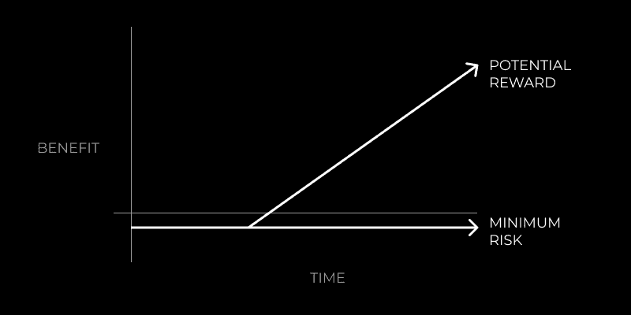

# 生产力提升：专注工作的力量 🚀

在本节课中，我们将要学习如何通过每天仅 4 小时的专注工作，来显著改变你的生活轨迹。我们将探讨注意力的价值、识别高回报机会的方法，并掌握一套进入并保持深度专注状态的实用技巧。

---

能够有意识地引导你的注意力，不仅能节省时间，还能节省金钱（参见：[注意力经济](https://markmanson.net/attention)）。

+   主流新闻机构通过制造恐惧来将你的注意力货币化。
+   社交媒体账户通过“有共鸣”且常带自我贬低性质的梗来窃取你的注意力。
+   Twitter、Instagram 和 Facebook 精确地知道哪些颜色、主题和内容风格能让你兴奋。
+   总有东西可以填补无聊带来的空虚。
+   就在刚才，我点击查看了我的 Twitter 通知。

从宏观角度看，这是现代世界面临的一个重大问题。

在心理健康方面，人们关注的是他们的想法，而不是想法背后的成因。
在身体健康方面，人们关注的是短期快乐，而不是长期能量。
在财务健康方面，人们关注的是快速致富的方案，而不是可持续的业务增长。

我们不是来讨论这些问题的。我们是来讨论专注工作的，但你可以从中看到注意力经济所造成的影响。

专注是一种货币，我们必须明智地投资它。

---

## 风险最小，潜在回报最大 💎

注意力经济只有在你是消费者时才是灾难性的。

机会像杂草一样涌现，为了抓住它们，你需要成为生产者。

你需要专注于建立那些风险最小但有可能带来巨大回报的事物。

这些被称为**非对称赌注**。

在过去 5-10 年中出现的一些机会（你仍然可以利用）：

+   **加密货币**
+   **建立社交媒体受众**
+   **提供专业化的自由职业服务**
+   **创办一家营销公司**
+   **将你的专业知识产品化并在网上销售**
+   **开始播客或博客**

四年前，我开始从事网页设计自由职业。这不需要一分钱启动资金，只需要在 YouTube 上投入一些时间学习，但有可能取代你的全职收入。

一年半前，我创建了一个 Twitter 账号，它已经增长到 4 万名关注者，并让我从为客户工作的业务模式中转型出来。

现在，我正处于博客、YouTube 频道和播客的起步阶段。鉴于我遵循了正确的公式，我毫不怀疑这些会带来巨大的回报。

> **公式：前期小额投资 + 持之以恒 + 迭代 = 指数级回报。**

我的所有成功，无论大小，都建立在非对称赌注之上。

那么，负责产生结果的载体是什么？是**专注的工作**。

也就是说，通过为世界增加价值，一次投入一小时，将我的专注力投入到注意力经济的“股票市场”中。

---

## 4 小时比你想象的要多 ⏳

上一节我们介绍了非对称赌注的概念，本节中我们来看看如何通过专注来高效执行这些赌注。我的挚友乔伊（[@heyjoeyjustice](https://twitter.com/psypreneur)）是一位心理表现教练。

他和许多其他人都已证明，通过保持专注，你可以将工作时间减半。

你在专注工作 4 小时内能完成的事情，比在分心状态下工作 8 小时还要多。

没错，即使是 1 小时的专注工作也能带来很好的回报，尤其是对于那些有其他耗时义务的人来说。

要开始你的赌注，有一个先决条件：你必须有一些你想要追求的兴趣或好奇心。如果你不主动学习，将很难找到可以从中获利的机会。

一旦你学会了，就必须将其应用于现实世界。

### 乔伊的进入专注工作 3 步法

在开始之前，请准备一本实体笔记本和一支笔。

**步骤 1：头脑风暴**

这个步骤有两个目的：
1.  清除内心的干扰（各种想法和思绪）。
2.  确定你为特定项目需要完成的精确任务。

尽情发挥，写下所有想到的事情。这不仅仅局限于“工作”。从家庭待办事项到本周购物清单，再到“工作”相关的事情，都可以写下来。

**步骤 2：分类与优先级排序**

为任务创建分类，例如：
+   家庭事务
+   社交成长
+   产品推广
+   寻找自由职业机会
+   客户工作
+   人际关系
+   健康

为了确定优先级，可以考虑使用**艾森豪威尔矩阵**。

如果你无法决定某件事是否优先，就抛硬币。不知道是否优先通常意味着它不是优先事项。抛硬币可以节省你的精神压力。

完成这一步后，你应该明确每个类别中接下来几天内必须完成的 2-5 个任务。

**步骤 3：时间块与安排**

现在你知道需要做什么了，是时候将其固定下来。安排时间块能让你的大脑为行动做好准备。

花 10 分钟时间，将你的任务添加到日历或你最喜欢的计划工具中。

工作时使用**番茄工作法**——50 分钟专注工作，10 分钟主动休息（离开你的椅子）。

从小处着手，逐渐增加工作量。从每天 1-2 小时开始，养成习惯后再相应增加。

安排时间块每周不应超过 15 分钟。

---

### 乔伊的快速焦点保持技巧

上一节我们学习了如何规划专注工作，本节中我们来看看如何在工作中保持专注。以下是几个实用技巧：

**技巧 1：通过减少不确定性来增加清晰度**
+   战斗、逃跑或冻结——没有清晰度，你将无法“战斗”。
+   这可以通过再次执行上述步骤 1-3 来实现。

**技巧 2：消除干扰**
+   将手机设置为勿扰模式，并将其从桌子上移开。
+   关闭不必要的浏览器标签页。
+   如果需要，换个环境（咖啡馆总是不错的选择）。

**技巧 3：利用音乐**
+   听纯音乐而不是带歌词的音乐。
+   电影或你最喜欢的视频游戏原声带。
+   《星际穿越》、《黑暗骑士》或任何汉斯·季默的作品都能产生神奇的效果。
+   模拟波（如白噪音、粉红噪音）。

**技巧 4：照顾好自己**
+   多运动（锻炼身体）。
+   吃得更好。
+   获得高质量的睡眠（绝对关键）。
+   优先考虑恢复（精神和身体）。

你无法强迫一个疲惫的大脑去工作。你的精神表现必须是可持续的。

---

## 承诺 🤝

如果你正在阅读这篇文章，说明你有野心。

你想要创造一些能提高你生活质量（无论是金钱、精神还是身体方面）的东西。

这就是起点。

**承诺**于一个非对称的赌注。

**承诺**于专注。

---

本节课中我们一起学习了注意力的价值、如何识别并投入“非对称赌注”，以及通过乔伊的 3 步法和 4 个技巧来实现并保持每天 4 小时的深度专注工作。记住核心公式：**前期小额投资 + 持之以恒 + 迭代 = 指数级回报**。从今天开始，规划你的第一个专注时间块，并付诸行动。

—

*乔伊关于专注工作的建议源自我们共同参加的[现代精通总部](https://join.modernmastery.co)培训。这些建议与[The Power Planner](https://learn.thedankoe.com/planner)配合使用效果极佳。你还可以收听我们共同制作的播客：[你并非你五个朋友的总和](https://www.modernmastery.co/post/you-are-not-5-friends-psypreneur)。*