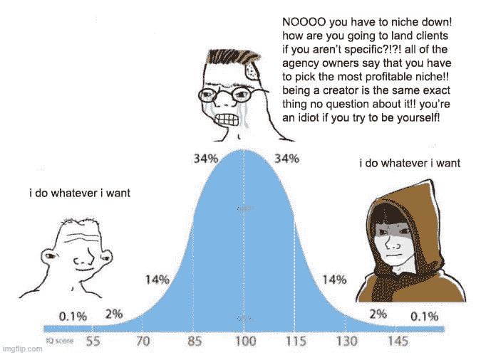
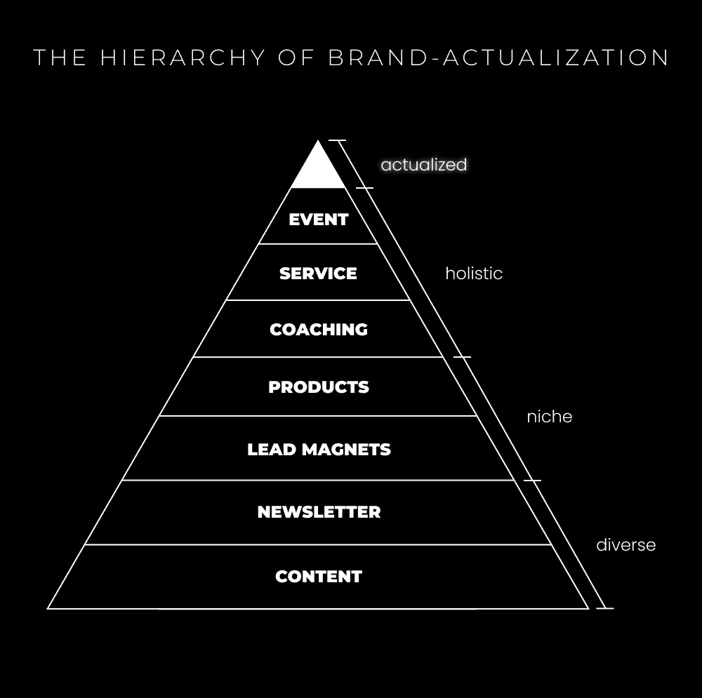
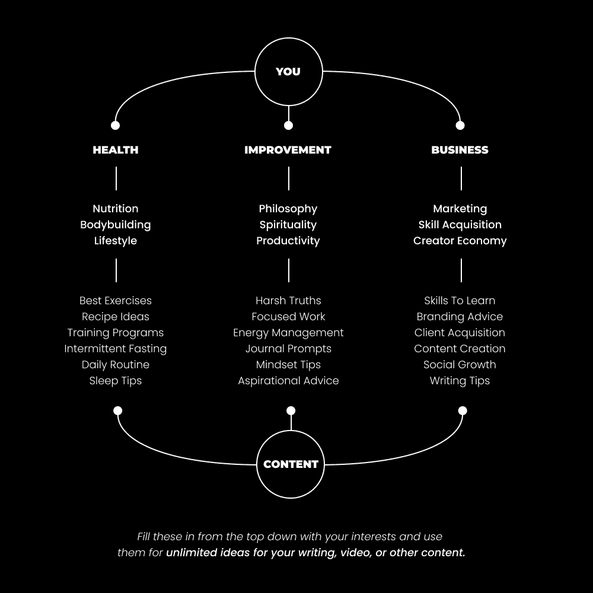

# 创作者经济：超越细分市场，构建你的个人品牌实现金字塔 🏔️

在本节课中，我们将探讨一个在商业领域被广泛接受但可能限制你长期发展的概念——“细分市场”。我们将分析其局限性，并学习如何通过构建一个动态、进化的个人品牌来实现更可持续和自由的增长。课程将涵盖从哲学基础到具体实践步骤的完整框架。

---

## 为什么“细分市场”对聪明人来说是糟糕的建议？🤔

当我刚开始创业时，我认为只要拥有技能，人们就会雇佣我。我不知道任何人都可以学会这项技能，而且在线自由职业领域开始充斥着像网页设计这样的单一技能商品。

我购买了许多课程，涵盖了自由职业、Facebook广告、电商品牌建设、营销、销售等领域。当我尝试建立他们在那些课程中教授的业务时，我没有看到多少成功。但我注意到它们之间有一个非常明显的共同模式：我必须非常具体地确定我的目标人群，也就是“细分市场”。

这个建议听起来很有道理：找到一个饥渴的市场，瞄准一个细分市场，研究该市场内的人并直接与他们交流。这似乎是我一直缺少的秘密。然而，这仍然是网络空间中最常见的建议，也仍然在初学者中引起最多的困惑、压倒性和焦虑。他们觉得如果他们一开始没有最赚钱的细分市场，他们就会失败。

因此，他们花费时间在细分市场之间摇摆不定，学习该细分市场的技能，但最终可能一无所获，没有钱或可以利用的东西。我喜欢挑战常见的观念，因为大多数时候它们都被无异议地接受为法律。它们得到了一些结果，但不是最好的结果。

随着社交媒体的兴起，商业世界发生了巨大变化。依赖于冷门外部接触的商业模式，与建立温暖受众的商业模式之间存在显著差异。你在网上学到的大部分东西可能已经过时，并不是新经济中做生意的最佳方式。

---

## 心态转变：从冷推广到建立受众 🔄

我曾经被训练成认为，必须进行冷电话、冷邮件和投放广告才能看到商业成功。经过多年的尝试和错误，我从未看到我想要的那种成功。

当我看到人们通过发布内容（关于我知道我也能够谈论的事情）并从中吸引客户时，事情开始变得明朗。

通过冷邮件和私信：
*   没有人知道我是谁。
*   没有任何先前的信任。
*   我没有一种方式来展示我的权威或结果。
*   这是一项大量的手动工作。
*   每个提案要么导致客户，要么什么也没有。我在过程中没有建立杠杆。

通过社交媒体内容、向观众的热门推广和促销：
*   我随着时间的推移建立起了声誉。
*   我通过广度和深度建立信任。
*   我可以在不向他们解释自己的情况下在观众中建立信任。
*   我可以在不尝试的情况下激发我对产品的兴趣。
*   没有东西会浪费。所有内容要么为数据做出贡献，要么为增长做出贡献。
*   随着我规模的扩大，我可以将我的品牌发展成我喜欢做的事情。我获得了自由。

因此，我开始在社交媒体上写内容，以吸引我的营销服务客户。

另一个问题是：人们总觉得他们只能谈论与他们销售相关的一个话题。他们没有意识到：
1.  你显然对与你销售相关的话题感兴趣。
2.  你还关注了数百个其他有不同兴趣的人。

你怎么能相信你必须坚持一个兴趣，当你**正在跟随那些谈论多个不同兴趣的人**时呢？并非人们不会对你的其他兴趣感兴趣，是因为你不知道如何让你的兴趣对其他人来说有趣。

人们总觉得，如果他们选择广泛的领域而不是细分领域，他们就会稀释自己，以至于无法赚到钱。我很早就对此提出了质疑。每一个大型的创作者都是广泛的。他们专注于社交媒体漏斗顶部的入门级教育，也专注于中高级的产品和服务。他们谈论的事情在某种程度上是整体性的。

---

## 发展阶段、自然等级及其在创作者经济中的反映 📈

上一节我们探讨了传统“细分市场”思维的局限性。本节中，我们来理解支撑个人品牌发展的深层结构：**等级**和**发展阶段**。

**等级是存在的基石**。现实的结构由**心灵单位**组成。这些“单位”是你能标记或感知的每一件事。它们有几个独特的特征：

1.  **心灵单位是等级化的，并且与整个世界紧密相连**。
    *   就像 `原子 -> 分子 -> 细胞`。
    *   或者说 `字母 -> 单词 -> 句子 -> 书籍`。
    *   在创作者经济中，可以是 `短篇内容 -> 中篇内容 -> 长篇内容 -> 产品 -> 品牌`。

2.  **心灵单位是完整的部分。它们自身就是一个整体，也是更大事物的一部分。**
    *   一个个人品牌的整体如果没有其各个部分，就什么也不是。

3.  **因此，思维单位出现、超越并包含。**
    *   只有少数创作者能够达到等级的最高层。但随着创作者经济的发展，构成它的等级体系的新层次将不断涌现。

你是你网络的一部分，而你的网络是社区的一部分，社区又是创作者经济的一部分。如果你想生存，你必须交换价值。

### 理解你的个人进化



所有事物都会经历发展阶段，包括你的个人品牌。我们可以用两个简化模型来理解：

1.  **初级、中级、高级**
    *   **初学者**：没有经过验证的想法，品牌哲学未发展，缺乏杠杆。必须优先学习基础技能和行动。
    *   **中级**：开始质疑和反抗初学者阶段的教条，可能陷入痛苦或愤世嫉俗的阶段。
    *   **高级**：重新发现原则，并从经验和权威的角度实践它们。内容具有深度和影响力。

2.  **预理性、理性和后理性**
    *   **预理性**：依附于特定教义和意识形态，不加质疑。
    *   **理性**：开始质疑和反抗，可能否定一切。
    *   **后理性**：重新整合发现，从更高维度理解并实践原则。

在创作者经济中，许多处于“理性”阶段的人厌恶简单的陈词滥调，试图反抗商业本质，但如果不将发现重新整合到等级体系中，可能会摧毁自己的业务。高级创作者则将这些原则视为成长的支柱，并从经验和权威的角度运用它们。

---

## 解决方案：你是无限的细分市场 🌌

上一节我们理解了个人品牌发展的阶段论。现在，让我们抛弃“寻找细分市场”的旧观念，拥抱一个更强大、更自由的新理念：**你是无限的细分市场**。

不要把自己局限在一个狭窄的盒子里。相反，将你的品牌视为一个**实现等级制度**，一个随着你成长而不断进化的金字塔。



```
你（个人品牌）
├── 社区/受众
│   ├── 产品/服务A的受众（细分市场A）
│   ├── 产品/服务B的受众（细分市场B）
│   └── 通讯订阅者（细分市场C）
├── 产品与服务（数字资产）
│   ├── 高级课程/咨询
│   ├── 数字产品
│   └── 引流产品
└── 内容基石
    ├── 长篇内容（通讯、博客）
    ├── 中篇内容（视频、播客）
    └── 短篇内容（社交媒体）
```

你是复杂的，这应该是你的目标。宇宙在向复杂性进化，你的自我意识也在进化。你的角色复杂性是由你克服的目标或挑战决定的。你达到的每一个目标都需要一定的技能水平和相应的视角。

随着你变得更加复杂，你可以在你自己的生活和他人的生活中解决更深、更有意义的问题。你的品牌应该随着你的技能和兴趣在追求目标的过程中不断发展和复杂化。随着你学习和获得技能，你有责任建立能够为他人带来成果的现实世界项目。

这既是你在商业中创造盈利产品的方式，也是你履行责任的方式。随着你达到每一个发展阶段，你将建立一个有形的产品来反映这一点。这是你教育你的追随者并建立权威的方式。

例如：
*   解决生产力问题后，创建了一个效率规划工具（引流产品）。
*   在网页设计领域获得成果后，创建了一门相关课程（数字产品）。
*   获得综合技能后，创建了品牌咨询服务（高价值服务）。

你没有意识到，你创建的任何通讯、引流产品、数字产品或服务，其用户本身就构成了一个“细分市场受众”。你正在*平台之外*建立多个受众。你的品牌是一个**品牌**，不是一个细分市场受众。它是一个存在于社交媒体中的社区。你的各个产品则是在这个社区中占据的“数字地产”。

当你将你的品牌细分时，你可能在3年后达到10万总粉丝。但如果你像我一样，一个引流产品就能带来7万人的细分受众，通讯带来12万订阅者，课程带来1.5万学生。你看懂我的意思了吗？这就是如何打破界限，并随着时间的推移构建你想要的任何东西。

---

## 智能进阶：构建你的品牌金字塔实践指南 🧱

理解了“你是无限细分市场”的理念后，本节我们来看看如何从零开始，一步步构建你的个人品牌实现金字塔。每个人都是从第一级开始的，关键在于持续构建和进化。

以下是为你推荐的进阶步骤：



**1. 确定导致你愿景的2-3个核心主题**
确定你想要的生活，以及你引导追随者走向的愿景。你的技能和兴趣是你独特地达到那里的方式。例如，追求“自由”可以通过电商、数字游民或投资等不同路径实现。选择2-3个你热爱且能支撑你愿景的交叉领域作为起点。

**2. 练习顶部漏斗写作和增长**
你在社交媒体上的首要任务是持续的品牌增长。
*   购买你主题的畅销书并阅读。
*   关注讨论这些主题的优秀创作者，从创作者（而非消费者）角度分析他们的内容。
*   注意哪些写作风格、思想和结构表现最好，并开始模仿练习。在没人看的时候坚持写。

**3. 以建立项目为载体开始创建通讯**
通讯是建立深度和权威的绝佳工具。
*   用它来练习深度写作，发展原创思想。
*   将它作为你未来引流产品或课程内容的草稿库。
*   即使最初免费，也能建立感知权威，表明你在提供价值。

**4. 创建一个引流产品作为你的第一个“数字地产”**
引流产品（如指南、模板、清单、入门电子书）可以在特定主题上快速建立你的权威。
*   **好处**：你无需只谈论该主题，但当你谈论时，你可以引用你的引流产品作为权威背书。它为你吸引了一个精准的细分受众。
*   **示例**：`视频剪辑入门清单`、`Notion习惯追踪模板`、`小红书起号基础指南`。

**5. 以最小可行服务提供销售以获得经验**
你需要一个“下一步”来货币化你的受众。
*   对于初学者，建议从**最小可行服务**开始：单一技能的自由职业（如做图）或单一主题的辅导（如健身计划）。
*   收费 `500-1000` 元，直到你验证了能交付结果。
*   系统化流程，然后提高收费。用少量客户替换全职收入。

**6. 脱离细分市场，进化、超越、包容**
此时你已在某个领域建立权威。是时候进化了：
*   将你的服务产品化（如将辅导变成小组课程）。
*   将小组课程进一步产品化为数字课程。
*   重复`引流产品 -> 服务 -> 产品`的循环，拓展到新的兴趣领域。
*   如果你想谈论新兴趣，确保有基础内容（如新的引流产品或通讯系列）让观众能跟上。

---

## 成为全面综合者：技能与兴趣的终极融合 🌟

经过时间和努力，比如说1-2年，你真的可以开始做你想要做的事情。世界需要更多的**全面综合者**，因为现实并不是像当前的教育体系那样被分割的。

你现在可能看不到，但你正在创造社会。你的工作是注意兴趣和行业之间的模式，在你的创作中将它们联系起来。成为一位现代的全才，一个数字时代的全才。

通过你的兴趣探索现实，通过内容分发你的发现，通过创造值得收费的东西，做自己热爱的事情谋生。随着宇宙的方向流动，享受随之而来的乐趣。

---

## 总结 📝

在本节课中，我们一起学习了：

1.  **挑战传统观念**：“细分市场”建议可能限制长期发展，尤其在依靠受众而非冷接触的新经济中。
2.  **理解发展结构**：个人品牌发展遵循“等级”和“阶段”（初级/高级，预理性/后理性），需要逐步进化。
3.  **拥抱新理念**：你不是一个狭窄的细分市场，而是一个**无限的细分市场**。你的品牌是一个随着你成长而进化的“实现金字塔”。
4.  **掌握构建步骤**：从确定核心主题、练习内容创作、建立通讯和引流产品，到提供最小可行服务，最终产品化并拓展到新领域。
5.  **立志成为全面综合者**：最终目标是整合你的技能与兴趣，通过内容分享洞见，通过创造价值谋生，构建一个丰富、自由且有影响力的个人品牌生态系统。

记住，关键在于**持续构建**。每一个你创造的数字资产（内容、产品、服务）都是你品牌金字塔上的一块砖，也是你吸引和服务的又一个“细分市场”。开始建造吧。