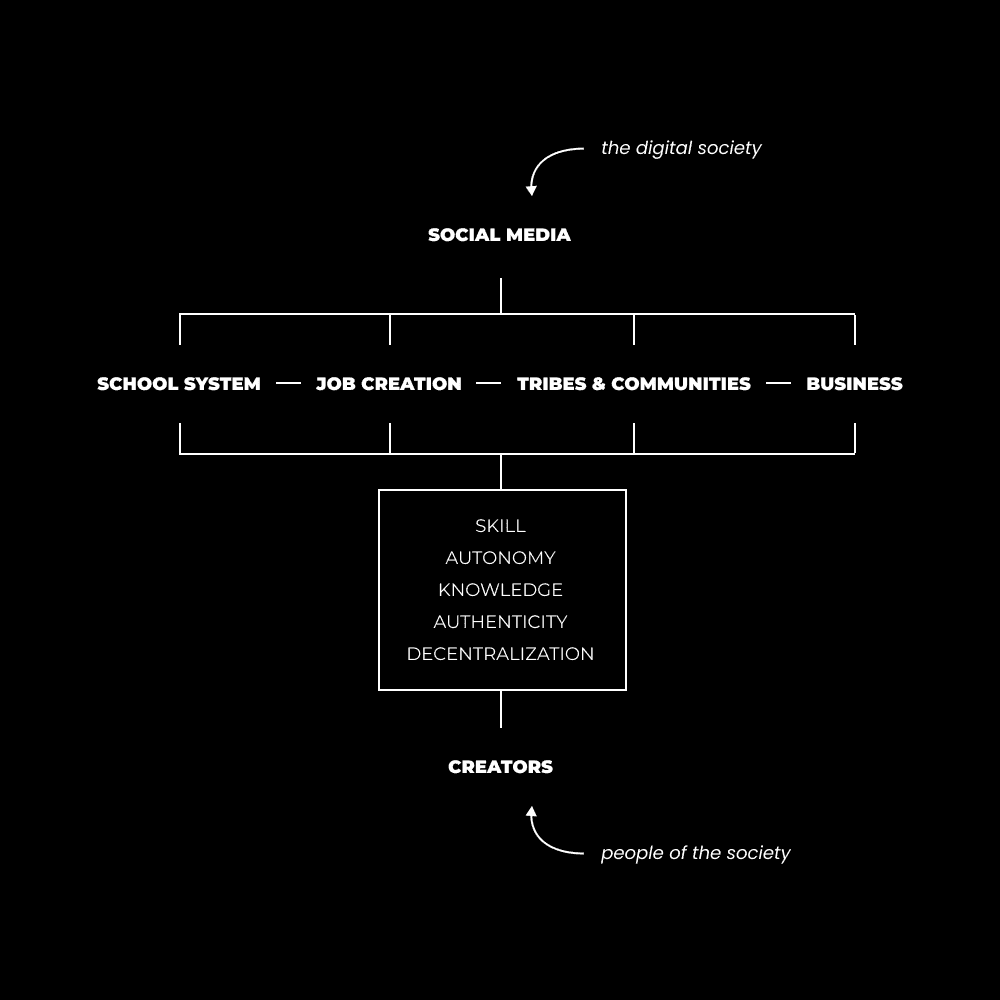
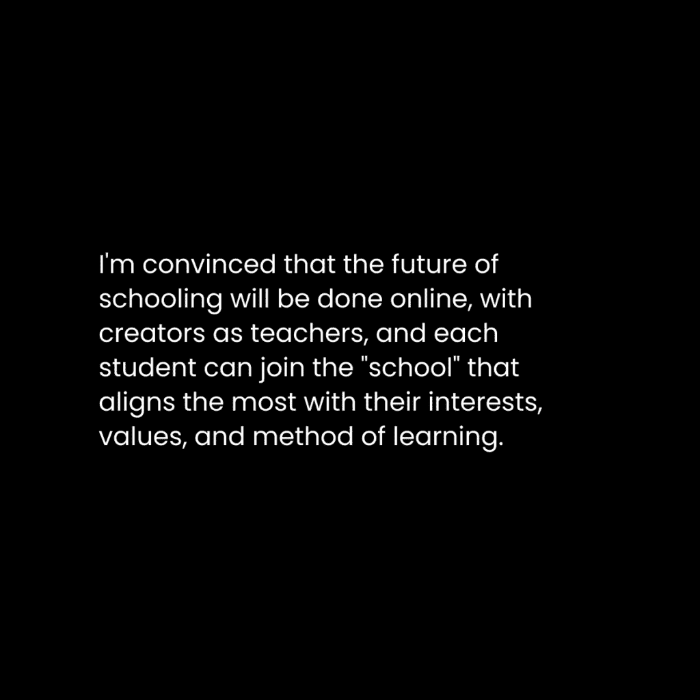
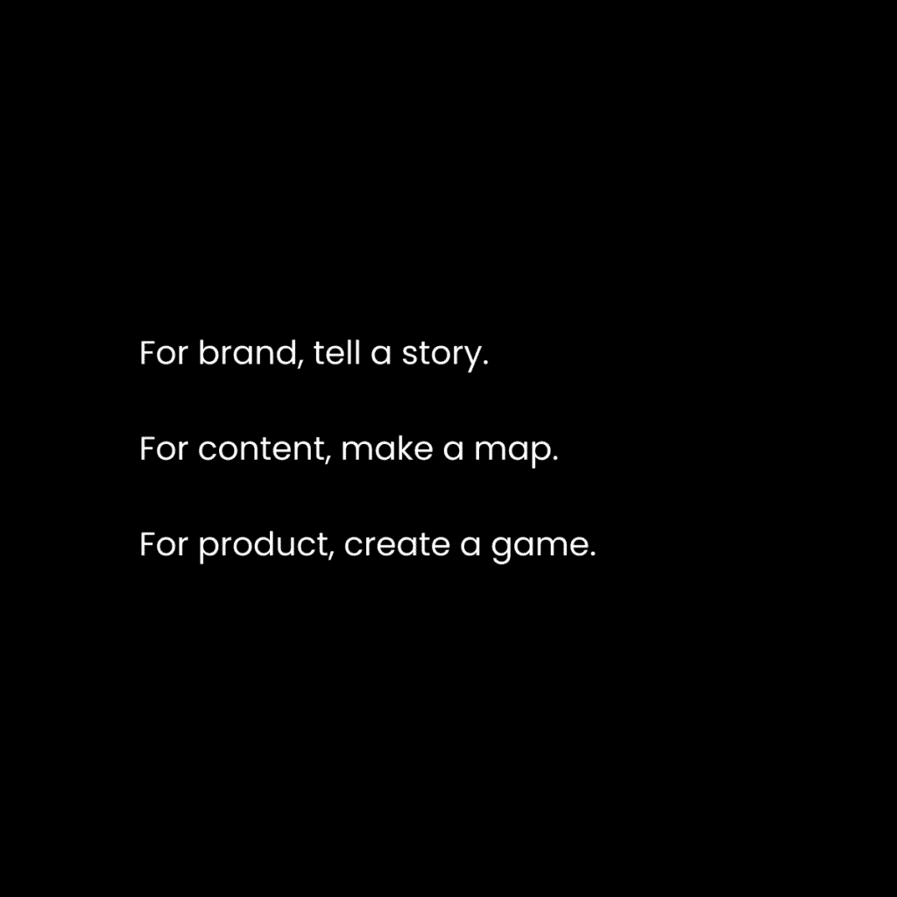
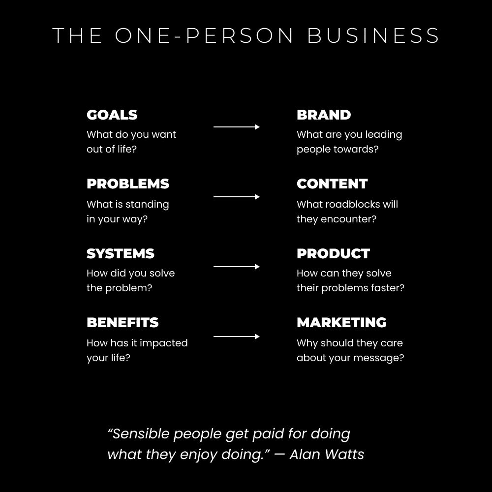

# 一人企业：重新审视一人企业（将自己变成企业）🚀

在本节课中，我们将要学习如何将自己转变为一个企业。我们将探讨创作者社会的兴起、创作者经济的本质，并深入分析构建一个成功的一人企业所需的核心哲学与具体路径。

---

## 概述

我们正处在一个新社会的开端——一个虚拟的创作者社会。这个社会由互联网和社交媒体塑造，它打破了地理限制，让信息、交流、商业和机会变得全球化。传统的等级结构正在被去中心化的进步所改变，个人现在可以通过创造内容和价值，直接教育、娱乐和激励他人，从而攀登到新的高度。本节课将引导你理解这个新背景，并学习如何在这个环境中，将自己打造成一个可持续的、盈利的一人企业。

---

## 创作者社会的出现 🌐

上一节我们概述了新社会的背景，本节中我们来看看什么是“创作者社会”。

互联网的普及使得信息以前所未有的速度传播。这促成了一个更先进、全球化且易于访问的社会的形成。这个社会由拥有共同信仰的机构、社区和文化观念构成。

最显著的方面包括教育体系、劳动力、社会与商业群体以及宗教机构。社交媒体扩大并同时缩小了这些领域的边界，使一切变得更加整体和互联。

传统的公立教育体系存在诸多问题，例如鼓励聚焦式思维、分隔式学习、强调顺从而非真实、重视记忆而非过程、将失败视为应避免之事、不容置疑的权威、推崇长期工作而非效率与真实价值、以书本知识定义智力，以及只提供培训人们从事可替代工作的过时课程。

相比之下，创作者社会的新教育体系允许个人：
*   追求自己的好奇心。
*   寻找最适合自己的教师（即创作者）进行学习。
*   将学习视为生活的一部分，而非令人烦恼的义务。
*   学习能让你快速适应环境的现代技能。
*   寻找有助于实现自我设定（而非外界分配）目标的特定知识。
*   将创业置于首位，因为对于想从生活中获得更多的人来说，这是唯一合理的终极目标。

这个新的教育体系就是互联网上的内容。它没有被明确标记，只是虚拟生活的一部分。

同样，传统的宗教机构可能限制追随者的思想，并反对与其自身观点相悖的观念。如今，精神意识和教育在大多数创作者品牌中都能找到。你可以开阔思维，研究不同观点，进行自我实验，直到形成适合自己的个人哲学。这不仅关乎精神成长，也涵盖财务和健康等方面。

---

## 创作者经济的本质 💰

上一节我们探讨了新的社会结构，本节中我们来看看这个社会中的经济模式——创作者经济。

商品交换自人类互动之初就是社会的自然组成部分。价值创造和交换是沟通与关系的基础。人类是高度社会性的生物。

金钱，或称货币，是一种中立的价值形式。人们会将其花费在他们认为有价值的事物上。这种价值判断取决于他们的身份、观点、目标、当前心态以及对问题的认知水平。

我们开始认识到营销和销售的重要性——因为它们是展示你所提供价值的核心技能。营销和销售需要考虑上述所有因素。

如果你的产品或服务没有针对具有特定目标（身份）的特定人群进行定位，而该目标又暗示了一个特定问题，那么你将无法赚钱。

创作者经济由通过内容和产品形式分发价值的个人组成。他们教育自己的受众，传授有助于实现受众目标的技能和知识。他们的产品或服务旨在产生实际效果，并帮助受众更快地达成目标。

---

## 我的个人商业哲学 🧠

上一节我们了解了价值交换的经济基础，本节中我们来看看支撑一人企业的核心哲学。

最好的企业能改变人们的生活。转变造就了制胜的产品。不要试图解决虚构的问题。解决你自己的问题。改变你自己的生活。将方法打包起来。给它贴上价格标签。

如果你解决了真实、有意义的问题，你失败的可能性会更小。这就是大多数创业者遇到的问题：他们对营销、销售、心理学或普遍的进化规律缺乏理解。

当大多数人正遭受阻碍集体意识提升的低层次问题时，不要总想着登陆土星或建立价值十亿美元的技术公司。从一个帮助人们解决生活中**真实**问题的**微型教育业务**开始。

*这*就是你为人类幸福和进化做出贡献的方式。你通过理解永恒的市场来实现这一点：健康、财富、关系和幸福。

通过解决这些领域中的问题，你可以：
*   推动你自己的自我实现。
*   创建一份包含你自己故事的独特指南，并可以传承下去。
*   通过帮助他人疗愈和实现目标来赚取收入。

在此基础上，每个人都处于更高的意识状态。然后，我们才能用时间去做热爱的事情，解决我们热衷的更深层问题（比如登陆土星）。

---

## 自我货币化的路径 🛤️

上一节我们确立了商业哲学，本节中我们来看看将自身价值货币化的具体路径。

社交媒体是一个新的社会。个人品牌是这个社会中的“个体”。这不只适用于有生意的人。大大小小的创作者都在招聘。品牌和公司也在招聘那些在公开场合展示自身价值的人。

社交媒体是一个公开的招聘板、公共学校、公共笔记系统，也是一个可以找到朋友和培养商业关系的公开派对。

首先，你可以为其他创作者工作以获得在新社会中的经验。这是一个很好的选择，但你也可以直接开始建立自己的事业。

### 路径 1：学习一项技能，出售一项技能

这是大多数人推荐的快速赚钱方法：
*   学习创作者或品牌在其业务中使用的现代技能（如电子邮件营销、漏斗设计或内容写作）。
*   围绕该技能创建内容以展示你的知识（坦白说，这不会吸引大量追随者，你的个人资料更像一份简历）。
*   由于没有受众在睡梦中购买你的产品，你可以为自由职业或咨询服务收取更高的费用。

要让这一切奏效，你必须**学习永恒的技能**：写作、演讲、营销和销售。

### 路径 2：围绕你的兴趣成为价值创造者

这很难解释，因为最常见的问题是：“我没有任何兴趣。”让我们从这里开始。

你通过在目标上投入精力来培养对某个主题的兴趣。这样一来，如果你没有实现它，你会觉得自己浪费了投资。这种压力让你保持责任感。

真正的目标应基于追求自我实现的永恒市场（健康、财富、关系、幸福）。你在旅途中培养的兴趣被应用于实现那个目标。

例如，对于健康市场，我可以对以下子主题产生兴趣：
*   健身
*   原始人饮食
*   极简主义训练
*   瑜伽
*   正念

对于财富市场，兴趣可能包括：
*   自由职业
*   软件即服务
*   简历构建
*   面试准备
*   预算
*   路径1中列出的任何技能

对于关系市场，兴趣可能涉及：
*   夫妻治疗
*   自信和魅力
*   日间约会技巧
*   如何搭讪

所有这些都帮助我推动每个领域的发展。这就是你成为一个现代文艺复兴式人物的方式。要变得真正不可替代，你必须成为一个终身自学者。

得益于新社会中的互联网内容、课程和非传统教育，你可以以创纪录的速度学习任何东西。

### 路径 3：双重行动以获得最大效果

拥有一个个人品牌，你将不得不学习大多数现代技能以使其成功。你将需要自己建立着陆页、漏斗、电子邮件、内容、个人资料设计、图形等一切使品牌成功的东西。

如果某项技能不能帮助你的品牌成长，它很可能也无法帮助他人，在这种情况下学习它也不值得。当你为自己的品牌取得成果时，你就拥有了帮助他人的知识。

你可以围绕你的兴趣销售产品或服务（以练习技能发展）。你将围绕这些兴趣创建一个最小可行产品，提供自由职业或咨询服务。

随着你通过生产的内容扩大受众，最终可以将其转化为一个需要较少努力即可销售的产品。这是一条更长的路径，但非常值得。你极大地提升了自己，你的业务比大多数人的都更具杠杆效应。

---

## 六位数一人企业的四大支柱 🏛️

上一节我们探索了不同的起步路径，本节中我们来看看支撑一个成功一人企业的四个核心支柱。

一人商业模式可以有多种定义。现在，我将重新定义它：**一人商业模式就是将你自己变成业务**。

这是一种新颖且有力的说法：“*成为高价值的人并展示自己，直到足够多的人知道你是谁、你做什么以及你为什么这样做。机会自会累积。*”简而言之，这就是你真正需要做的以取得成功。

为了更清晰，让我们深入了解一人企业的四大支柱：

### 支柱 1：品牌 – 你就是细分市场

你的个人品牌是你在新社会中的“自我”或“身份”。你的身份是塑造你观点的潜在故事。你的观点包含目标，你从中感知情境。

这些目标可以是外界分配给你的（社会 conditioning），也可以是自我生成的（与你的愿景一致）。当你阅读一本书时，你的解读会与下一个人不同，因为你的目标作为你的视角是不同的。

你的品牌是你对未来的愿景（并且你的愿景会随着你的成长而发展）。你对未来的愿景意味着你已经拥有，或正在学习实现它所需的技能和兴趣。

你的任务是展示这一点，让读者在任何可以接触你的地方都能看到。你所有的内容都将从你品牌的视角来撰写。

**示例**：如果我的当前愿景是赚更多钱，我学到或正在学习的技能涉及营销、健康和精神领域，那么我的个人简介可以是：“我撰写关于营销、健康和精神的内容，帮助你建立一个全面的一人企业。”

甚至健康和精神层面也可以被定位为帮助商业发展的方式。这就是大多数人困惑于如何将兴趣融入他们感到有联系的狭窄领域的原因。**你在引导人们走向何方？** 这就是吸引追随者的方式。

### 支柱 2：内容 – 记录你的思想

我喜欢将社交媒体视为一个公共笔记系统，你在其中记录：
*   你正在学习的内容以及它如何应用于你的生活。
*   你对你技能和兴趣的看法和观点。
*   你在生活故事中学到的教训。

在不知不觉中，我们正在以可探索的方式在互联网上积极构建集体意识。但是，你不能只是写些东西然后祈祷你的品牌能增长。

你必须学习营销、说服技巧，并沉浸于表现良好的内容中，以便你能注意到它们之间的模式。如果你还没有学习营销、销售或文案写作——现在就开始吧。它们将改变你的生活。

### 支柱 3：产品 – 公共个人项目

在个人企业哲学下，你通过解决自己的问题并销售解决方案来为新的社会做出贡献。进展如下：
*   识别你生活中的一个问题。
*   将其转化为一个个人项目以获得经验。
*   将其转化为一个最小可行性产品。
*   开始以 500-1000 美元的价格销售（自由职业或咨询）。
*   在过程中通过内容建立你的受众。
*   提高你提供的深度和复杂性。
*   当你准备好时，将其产品化，使其可以在睡眠中销售。

这可能需要 1-3 年。

“项目”是你实际上在现实世界中解决问题的方法。它们迫使你应用所学，也是可触摸的成果。你可以迭代它们，并随着时间的推移变得更好。你可以反思它们，并使它们对下一个人更容易实现。

**教授**是识别知识差距的方式。那是你唯一能够填补它们的方式。如果你没有通过构建项目和教授你所学到的知识，你的旅程将会缓慢而痛苦。

### 支柱 4：营销 – 向自己销售

如果你从不推广自己，你将一分钱也赚不到。就这么简单。

营销贯穿你的整个品牌，但最普遍的是：
*   你产品和服务的着陆页。
*   你推广它们的电子邮件。
*   你推广它们的内容。
*   在你的推广信息中，判断他人是否适合它们。

你可以练习以下框架：
1.  **确定他们的目标或期望结果**：你必须知道你的受众想要什么。
2.  **确定阻碍他们的因素**：为什么人们不能实现目标？为什么你一开始没有实现？
3.  **展示你的解决方案以解决燃眉之急**：既然他们已经明确了目标及阻碍，你就知道他们是否适合你的解决方案。如果是，询问他们实现目标后生活将如何改变，然后展示你的提议作为潜在解决方案。

---

## 总结

在本节课中，我们一起学习了如何将自己转变为一个企业。我们从**创作者社会**的兴起和**创作者经济**的本质开始，理解了在新背景下个人价值的巨大潜力。接着，我们探讨了以解决真实问题为核心的**个人商业哲学**。

然后，我们分析了三条**自我货币化的路径**：从学习并出售技能，到围绕兴趣创造价值，再到通过“双重行动”最大化效果。最后，我们深入研究了构建六位数一人企业的**四大支柱**：**品牌**（定义你的细分市场）、**内容**（记录并分享你的思想）、**产品**（将个人项目转化为可销售方案）以及**营销**（有效地推广自己）。

记住，一人企业的核心是**将自己变成高价值的业务**。通过持续学习、创造价值、解决问题并勇敢展示，你可以在新的创作者社会中建立有意义的事业，实现个人成长与财务自由。