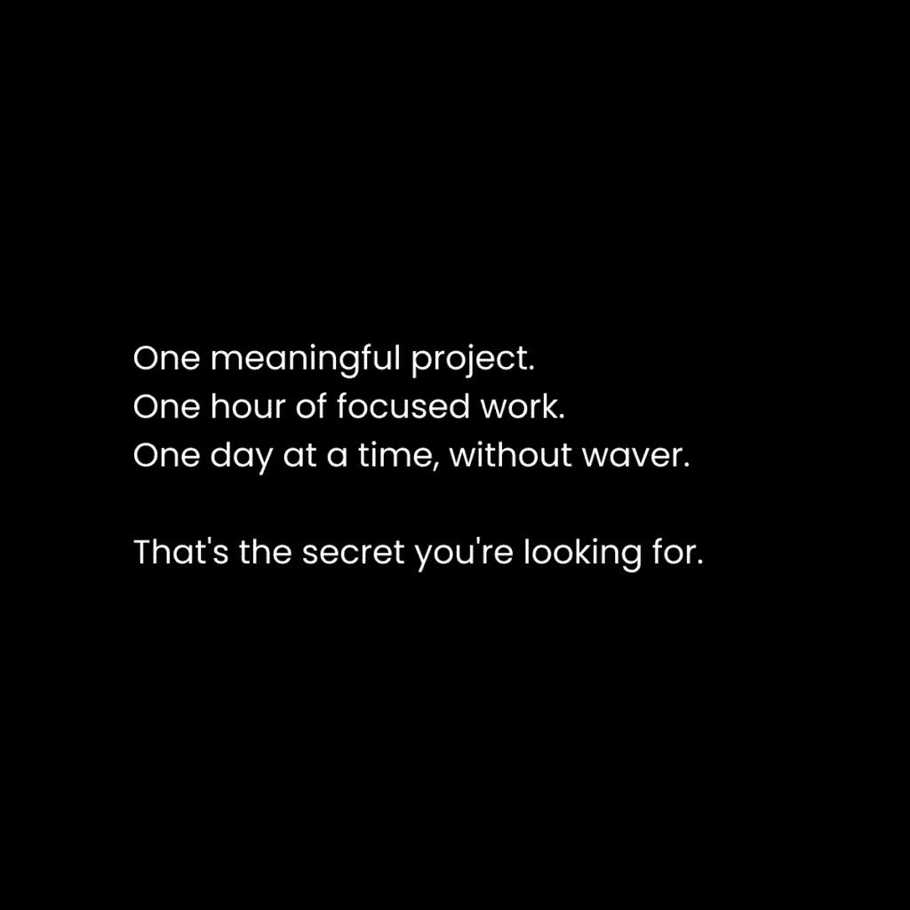
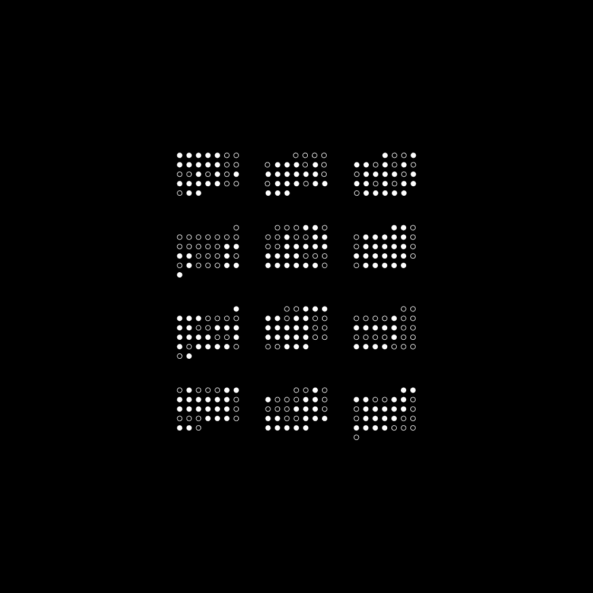
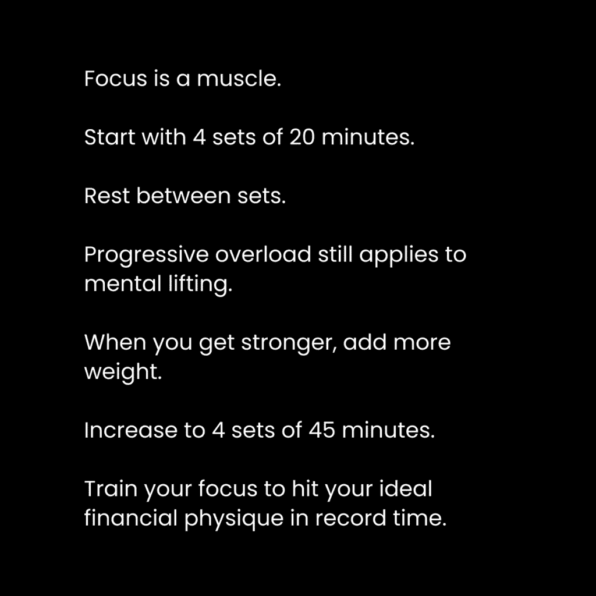

# 专注是超能力：如何在信息时代取得成功

## 📖 概述
在本教程中，我们将探讨“专注”在当今信息过载时代的重要性，并学习一个实用的框架，帮助你通过提升专注力来创造更好的生活。我们将从理解专注的价值开始，逐步深入到具体的实践方法。

---

## 🌍 1：为什么专注工作是超能力？

幸福是一种技能，而练习不幸福比以往任何时候都更容易。

我们并不生活在我们祖先的世界里。物质世界当然也发生了变化，建筑物更多，我们的日常惯例也不同。环境的变化反映了人类进步，但除非我们回归自然或创造可持续的解决方案，否则可能对长期健康产生不利影响。

心灵世界则是完全不同的故事。随着物质世界的建设，我们的心灵必须适应和进化，以发现和处理新信息。我们称这种能力为创造力，它是人类的珍贵天赋。

物质世界在人类意识之前就已存在。当心灵层面出现时，它超越并包含了物理和生物层面。这意味着物质是更大生物体的一部分，而生物体又是更广阔心灵的一部分。

我们可以将旧世界想象成一粒橡子，而新世界则像一棵百岁橡树。这棵橡树有一个坚实的核心，分裂成数个主要区域，并继续分支成数千片叶子，每片叶子都有其自身的生态系统。当然，有时需要修剪分支以引导其向正确的方向生长。

我们可以将这棵橡树视为对现实的稀释描述。有无限的分支和叶子可供探索，但大多数人被童年学到的“单一”路径所条件化。他们通过心理编程，将自身潜力限制在无限可能性中的一条分支上。如果你愿意，可以将那条分支想象成“矩阵”。

这棵橡树需要用心灵去探索。每个分支代表一条可以用能量、注意力和意志去探索的信息路径。

**主要问题在于：**
现代人很容易陷入平庸、堕落和机器人化的无意识陷阱。当人们脱离默认路径时，他们会害怕未知。有太多信息可以探索，太多机会会导致不知所措，太多意见会引发焦虑。要找到清晰，你必须战胜混乱。你不能在遇到第一个挑战时就退缩。

对于每一个好想法，都存在一百个坏想法。你对成功的构想是充满力量的，但随之而来的是对失败的思考、所需时间、需要学习的技能以及不同的职业和商业路径。然后，那些负面想法可以分裂成一百个更多。除非你学会如何整理你的思想，否则无法从混乱中创造清晰。

---

## 🧠 2：程序或被编程

信息时代令人不知所措。在这些时代，你能做的最重要的事情是整理你的数字、心理和物理环境。

以下是需要整理的三个层面：

**数字环境**
沉浸在对你的成功有益的信息中。取消关注那些不利于你未来的账户。购买能增强你对自身潜力认识的书籍。订阅那些教授学校不教的知识的播客、通讯和博客。无论你转向何处，都要创建一个使成功不可避免的网络环境，以此来编程你的大脑。

**心理环境**
把你的大脑当作一个花园。你的思想可以是整洁而美丽的，也可以像杂草一样生长，导致混乱的螺旋式下降。正如阿拉伯谚语所说：“雨的本质是相同的，但它使沼泽地长满荆棘，在花园里长出花朵。”

**物理环境**
那些满足于舒适的人形成了定居点。他们为彼此平庸的生活辩护，并被编程相信这是正常的。未知才是你潜力的所在。投资大师纳瓦尔曾说：“你做出的最重要的决定是你要住在哪里。它驱动着你的商业机会、人际关系、食物和水供应、政治、活动以及日常生活的质量。”

你是你环境的产物。你的思想、情感和行为（按此顺序）受到环境中的人和信息的深刻影响。思维过程会变得习惯化，并随着时间的推移被编程植入你的心中。许多人在四十年的机器人般生活中醒来，疑惑时间都去哪儿了。不要成为他们中的一员。

**人类行为是有目标的。** 我们所做的一切都与一个目标一致。我们做出的每一个决定都在推动我们向有意识或无意识的目标迈进。目标被融入你的身份中。你的身份影响你对情况的看法。你的观点影响你如何在该情况下感知问题。而情况只能通过你所处的发育水平来观察。这就是为什么这么多人感到苦涩、受冒犯和愤怒——他们在童年后就停止了学习和成长。当你选择在精神上早逝时，你就错过了生活的深度。

对于大多数人来说，他们所知道的就是“上学，找工作，65岁退休。”这就是为什么我如此重视通过创作者经济传播对新机会的认识。大脑是一个模式识别机器。因为从你小时候起，通过你的成长、教育和你周围普通朋友的行为，默认的生活轨迹就被植入你的心中——你会做同样的事情。如果你没有为成功编程你的大脑，它将会被平庸所编程。

---

## 🎯 3：专注 = 生活质量

> 想象一下有一个电子表格，显示了你在生活的任何特定领域投入了多少注意力。包括心智、身体、精神和商业，这些都影响你与世界及周围人的关系。这个电子表格将直接反映你的生活质量。 —— 《专注的艺术》

专注是习惯的习惯。对你长期和短期目标的有意识关注，是你为成功和日常生活质量编程大脑的方式。专注是你整个存在的根源。这是你如何将意识、觉知和注意力引导到有价值的事情或分心事物上的过程。

这两者都会导致大脑中多巴胺水平的增加。多巴胺显然会让你感觉良好。分散注意力会导致“廉价”的多巴胺，而创造价值会导致“昂贵”的多巴胺。我们希望提高生活中“昂贵”与“廉价”多巴胺来源的比率。我们希望提高信号与噪声、重要与无意义、有意义与无意义之间的比率。

我们首先需要创建一个自我生成的目标层次结构。如果你没有有意识、有意义的目标，你就无法将注意力集中在这些事情上。无论你是否“不知道”这些目标应该是什么，都没有关系。先选择一些听起来有意义的事情。只有这样，你才能意识到你**不想**得到什么。通过意识到你不想得到什么，你就可以专注于更接近你想要的东西。随着时间的推移，你将实现那些并非社会分配给你的目标，并开辟自己的道路。

上一节我们探讨了专注与目标的关系，接下来我们看看具体需要做什么。

以下是实现专注的三个步骤：

**1) 放大视角以获得洞察力**
想象一下你理想的未来。你曾经这样做过吗？如果是，最后一次是什么时候？拿出笔记本，详细地描述它。花30分钟写下你认为你想要的东西：心智、身体、精神、商业，以及这些事物如何以有益的方式影响你生活的各个方面。将这种生活与你现在的生活进行对比。这就是你对未来的愿景，一个包含你所有其他目标的宏大元目标。这为你提供了一个视角或框架，用以观察日常情况。

**2) 解构以弥合清晰度差距**
在你拿出的笔记本中，将你生活的每个领域分解成可管理的子目标。写下：一个10年目标、一个1年目标、本月的目标、这周的目标、以及你今天能做什么。不要执着于这些目标。这是一个产生清晰度的练习。你的目标会随着时间演变，这没关系。它们可能会改变。如果你不做这件事，你按照社会分配给你的目标行动的可能性会更高。保持这个笔记本在手边。搞乱，整理，然后行动。

**3) 放大以有目的地行动**
在你的脑海中保持你的框架。记住，你正在形成这个习惯。你试图通过将注意力重新集中在你认为重要的事情上，来减少生活中的干扰。每一个其他行动，最终每一个习惯，都应该指向你的愿景。这就是如何与生活保持一致。你能感觉到它。

问题是，我们聚焦在什么上？我们如何知道我们每天都在取得进步？

---

## 🚀 4：一个项目，一小时，一天一次

现代世界是一个无限的信息网络。如果你不训练你的专注力，你可能会迷失在想法、机会、商业模式、人际关系建议、生产力教条、阴谋论、新闻和戏剧中。在你目前的生活水平上，你接触到的99%的信息都是干扰。我们必须将注意力集中在那些能让我们过上更好生活的少数事情上。这是独一无二的个体特征。

**一个有意义的项目**
从你笔记本上写下的内容开始，**将你的目标转化为项目**。你是元项目，是你生活的作品。你作为一个项目，由使生活愉快的、相互连接的层面组成：心灵、身体、精神和金钱（是的，金钱是必要的。它是商业的桥梁，社会的命脉，是将你想要建设的未来带入生活的方式）。

在商业中，这些是永恒的市场，其中存在亟待解决的、有利可图的问题。因为它们是真实人在真实生活中的真实问题。当你在这些领域内为自己的问题创造解决方案时：
1.  你解锁了开始一个更有意义（并且可能更有利可图）的项目或进入生活下一阶段的能力。
2.  你可以与同样需要帮助的人分享你的解决方案——这就是你作为最有利可图利基市场的推理。
3.  你在现实中取得了有形的进步。你不会陷入空想和“教程地狱”的循环。

因此，我们必须将我们的生活作为一个项目，分解成后续的子项目，以攀登个人成功的阶梯。你可以将项目视为视频游戏中的任务。这就是为什么视频游戏令人愉快——它们将你的注意力集中在目标层次上。你开始控制你的注意力，带着目的在世界中前进。人们会在你如何自持中注意到。你自信地走在路上，因为没有任何想法会遮蔽你真实的自我状态。

**一小时的专注工作**
你不需要每天工作12小时来实现你的梦想。如果是这样，没有人会看到任何形式的成功。成年人有责任。家庭、工作和要支付的账单需要他们的专注，直到这些问题得到解决。

对于你的第一个有意义的计划，选择一个解决你生活中最普遍问题的计划。这就是你的目标。与其坐下来空想，不如制定一个行动计划。你超重吗？你破产了吗？你是不是一直都很紧张？你讨厌你的工作吗？你缺乏能量吗？它是什么？你在逃避什么，以至于你不想面对成长带来的痛苦？如果解决了，什么问题会为你解锁下一个层次的生活享受？

从那里，你必须将那个目标分解成你可以融入生活方式的行动。你的生活必须在根本层面上改变。你将不得不放弃你现在正在做的事情——因为如果你想要成长，你本来就不应该做你现在正在做的事情。如果你不是每天都做，那就不是习惯。如果不是习惯，结果就是暂时的。习惯的形成需要你改变自己的一部分。

*   **如果你需要钱**，把每天的第一小时用于金钱教育和行动。
*   **如果你想要减肥**，把每天的第一小时用于健身教育和行动。
*   **如果你想要减少压力**，把每天的第一小时用于心理健康教育和行动。

**一天一天来**
专注是一种货币。当你投资于自己的教育、工作、休息和成功时，结果不会立即显现。一致性是必需的。实际上，别提那了，一致性被高估了。持之以恒和迭代是必需的。你必须每天都带着建立一个能够持续到未来的项目的意图出现。这就是如何成为一个自信且有趣的人。当你下定决心要实现你的愿景时，人们会注意到。作为一名领导者，你会吸引追随者。他们会给你资源让你更快地建设。人们接受你的观点，他们的生活就会得到改善。当然，总会有一些人试图拉你下来，但他们很少，你会学会如何管理和忽略他们。

你如何使持续的行动无缝进行？通过在一天中安排将“杠杆移动任务”放入高能量时间段。

**1) 杠杆移动任务**
> 关于方法，可能有成千上万种，但原则却很少。掌握原则的人可以成功地选择自己的方法。而那些忽视原则尝试方法的人，肯定会遇到麻烦。 —— 哈灵顿·艾默生

持之以恒的关键是动力。你需要堆叠**小的**胜利。就像一款视频游戏。如果你从未取得任何进步，你为什么还要继续玩游戏呢？那不会有趣。这就是其他陷阱开始发挥作用的地方。太多人开始工作而没有方向或教育。他们抓住方法而不是习惯原则。

从你所知道的事情开始。优先考虑大局理解。当你遇到具体问题时，再学习技术细节。
*   如果你想减肥，在学习训练和营养**原则**之前就开始阅读关于甲状腺功能减退症的书是愚蠢的。
*   如果你想要开始创业，在学习流量和报价**原则**之前购买关于通过Facebook广告获取客户的课程是愚蠢的。
*   如果你想要约会，在学习社交、亲密或商业关系的**原则**之前学习“游戏”技巧是愚蠢的。

你会注意到原则在生活的多个领域重叠。这意味着，你将更快地取得全面进步。就像你在商业中可以进行增肌和减脂。或者说你需要一个有价值的报价在约会中面对目标流量。开始你的有意义的项目。购买专注于整个主题的书籍。理解你必须每天完成的杠杆移动任务。

**2) 高能量时间块**
对于大多数人来说，早上首先排除你的专注工作是有意义的。尤其如果你有工作或家庭。你的能量可能看起来不是“最高”的，但你每天的能量是有限的。你打算下班后建造你的梦想吗？我试过，很难保持一致性。当你有家庭责任占据你的心理空间时，你打算建造你的梦想吗？可能不会。

让自己轻松一些。每天早起。推过不适。让它成为习惯。它不会很难长时间。你会逐渐喜欢它的。如果你年轻且责任少，同样适用。你可以随时工作，但意识到你生活中的干扰。分散注意力是主观的。我并不是说你的朋友和电子游戏是坏的。但与你的梦想相比，它们会阻碍你的进步。早上工作。完成你的优先任务。然后轻松享受你的一天剩余时间，因为你已经完成了你需要做的事情。

---

## 📝 总结
在本节课中，我们一起学习了专注在信息时代的核心价值。我们了解到，专注不是一种天赋，而是一种可以通过整理环境（数字、心理、物理）、建立目标层次结构以及践行“一个项目，一小时，一天一次”的框架来培养的超能力。通过将生活视为一个可管理的项目，并在高能量时段进行有目的的专注工作，我们可以逐步将注意力从干扰转移到价值创造上，从而显著提升生活质量，并朝着自己定义的理想未来稳步前进。记住，你是自己生活的程序员，选择专注，就是选择为自己编写一个更强大的未来。