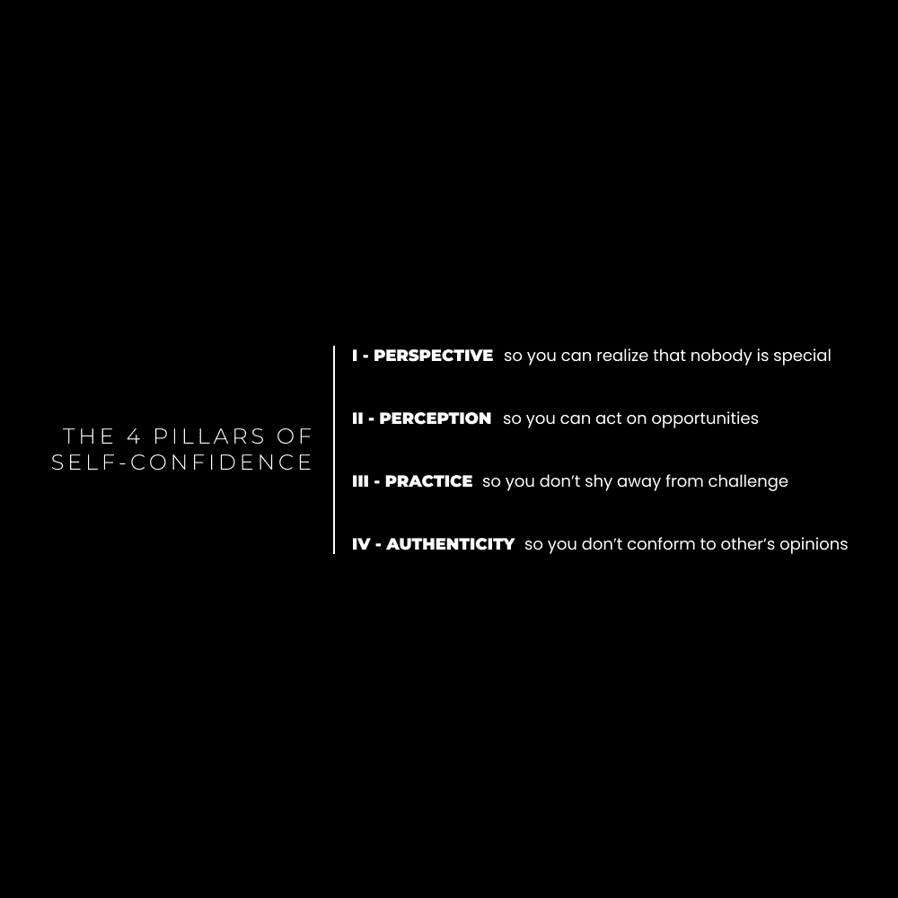
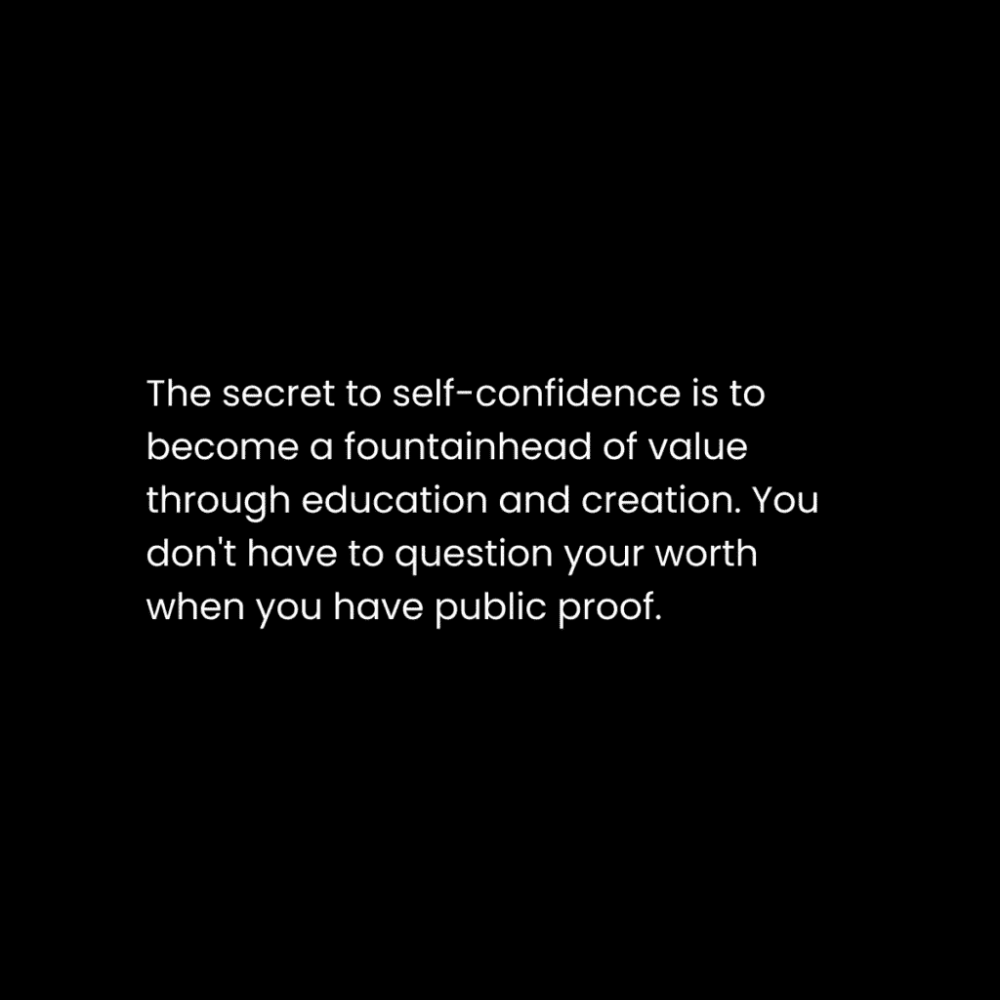

# 自信心理学：你之所以不成功，是因为你太在乎了（如何停止在乎）

> [原文链接](https://thedankoe.com/letters/you-arent-successful-because-you-care-too-much-how-to-stop-caring/)

在本节课中，我们将要学习一个核心观点：过度在意他人的看法是阻碍我们成功和自信的关键因素。我们将探讨如何通过建立对未来的信任来停止这种内耗，并深入分析构成自信的四个支柱，以及一条通过创业和个人成长来培养不寻常自信的实践路径。

当你开始信任自己的未来时，你便不再会过度在意他人的意见。

这背后有深刻的道理需要理解。

缺乏自信是困扰大多数人的问题，它限制了潜力的发挥。其根源往往在于过于在意别人的看法。

例如，假设你想开始创业，脑海中可能会涌现出许多想法：

+   我的父母会怎么想？
+   我的朋友们会怎么想？
+   我的配偶会怎么想？
+   这能取代我现在的收入吗？
+   这需要多长时间？

当你真正开始创业时，类似的担忧会更多。

人们失败的原因，常常是无法承受实现目标所需的情感负担。

对于每一个关于更好生活的想法，可能有一百个想法试图将你拉回原地。

而这还仅仅是关于创业的想法。

我们每天还有其他成千上万个想法。

我们担心很多事情。

例如，结交新朋友时，我会显得奇怪吗？

如果债务失控，我的生活会变成什么样？

我今天早上喂狗了吗？如果别人发现我没喂，会不会觉得我是个糟糕的宠物主人？

培养自信并非易事。

在现代环境中，更多的信息、责任和未来的选择，既可能将自信转化为成功，也可能将焦虑催化为失败。

那么，我们该如何开始培养那种能带来自信的信任感呢？

## 自信的四个支柱

上一节我们探讨了过度在意的危害，本节中我们来看看构建自信的具体框架。以下是自信的四个核心支柱。

当大多数人思考如何变得更自信时，他们会想到一个简单的公式：

**自信 = 能力**

这个公式是正确的，但很多人将“能力”狭义地理解为在特定技能上变得更好。

因此，他们不断地学习、学习、再学习，却从不采取行动，从不进行自我反思，也从未真正将自信作为一种技能来培养。这是最常见的误区。

这个简单声明背后有更深层的含义，我们需要深入理解。因为显然，将“自信 = 能力”作为泛泛的建议，并未解决这个普遍问题，有时甚至使之恶化。

**支柱一：视角**

当你进入一个让你感到不自信的情境时，焦虑感会急剧上升。

这会使你的思维变得封闭，只关注内心的想法。

这些想法会不断滋生。

你会完全从情境中退缩，成为过去经历的奴隶。你仍然是同一个人。

你必须摆脱这种状态，并有意识地努力重新编程你对情境的反应习惯。

具体做法如下：

+   当你进入一个引发焦虑的情境时，请先暂停。
+   拓宽你的视角，将当前情境仅仅看作一个普通的情境。
+   将你的意识转移到与你处于同一情境的其他人身上。

“转移意识”即采用他人的视角。

请记住，大多数人只是和我们一样过着普通生活的人。

亿万富翁也有他们的烦恼。

健身模特也有和我们类似的问题。

那些你心理上认为高于你的人，其实也有同样的困扰。

唯一可能让他们对你产生负面反应的事情，就是你不把他们当普通人看待。

不要将他们置于你之上。

请记住，你正在培养一种新习惯。

这需要重复和实践。

如果你无法对情境建立正确的视角，就无法进展到其他支柱。

**支柱二：感知**

你如何感知一个情境，决定了你的行为。

这要求你在情境发生之前和之中都保持开放的心态。

例如，如果你浏览社交媒体时，没有将企业主的推文视为一个接触机会，你就不会去联系。

即使你将其视为机会，如果你误解了对方，仍可能搞砸信息或根本不敢发送。

这同样适用于结交新朋友或参与困难的讨论。

感知是双向的。

你会根据他人的表现方式来感知他们。

他人也会根据你的表现方式来感知你。

如果你没有“看起来合适”或以某种方式表现，可能导致对方产生负面解读，事情就不会顺利。你会在潜意识中察觉到这一点，从而避免参与那些因外表和行为方式而可能导致失败的情境。

我个人非常内向，但人们常告诉我，我穿着、走路和说话的方式显得很自信。

这需要练习。

**支柱三：实践**

你在某个领域的能力，使你能够更好地感知情境。

可以将技能获取视为提升你在人生游戏中的等级。

在电子游戏中，有“技能树”。

在游戏过程中，你选择技能来帮助你以想要的方式游玩。

当你练习这些技能时，你获得了经验，新的技能也随之解锁。

这里的关键点是：

**你无法使用其他技能，除非你先练习了当前可用的技能。**

你之所以意识不到有利可图的机会，是因为你缺乏识别、选择和采取行动的技能。

朝着目标前进，需要你不断学习并练习达到目标所需的技能。

如果你的目标定得太高，你会感到不知所措，不知道从何学起。

你必须在当前的等级上努力，并获取达到下一级所需的技能。

随着等级提升，你的工具箱里会装满技能，这些技能让你拥有比低等级时更广阔的视野。

以我为例，我第一次成功的尝试是自由职业网页设计。

这是一项任何人都可以学习的单一技能，但竞争激烈。

我知道，如果我想做更有利可图的事，比如为服务型企业制作营销漏斗，就必须学习营销、文案和用户旅程等技能。

然后，当我追求成为内容创作者时，我需要结合已有知识，并增加新的技能，比如内容写作。

我的等级越高，遇到的人越多，我在多个领域的自信也越强。

你能做的最糟糕的事，就是停止学习新技能，满足于当前的等级。

**支柱四：真实性**

真实性意味着按照自己的意愿行事，不受你认为需要遵守的外部思想、观点和信念的干扰。

例如，当我使用一些词汇时，有人在评论中说这不专业。我是应该遵从他们相对（而非绝对）的信念，还是自己思考？

我不在乎是否“符合专业”，也不在乎被那些每个人都可以不同方式解释的词语所冒犯。

通过真实性获得的自信，是一场心理游戏。

你必须每天练习。

你必须学会暂停、获得视角、调整感知，并练习情境所需的技能。

真实性，是你实践自信四个支柱的方式。

## 不寻常的自信之路

上一节我们建立了自信的理论框架，本节我们来看看一条通过行动和实践来培养深层自信的路径：创业与个人成长。

创业是人类的天性。

它意味着追求新挑战，永不满足于现状，通过获取技能来扩展视野，并通过反馈（如金钱）来验证你是否为社会做出了实际贡献。

创业即是创造。

成为一名创造者，是通过你独特的人性边缘来引导神圣的创造行为。

你不希望陷入一个不再有挑战的境地。

就像笼子里的猴子，即使你是收入最高的1%，如果你的心理停滞，你仍会疑惑为何生活不尽如人意。

个人成长是通往业务增长的“门户药物”。

而业务增长，则是一条培养不寻常自信的道路。

我在“数字经济学”中将两者结合，旨在帮助你提升自我，将自我产品化，并从自我中获利。这是一个自然的进程。

以下是创业如何培养不寻常的自信：

**1. 它要求你不断进化，否则就会“死亡”。**

大多数人在25岁时就“死”了。

他们找到了工作、配偶、房子、车子。

他们得到了社会期望的一切，成为一个舒适、顺从、对系统威胁很小的人。

生活是不断流动和演变的。如果你选择满足于次等的生活来阻碍这种流动，那么你就“死”了。

这里的“死亡”是象征性的。如果生活意味着成长，而成长需要新事物，那么“死亡”就是新想法、潜力、项目和实践的消亡。

在一个永不停息变化的世界里，创业能确保你不停止成长。前提是你能坚持到成功。

**2. 它要求你成为所在领域的专家。**

如果你的理解不足，你将得到次优的结果。

理解不同于知识。

理解是意识向上的扩展运动。

冥想是意识向下的扩展运动。

大多数神秘主义者和精神导师忽略了这种平衡。

这不是“要么创造，要么战斗”，也不是“要么进步，要么行动”。

两者都是。

这就是生活。

二元性崩溃，合为一体。

如果你只堆砌理论而不实践，你将在行业中失败。

你需要日常的教育和执行，二者缺一不可。

**3. 它要求你为自己和客户取得成果。**

如果你没有取得成果，你就没有价值。

道理很简单。

如果你没有取得成果，这不是放弃的信号，而是改进的信号。真正的价值需要随时间发展。

创业，是你确保自己在现实中成为一个有价值资产的方式。

**4. 它要求你接受初期的“表现不佳”，以便改进。**

认为自己在开始时就能做好几乎所有事情，这种想法是愚蠢的。

正是这种想法阻止了大多数人采取行动去实现梦想。

一旦你克服了第一个障碍，你就会进入一个纯粹的进步阶段。

**5. 它要求你改变工作、休息和娱乐的习惯。**

你无法用达到二级时的角色，去胜任三级的要求。

成长需要改变，这就是为什么大多数人早早安定下来。

**6. 它要求你掌握心理学技能，以便理解你的内心。**

营销、销售、写作和演讲是商业成功的基础。

在当今世界，财富通过代码和内容创造。

代码是互联网的后端。

内容是前端。

结合两者，你就拥有了“人”和“产品”。

将人们引向产品，你就能获得利润。

你可以学习编码，这极具价值。但除非这是你的热情所在，否则学习内容创作可能更好。

你可以利用编码者构建的工具（如网站建设器、社交媒体平台）来分发你的内容。

内容创作需要自我理解。

你必须吸引注意力、保持注意力，并向这些注意力提供价值。

我在“一百万美元技能堆栈”中详细讨论过这一点。

## 自我提升者的实践路径

前面我们探讨了理论和框架，本节我们将聚焦于一条具体的、可操作的进步路径，帮助你将自信培养为一种可实践的技能。

当你试图变得更加自信时，“焦虑陷阱”是危险的。

你会为接近新人而焦虑。

你会为创业所需的改变而焦虑。

当你感觉到焦虑时，请停下来。

（这需要有意识的努力……*暂停。*）

拓宽你的视角。

调整你的思维方式。

焦虑的解药是好奇心。

这就是心态的调整。

当你担心开始创业时，你看得太远，以至于无法清晰思考。你的大脑无法整理你心理上所处的混乱情境。

将你的注意力拉回到现在可以做的事情上。

对你可以开始学习的内容感到好奇，然后去学习它。

当你在社交场合时，停止想象与那个人未来的每一个细节。

将你的注意力集中在眼前的人身上。

有什么吸引你的地方？

向他们提问。

以下是如何利用好奇心，来建立盈利业务（自信作为副产品）的动力。

**1. 从写作开始**

当你不自信时，写作是最好的起点。

而且，写作是所有内容形式的基础。

推特、广告、视频、短视频……所有内容都始于撰写实际的帖子或脚本。

写作让你在别人竞争外表时，可以展示你的智慧。

你不需要展示你的身体甚至你的脸。

要成为一名优秀的作家，你需要理解心理学，以构建能够吸引、保持和传播注意力的信息结构。

要理解心理学，就要研究营销和销售。这样你才能学会在现实世界中应用你的心理理解。

如果给你指一条路，以下是开始写作的步骤：

+   选择一个你感兴趣、并可能作为全职工作的主题。
+   每天拨出30分钟学习营销、销售或你感兴趣领域的知识。
+   不要错过任何一天的学习。观看视频、播客，阅读书籍和网络内容。
+   记录下让你印象深刻的想法。
+   从 Twitter（X）或 Threads 开始，发布你的想法。
+   将社交媒体运营视为一项需要成长的技能。

在3-6个月的时间里，你应该能获得相当数量的关注者。

这足以让你有信心将其视为全职生意。

一旦你有了足够的读者，你就可以创建产品或服务来将你的写作变现。

届时，你学到的营销和销售知识将派上用场。

**2. 开始演讲**

大多数人不知道，我的第一个拓展平台不是Instagram，而是一个播客。

原因如下：

+   它帮助我结识高层人士，并获得更多机会。
+   你不需要视频编辑技能。从写作过渡过来很容易。
+   它迫使你发现与他人沟通中的盲点。

我没有用播客来直接赚钱或成名。

这在播客中很罕见。

我用它来联系我想交谈的人。

人们通常很喜欢上播客。

例如，我想和贾斯汀·威尔士交流，就邀请他做了一期播客，这为我的品牌带来了新视野。

我们关于一人业务的讨论，成为我在6周内获得YouTube上15万订阅者的催化剂。

那是下一步。

你可以直接将之前的写作内容用于YouTube。

制作6个月视频后，你能直观地看到自信心的提升。

你会变得更自然、更简洁、更有影响力。

你的业务将与你的自信一同增长。

**3. 创建一个产品或服务**

至此，你正在扩大你的受众。

你拥有了“人”。

如果你还没有，你需要退一步，意识到这是一个技能问题。你需要对社交媒体有大局观，以便持续产出能吸引人的优质内容。

赚钱需要“人”和“产品”。

这里的“产品”也包括服务。这是你卖给所吸引人群的东西。

这是赚钱的唯一方式。

你可以努力成为仅靠社交媒体平台广告收入生活的人，但你将成为算法的奴隶。

创建自己的产品或服务，是你掌控收入的方式。

社交媒体作为一种技能，成为一个你可以随时打开以赚取更多收入的水龙头。

你知道如何吸引人，你有一个可以销售的产品。

（这两者都需要大量工作，你需要在两方面都不断提高。）

关于创建产品，这里有一些可供深入学习的资料：

– [一人业务模式概述](https://thedankoe.com/letters/the-one-person-business-revisited-turn-yourself-into-a-business/)
– [即使是新手也能创建优秀产品的最佳方式](https://thedankoe.com/letters/the-best-online-business-model-to-make-1-million-in-2023/)
– [如何将你脑中的价值10万美元的知识产品化](https://thedankoe.com/letters/you-have-100000-of-knowledge-trapped-in-your-brain/)

建立产品或服务有助于增强自信的原因是：

+   你一开始会做得不好。这几乎适用于任何新事物。不要因为商业对你陌生就感到可怕。
+   你会直接得到关于如何改进的反馈。人们可能严厉，但大多数人是友好的。
+   如果你真想赚钱，你需要提供真正的价值。如果你的受众或收入没有增长，可能需要思考你提供的价值究竟有多大。

---

本节课中我们一起学习了如何通过停止过度在意他人来解放自己。我们剖析了自信的四大支柱：**视角**、**感知**、**实践**和**真实性**，并探索了一条通过**写作**、**演讲**到**创建产品**的实践路径来培养不寻常的自信。记住，自信不是一种天赋，而是一种可以通过刻意练习培养的**技能**。请将自信的培养视为一生的习惯。

– 丹·科