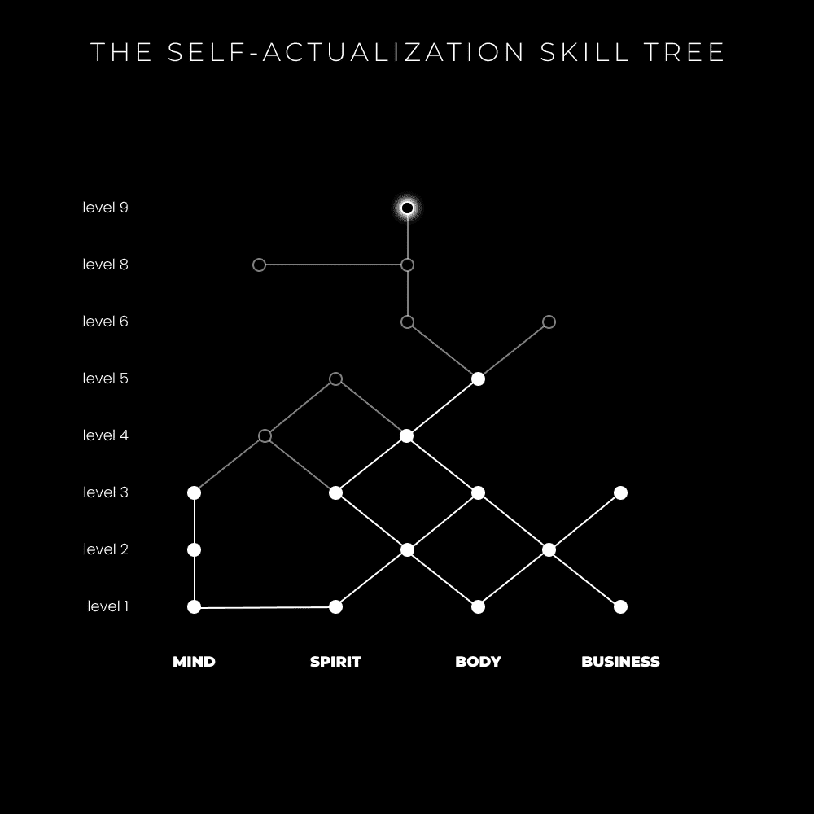
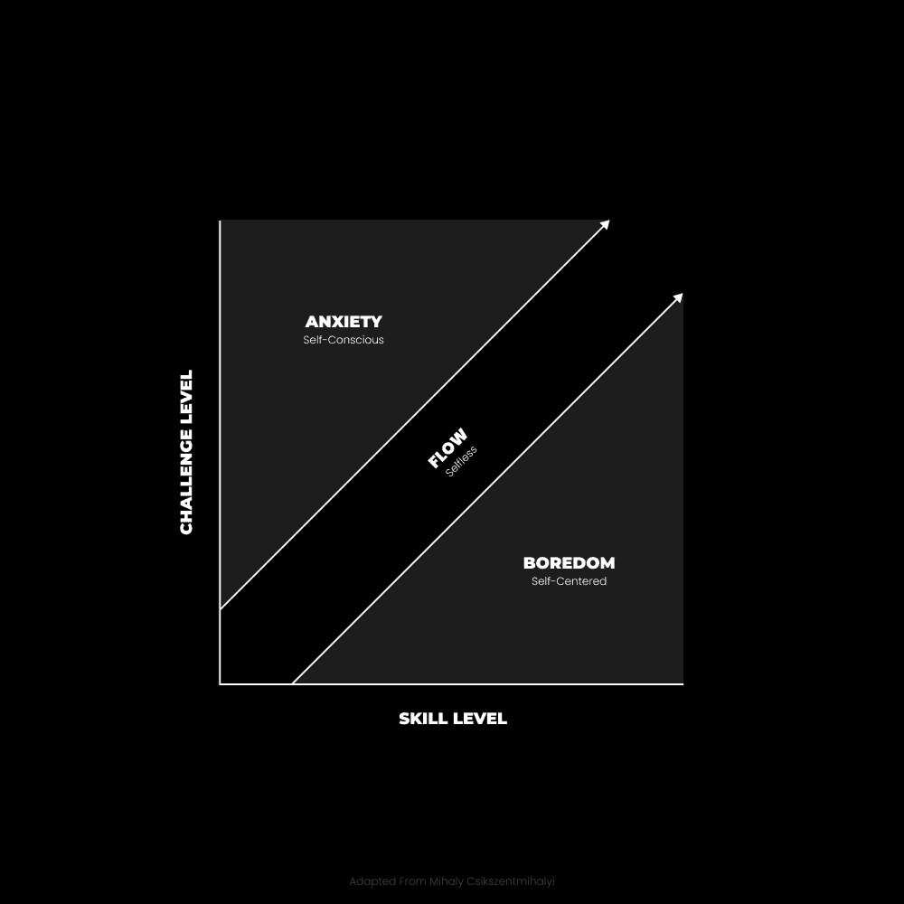
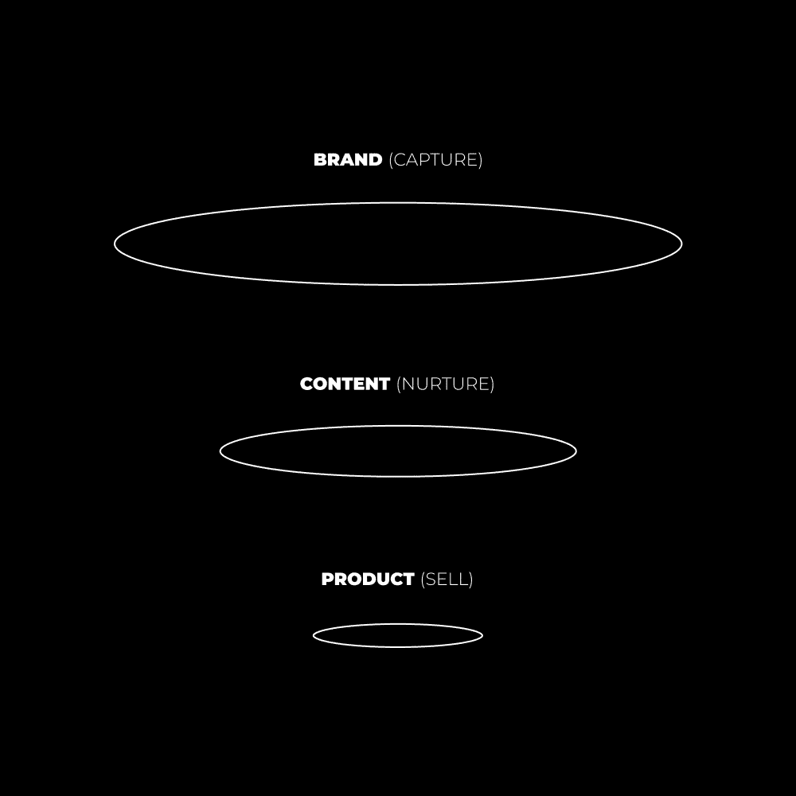

# 数字经济学：少工作，多赚钱（4小时工作日）🚀

在本节课中，我们将探讨一个反直觉的理念：减少工作时间反而能帮助你赚取更多收入。我们将深入分析如何通过消除低价值任务、聚焦高杠杆活动以及理解复利效应，来实现每天仅工作4小时的高效模式。

## 核心原则：消除与聚焦

当我告诉别人我每天工作不到4小时时，他们通常表示怀疑。尤其是在我当前的生活阶段，我每天最多只工作1-2小时。这是如何实现的？

上一节我们介绍了高效工作的核心理念，本节中我们来看看实现这一目标的两个具体策略。

以下是实现高效工作的两个关键策略：

1.  **持续专注于消除不喜欢的事情**：我不喜欢冗长的客户电话或主持播客，因此我停止了这些活动。仅此一项每周就为我节省了数小时。当然，这并非一蹴而就。我必须**为我的问题创造解决方案**。客户工作曾有其作用，直到我意识到打造个人品牌是一条出路。于是，我将其作为每天早晨的首要任务，坚持了一年。
2.  **持续专注于最高杠杆的活动**：自由职业和咨询是很好的起点，但需要投入大量时间。若想获得更多自由，你需要一个能在你睡觉时自动销售、无需个人持续投入的产品。我逐步从客户工作中抽身，并利用我在品牌咨询方面的经验，建立了一套数字产品组合。随着个人成长，**时间与金钱的投入产出比必须降低**。

## 执行力：从知道到做到

接下来，我意识到写作是我理想的流量生成方法。我每天早上会写1-2小时，甚至在周末也是如此。我的写作内容会被改编并发布到各个社交媒体平台，以持续扩大受众。

这就是大多数人失败的地方。他们学习了课程，明确了哪些是高杠杆任务，但实际行动却背道而驰。当他们问“为什么我没有结果？”时，我询问他们每天专注做什么，答案往往是“几乎没有”。他们没有每天执行那些能带来结果的关键行为，而是拖延数小时，或将时间浪费在无关紧要的事情上。

**结果需要时间来积累势能，而大多数人缺乏耐心。**

## 增长的复利：受众的力量

许多人尚未意识到受众增长的复利性质。商业，无论线上线下，都需要“人”和“产品”。“人”可以通过广告、地理位置、手动拓展（如冷电话或邮件）获取，而在数字时代，最有效的方式是通过内容创作来扩大读者群。

大多数企业每天花费数小时试图获取客户，却忽视了社交媒体的力量。

我的观点是：如果一个拥有5万粉丝的品牌每月能赚5万美元（对于懂行的人来说，这仅是起步水平），那么一个拥有50万粉丝的品牌，只需付出十分之一的努力就能达到同等收入。想象一下，如果拥有200万粉丝（我确实有），我甚至可以用一周中一小时的产出赚到那么多。

换句话说：由于我多年来的专注投入，我的单次创作产出可能是一个初学者的数千倍。我不愿为了所谓的“地位”或合群而延长工作时间。

> 我认识一位每天工作14小时的企业家，却仍生活拮据。我也认识一位每天工作5小时的企业家，已经创立并出售了3家价值超过1亿美元的公司。价值不在于你工作了多久，而在于你的注意力聚焦在何处。
> — Tej Dosa (@ComedicBizman)

没有其他流量生成方式拥有如此强大的力量。严峻的现实是，大多数人坚持的时间不够长，从未达到“一天内获得一个月结果”的境界。大多数人没有提升技能水平，只是在当前水平上投入了更多时间。

## 为何选择4小时工作日？🧘‍♂️

越来越多的年轻创业者吹嘘自己长时间工作，每天12-14小时。这本身没问题，创业就像一场游戏，可以很有趣。但这种生活方式存在一个明显问题：**过度工作是全面发展的对立面**，而全面发展是通向自我实现和指数级增长的催化剂。



人们好奇我为何每天只工作3-4小时（平均而言，没有什么是永久的）……我却想知道他们为何不关心自我实现。如果你过度专注于金钱这类中性事物，哪还有时间培养创造力、维护人际关系和关注健康？

想象一下视频游戏中的技能树。如果你只专注于一条路径，就无法解锁更高阶的技能。你可以在商业上达到一定高度，但要达到新的境界，你必须在健康、人际关系和认知发展上达到同等水平。

关于“一天内获得一个月结果”的观点，如果**只**专注于商业，这几乎是不可能的。“专注于一件事”恰恰**需要**你关注许多其他方面才能把这件事做得更好。这在生活中大多数有益的事情上都是反直觉的。


## 工作与休息的心理学🧠

让我们明确区分工作与休息。我们将**工作**归类为“生产力模式”，将**休息**归类为“创造力模式”。这两种模式是由你的注意力聚焦点、方式和目的所决定的心态。

**生产力模式**是一种注意力高度集中的狭窄状态。你专注于解决任务提出的具体问题，通常伴随着压力感或表现压力。在心理学上，这对应于大脑的**任务积极网络**，它在需要对外部环境保持注意力的任务中活跃。

**创造力模式**是一种开放而放松的注意力状态。你不专注于与压力相关的任务，但思维仍在活跃。这就是为什么在淋浴、健身、散步或晒太阳时常常会灵感迸发。在心理学上，这对应于当我们从对外转向对内关注时激活的**默认模式网络**。

**问题在于**：过度工作的人没有意识到，习惯不仅仅是行为，更是身份认同。像“生产力模式”这样的心态可以成为你潜意识中的条件反射。你可能长期生活在一种狭隘、有压力的视角中，悄无声息地损害健康，而你却毫不在意，因为这就是你所知的全部。

你当前的意识水平就像被迷雾笼罩，无法看清梯子的更高一级。生活变得机械而“已知”，你从未想过“未知”可能对你有益。当你想到每天只工作3-4小时可能带来更大进步时，你的身份认同会受到威胁，你害怕踏入未知的生活方式。因此，自我意识固化了你的生活方式，你继续重复过去的行为。

**进化**：我并非说生产力模式是坏的。事实上，它是最令人愉悦的心态之一——安全、确定、专注，可以屏蔽消极想法。问题在于**从不打破这种状态**去反思过去、重新瞄准未来。你从未拉远视角审视人生方向，从而做出更好的日常选择。大多数人一生都在“埋头拉车”，某天醒来却不知问题出在哪里。

**正确的方法是**：先拉远视角，设定一个宏大目标以获得方向感，然后从这个目标的角度来审视你的日常选择。许多勤奋的创业者可能嘲笑自己与朝九晚五的上班族不同，但本质上，他们可能陷入了同样的陷阱。



最好的解释方式是使用***技能-挑战匹配***模型：

```
高挑战 + 高技能 = 心流状态（最佳体验）
低挑战 + 高技能 = 无聊
高挑战 + 低技能 = 焦虑
低挑战 + 低技能 = 冷漠
```

挑战是获得最大享受（心流状态）的关键。挑战会缩小思维，使人专注于阻碍有意义目标的问题，而目标正是进化的驱动力。我们都感受到一种“吸引力”，召唤我们成为最高版本的自己。这是进化在召唤你按照自然规律生活。

**停滞即死亡**。为了达到新的挑战水平，你必须：
*   永不停止学习，积累新技能和新视角。
*   提升你人格的复杂性，以便能够感知到更高层次的挑战。
*   解决生活中的深层问题，避免停留在表面。

这是我对大多数朝九晚五工作不满的原因。有些工作确实允许进步，但过程缓慢且存在不可避免的上限。我认为朝九晚五的工作应被视为垫脚石。它们容易滋生自满，对心理健康有害。**挑战使生活变得有趣和有意义**。如果你停止追求更多，停止个人进化，你将失去目标和满足感。

当然，每个人都有自己的目标。有些人可以在终身的朝九晚五工作中，通过正念方法达到持续的幸福感。但我这番话是对那些内心明显渴望更多、天生具有探索自身潜力好奇心的人说的。否则，你就不会读到这里。

## 创造力与杠杆⚖️

> 如果一项工作不需要创造力，就将其委托、自动化或放弃。
> — Naval Ravikant (@naval)

**创造力是生产力的平衡**。持续保持生产力会导致持续的压力水平，进而导致肤浅的生活。你甚至意识不到生活中还有深度，很难将思维扩展到工作相关任务之外。这会影响到你生活的每个领域：与亲友的关系、从健康活动中恢复的能力、以及决定你未来真正财富水平的心理能力与发展。

4小时工作日、单一焦点和有意义的工作正在互联网领域成为新常态，这有充分的理由。从古罗马人、希腊人，到史蒂夫·乔布斯、查尔斯·达尔文，越来越多的远见者、战略家和创新者都将他们的成功归因于极低的工作时间和大量的休息活动（如长距离散步）。

当我们看到某人拥有令人尊敬的创意作品时，常以为他们长时间工作、通宵达旦。然而，事实往往相反。例如，达尔文会在早晨散步和早餐后于八点开始工作，一个半小时后休息，处理信件，然后再进行严肃的工作或实验。中午时分，他便结束工作日，外出散步。阅读并回复更多信件后，他会小睡，再次散步，然后可能再工作一小段时间。

**每天3-5小时的工作搭配积极的休息，似乎是大多数有影响力的创意人士的黄金点**。海明威、昆汀·塔伦蒂诺、大卫·奥格威等来自不同领域的作家，会将大量时间花在看似“不工作”的事情上，如闲逛、交谈。他们为创意的涌现留出了空间，正是这些创意推动了他们工作的成效。

如果他们能用这种方法改变文化和商业，为什么企业工作狂不能呢？如果你想知道“如何”做到这一点，可以参考我之前的详细文章：[《4小时工作日的十条戒律》](https://thedankoe.com/letters/the-4-hour-workday-focused-work-changed-my-life/) 和 [《我的深度工作常规》](https://thedankoe.com/letters/change-your-life-in-6-months-my-deep-work-routine/)。

## 新货币：注意力与想法💡

你如何赚钱？
第一，你需要**注意力**（受众）。
第二，你需要一个**产品或服务**来引导这种注意力。
第三，你需要了解在整个用户旅程中**引导注意力**的过程。

有些人可能会随机购买你的产品，但这在大多数情况下不可持续。你必须创造并理解用户与你的品牌互动的每一个接触点。有些人称之为“漏斗”，但这个术语带有一些不道德的营销色彩。

我的“漏斗”很简单：
*   每周写一篇围绕一个大想法的通讯文章。
*   每天写3条简洁而令人难忘的推文。
*   将这些内容重新加工，发布到所有平台（我的通讯文章就是我的YouTube视频脚本，[我在这里教你如何写作](https://2hourwriter.com)）。



你必须用**想法**来吸引、保持和培养受众的注意力。**想法是新的货币**。**现代成功是一场心理战**。**创造力、休息和短工作时间是催化剂**。这是我后期才深刻意识到的事情。

这里是你需要关注的重点：**如果不优先考虑深度，你就不会被记住**。你的权威取决于你能在他人一生中占据多少注意力。一条推文可能占据10秒注意力，一本书可能占据5-6小时。你成为你所消费的内容，你也塑造了阅读你作品的人。

书籍、通讯、播客和YouTube视频，这些是你的品牌基石。这就是你在不需要强硬销售策略和直接响应营销的情况下培养受众的方式。当你优先考虑深度、理解和新颖的视角时，你便与受众建立了信任和“股权”，可以在推广时兑现。

你更容易记住谁？是你在Twitter上点赞过的某条推文的作者，还是那位改变了你世界观的书作者？我不记得从埃克哈特·托勒那里读过的每一句话，但我会将他的作品推荐给任何好奇于我最大影响力来源的人。他“住”在我的脑海里，因此能持续地从我这里获得影响力（和潜在收益）。

### 全面的生活方式框架：填充-清空-使用🔄

> 下午：通过阅读、学习和社交来**填充**你的大脑。
> 睡前：通过日记、计划和冥想来**清空**你的大脑。
> 早晨：通过创造、输出和专注来**使用**你的大脑。
> — Dan Koe (@thedankoe)

**在下午，通过以下方式填充你的心灵**：
*   **追求好奇心**：收集真理的碎片，并将其整合进你的世界观。
*   **获取技能**：增加你在不断变化的市场中的价值。停止学习就等于停滞。
*   **进行智力对话**：检验你的想法，保持开放心态，避免陷入狭隘视角。避免无谓的辩论和争论。
所有这些都可以作为你创造性工作的燃料。

**在睡前，通过以下方式清空你的心灵**：
*   **自我反思**：记录下你可能会错过的错误、教训和方向。
*   **现实映射**（或记录当天所学及其与其他想法的联系）：以便你能创造出有价值的东西。
*   **精神连接**：避免陷入“行动”模式。拥抱“存在”状态以平衡压力。

**在早晨，通过以下方式使用你的心灵**：
*   **专注工作**：引导你的发现，练习你的技艺。
*   **优先项目**：为你的工作提供方向。这是唯一能产出你可交付给他人物品（并获得报酬）的途径。
*   **爆发式强度**：在清晨第一件事上就获得成就感。在休息时，你可以安心地知道已经完成了最重要的工作。

## 总结

在本节课中，我们一起学习了如何通过“少工作”来“多赚钱”的哲学与实践。核心在于：
1.  **消除低价值消耗**：果断停止你不喜欢且低杠杆的活动。
2.  **聚焦高杠杆活动**：识别并持续执行能带来复利效应的核心任务（如内容创作）。
3.  **理解心理模式**：平衡“生产力模式”与“创造力模式”，让休息为深度工作赋能。
4.  **建立全面框架**：采用“填充-清空-使用”的每日节奏，系统化地管理精力与创造力。
5.  **认识到新货币**：在注意力经济时代，**深刻的想法**和与受众建立的**深度信任**才是真正的财富源泉。

实现4小时工作日并非关于懒惰，而是关于极致的专注、系统化的效率，以及对个人全面发展的深刻承诺。它要求你从埋头苦干转向抬头看路，用智慧而非单纯的时间投入来创造价值。现在，是时候重新审视你的工作方式，将注意力投资在能产生最大长期回报的事情上了。