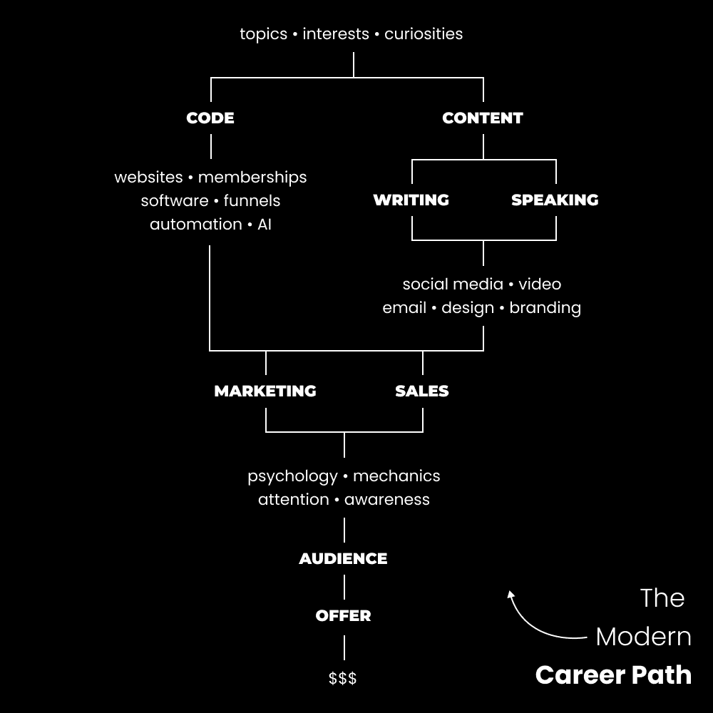

# 高收入技能教程：核心概念与永恒技能 🧠

在本节课中，我们将要学习实现财务自立所必需的核心高收入技能。这些技能不是可选的，而是成功的基础。我们将首先探讨失败的价值和自立的本质，然后深入分析那些超越表面技术、真正驱动成功的永恒技能。

我的商业旅程很简单。我尝试了几乎所有事情，但都失败了。失败是一种祝福，因为它揭示了可以改进之处。那些没有失败的人不会成功。成功只存在于失败的基础上。你必须设定一个高目标，将巨大失败视为低目标，并在挣扎中前进，以实现有意义的对比。

这提出了一个重要观点：**自立**。富家子弟往往不真正自立，因为成功对他们来说是常态。没有人能教你**自我**自立，否则这就不算是自立。要在任何领域实现自立，你需要能够弥合你目前状态和理想状态之间差距的技能。大多数人不知道自己想要什么，甚至没有意识到自己目前的状态是个问题。

注意“需要”这个词。有一些技能是**必须**学习的，它们不是可选的。我重复一遍，它们**不是**可选的。本教程展示的技能，是每个成功人士都必须学习（或雇佣）以在商业、关系乃至健康方面达到一定成功水平的技能。我在7种商业模式上失败了，原因正是我没有理解那些能真正让我赚钱的技能。这些不是网页设计或电子邮件营销等现代技能，而是更深层、更根本的能力。

---

上一节我们介绍了自立的概念和核心技能的必要性。本节中，我们来深入探讨第一组永恒技能：**营销与销售**。

我正在构建一个软件业务，过程中会感到迷茫。商业结构、法律、招聘等事务可以即兴学习。网上有大量资源教你如何开始一项“真正的”业务。在一家个人企业中，你甚至可以免费开始。技术技能是可以学习的。

但技术技能并非商业成功的唯一驱动力。如果它们是，大多数企业就不会失败。**营销和销售**才是关键的不同因素。它们是永恒的技能，需要创造力、经验和行业理解才能发挥作用。营销和销售是赚钱和亏钱之间的区别。

以科技初创公司为例。他们可能有出色的开发人员和产品，但发布后却失败了。原因在于：他们没有建立受众信任，没有吸引目标市场的注意力，没有解决具体问题，也没有通过内容创造自己的客户。

**营销和销售**与**写作和演讲**的结合，是你创造价值的方式。价值创造是建立个人企业的核心技能。为了在写作和演讲中有效展示营销和销售原则，你需要整合以下要素：

以下是构建有效营销内容的关键要素列表：
*   **一个期望的结果**：你的受众想要达到什么目标？
*   **一个阻碍前进的热点问题**：是什么在阻止他们？
*   **一个通往结果的既定路径**：基于你独特经验的解决方案。
*   **目标人群的意识水平**：他们对问题的了解程度如何？
*   **基于八种人类欲望的论述角度**：从根本欲望出发谈论问题。
*   **好处与影响列表**：解决问题将如何改善他们的生活。
*   **证明**：你自己或前客户的成功案例。
*   **一个引人注目的大想法**：在互联网噪音中脱颖而出。
*   **风险逆转或保证**：促使他们做出最终决定。

营销和销售是永恒的，因为它们基于人类行为和心理机制。它们从思想开始。你不仅在推销产品或服务，当你写作时，你也在推销你的想法。内容缺乏参与度，往往是因为未能将上述要素结合成有影响力的写作和演讲。

记住我们讨论的自立吗？其余的取决于你。请深入研究营销和销售，并牢记上述要点，以筛选出真正重要的内容。

---

理解了营销与销售的核心地位后，我们来看看承载这些技能的**永恒容器**：产品与内容。

大多数人失败是因为不理解商业如何运作。你需要一个好的产品，以及需要这个产品的人。让我们通过一个卖计划表的场景来了解：

我想卖计划表，因此我先从自己身上实验。为什么？因为你需要经验和结果。大多数企业失败是因为试图向从未经历过问题的客户销售。我购买了畅销的计划表、生产力书籍和课程。我沉迷于相关播客、社交媒体和视频。我规划我的日子和工作，应用所学。

到这个阶段，我已经有了改进产品或创造全新产品的想法。我也让自己接触到了运营此类业务所需的全部内容：
*   我听过高效能的社交媒体内容（可复制用于推广）。
*   我购买过同行产品（可逆向工程其营销和网页）。
*   我取得了结果，拥有了直接经验、期望结果和达成路径（构成了我的营销策略）。

它就在你面前。如果你想在工作之外赚钱，你需要**分销和产品**。如果你想不受地理限制地做到这一点，你需要**代码和内容**。

**代码是互联网的后端，内容是互联网的前端。代码是你托管内容的方式，内容是你吸引注意力的方式。**

你不需要学习编码，因为现代软件已经让许多事情变得简单。以前需要团队完成的工作，现在一个人用软件就能做到。你可以发布内容，被大账号分享，获得数十万浏览量。你可以建立读者群，让你在生活中做任何想做的事。

总而言之，创造内容不再是可选的。销售周期正在变长，潜在客户会更多地调查你。**谁拥有最多和最好的内容，谁就会获胜。**

内容是你分发产品的方式。营销和销售是你创造市场真正重视的产品和内容的方式。这些是你无论学习什么其他技能都需要优先考虑的主要技能：营销、销售、写作，以及用内容作为所有上述活动的载体。

---

在掌握了核心的永恒技能及其载体后，让我们展望一下基于这些技能的**现代职业道路**。

我对创作者经济充满信心。它正在纠正工业革命中的一些问题。教育正在分散化，个人可以自学并掌握关键技能，8小时工作日和工资奴隶的时代正在结束。

以下是我预测的现在和未来的职业道路步骤：

### 1) 代码与内容
大多数人将从代码或内容开始。你可以成为一名程序员或内容营销人员。两者都可以为创作者、初创公司或任何现代企业工作。你的个人品牌（在线形象）是你未来找到客户、工作和吸引客户的地方。如果你不学编程，现代软件也使得这并非必需。

### 2) 营销与销售
这两条道路最终都汇聚到学习营销和销售的必要性上。大多数软件公司和程序员失败是因为无法销售产品。内容创作者也面临同样问题。营销和销售是你在创业狩猎中的武器。

### 3) 建立分销
分销是数字财富竞赛中最重要的概念之一。低杠杆、即时满足的分销方法包括冷邮件、付费广告、直接消息。虽然可行，但一旦停止努力，收益也可能停止。

你最好建立长期的分销渠道（同时混合使用其他方法）：
*   **建立观众群**：例如拥有10万粉丝的社交媒体账号。
*   **向你的网络推广**：让你的互联网朋友推广你的作品。
*   **租赁他人的观众群**：通过新闻通讯或YouTube赞助接触数百万人。

你必须将社交媒体作为一种技能来利用全球分销渠道。当你建立观众群时，你仍然可以通过其他方式立即开始赚钱。

### 4) 从可雇佣到不可雇佣
会有那么一个时刻，你知道自己永远不会再被雇佣。你的技能累积成了在任何市场条件下赚钱的能力。我会遵循的步骤是：
*   学习所有品牌都需要的基础技能（营销、销售、内容等）。
*   通过工作或为创作者工作获得实际经验。
*   每天至少投入1小时建立自己的事业（写内容、推广产品）。
*   随着观众增长，过渡到为自己工作，并扩大产品范围。

这样做，你几乎可以确保自己的未来。庞大的观众群可以弥补营销技能的不足，反之亦然。

### 5) 重复性产品
大多数创作者失败是因为将货币化视为一次性交易。你的产品和服务应与你共同演变。停滞等于死亡。我的业务从网页设计服务开始，演变成漏斗、数字产品、社区、出书计划，最终是软件。这是一个永不停止的持续迭代过程。如果你持续学习，就会看到改进产品的机会。

---

本节课中我们一起学习了实现财务自立的核心高收入技能。我们从失败的价值和自立的定义出发，深入探讨了**营销与销售**这对永恒技能，以及承载它们的**产品与内容**。接着，我们规划了一条清晰的**现代职业道路**，从掌握代码或内容开始，到学习营销销售、建立分销渠道，最终实现从“可雇佣”到“不可雇佣”的转变，并通过创造重复性产品实现持续增长。记住，商业和生活一样，是一个持续构建和迭代的过程。继续构建。