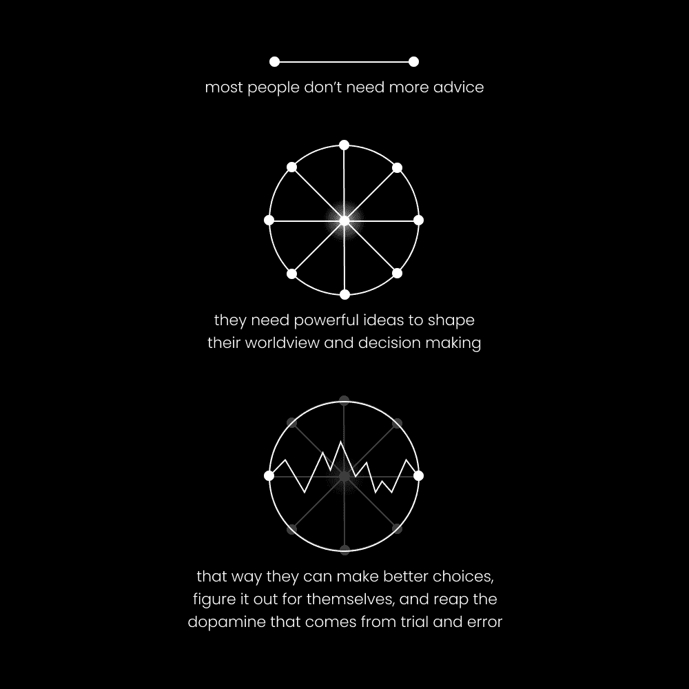
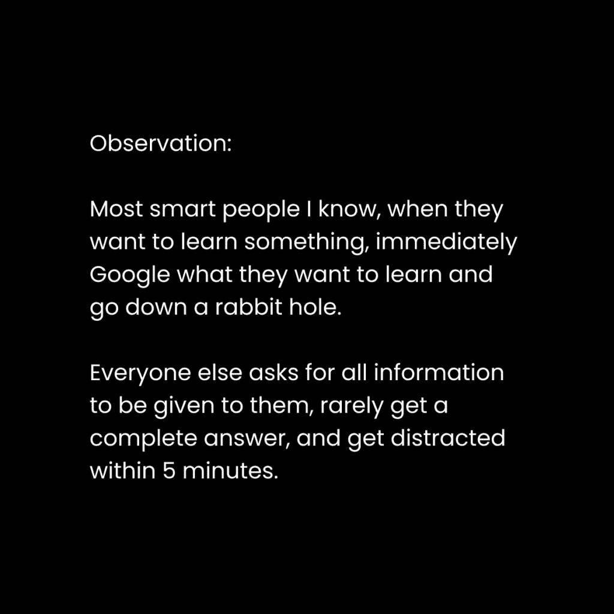

# 成功之道：为何多数人失败，以及如何真正开始

在本节课中，我们将探讨一个普遍现象：为何大多数人寻求建议却依然失败，并学习如何通过改变自身和采取正确行动来开启真正的成功之路。我们将摒弃空洞的语气词，专注于可执行的核心理念。

---

> 原文：[`thedankoe.com/letters/successful-people-dont-ask-for-advice-why-99-of-people-fail/`](https://thedankoe.com/letters/successful-people-dont-ask-for-advice-why-99-of-people-fail/)

人们常问：“我如何开始创业？”、“我如何开始与人交谈？”、“我如何开始追求目标？”。答案很简单：**通过开始**。寻求建议本身并不是开始。

多数人寻求建议是因为害怕经历实现目标过程中必然的尴尬和失败。建议并非总是坏事，但如果99%的失败者都在寻求那99%普遍流传的建议，这本身就值得深思。正因如此，关于“如何创业”或“如何健身”的书籍汗牛充栋，但99%的人依然失败。

人们提出的问题往往过于模糊，以至于无法给出有效答案。“我如何开始创业？”这类问题，期望别人能提供无需自己付出努力的完整人生指南，这本身就是浪费时间。你需要书写自己的人生，停止做那些不能带来实际经验提升的事情。你无法通过外包整个学习旅程来获得真正可操作的答案，因为你害怕的正是这段旅程本身。

问题的核心在于缺乏对“学习过程”的理解。人们不知道如何学习，甚至从未思考过学习过程是怎样的。大多数人从一开始就问错了问题。当他们面对新目标时，没有一个清晰的学习过程来指导决策。

一个有效的学习过程应包含以下步骤：
1.  设定一个有意识的、有意义的目标。
2.  开始培养能实现该目标的习惯。
3.  管理伴随身份转变而来的痛苦和情绪。
4.  用与目标相关的信息“编程”你的大脑。
5.  尝试不同的技术方法。
6.  在遇到具体问题时，才去寻求技术性建议。

当你进行到第6步时，需要注意的是，建议只有在符合你**所处具体情境**时才有效。书籍、播客或社交媒体上的海量建议中，可能只有极微小的一部分适用于你当下的精确状况。你此刻的认知在下一秒就会发生变化，且与他人的经验截然不同。只有当你处于痛苦、挣扎或挑战的状态时，才能获得突破到下一层级所需的洞察。

因此，接收最佳建议需要一个过程，以避免被无用信息压垮。接下来，让我们分解身份转变、自我实验以及如何正确寻求建议，以加速你的学习。

---

## 🧠 成功之道：02：你不需要更多建议，你需要改变自己

上一节我们指出了盲目寻求建议的弊端，本节中我们来看看问题的根源：你自身。

你未能实现目标，是因为你还不是那个能实现目标的人。每一个新目标都像是向未知领域抛下的锚，它需要一个新的世界观、特定的技能和信念来支撑，这些共同构成了新的你。

这就像玩一款游戏。你没能达到100级是有原因的：你缺乏成为100级角色所需的“角色发展”。游戏中风险是虚拟的，而现实中风险虽真实，却常被夸大。**所有的改变都需要身份的转变**。你不能指望仅仅接受建议，就能获得达成目标所需的经验。

回想一下，你上次真正采纳了所寻求的建议是什么时候？你得到的绝大多数建议，其实并不适用于你当前的目标和理解水平。一个100级的人给出的建议，对10级的人来说可能毫无意义。经验的差异是指数级的。在游戏中，每升一级都需要更多经验值。现实中也是如此，从新手到入门的改变相对容易，但之后的进步会显著放缓，就像健身中的“新手福利期”过后一样。

如果你的身份不是**有耐心、专注长期、能容忍风险、乐于从失败中学习**的人，你就会失败。那么，如何改变自己？

**1) 编程你的世界观**
你的世界观影响你的视角开放度，视角影响你对情境的感知，感知影响你的决策，决策影响你的行为，行为形成信息反馈循环，进而“编程”你的身份。身份又反过来塑造世界观，形成一个循环。

如何开始改变？将**自我教育和技能获取**视为日常生活的必要部分。令人困惑的是，很少有人这样做。他们想变得更好、取得成就、获得平静，却没意识到达成这些理想结果的能力，源于他们是否具备相应的能力。

**技能是思想与现实的交汇点**。技能通过教育和实践培养。你所在之处与所想之处的差距，在于**技能**。不是信念、知识、环境或出身，这些虽是重要变量，但最终都被技能超越。一切始于用正确的输入“编程”你的大脑：
*   用有目的的学习替代无意义的刷屏。
*   用在现实世界中创建新项目替代玩电子游戏。
*   用晨间散步、阅读、听播客或观看能开启新可能的视频替代睡懒觉。

学习带来对机会的认知，认知创造动力，持续学习（每天）会随时间改变你的决策。

**2) 身份转变的痛苦**
改变自己如同雕刻一件艺术品。到18岁时，你可能已像一块巨大、方正、未经雕琢的大理石板。第一个改变的决定是最痛苦的，这是对改变的承诺。你必须小心翼翼地进行，如同将手臂从大理石中“剥离”出来，开始雕刻。

如果用力过猛，可能会毁掉整块石料。你需要进行**小而精确的敲击**，来塑造理想的心理体格。每个情境都提供一个可以敲击的点。你必须**有意识地处理每个情境**。当你感到焦虑达到顶峰时，暂停并坚持住。痛苦是暂时的，但所有的成长都需要经历痛苦。

**3) 痛苦是快乐，死亡赋予生命**
这里讨论的“死亡”不是物理上的，而是心理和象征意义上的：即旧我的消亡。我们有两种驱动力：**性冲动**（创造、生存、延续）和**死亡冲动**（破坏、回归无限、消解自我）。有些人通过看似愉悦的活动逃避痛苦，反而承受了更多难以忍受的痛苦以维持“舒适”。另一些人则在健身房、商业或个人发展中主动寻求痛苦，剥离自我的一层层面纱，尽可能接近精神的“死亡”——这正是许多修行者和自我提升者的目标。

关键在于创造一个能产生“痛苦”的环境（如健身房），这种痛苦会催生新的生命和成长。理解这一点，有助于我们接纳改变过程中的不适。

---

## 🔬 成功之道：03：自我实验的力量（如何永久解决问题）

上一节我们探讨了改变身份的必要性，本节我们将学习实现这种改变的核心方法：自我实验。

**自我实验是解决你个人问题的唯一方法**。它与自力更生相辅相成。自我实验能帮助你避免“处方”和“如何做”类建议的固有危险。让我们看一个假设案例：

*问题*：没有足够金钱享受时间。
*   **A方**：完全照搬某位理财大师的方法。进行小额保守投资，降低汽车档次以减少开支。
*   **B方**：从多来源获取建议，但为自己做决定。他们利用“如何做”建议来发现可融入自身目标的原则。他们虔诚学习，但不拘泥于任何可能令其停滞的理念。最终，通过教育和努力，他们找到了适合自己的方法并取得成功。

别人的路径很难完全复制，因为它是高度个性化的。作者以自身为例：在26岁时通过一人公司达到某种成功，这条路上同行者很少。他可以教授原则、给出系统、展示路线图，但每个人仍需通过自己的“教育和努力”让这些为自己所用。

那么，如何通过自我实验实现任何目标呢？以下是具体步骤：

**1) 拥有一个有意识的目标**
目标为你的决策提供框架。没有目标，就无所谓系统。你需要一个能成长为愿景的目标，并时刻牢记它，以便积累实现它的动力。你不会无缘无故充满动力，而是带着一个目标去体验生活，并通过学习和观察，生成实现它的**理由**。你为目标投入的能量（教育和努力）越多，它的“引力”就越强，会开始毫不费力地将你拉向它。

**2) 获得全面的理解**
整体理解比技术细节更重要，原则比战术更重要。但这不意味着可以忽略细节和战术。如果你不能理解试图建立的生意的每个动态部分，你会在商业中失败。如果你没有对身体、营养、训练的整体理解，你会在健身中失败。缺乏对目标领域的整体理解，你容易受流行但不可持续的意识形态影响（如快速致富计划、流行饮食）。

当你接近一个目标时，**教育和努力必须携手并进**以创造理解：
*   **广泛学习**：阅读通用书籍，收听播客，关注提供多元观点的社交媒体账号。
*   **立即行动**：用你拥有的时间追求目标，并实践所学。行动巩固真知。
*   **调整决策**：随着学习，调整你的方法。一开始你会做得很差，这是任何新事业的现实。

**3) 尝试各种技巧**
在学习过程中，你会发现各种可以测试的技巧。在商业中，这可能包括各种写作建议、潜在客户生成方法、商业模式等。这些都是容易获取的信息，如果人人都能轻易获得，你靠它取得非凡成功的可能性就低。

关键在于**自力更生**。你必须**尝试**你学到的技巧，才能通过经验领悟其背后的原则。当你了解真相时，新的、他人看不见的机会才会向你显现。通过实验各种技巧，你也在增加自己的**技能栈**。技能会累积，并让你能感知和利用更好的机会。

**4) 系统化有效的方法**
当你对目标有了清晰认识，会发现某些“杠杆”能带来最大结果。有些技巧就是能带来比别人好1%的结果，这就是你的优势，因为这1%会随时间复利增长。

例如，作者的系统是：每天早上写作30分钟，并将内容复用至所有平台。这为他带来了可观的关注和收入。他将写作视为吸引流量的杠杆，将新闻简报视为可无限再利用的内容资产。

对于初学者，系统可能不同。例如在社交媒体上，你可能需要：
*   积极互动以吸引关注。
*   练习撰写可分享的内容。
*   打造解决自身问题的产品或服务。
*   开始撰写更长篇幅的内容以建立信任并促成销售。

你的系统会随着成长而发展和变化。如果系统不能进化，你就错过了增长的机会。

---

## 📝 总结

在本节课中，我们一起学习了成功路上的关键思维转变。

我们首先指出，单纯寻求模糊的建议往往是拖延和恐惧的体现，无法代替真正的开始。接着，我们深入探讨了问题的核心：**你需要改变的不是方法，而是身份**。通过“编程”世界观、接纳身份转变的痛苦，并理解痛苦对成长的意义，你才能成为能实现目标的那个人。

最后，我们掌握了解决问题的根本方法：**自我实验**。通过设定有意识的目标、获得全面理解、积极尝试各种技巧并将有效的方法系统化，你可以找到最适合自己的独特路径，实现自力更生。

记住，对于每一条“可操作”的建议，都有无数人未能凭借它成功。因此，不要沉迷于寻求建议，而是专注于**做你想做的事，并通过持续的教育和努力，提升你做这件事的能力**。