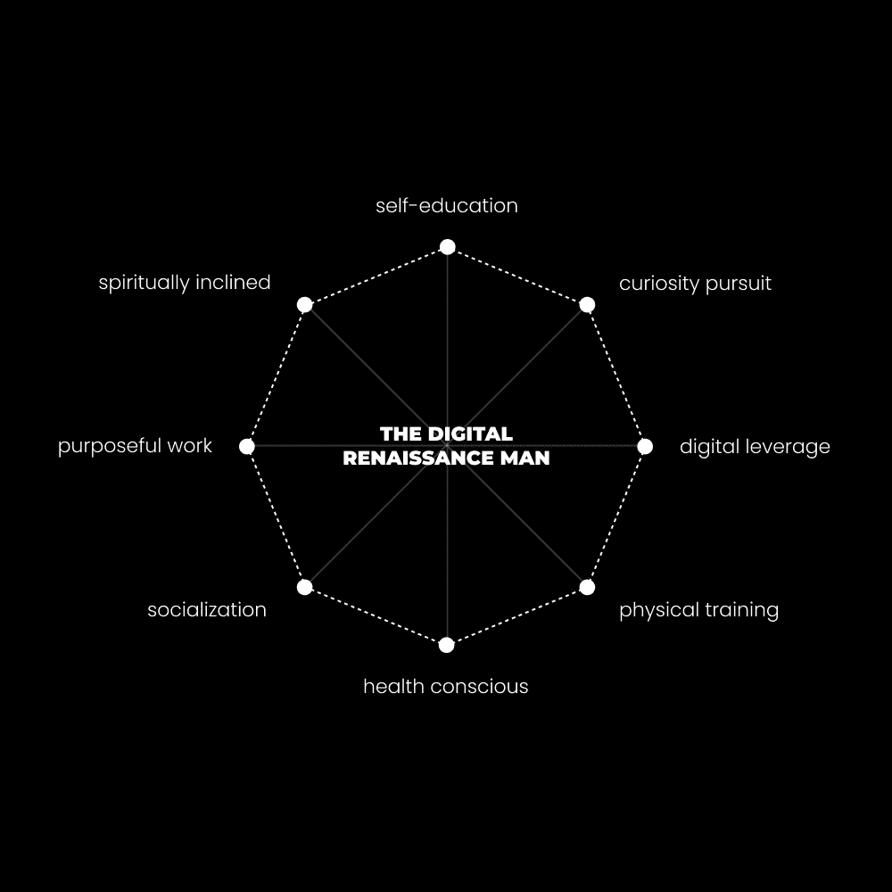

# 中庸生活的解药：成为多维度健美的人 🧩

在本节课中，我们将要学习如何摆脱平庸的生活模式，通过成为一个“多维度健美”的人来最大化生活的各个领域。我们将探讨为何传统的专业化路径会限制我们的潜力，并介绍一种融合好奇心、持续学习和主动建造的新生活方式。

---

我总是有动力去“最大化”生活的每一个领域。
我把生活看作是一款电子游戏。
我的思维、身体、精神和财务状况，共同构成了我获取经验值的能力。
我的目标是成为一个多维度健美的人。
这种想法可能源于我很早就开始质疑那条默认的人生道路。
我注意到许多人看起来并不快乐，他们超重且痛苦。
我还观察到，人们常常因为选择了一条特定的人生道路而限制了自己的机会。
跟随大多数人的做法是没有意义的，因为这只会创造出一个大多数人都拥有的、并不美好的人生。

## 中庸生活的解药：2：默认道路的问题 🚧

上一节我们介绍了追求多维发展的动机，本节中我们来看看阻碍我们的核心问题：生活中那条默认的道路。

这条默认道路的问题在于**专业化、分割化和细分市场**。
我们被训练去关注一个个孤立的点，而不是连接这些点的线条。
在学校，我们学习生物学、化学、数学、文学等独立课程。这些课程之间缺乏联系，缺乏整体性、创造力和能产生卓越成果的实践性。
离开学校后，我们进一步将自己的思想局限在自认为想成为的某种人身上。
作为青少年，我们被期望在尚未真正开始生活之前，就从无限可能中选择一条道路。我们怎么可能确切知道自己想要什么？将余生专注于一件事，这听起来更像是痛苦的配方。
这种做法剥夺了我们的好奇心和创造力。
其结果是一个战士缺乏智慧、而知识分子缺乏勇气的世界。
一位“哲学家”可能会忽视生活的实际方面，因为他们是知识分子。但哲学的核心问题是“一个人应该如何过上好生活？”如果一个哲学家不能创办企业、无法平复内心或成为社交达人，那么他的哲学就毫无意义。
科学家可能会把青蛙扔进搅拌机来研究其各个部分。他们或许能有所发现，但如果他们从整体上研究青蛙，收获可能会少得多。
与其只盯着青蛙的各个部分，不如研究它的环境、交配模式、决策和饮食，同时不忽略任何一个方面。
这种分割式学习的效应，破坏了我们个人的潜力。

## 中庸生活的解药：3：现代文艺复兴人 🎨

我们讨论了默认路径的局限性，现在，让我们看看一种更理想的模型：现代文艺复兴人。

出生时，我们就被指定了一种生活方式。
去上学，找份工作，找个伴侣，尽力挤出时间做些让生活美好的事，65岁退休，从此不再工作——尽管工作本是生活中不可或缺的一部分，我们本应将注意力投入自己认为有趣的事情上。
在学校，我们被告知要选择一个专业。
在商业中，我们被告知要选择一个细分市场。
因此，我们忽视了其他研究领域，我们的成果也因此受到影响。
创造力是通往财富、精神满足和财务自由的途径，而创造力需要高度专注于解决特定问题的深刻理解。
我们正处在第二个黄金时代的中心。
互联网上的信息如此之多，以至于令人不知所措。你不可能学会所有东西，但你可以学会很多。
人们仍然生活在必须非常擅长“一件事”的范式里，因为在过去，这是环境对成功的要求。
如今，成功是为**价值创造者**保留的。他们是专业通才，是新文艺复兴人，是数字文艺复兴人。这样的人可以研究多样化的兴趣，从中创造价值，并维持一种愉快的生活方式。
我们生活在有趣的时代。
信息量巨大，但对于没有目标或学习意图的人来说，这只会让人感到压抑。
创作者经济已经兴起，课程开始将信息浓缩成可操作的商业模式和人生建议。
内容、课程和书籍是现代世界的心理压缩包。
现在，获得一份可替代的收入不再需要4-12年、4万美元和一张文凭。
但这意味着个人需要承担起责任。
没有人在那里牵着你的手。
以下是实现转变需要做的事情：

以下是实现多维发展的三个核心行动指南：

**1) 我什么都不是**
成为没有标签的人。
成为一切。
成为一名设计师、作家、营销人员、社交达人、跑步者、健身者、哲学家、科学家、心理学家和通才，懂得如何维持自己强烈的好奇心。
固守于一种技能、意识形态或身份，会限制你在各种情况下的潜力。
宇宙是一个变形者。它处于不断的流动中。海洋蒸发，在云中凝结，雨滴汇成水坑，水最终总会找到归途。
没有什么是永恒的。
你的细胞与几年前已完全不同。你的兴趣可以改变。你的思想可以改变。你可以改变。
去成为宇宙。

**2) 好奇心指南针**
当我还是个孩子的时候，人们会劝阻我“经历某个阶段”。
我有过情绪化阶段、健身房兄弟阶段，甚至狂欢者阶段。所有这些都塑造了我。
尝试没有任何问题。完全迎合他人的一时兴致才是问题所在。
处方、路线图和长期课程并不坏，但它们会限制你的思维，使你只专注于特定结果，并给出达到该目标的特定建议。
这很有用，但不应该被视为一劳永逸的交易。否则，你很容易陷入悲惨的生活。
我在自己和那些我渴望成为的人身上都注意到了一个模式：
他们不会将所学限制在一件事情上。
一切都相互连接。
通过追求你好奇的事物，你不仅会更有学习动力，而且模式识别会增加有益的多巴胺分泌，并巩固高级知识。
“专注于一件事”是很好的建议，但前提是那件事是一个庞大、有内涵、有意义的目标，需要你专注于大量的兴趣、技能和经验才能实现。
我的“闪亮物体综合症”造就了我今天的在线形象。我的品牌、内容和产品都是我技能与兴趣的独特综合。
对某个主题、技能或兴趣保持1-2个月的极度好奇，并将其添加到你的心理工具箱中是明智的。这将随着你的人生经历而增加你对机会的感知能力。
当你过度细分领域（时间过长或范围过窄）时，你就变成了一个缺乏深度和个性的、美化版的搜索引擎。

**3) 投资你的教育**
在生活中，你唯一真正拥有的东西是：你的思想。
其他一切都可以被夺走。
学校系统做对的一件事是提倡持续、每日的教育，以期拥有更好的未来。
但是，学校不重视好奇心，所以大多数人毕业后都讨厌学习。
学习是人类经历的基础。
在你的脑海中刻下这样的观念：你必须每天学习一些东西，任何东西。无论是一小时还是三小时，你的未来都取决于此。
如果你不首先了解它们，你如何能发现新的机会？你如何能对那些对你来说尚不存在的机遇采取行动？
当你停止学习时，你的生活就停止了进步。你停止了成长。心理上的益处和令人愉悦的化学物质停止了流动。生活变得平庸而重复。你变得机械和呆板。
我们已经讨论了很多关于学习的事情，但如果没有建造，学习就没有意义。

## 中庸生活的解药：4：成为一位建造者 🛠️

我们强调了持续学习的重要性，但知识本身并非终点。本节中，我们来看看如何通过“建造”将知识转化为现实。

在我的新书《专注的艺术》中，有一个关于建造者哲学的部分。
我在生活中注意到的一个模式是，我总是会抽出时间来建造一些属于自己的东西。
学校作业、客户工作以及职场中分配给我的项目都是必要的，但它们并没有给我带来想要的满足感。
我的生活本身就是一个由一系列个人和商业项目构建而成的元项目。
项目为你的学习注意力提供了框架。
当你的注意力集中在你所建造的事物上时，你所接触到的所有信息都会通过那个视角进行过滤。
学习的源泉是挑战而非记忆。你必须遇到一个问题，发现那个问题的解决方案，并将其融入你的生活中。
为了确定一个问题，你需要一个目标。
为了解决问题，你需要创造一个解决方案。
为了创造一个解决方案，你需要一个能投入1-6个月注意力的项目。
当我说项目时，我指的是可以衡量和记录的东西。它不一定是实物产品。
这可以简单到拥有一本力量训练日志，记录你的饮食，跟踪体重，并研究健身信息以促进进步。
让我们从这里开始。

以下是启动建造之旅的四个步骤：

**1) 大的理性目标，小的非理性步骤**
大目标比小目标更好，因为它们为你提供了实现目标所需的愿景、动力和长期关注。
我对在一年内建立一个价值百万美元的企业，比对每天发送10条网络信息更感到兴奋。
我对今年夏天在海滩上看起来很健美，比对为一周准备餐食更感到兴奋。
要开始你成为多维度健美的旅程，请为你生活的主要支柱设定一个大目标。
+   **心智** – 你如何处理情绪和压力？你想要和其他人一样拥有平庸的心态吗？
+   **身体** – 你想要看起来和感觉如何？这如何影响你生活的其他方面（比如别人如何看待你，向你提供机会）？
+   **精神** – 你觉得生活缺乏意义、奇迹和满足感吗？你觉得生活是在发生在你身上，还是你在顺应生活？
+   **商业** – 你想赚多少钱？为什么？你希望这笔钱来自一个有目的的尝试，而不是90%的人所做的工作吗？
我强烈建议你花10-20分钟在日记中写下关于这些话题的思考。它们如何影响你的生活？
问题在于人们常常止步于此。
他们只是在精神上自我满足于目标，却从未在实现这些目标上取得任何有意义的进步。

**2) 为生活的每个领域制定一个项目计划**
目标是“什么”，愿景是“为什么”，项目是“如何”。
现在我们有了对大目标的愿景和动力，我们需要获得清晰度。
项目有一个目标，一个过程，以及每天要完成的优先行动。
你每天可以做些什么来推动你的目标？
你需要了解目标的哪些方面，以便做出更好的决策？
你如何记录进度，以保持明天继续的动力？
在你用来写下目标的笔记本中，为每个目标创建一个简单的项目：
+   **里程碑** – 记录具有现实时间表的具体里程碑。
+   **变量** – 列出每个帮助你实现目标的变量（对于健康：营养、训练、睡眠。对于商业：产品、流量生成、内容）。
+   **原则** – 那些能推动进展的优先行动。
+   **技能** – 你将需要获得以实现该目标的技能。
这为改变你的生活带来了更多的清晰度。

**3) 先行动，再学习**
如果你想学得更快，就不要从学习开始。
1.  制定一个项目计划。
2.  开始构建它。
3.  在路上学习。
太多人陷入了教程地狱，堆积了无用的知识，就像大脑迷雾一样。
开始行动，遇到问题，并尝试不同的技术来解决该问题。
当我学习 Photoshop 时，我曾试图在开始之前了解这个软件的一切。
当我真正开始时，我感觉自己一无所知。
我不得不补充一些特定的教程和“跟我一起做”的视频，直到我弄清楚如何创作我想要的东西。
我意识到解决一个问题的方法不止一种。
如果我想移除像树这样复杂的背景，我可以用钢笔工具、颜色通道、色彩范围或快速选择工具来完成。
快速选择是每个人都会做的，但往往导致最差的结果。
当你在研究任何事情时，请记住这一点。
如果任何人都能用容易获取的信息解决问题，那么很可能还有更好的方法，这会让你在竞争中占据优势。
现在，我不想让你觉得除非你有问题，否则你**永远**不应该学习。
完全相反。
我强烈鼓励养成普遍的教育习惯。
每天沉浸在与你的目标相关的信息中10-30分钟。
观看一个你感兴趣的 YouTube 视频。购买一本畅销书。为你的下一次散步安排一个播客（并且开始散步……我保证，如果你不走出家门，你无法坚持这个学习习惯。干扰太多了）。

**4) 通过习惯形成的生活方式设计**
你和你想要成为的人之间的区别，是你生活方式中组成的习惯。
仔细想想。
那些在心理、身体或财务上激励我们的人，他们是某天突然醒来就拥有了最好的头脑、身体和事业吗？
还是他们每天采取的小行动维持了他们的进步，并朝着更好的未来迈进？
大多数人会告诉你停止玩游戏、减少外出和避免分心……我部分同意，但也部分不同意。
我偶尔还是会玩电子游戏。也许每周5小时。
我仍然会和朋友出去，熬夜。也许每月2-5次。
我之所以仍然能超过99%的人，是因为我在早上提前安排了那些能够推动事情进展的任务。
在早上5点到11点之间，我通常会：
+   每周跑步3-4天
+   写作我的通讯和内容1小时（这维持了95%的业务……记住，这是原则）。
+   开发一个新项目，目前是我的书和软件公司
+   每周去健身房6-7天
+   在所有活动之间散步
+   烹饪需要10-15分钟准备的高营养餐食（并且晚餐外出就餐相当多——我每天大约摄入4500卡路里）
我知道不是每个人都能这样做，因为时间限制，但我过去也不能。
当你从努力中获得成果时，你在所做的事情上会变得更加高效。时间会释放出来（因为这应该是你设定的几乎每个目标的子目标……这是一种衡量进步的绝佳方式）。
当你不确定时：
提前一个小时起床可以解锁无干扰的时间，这将解决你大部分的问题。

---

本节课中我们一起学习了如何通过成为“多维度健美”的人来治愈平庸的生活。我们剖析了过度专业化的问题，介绍了现代文艺复兴人的模型，并深入探讨了通过好奇心驱动学习、设定宏大目标、制定具体项目计划以及“先行动后学习”等策略来主动建造自己的人生。关键在于打破标签、以项目为导向整合多元技能，并通过精心设计的日常习惯将愿景转化为现实。记住，你唯一真正拥有的是你的思想，投资于它，并用它来建造属于你的、不设限的生活。

对于多维度的健身爱好者，
– 丹·科