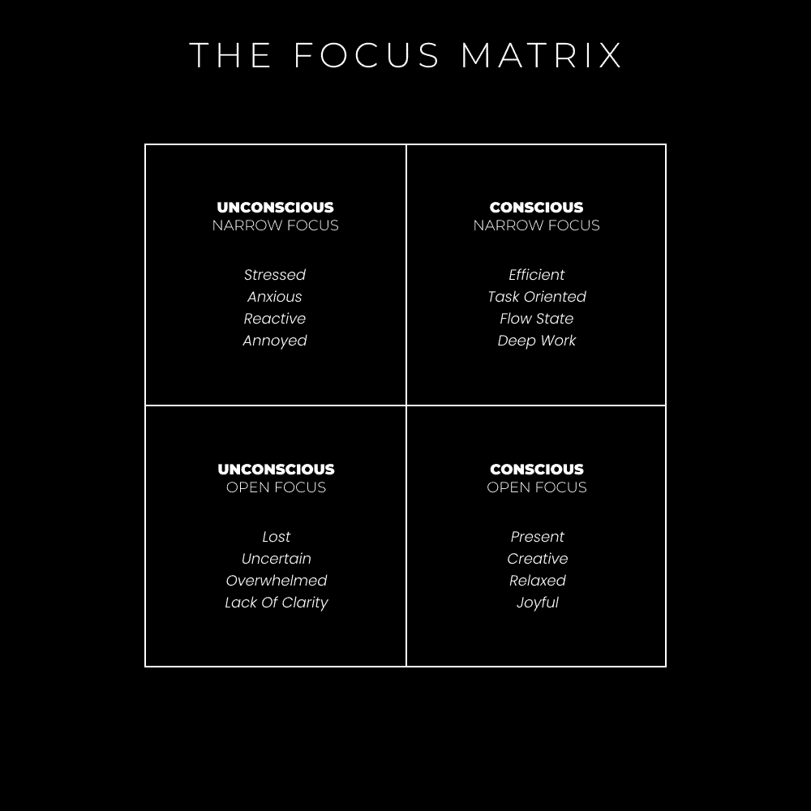

# 生活是一场电子游戏：理解游戏框架

在本节课中，我们将学习如何将生活视为一场电子游戏。这个比喻可以帮助我们更好地设定目标、管理注意力，并享受成长的过程。我们将从心理学、形而上学、自助和商业等多个角度来探讨这个主题。

## 概述

生活可以被看作一场结构化的游戏。我们的生活质量取决于我们处理信息的能力。当我们学会在已知与未知之间找到平衡，并持续提升自己的技能与意识时，我们就能更流畅地“玩游戏”，并朝着理想的目标前进。

---

## 心理学：电子游戏如何让你沉迷于进步

上一节我们介绍了生活作为游戏的基本框架。本节中，我们来看看心理学如何解释我们对进步的沉迷。

“心流”是一种最佳的内在体验状态，此时意识井然有序。当我们将心理能量（即注意力）投入到现实目标，并且技能与行动机会相匹配时，就会产生心流。追求目标能带来意识的秩序，因为它要求我们全神贯注于手头的任务，暂时忘却其他一切。

### 心理熵

有序的意识创造了心流状态的层级。当我们分心于干扰时，就增加了陷入混乱的机会，即“心理熵”。心理熵指的是心灵倾向于陷入无序的意识状态。

例如，一个关于鸡蛋致癌的负面想法，可能会引发一连串关于健康、饮食和人生潜能的担忧，让思绪变得混乱。我们可以通过放大视角、重新将注意力聚焦于能带来成长的方向，来逆转这种熵增。

### 视频游戏中的秩序意识

通过分析电子游戏如何建立秩序意识，我们可以学到实用的课程，以增强学习、技能获取和自信心。

以下是开始玩一款新游戏时的典型步骤：

1.  你最初并不知道该做什么。
2.  你通过教程循序渐进地学习，避免一次性接触过多信息。
3.  你在第一关反复练习，直到这一关变得无聊。
4.  你逐渐接触到更多需要实践的技能、特质和能力。
5.  你逐步增加挑战的难度，直到你决定停止游戏。

要在意识中保持秩序，就必须实现技能与挑战的匹配。

**公式：心流状态 ≈ 技能 ≈ 挑战**

如果挑战远超你的技能，你会感到焦虑。如果挑战远低于你的技能，你会感到无聊。

### 自我意识作为指南针

平衡技能与挑战是一项你必须练习的“元游戏”。当你感到无聊时，大脑会开始走神。此时，你需要将注意力重新聚焦于为当前情境增加挑战。即使面对重复性任务，你也可以通过创造更具挑战性的“小游戏”来增加趣味性。

当你感到焦虑时，大脑容易陷入自我怀疑的负面循环。这时，你需要暂停，放大视角，并重新聚焦。这需要有意识的练习才能形成习惯。

---

## 形而上学：我们生活在一个基于生存的模拟中

上一节我们从心理学角度探讨了游戏机制。现在，让我们从更宏观的形而上学视角，看看我们可能身处一个怎样的“游戏”中。

认知心理学家唐纳德·霍夫曼提出，人类的感知是一个“用户界面”，它隐藏了现实的真实本质，以便我们能够生存。自然选择并不青睐那些能看清现实本来面目的生物。

### 时空作为压缩算法

霍夫曼认为，空间和时间是一种可视化工具，是我们用户界面的“操作系统”。主观现实就像一个屏幕，帮助我们只看到生存所需的信息。每个“物质”对象就像屏幕上的一个图标，我们应该“认真对待，但不要按字面意思理解”。

我们在屏幕上点击并执行特定任务，会产生预期的结果。这些结果就像是游戏中的“适应度回报”或分数。通过试错，我们学习如何获胜和进化。

### 移除界面

如果我们移除了这个界面（例如通过致幻剂或深度冥想），可能会“发疯”。因为我们的自我会消解，我们将以完全不同的方式运作，甚至可能无法生存。因此，目前明智的做法是扎根于现实，同时从更高的视角出发行动。

### 心灵作为容器

人类的大脑可以被视为一个容器，现实通过它流淌。想象它就像一个投影仪：发出的光线是意识，胶片就是心灵。光线穿过胶片，投射出我们所经历的各种体验，从而框定了我们的感知。

---

## 自助：如何重塑自我（你的角色）

理解了游戏的心理学和形而上学基础后，本节我们将学习如何主动重塑自己，即你在游戏中的“角色”。

生活是一场游戏。你的任务是积累财富、获取技能、获得经验、解锁新关卡，最终达到拥有足够资源去实现任何目标的境界。

电子游戏与现实生活的区别在于风险是虚拟的还是真实的。但两者的相似之处在于都需要学习、实践，并享受进步带来的多巴胺奖励。

### 提高自我复杂性

要提高你的意识，你必须提升你的思维水平。这需要你识别问题、接受挑战、掌握技能、获取知识，从而超越旧有的身份。随着思维层次的提升，你的身份也必须改变。你在心中将知识、技能、信念和经验排序为“自我”，这决定了你能接触到怎样的机遇。

### 创建你玩的游戏

如果游戏包含一个预期结果（获胜）、一条达到结果的路径（进步）以及需要采取的习惯性行动（优先事项），那么我们就能从任何生活情境中创造游戏。

这个**目的、过程和优先级**的通用原则，是人类行为的底层框架。没有目标，就没有愿景；没有路径，就没有方向；没有任务，就没有专注。

要创造一个游戏，你需要一个框定注意力的目标层次结构。例如：

*   一个10年目标（树立愿景）
*   年度目标
*   月度目标
*   周度目标

这些目标应松散地保存在脑海中，作为指引而非束缚。然后，将你的教育和日常行动与之对齐。你所取得的进步会带来有意义的多巴胺分泌，感觉非常棒。

### 所有变化都是行为变化

要改变生活，你必须改变行为。要改变行为（朝正确方向），你需要一个计划。要坚持计划，你需要一个系统。系统就是有组织的行为改变。要创建系统，你必须朝着目标前进，拥抱试错的本质，强化成功经验，并坚持到“成功”成为你生活各领域的默认状态。

---

## 商业：新的数字社会

最后，让我们看看这个“游戏”比喻如何应用于现代商业和创作者经济。

世界正因技术进步而从企业主导转向个人赋权。在数字文艺复兴中，我们可以学习任何事物，从事任何工作，成为任何人。互联网扩展了存在的“内心空间”，创造了一个充满无限潜力的领域。

### 品牌——你是最有利可图的细分市场

你的品牌就是你的在线化身。强大的品牌拥有愿景——一个大胆的、非理性的目标，它像引力一样吸引着追随者。你的品牌是你正在成为的最高版本，它指引你通过一个能为他人带来巨大价值的实体来对齐行动。

### 内容——完成任务学到的教训

你的内容是你追求挑战性目标过程中获得的想法、观点、教训和建议。写作（或内容创作）能带来自我意识、自我理解以及组织思想（即秩序意识）的能力。最好的内容来自能量转移，分享那些真正让你兴奋和共鸣的想法，不要自我过滤。

### 产品——行为改变系统

最好的产品能激发积极的行为改变。从你在旅程中获得的知识和技能中，创造出你真正需要或能从中受益的产品或服务。当你解决了自己的问题并出售解决方案时，你就在做出积极的改变。

### 营销——培养内在哲学

研究营销和销售是明智的，它们关乎价值交换的心理学和形而上学。投资于这方面的教育，注意其中的模式与原则。你追求目标背后的“原因”或“为什么”，正是你如何将产品推广给他人的核心。“为什么”能激发情感共鸣。

---

## 总结

本节课中，我们一起学习了将生活视为一场电子游戏的多元视角。

我们从心理学理解了“心流”与“心理熵”，学会了通过匹配技能与挑战来获得最佳体验。我们从形而上学探讨了现实可能是一个基于生存的“模拟”，提醒我们以更超然的视角参与。在自助部分，我们掌握了通过设定目标层次和改变行为来主动重塑“角色”的方法。最后，在商业部分，我们看到了如何在创作者经济中，将个人品牌、内容、产品和营销整合起来，玩好这场“数字游戏”。

记住，生活是一场游戏。你的任务是理解规则，提升技能，享受过程，并朝着自己设计的胜利不断前进。