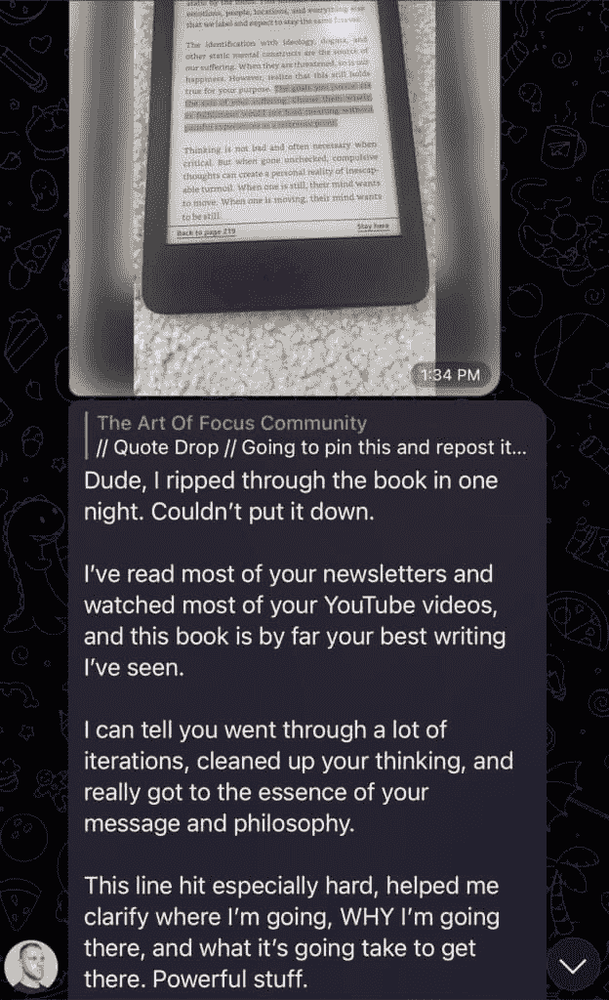
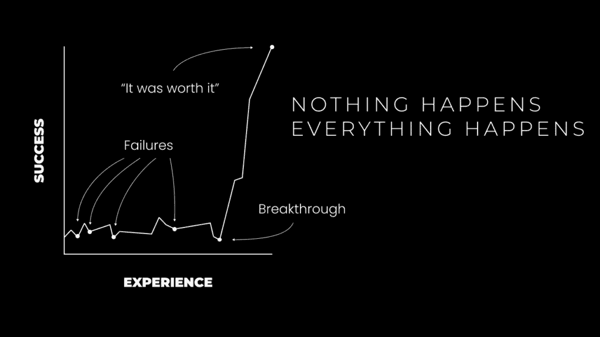

# 个人成长与数字创业：我的故事：丹·科伊未述说的真相

在本节课中，我们将跟随丹·科伊的个人历程，了解他如何从一个对传统生活路径充满质疑的年轻人，通过不断的试错、学习和自我进化，最终建立起成功的数字业务和个人品牌。我们将重点剖析他尝试过的各种商业模式、积累的关键技能，以及最终实现指数级增长的转折点。

## 概述：对“默认”生活方式的警觉

我从小就对周围的环境保持警觉。我意识到一定存在更好的生活方式。我看到的每个角落似乎都充满了不快乐的人，他们对职业、老板、家庭乃至自我都感到不满。这或许是我所处的环境使然，也可能是我内心的倾向，但某种力量驱使我像躲避瘟疫一样，想要避开这种“默认”的生活方式。

我明白，抱怨手中的牌无法改变未来。将命运掌握在自己手中是唯一的选择。因此，我将个人责任、自我教育和追求自主权，确立为我二十岁前人生的核心信条。

如果每个人都遵循“看新闻、上大学、找工作、65岁退休”的教导，难道不会导致千篇一律的结果吗？这难道不是全球普遍不快乐的根源吗？对我而言，只有一个选择：**做与所有人相反的事**。

当人们盯着电视时，我沉浸在那些真正做出成绩的创作者的内容中。当人们下班后瘫在沙发上时，我放学后直奔健身房。当人们用有毒的主流新闻填充大脑时，我在阅读关于灵性和实现全部潜能的书籍。

---

## 我的存在的祸害：传统的职业道路 🏫

上一节我们提到了对传统路径的质疑，本节中我们来看看这种质疑如何在我大学生活初期具体化。

我对上大学感到兴奋，认为这是一个尝试新事物、结识新人的机会，但最终，它意味着：*推迟建立可持续收入来源的时间*。从踏入亚利桑那州立大学校园的那一刻起，我就知道倒计时开始了。这是一场生存游戏。我必须学会在没有正式工作的情况下赚钱所需的技能，否则终将与他人无异。

我决心尝试不同的商业模式。大一那年，我和朋友一起创办了一个健身YouTube频道。我们制作健身视频、教育内容和食物挑战。几个月后，我们决定放弃。那一年，我主要忙于聚会、打游戏，并通过学习平面设计、市场营销等课程探索自己的兴趣。

大约在那时，我经历了一个重大转折点：我和朋友因在宿舍外吸食大麻被捕。我不得不面对警察、留下指纹并接受审讯。暑假回家后，我收到法院来信，给了我两个选择：出庭辩护可能成为罪犯，或支付高昂费用参加一个为期数月的尿检项目。我感到恐惧，将信藏起来独自承受情绪压力。

正是这时，我购买了埃克哈特·托利的《当下的力量》这本书。我如饥似渴地阅读，希望缓解痛苦——它确实做到了。在那个时刻，我真正放下了执念，无论发生什么，我都接受。我重拾了开辟自己道路的动力，开始制作新的YouTube视频（类似当时的Elliot Hulse风格），并继续学习灵性知识。然而，就像之前的尝试一样，这次也未能成功。

---

## 失败，失败，再失败 🔄

上一节我们看到了早期尝试的受挫，本节中我们将回顾大学期间一系列更具体的商业尝试及其教训。

大二时，我开始学习摄影。我疯狂观看教学视频，用暑假打工的钱买了相机，拍摄各种主题。但我发现自己真正热爱的是后期编辑。这让我一头扎进学习Photoshop的“兔子洞”。大三时，我决定在Instagram上发布我的超现实合成作品。

我常常花费6-8小时专注于实现脑海中的图像。以下是一些成果示例：

   

这些作品大多是库存图片的混合，有些包含我自己的摄影。我从未打算以此赚钱，但最终在Instagram上获得了约2500名粉丝。几个月后，我对数字艺术感到厌倦，但这个过程教会了我平面设计、视觉叙事，并让我看到了通过优质内容在社交媒体上成长的可能性。

那一年，我还尝试了更多商业模式。以下是主要的几次尝试：

**1. Facebook广告代理**
我购买了一门课程，学习如何获取客户、创建Facebook广告以及为本地企业服务。在发送了约50封冷邮件并进行了2-3次销售通话后，因未能获得客户而放弃。回顾过去，这次经历让我了解了销售漏斗和直接响应营销，这是任何业务成功的关键。我只是缺乏耐心。

**2. 派对服装代发货商店**
我深入研究了EDM和音乐节场景，创建了一个销售时尚简约服装的Shopify商店。利用之前的Facebook广告知识，我花费了约100美元广告费，最终只卖出了一件亮片内衣。虽然赚到第一个在线美元的感觉很棒，但看到客户要等待30天从中国发货的产品时，我感到很糟糕。

**3. 自由网页设计**
大三时，我参加了一门网页开发入门课程，并爱上了编程。我逃课学习Udemy课程，在一个月内学完了整个大学课程的内容。这让我意识到自我教育习惯对于想掌控自己生活的人的绝对必要性。深度工作和深入研究必须成为*日常*。我尝试自由职业，联系朋友和家人，建立了一些作品集网站，并接到了几个低价客户（总计约500美元）。

那时我已是大四，时间所剩无几。我必须让某件事成功，否则将面临“找一份正经工作”的命运。

**4. 两个电子商务品牌**
我决定整合品牌、网站开发、平面设计和广告技能，创建一个真正的品牌。我注意到开发者需要长时间盯着屏幕，而蓝光眼镜正成为趋势。我向父亲借了几千美元，寻找产品、下单、等待、拍摄产品照片并开始投放广告和联系网红推广。

以下是一张广告图片：

（图中的刺猬叫Momo，后来生病去世了）。眼镜产品不错，但我只是在广告上浪费钱。一次网红推广后，我在评论中被嘲笑为“小丑”，这打击了我，我再次放弃。

这导致了我人生的另一个低谷，类似于被捕之后。我浪费了父亲的钱，刷爆了第一张信用卡，感到希望渺茫。似乎唯一合理的选择是接受命运，利用编程技能去找工作。我很快找到了一份网页设计工作。这份轻松的工作让我了解了运营网页设计公司所需的一切。我用空闲时间尝试获取客户，并取得了一些成功。

有了收入后，我决定尝试另一个电子商务品牌：简约钱包。我甚至投资拍摄了专业的产品图片：
 

再次，没有销售，浪费了钱，也厌倦了这一切。此时，我决定全力投入自由职业。在此期间，我还尝试过SEO公司、内容营销公司，并试图为我所能接触到的一切寻找客户，主要是网页设计。

到目前为止，我开发的所有技能都在为我铺路，尽管尚未看到巨大成功。

---

## 没有发生什么，然后一切就发生了 🚀

上一节我们经历了一系列失败，本节中我们将看到坚持和技能积累如何最终迎来转机。

尽管有一份收入尚可的工作，我内心的声音仍在尖叫，要求我兑现对自己的承诺。我知道，如果现在不摆脱工作，未来的责任（车贷、家庭等）将成为我的枷锁。我必须立即行动。

我走访本地企业，再次联系人脉，尝试LinkedIn潜在客户开发等方法。通过这个渠道，我每月能获得2-3个客户，收费1500-2500美元。在帮助这些服务型企业时，我学习了电子邮件营销和文案写作。我还意识到，我工作的公司之所以盈利，是因为拥有营销、销售和运营部门，而网页设计师只是其中一环。

我调整了报价，开始创建简单的服务漏斗：一个着陆页、注册表和电子邮件序列，旨在为承包商、律师等已经获得线索但希望提高转化率的客户预订咨询电话。因为这个报价更具体、效果更可衡量，我将价格提高到2500-5000美元，这比制作完整网站耗时更少，且更容易系统化。

几个月后，我决定辞职。此时，我对自己的能力有了绝对的信心。辞职本身并不像想象中那么兴奋，但为之努力的过程无比充实。

辞职后，我发现了Twitter的力量，开始发布内容，并计划在寻找网页设计/漏斗客户的同时，创建一个面向自由职业者的数字产品。这时，我的目标客户转向了创作者、教练和自由职业者。我了解他们，喜欢与他们合作，并能带来显著成果。

在过去的四年里，我不断构建产品、调整品牌、测试不同产品。指数级增长就此开始。

以下是关键的发展阶段：

**1. 通过自由职业达到六位数收入**
大约4年前，我首次通过自己的努力实现了六位数的年收入。从大一开始算起，这经历了4-5年的试错。但期间我并不总是全力以赴。进步就像有氧运动的效果，不坚持就会迅速消失。你必须日复一日，终身学习。

**2. 创建自由职业课程并扩大受众**
我的座右铭是：“解决你自己的问题并出售解决方案”。此时我已拥有丰富的自由职业知识，创建相关产品顺理成章。当时我只有约500名Twitter粉丝。通过善于网络互动，我的内容被拥有大量粉丝的开发者和自我提升类账号分享，我每月通过课程额外赚取3000美元。

**3. 创建第二个数字产品：网站建设教学**
我的第二个座右铭是：“创造你自己的客户”。我需要在现有产品与通过谈论心态、灵性吸引的初学者之间搭建桥梁。因此，我创建了一个产品，教授他们一项可用于自由职业的技能：如何创建网站。

**4. 达到1万Twitter粉丝并创建社交媒体产品**
在社交媒体上取得成果后，我创建了一个针对初学者的社交媒体产品。这是整体拼图的逻辑延伸：通过建立受众来开展自由职业，避免冷邮件和手动推广的痛苦。最终，我将这些产品打包成一个名为“Modern Money”的产品。

**5. 推出实体计划本**
 
我喜欢在写作中探讨生产力，并且一直想创造实体产品。我利用之前电子商务失败的经验，寻找并销售实体计划本。它销量不错，但我讨厌从家里发货的繁琐。于是，我将其转化为数字版本并免费提供。

**6. 数字产品销售额在一年多后达到六位数**
通过多次产品发布和市场测试，我能够快速加倍投入有效的策略。我的三个数字产品在一年多后创造了10万美元的收入。

**7. 将自由职业服务转向营销咨询**
此时，我对网页设计和漏斗有些厌倦。许多创作者和教练更希望获得咨询指导，而非外包服务。因此，我创建了一个咨询服务项目，教授营销、销售、文案、提案制作以及我的简单服务漏斗来获取客户。这为我节省了大量时间。

**8. 创建 Modern Mastery HQ**
Modern Mastery 是我人生工作的一个新里程碑。我花费两年时间，将我学到的一切知识整合进去，并包含了所有旧产品。这让我明白，发展基于订阅的社区是一个漫长而缓慢的过程。

**9. 实现单月收入5万美元**
通过 Modern Mastery 会员费和市场营销咨询（约5个客户，每人8000美元），我实现了单月收入5万美元。

**10. 创建 Digital Economics 和 2 Hour Writer，为愿景奠基**
我将所有所学构建成 Digital Economics 大师班。然后，从中分离出 2 Hour Writer 作为低价前端产品，构建价值阶梯。我之前构建的一切都“允许”我当前产品的形成。意思是，你无法凭空创造出完美的产品，它需要基于当前水平的进化。

**11. 2022年通过每天写作2小时赚取80万美元**
到2022年底，我的品牌在所有平台上开始指数级增长。一切开始协同。我的产品质量通过进化自然提升。读者群快速增长，收入也随之增长。幸好我已没有客户工作，才能充分利用这股流量。经验是：如果你有畅销产品，就将大部分精力集中在受众建设和流量利用上。

**12. 一年赚取330万美元**
一旦我意识到只需要一个不断增长的读者群和一个能帮助他人的产品（从而促进销售、带来价值并通过口碑传播），我就知道了我的杠杆所在。我坚持每天早上写作2小时。当方法正确时，这会带来新产品、读者增长和业务维护。通过保持一致性并确保读者群增长，指数级增长随之而来，收入也同步增长。

**13. 将每一分利润投资于新公司 Kortex**
Kortex 是我的新事业。其核心是一款为作家、营销人员和创意人士设计的革命性软件，它结合了笔记应用和写作工具，旨在确保你的写作独特、有影响力、有说服力。长远来看，它还将取代许多创作者的通讯软件、个人网站和内容调度工具。

此外，我们还构建了一个教育框架。所有 Kortex 订阅者都可以访问一个策略库。这里也是唯一可以聘请我（以及我的合作伙伴）进行咨询、团体头脑风暴或代笔服务的地方。

---

## 我所有教诲的总体教训：身份的进化 🌱

上一节我们回顾了成功的路径，本节我们来总结贯穿始终的核心原则：进化。

进化需要斗争、压力、冲突和挑战。反之亦然。

*   当恒星爆炸，其原子核填充银河，允许其他形式生长。
*   当国家间发生战争，技术进步可能超越失去的生命。
*   当你感到迷失，你正接近一个人生章节的结尾。你要么找到目标，要么被情感风暴吞噬。

你不能让自己自满。总有一座山要攀登，一个项目要建设，一个产品要推出，一篇文章要发表。

当你通过解决问题来追求和克服挑战时，你会获得所需的技能和心态。当你追求并实现目标时，你的“自我复杂性”会增加。生活变得有意义，因为你拥有了察觉普通人无法察觉之事的经验。

如果你不知道该做什么，就开创一项业务。这是个人和集体进化最好的载体之一。

这就是我的故事。

---

## 总结

本节课中，我们一起学习了丹·科伊的个人成长与创业历程。我们从他对传统生活方式的警觉开始，追溯了他大学期间多次失败的商业尝试，看到了他如何通过自我教育在网页设计、营销、文案等领域积累技能。关键转折点在于他将这些技能系统化，从自由职业转向产品化和咨询，并通过在社交媒体上持续输出高质量内容构建受众。最终，他通过创建数字产品、利用杠杆效应和保持每日深度工作的习惯，实现了业务的指数级增长。贯穿始终的核心教训是：**进化源于持续应对挑战，而创业是驱动个人进化的强大载体**。