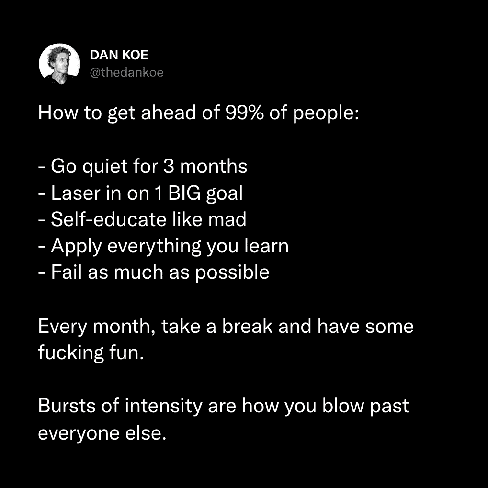
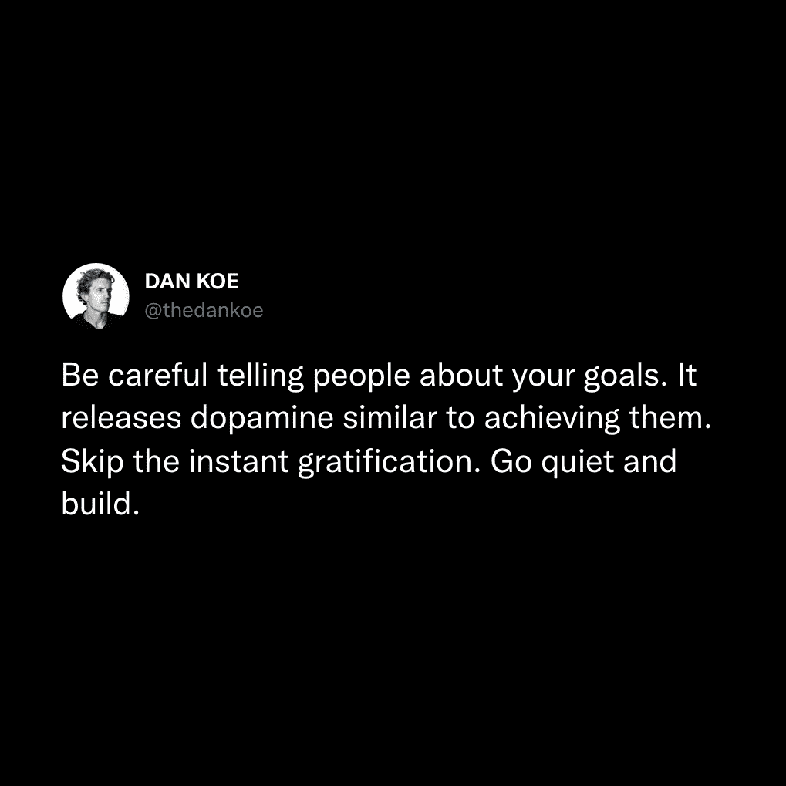
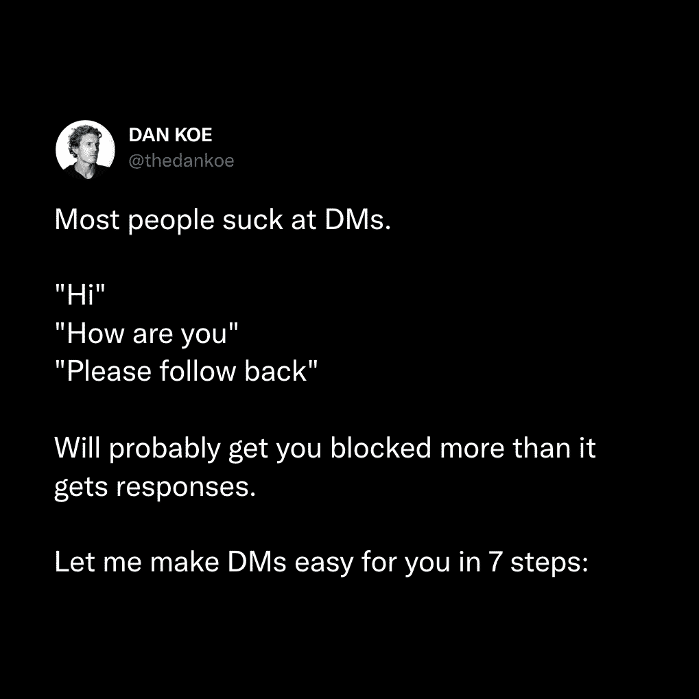

# 说服性沟通：21 世纪的核心技能 🧠

在本节课中，我们将要学习一项被誉为21世纪最关键的技能——**说服性沟通**。这项技能不仅能帮助你在社交媒体上获得增长，还能让你的写作被更多人分享。我们将深入探讨其核心原则，并提供实用的守则和结构，帮助你掌握吸引并保持他人注意力的艺术。

---

## 核心原则：情感驱动行动

上一节我们介绍了课程主题，本节中我们来看看其背后的核心逻辑。

**人们不会记住你说的话，他们会记住你让他们感觉如何。**

这个观点值得重复强调：*人类是情感生物，而非逻辑生物*。绝大多数人尚未能完全摆脱或控制自我情绪反应。因此，吸引和保持注意力的基础在于触动读者的情感。

*   挑逗读者的自我。
*   让他们感到“好”等于让他们感到“愉快”。
*   让他们感到“不好”等于让他们感到“糟糕”。

如果你能引导人们经历一场包含爱、恨、兴奋、欺骗、平静等情感，并最终以对其生活有益为结局的旅程，那么你就掌握了内容创作的艺术。生活本质上是故事，而人类通过故事来理解世界。你的任务就是利用文字的力量，让人们*感受到*特定的情绪。

---

## 丹的 10 条吸引注意力守则 🎯

在浏览内容时，尝试留意以下策略的使用。观察自己何时被吸引，并思考“为什么”，这是在脑海中巩固这些信息的最佳方式。

以下是十种最可复制且实用的方法：

### 1) 具体数字
在标题或开头使用数字能有效让人驻足。形式包括：
*   **统计数据** — 例如：“地球上共有 70 亿人口”。
*   **金额** — 例如：“苹果新的 1175 美元 iPhone 有这个新功能”。
*   **指标** — 例如：“我发送了 322 封冷邮件”。
*   **列表** — 例如：“7 个正在阻碍你的坏习惯……”。

数字越具体，吸引力越强。

### 2) 模式中断
模式中断是指打破人们习以为常的浏览模式的内容。例如，在充满短评的平台中，一条格式精美的列表式推文就能让人停止滚动。

### 3) 消极偏差
人类大脑天生更关注和记忆负面信息。这并不意味着内容要一直消极，而是可以**用负面的形式表达积极的观点**。例如，将“你将取得伟大的成就”改为“你将永远不会再次触底”，后者通常更有效。

### 4) 群体指出
明确指出你正在与之对话的具体群体。例如：
*   “如果你 20 多岁……”
*   “呼吁所有创作者、教练和自由职业者！”
*   “父亲是人类的一份礼物……”

即使读者不属于该群体，这也能帮助他们“选择一方”并与内容产生共鸣。

### 5) 问题指出
描述人们正在经历的普遍不适或问题。准确描述痛点能让人产生共鸣，从而吸引注意力。例如，简单指出“感觉糟糕”就是一种有效的痛点描述。

### 6) 潜在的好处
与指出问题相反，直接阐明内容能带来的好处。思考内容背后的“为什么”，即它能为读者解决什么痛苦或带来什么收益。

### 7) 社会证据
展示你的成果或资历，能暗示信息差距，建立权威感。当这种展示并非单纯“炫耀”，而是用于说明观点时，效果最佳。例如，用你的成就来佐证你提出的建议。

### 8) 自信与信念
**这是最重要的一点。** 仅凭自信就能创作出极具影响力的内容。对你的信念保持坚定，并用清晰可信的论据支持它。人们渴望被自信地告知该做什么。提升自信表达的方法包括：
*   消除暗示不确定性的词语（如“可能”、“也许”）。
*   尽可能使用绝对化的陈述。
*   适当夸大观点以增加能量。

例如，将“如果有些人发展了他们的技能集，那可能很明智”改为“地球上每个人发展他们的技能集是至关重要的”。

### 9) 主动语态
使用主动语态能让叙述更直接、有力，也显得更自信。避免使用被动语态，因为它通常较平淡且可能过早揭示关键信息。练习编辑你的文字，将被动语态转为主动语态。

### 10) 警告与忠告
分享你在达成某个目标过程中遇到的障碍或需要注意的事项。提供基于自身经验的警告，能建立信任并提供价值。例如，针对一个流行话题提出与众不同的警告，可以引发讨论和深度互动。

---

## 如何保持注意力？ 📖

上一节我们学习了如何吸引初始注意力，本节中我们来看看如何将这种注意力保持下去。

一旦引发了好奇心，大脑就会想要了解完整的故事。保持注意力的关键在于**编织一个引人入胜的叙事**，并注重内容的结构与视角。

以下是两个关键方面：

### 1) 内容结构
适应现代阅读习惯，优化内容结构以提高可读性：
*   **使用列表**：用数字、项目符号等分解内容，列表本身就能构成一个微型故事。
*   **善用换行**：用换行符强调重点句子，让行文有呼吸感，但不要滥用。
*   **开头精炼**：用简短有力的句子开头，抓住注意力后再展开。
*   **拆分长句**：使用括号、破折号等工具拆分过长的句子，增加节奏变化。

### 2) 新颖的视角
为常见想法带来新的清晰度或细微差别，能刺激大脑产生多巴胺。避免只从同类平台获取信息，以免观点同质化。获取新颖视角的途径包括：
*   **广泛消费**：阅读书籍、收听播客、阅读长文，获取深度信息。
*   **创造联系**：将不同领域的知识或隐喻应用到你的主题中。
*   **分享经历**：融入个人故事和独特经历来阐释观点。

---

## 如何创造深度参与感？ 💖

记住核心原则：***人们不会记住你说了什么，他们会记住你让他们感觉如何。***

你的角色是传递改变生命信息的使者。通过内容创造以下感觉，可以建立深度参与：

**1) 教育带来的清晰感。**
传授新知识或提供对生活某方面的清晰认知，能带来愉悦感。通过新颖的视角、隐喻和故事来实现这一点。

**2) 灵感带来的赋能感。**
灵感不同于动力。它帮助人们自己“连接点”，获得做出改变所需的清晰度。当人们觉得自己想出了答案时，会将这种积极的感受归功于你。

**3) 娱乐带来的愉悦感。**
在内容中加入幽默、趣闻或有趣的观点，就像电影中的笑料或精彩场面一样，能直接带来快乐。

**总结来说，你的内容应致力于达成教育、启发灵感或提供娱乐这三个主要目标之一或全部。**

---

## 总结 📝

本节课中我们一起学习了**说服性沟通**这项核心技能。我们从“情感驱动行动”这一根本原则出发，详细探讨了吸引注意力的十条实用守则，包括使用具体数字、模式中断、展现自信等。接着，我们学习了如何通过优化结构和提供新颖视角来保持读者的注意力。最后，我们明确了创造深度参与感的三大目标：提供教育、激发灵感和带来娱乐。

掌握这些原则和技巧，你将能更有效地通过文字影响他人，无论是在社交媒体增长还是深度沟通中，都能发挥巨大作用。