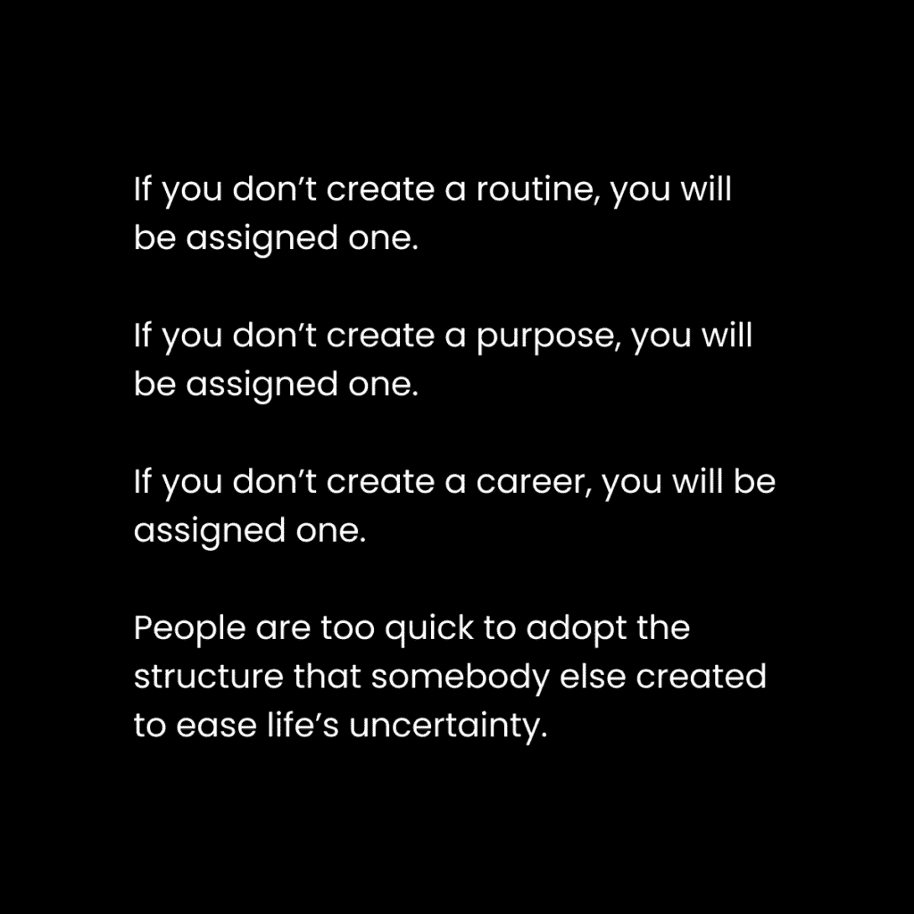
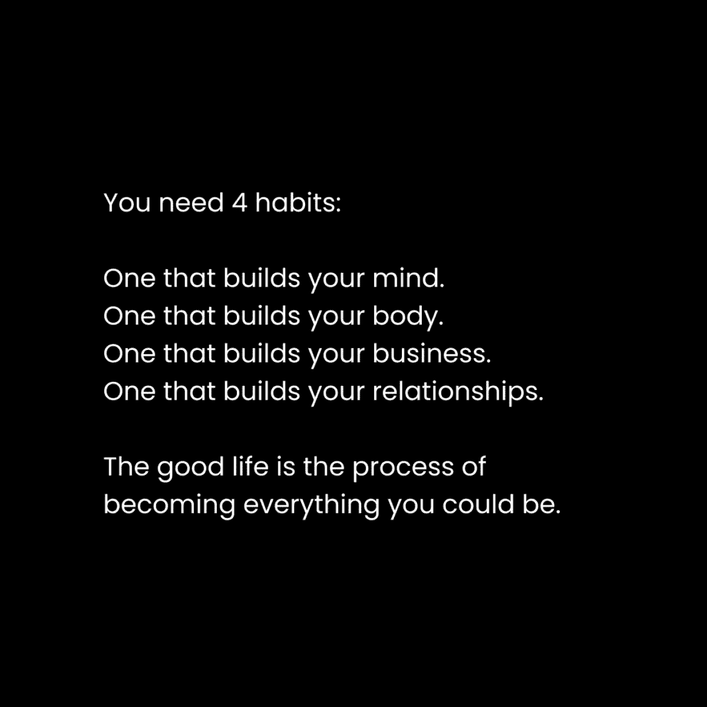

# 改变我生活的日常例行程序：核心概念与四大支柱

在本节课中，我们将学习如何通过建立有意识的日常例行程序来掌控自己的生活，逆转混乱，并朝着自我设定的目标前进。我们将探讨例行程序的重要性、身份改变的原理，以及构建美好生活的四大支柱。

## 为什么你需要一个例行程序？

每个人都遵循着某种例行程序。如果你认为自己没有，那可能是因为你没有意识到社会已经为你分配了一套默认程序。或者，你的“程序”就是毫无规则。

没有规则，就无法进行游戏。没有游戏，就没有胜利。例行程序就是你生活的规则。你实践得越久，就越熟练，甚至可能忘记规则却依然能赢。

现在是时候停止玩社会要求你玩的游戏，开始玩你自己的游戏了。一个强大的例行程序，无论长短，都能在你追求目标时防止你感到不知所措。许多人正朝着别人给予的目标前进，他们是在推进他人的梦想，而非自己的。

如果没有你自己创造的例行程序，你的生活将逐渐滑入混乱的深渊，陷入充满责任、工作、人际关系和你所厌恶的特性的生活。例行程序带来舒适感。大脑渴望秩序，而例行程序让你能够集中注意力，使行动流畅。

## 通过身份改变逆转局部熵

内在体验的最佳状态是意识中有秩序。当心理能量（即注意力）投入到现实目标中，并且技能与行动机会相匹配时，就会发生这种情况。追求目标会带来意识的秩序，因为一个人必须集中注意力在手头的任务上，暂时忘记其他一切。

当你成为一个会采取特定行动的人时，你就不再需要动力或纪律。健身者不需要动力来保持健康饮食，游戏玩家不需要纪律来整天玩游戏，作家不需要动力来整合想法，员工不需要纪律去上班。他们这样做是因为他们的生存（心理层面的）依赖于此。

动物通过遗传密码中的信息生存，人类则通过意识中的信息生存。我们在儿童时期及一生中接触到的信息，编程了我们的思维，使其在特定的系统上运行。系统是达成目标的过程。因此，我们的身份是一张由有意识和无意识目标构成的网，它决定了我们的能力、兴趣和选择。

你每天都在朝着无意识的目标层次行动。这些目标已被训练到无需思考。你醒来、走路、刷牙、穿衣以避免被视为异类。这些都是你为了融入社会并生存而培养的技能。

当我们不清楚如何实现目标时，心智就会变得混乱。我们变得不知所措、焦虑和狭隘。心智陷入混乱，这就是熵。熵是普遍的，不仅物质会衰败，心智的结构或身份这座无形的大厦也会。你通过设定目标、创造实现路径，并专注于能带来结果的优先行动来逆转熵。

优先行动包括日常的自我教育和实践，它们让你接触到塑造身份的信息。你需要一个计划，没有其他方法。因为如果你没有，社会有，而且他们已经为你规划了几十年。如果你不设定自己的目标、不获取应对挑战所需的技能、不开辟自己的道路，你的命运将被社会操控，而你甚至不会意识到。

## 生活的四大支柱（如何逆转熵）

成为“多维度强健”是通往美好生活的途径。生活的所有领域都是相互关联的系统，它们塑造你的身份，并在你的心智中逆转熵。微小的改进是创造有序心智的关键。

通过为你的生活支柱中的每一个方面培养日常习惯，成功变得不可避免。如果你不是每天都在构建你的心智、身体、事业和人际关系，那么你究竟在做什么？有什么比这更重要？或者你现在所做的一切都只是一种干扰？

“享受生活”不等于追求短暂的快乐。人类心理学表明，我们天生有成长、扩展、超越和创造的内在驱动力。乐趣存在于进步之中。“做你想做的事”往往是自我意识在阻止那些可能导致自我提升的想法——而那正是你的本性所渴望的。只有剥去你认为自己想要的东西的表层，你才能真正做你想做的事。

以下是实现行为改变的真正方法：

**1) 将你的未来与整体目标对齐**

目标和问题为你提供了视角的框架。你的视角决定了你将哪些信息视为重要。改变生活的第一步是残酷地意识到那些让你想要改变的问题。坐下来，思考一下：如果你继续采取相同的精神、身体、财务和人际关系行动，最坏的情况会是什么？然后利用这一点作为锚定未来的地方。设定一个宏大、能激发生活各个领域的愿景目标。

**2) 将日常自我教育视为绝对必要**

学校只教你现实的一小部分，它们训练你进入现实的某个片段，却忽视了孕育真正智慧的整体相互关联性。没有自我教育，你将带着同样的狭隘身份和视角度过一生。教育扩展思维，引入新颖视角，是大脑中持续的多巴胺能量来源，并为你提供清晰行动以实现目标的知识。随着时间的推移，教育使你的思维适应新的系统。

**3) 获得实现你目标所需的技能集**

你目前所在之处与你想去之处之间的差距，就是技能。这是一个事实。你没有得到你想要的结果，因为你不是那个能够得到这些结果的人。唯一能够阻止你的就是被分散注意力到偏离轨道的程度。技能是可以训练的。

你需要两样东西：
*   **30-60 分钟的自学习惯** – 阅读，购买课程，收听播客，获取充足的知识，这使你能够采取行动。
*   **30-60 分钟的构建习惯** – 在现实中应用你的知识，并对你所学的进行实验。获取反馈并迭代，直到成功。

学习来自挣扎，而不是记忆。当你在现实世界中构建并遇到障碍时，问题就产生了。随着你重复这个教育和构建的过程，1-5 年内，你会对取得的进步感到震惊。

---

上一节我们探讨了为什么需要例行程序以及实现改变的三大核心方法。接下来，我们将具体看看如何将这些原则应用到一个真实的、改变生活的每日例行程序中。

# 改变我生活的日常例行程序：2：我的具体每日流程

在本节中，我们将详细拆解一个经过实践检验的每日例行程序。请注意，这个程序是我多年实验的结果，旨在服务于我期望的未来。它现在可能对你不可行，但我鼓励你尝试其中的一些片段，并逐步创建适合你自己的版本。

例行程序的每一个方面都应该是故意的。意图等于你正在努力实现的目标。你能为你采取的行动找到的理由或原因越多，执行起来就越容易，对未来的益处也越大。

## 我的每日例行程序分解

**1) 30 分钟的早晨散步。**

每天早上大约 6 点，无论天气如何，我都会外出散步。我会听教育材料，或在手机上规划日程。我的目标是每天走 15-20,000 步，因为走路是那种需要最少努力但能带来最大效果的活动之一。散步可以让我头脑清醒、唤醒身心、远离干扰、充当创造力障碍、保持身材和健康、获得一些阳光，并逆转长时间久坐和面对屏幕蓝光造成的损害。

**2) 90 分钟专注工作。**

我有一份每天早晨执行的重复性高杠杆任务列表。这时我会进行写作（书籍、通讯、内容以及营销材料）。我将所有优先任务集中在这个工作时段，以便在大多数人醒来之前完成它们。这让我能够在一天后续的时间里更灵活地处理事务。

**3) 30 分钟跑步或散步。**

每周三次，我会跑步 30 分钟，以达到每周 150 分钟一般有氧运动（区域 2）的目标。我个人注意到跑步可以提高我的专注力、压力承受力、改善身体成分，并让我在晚上带着“完成了艰难任务”的满足感入睡。在其他日子里，我会散步，听教育材料，并用手机应用收集想法，以便后续转化为创作和产品。

**4) 90 分钟专注工作。**

跑步后，我洗澡、吃早餐，然后开始第二轮专注工作。在这个时段，我进行较少的创造性任务，更多处理行政工作、客户事务以及需要与人沟通的事情。这时，开放的待办事项和干扰开始增多，但还不至于无法通过再次散步来缓解。

**5) 接电话和/或散步。**

这是我日程中的一个新时段。过去我讨厌电话，但现在为了事业成功，我接受了它。大多数日子里，我总工作时长约为 4-5 小时。这些电话包括客户、团队内部、设计讨论等。如果条件允许，我会在散步时接听这些电话。

**6) 去健身房。**

此时大约是下午 1-2 点。这是我一天中从工作模式切换到休息模式的转折点。我知道在健身房之后，我无法达到最佳工作状态，所以将此视为工作时间的截止点。我几乎每天都会训练，除非身体明确需要休息。

**7) 一次长谈式的午餐。**

我保持一个非常小的社交圈。健身房之后，我会和好朋友一起吃午餐，放松交流。

**8) 小憩、散步、阅读或完成繁忙工作。**

现在是下午 3 点到 4 点。这部分时间对心理恢复至关重要。如果你用高强度工作训练大脑，你就需要恢复时间。不同领域，相同的普遍模式。

**9) 和伴侣一起吃饭或度过时光。**

我喜欢美好的晚餐。大多数晚上，我会和亲密的朋友外出吃饭，或者在家里看节目、和伴侣聊天。这就是我典型的一天。

它包括强度、一致性、好奇心、学习、构建、心智、身体、事业、人际关系等所有能实时创造未来自我和生活方式的要素。当然，这个程序会根据生活中的具体事件灵活调整。这只是我回退的默认设置。

---

本节课中，我们一起学习了建立个人例行程序的重要性，理解了通过身份改变和目标对齐来逆转生活“熵增”的原理，并剖析了一个具体的每日流程范例。记住，关键在于**意图明确**、**持续进行自我教育**和**技能构建**，并将这些原则融入到你为自己设计的、可持续的每日习惯中。现在，是时候开始规划你自己的游戏规则了。