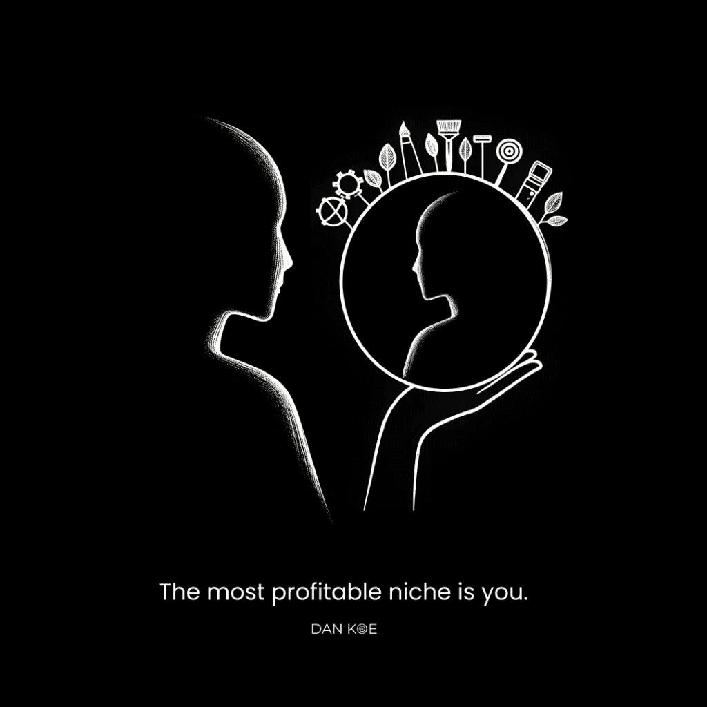
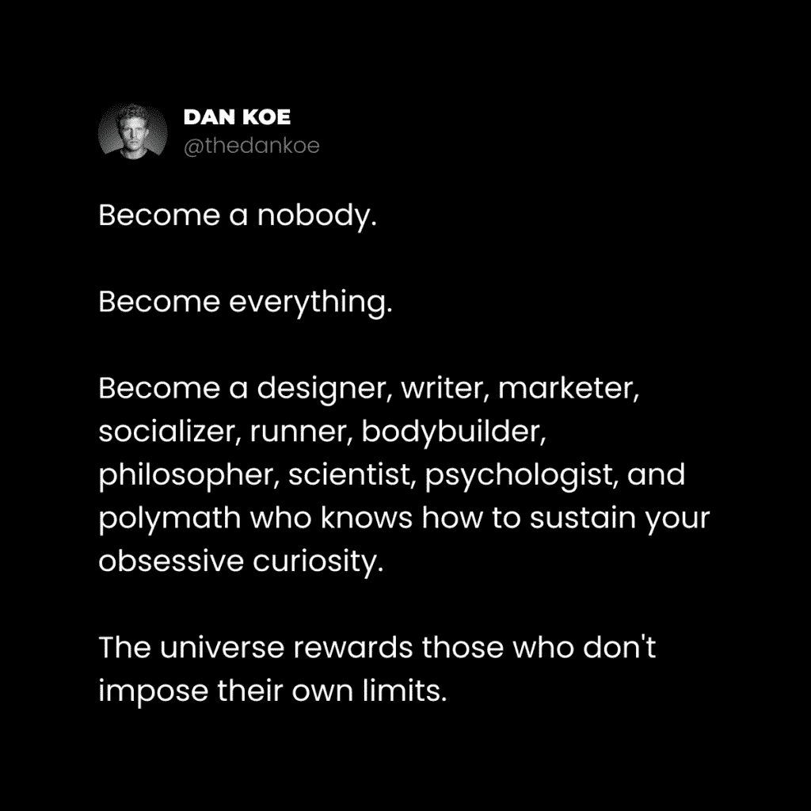

# 反利基：为什么无利基让你无可替代

在本教程中，我们将探讨一个颠覆传统商业思维的概念——“反利基”。我们将分析为何执着于寻找一个狭窄的利基市场可能适得其反，并学习如何通过构建以个人世界观为核心的品牌，实现可持续增长和无可替代性。课程将涵盖从理解商业矩阵到实践内容创作的完整路径。

## 课程 1：商业矩阵与利基陷阱

上一节我们概述了课程目标，本节中我们来看看传统商业建议背后的“矩阵”以及“利基化”这一建议为何常常带来痛苦。

我在多年的痛苦经历后才意识到这一点。当你开始自由职业或创业时，听到的第一条建议往往令人难以忍受：“选择一个利基市场。”

就像社会存在一个无形的“矩阵”，商业世界也有其“矩阵”。社会矩阵是一个未经审视的思想网络，它维持着社会的协同运作。商业矩阵则是让企业按“既定”方式运营的思想网络。

我们通过学习入门、中级到高级的知识来成长。但问题在于，很少有人从一开始就质疑这些入门级知识。我们是否绝对确定这是处理事情的最佳方式？这真的最有利于结果吗？还是它造成了更多困惑，导致人们过早放弃？

那些能跳出矩阵的人可以自由行事。但在你能开创自己的游戏之前，你必须先理解游戏规则并积累足够的经验。

### 传统利基方法的失败

当我开始商业之旅时，我从自由职业起步。我尝试了几乎所有能想到的技能：视频编辑、平面设计、SEO、内容营销、Facebook广告和网页设计。当时我称自己为“代理商”，但这本质上仍是自由职业。

我的核心痛点始终是选择利基市场。我会无休止地搜索“前100个目标利基市场”并下载免费指南，目标是牙医、健身房、建筑公司等。

这种方法存在几个根本问题：

以下是传统利基方法的主要缺陷：

1.  **缺乏兴趣**：我不在乎这些目标客户，甚至讨厌与他们合作。这并非可持续的工作方式。
2.  **缺乏经验**：我没有这些行业的经验。大多数企业失败是因为试图解决自己未曾经历过的问题。
3.  **策略错误**：它优先考虑“寻找”客户，而非“吸引”或“成为”专家。这导致在客户开发上花费的时间远多于建立自身杠杆。

渴望找到“最佳利基市场”的强烈愿望，恰恰表明你没有从原则层面理解商业。“找到最佳利基”是一种策略，而非原则。建立一个你自己会购买、使用并受益的产品或服务，才是商业中为数不多的捷径之一。这两个教训改变了一切。

## 课程 2：你就是最赚钱的利基

上一节我们剖析了传统利基思维的陷阱，本节中我们来看看如何将你自身——你的思维和经历——转化为最强大的利基。

大多数人没有意识到，他们本身就属于一个非常特定的“利基”。你所关注的人和兴趣塑造了你。创建利基时的第一个错误是：如果你的工作面向特定人群，而你自己也是一个特定的人，为何要围绕一个你未必感兴趣的狭窄主题来构建一切？

这样做并不会让你更有权威，人们也不会更信任你。最好的情况，你看起来像一个高级的“行动建议”搜索引擎；最坏的情况，你限制了受众增长，无法利用更广泛的网络效应。

例如，一个只谈论“企业家高管培训”的人，只能吸引那一小部分人。这本身不坏，但样本量很小。相比之下，一个融合了多种个人兴趣的人，可能因为内容更具分享价值而获得指数级增长。

你可能会质疑：“但那30万粉丝对我的产品或服务不感兴趣，他们不是潜在客户。”这种想法需要纠正：

1.  **网络效应**：30万粉丝每人推荐3-5人，你的潜在受众将扩大到90万至150万。
2.  **教育目的**：受众不应该立即购买。教育品牌的作用是引导他们从初学者（通过内容）成长为高级用户（通过产品）。
3.  **价值认知**：没有无用的粉丝，只有未能教育他们发现新价值、改善生活的狭隘思维。

### 利基即世界观

让我们重新定义“利基”。它本质上是一种**世界观**或**视角**。当你的“利基”是不断成长和变化的你自身时，你就没有传统意义上的利基。你不会被单一的技能或兴趣所限制。

传统上，你被要求利基化是为了理解客户心态：创建客户画像，识别他们的痛点，提供解决方案。但为什么不跳过这些，直接将自己作为客户画像，解决自己真实经历的问题，并建立对自己生活真正有益的解决方案呢？这消除了99%的赚钱猜测，也确保你不会与不喜欢的人共事。

从结构上看，一种世界观或视角由以下核心构成：

**1) 目标**
影响每个行动的有意识或无意识目标。目标决定了你如何解读信息和机会。公式：`目标 -> 信息过滤与机会识别`。

**2) 问题**
阻碍实现目标或理想生活方式的问题。营销的基础是逐步提高受众对问题的认知水平。认知有五个层次：
*   无意识
*   问题意识
*   解决方案意识
*   产品意识
*   最清醒（准备行动）

**3) 潜在路径**
清晰的路径、系统或解决方案。当人们对下一步不清晰时，会产生焦虑和失调。你的工作是创建一个全面、循序渐进的路径，与拥有相同世界观的读者分享。

此外，先前的经验、信念、技能水平等心理因素也影响着人们的感知和行动。作为教育品牌，你的全部工作就是提升受众的认知：让他们意识到自己的目标和问题，向他们展示未知的潜力。

你的利基就是你世界观中，由宏大目标和紧迫问题构成的框架。你的任务是“编程”受众的思维，让他们接受这种世界观，追求那些目标，解决那些问题。这是一项艰巨而充实的使命。

## 课程 3：创造你的独特领域——《你的人生之书》

上一节我们定义了利基即世界观，本节中我们将学习一个具体方法，通过记录你的生活来创造无可替代的独特领域。

当你在互联网上记录生活时，你就在创造属于自己的独特领域。你的过去、现在和未来的心态与技能，应以一种有说服力的方式呈现，以吸引那些与你性格相似但比你落后几步的人，从而真正帮助他们。

以下是你将撰写的“人生之书”的结构提纲。用它来捕捉灵感、识别模式并规划内容。坚持6-12个月，你的受众将真正熟悉你。

**书籍引言：你的故事**
你的故事就是你的品牌。用个人经历开始任何写作，本身就与众不同。
*   你从哪里开始？
*   你经历了哪些挑战？
*   旅程的高潮是什么？
*   你实现了哪些他人渴望的目标？
*   哪些主题、兴趣或技能帮助你达到了那里？

**第一部分：哲学**
你需要让人们与你达成共识。你的哲学是对“一个人如何过上好生活”的回答。
*   详细描述你的理想未来和生活方式。
*   描述你的“敌人”——你想要避免的未来。
*   你有哪些他人可能认为极端或冒犯的信念？
*   每个主题、兴趣或技能对实现理想生活的重要性是什么？

**第二部分：教育**
这是建立权威的方式。你的工作是教育人们关于技能或兴趣。
*   事实上*教授*他们这些技能或兴趣，以及你是如何学习的。
*   不要陷入“他们可以在别处学到”的陷阱。假设他们没有动力去别处学，而你必须提供信息。
*   人们会记住第一个教会他们有用知识的人。

**第三部分：实践**
创建逐步系统和实践，供读者使用以提高相关技能和兴趣。
*   将这些系统归功于你自己。可以改进现有工具（如艾森豪威尔矩阵），以你的方式重新创造，可能获得更好结果。
*   行为改变是建立权威和认可的动力。

通过在社交媒体上按照这个结构持续创作，你建立的品牌将超越99%的人。

## 课程 4：兴趣心理学与广泛品牌构建

上一节我们学会了如何规划内容，本节中我们来看看如何安全地谈论多种兴趣，并构建一个广泛吸引人但转化精准的品牌。

我经常被问到：“我想谈论更多兴趣，但如果参与度低或观众不喜欢怎么办？”首先，要区分**内容**和**产品**。内容不是为了每时每刻推广产品。你应该有一个**具体而有说服力的产品着陆页**来建立权威，而不必总是在内容中谈论它。

许多人只发布产品图片或更新，只销售，从不展示人性、教育、娱乐或激励。但人们关注的是教育家、娱乐家和激励者，而不是公司账号。RedBull的Instagram上没有产品图片，全是关于其代表的生活方式。

如果你只谈论让你赚钱的技能，会导致：
*   **参与度低**：内容不被分享，增长受限。
*   **缺乏信任**：急于变现会阻碍长期权威建立。
*   **限制发展**：被困在单一利基，难以转型。

人们有多种兴趣，也可以接受新的兴趣。你可以让你的兴趣变得有趣。这就是将观众变为粉丝，再变为超级粉丝的过程。谈论多个兴趣是你变得不可替代的方法。优秀的个人品牌只是发布他们认为重要的事情，并试图向你展示其重要性。

以下是实践方法：

以下是开始谈论多种兴趣的三个核心焦点：

1.  **专注于教育**：采用初学者的心态。他们如何能更好地达到你现在的水平？
2.  **专注于理解**：确定追随者的知识差距。他们需要了解什么才能与你同频？
3.  **专注于重要性**：分析你的生活。为什么你拥有这些特定的技能和信念，而不是其他成千上万种可能？为什么选择这条道路？

### 广泛的品牌，具体的产品

你可能会问：“如果我不写销售相关的内容，如何销售？”答案在于对营销的真正理解。你几乎从不直接谈论所销售的技能，而是谈论**它将如何改变他们的生活**。你展示他们渴望的生活，让他们意识到问题，并展示产品作为解决方案。

因此，请这样思考利基：
*   **你的品牌**：是一个吸引相似人群的广泛吸引器。
*   **你的内容**：是让人们意识到其生活目标和问题的手段。
*   **你的基础产品**：是连接现状与理想的桥梁。

你不需要持续写产品，因为你有**着陆页**这种静态的数字资产在持续工作。你可以这样部署：
1.  **通讯/博客**：托管所有内容，吸引广泛受众。
2.  **免费指南着陆页**：教育人们成为你产品的合格客户，针对更具体的问题。
3.  **产品着陆页**：承接内容，让人们意识到可以更快解决问题。

这就是真正的利基化：部署数字资产，撰写基于世界观的内容，并持续引导人们关注你的通讯、免费指南和产品。

### 品牌与产品的演变

解决你自己的问题，然后销售解决方案。不仅仅是做一次，而是持续进行。随着你达到新的高度，你的品牌、内容和产品必须不断进化。旧产品失去吸引力时，创造新产品能维持并增加你的年收入。

你必须进行实验和迭代。这是防止品牌熵增、避免在社交媒体上缓慢消亡的唯一方法。你必须不断进化。

## 总结

在本节课中，我们一起学习了“反利基”思维的核心内容。我们首先批判了传统“利基化”建议的局限性，指出其源于肤浅的商业矩阵。接着，我们重新定义了利基，将其视为个人**世界观**的框架，包含目标、问题和路径。我们学习了通过撰写“人生之书”来记录和构建自己独特领域的具体方法。然后，我们探讨了“兴趣心理学”，明白了谈论多种兴趣如何让你变得不可替代，并掌握了构建“广泛品牌、具体产品”的营销策略。最后，我们认识到品牌和产品需要随着个人成长而持续演变。核心在于，**最强大、最可持续的利基，就是不断成长、真实记录的你自己**。